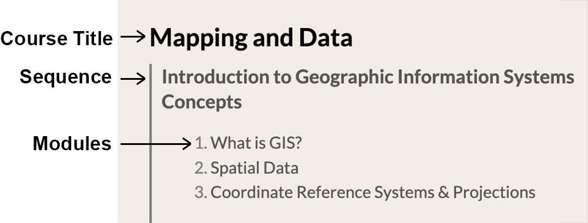

# GSAPP Smorgasbord

This is the repository for the GSAPP Smorgasbord!


## Architecture/build process

1. On site build, a script/Nuxt module (`modules/process_content.js`) parses Markdown content in the `/content` folder and generates linkages between them.
2. This data is generated in `data/content.json`.
3. This data is loaded into Vuex via `store/index.js`
4. Content that is structural (Menu generation & double linking) uses this generated data. 
5. Display and retrieval of content is done via Nuxt Content.


## Module Content 

_See [content/modules/0-template](content/modules/0-template) as an example; you can duplicate that folder and work from there._

### Structure

The hierarchy of the Smorgasbord goes Course -> Sequence -> Module



Module Content is located in [content/modules](content/modules), with folders named after the sequence, and modules inside.

Sequences are assigned to Courses manually in [components/ModuleIndex.Vue](components/ModuleIndex.vue). If you would like to add a course, please contact CDP Assistant Director Adam Vosburgh, or submit a pull request with him as a reviewer.

### Module Markdown File

Inside of each folder, there is one Markdown file ([0-template-markdown-file.md](content/modules/0-template/0-template-markdown-file.md)) and several different images. Images should be relatively linked to (see the Markdown file for examples).

The markdown file should have this (YAML front matter) at the start of each file: 
```
---
moduleid: 0
title: Grasshopper as Tool-making Medium
published: True
---
```

**Make sure that the moduleid is unique!** You can make sure that the module IDs don't collide by looking at our [CDP Smorgasbord Module Tracker](https://docs.google.com/spreadsheets/d/1v-vODKkGjbIf1fCRc6aVs-EnZ248mZvRsGmF1WnpTCg/edit?usp=sharing). If you do not have access please contact Adam Vosburgh.s

Typical file naming conventions is that the title of the sequence should be 'index.md', and that moduleid start with zero. For example, if your new tutorial sequence is sequence '21', then your index is '210' your first module '211' etc.


## Development Setup

The site is created in NUXT.js. If you'd like to develop locally, so that you can see the content adjust live:

### Setup
`npm install` or `yarn install`

### Run Development Environment

`npm run dev` or `yarn dev`

The site will be hosted at `http://localhost:3000`.


## Styling, etc

### Image layouts

Images can be tagged with `#img-full`, `#img-left`, `#img-right` to position images in the document.

(These are defined in 

``

``

``

### Image Captions

Captions can be created by putting a line in asterisks, immediately after the image (without a line inbetween). Example:

```

*Matthew Barney, DRAWING RESTRAINT 10, 2005*
```

### Code instruction

Code instruction blocks can be tagged using the `instruction` class in a markdown file. Eg.:

```
<div class='instruction'>
DO XYZ in Rhino
</div>
```

