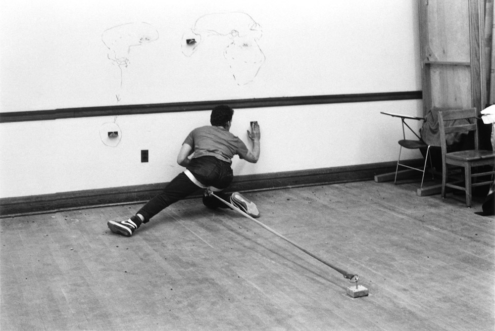
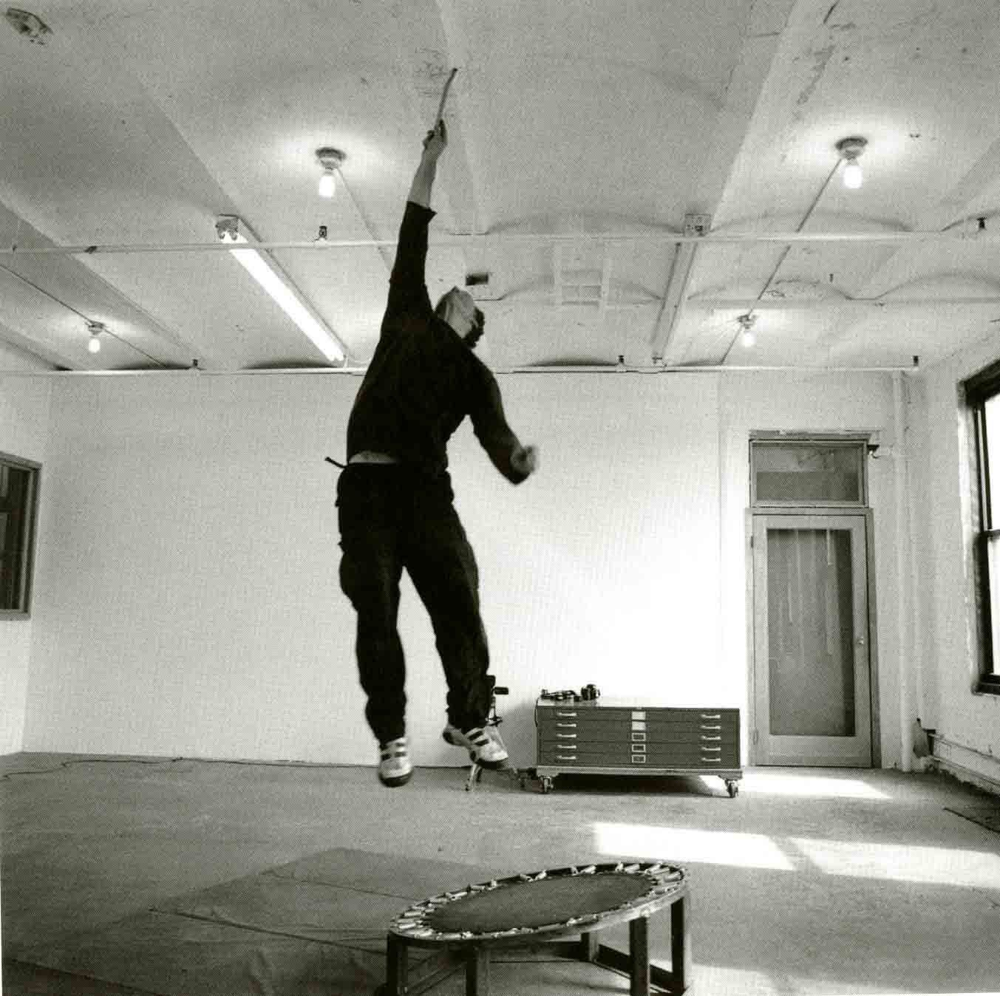
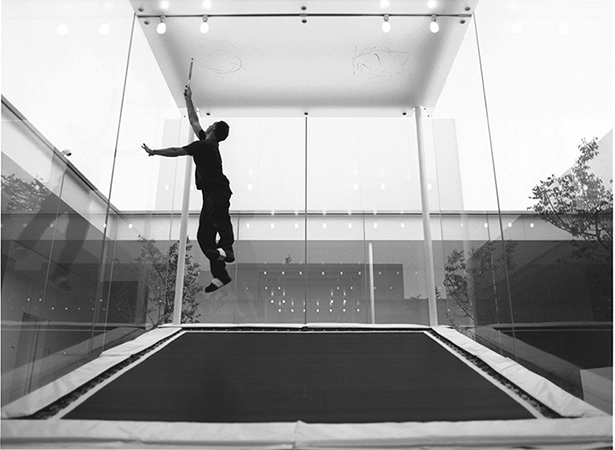
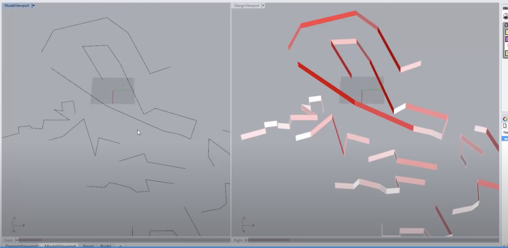

# Drawing Restraint: Grasshopper, Simple Logic and Affordances

>*Matthew Barney, DRAWING RESTRAINT 5, 1989*

>*Matthew Barney, DRAWING RESTRAINT 6, 1989*

>*Matthew Barney, DRAWING RESTRAINT 10, 2005*

Matthew Barney's *DRAWING RESTRAINT * series is about self-imposed limitation, constraint, restraint, and a series of creative processes that emerge out of these restraints:

>Barney’s multipart Drawing Restraint project (begun in 1987, and ongoing) began with a straight­forward proposition: his attempt to make a mark—the most basic component of drawing—while impeded by various physical obstacles, ramps, and harnesses. The early Drawing Restraint works (1–6) comprise an action and its residue, including documentary photography or video, often drawings, and occasionally the restraints themselves. [link](https://www.moma.org/collection/works/81055)

What does it mean to creatively *constrain ourselves* in a design process, or in a data process? 

From a programming and data perspective, *restraint* could involve sorting, involve `if` statements, or some limiting process that involves an inventive method of measurement and logic. 

From a design perspective, *restraint* could involve choice, process, decision, that emerges out of some self-imposed, inventive restraint - [a book written without the letter 'e'](https://en.wikipedia.org/wiki/Gadsby_(novel)), for example, or a 48-hour film festival, where the goal is to produce a short film in a duration of time.

In this module, we will use Grasshopper as a medium to explore these **multiple forms of inventive restraint** - measurement and logic, as well as creative constraint. 

By the end of this module, we will create a spatial design tool that limits the square feet of walls we can create on a site, or the type of walls we can create, forcing us to design creatively within these constraints.

---

### Logic 

(ROUGH TEXT)

- Grasshopper, as a flow-based programming language, inherently moves from data to 

Outline:
- Geometry Pipeline to filter, receive data
- Line Length, Math inequality, to create boolean logic
- Dispatch / Sift Pattern with boolean logic 
- Custom Preview

