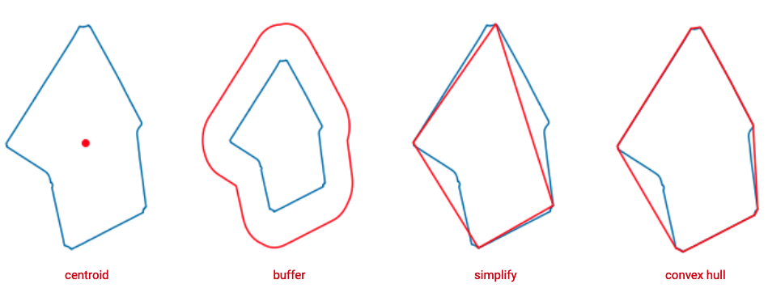
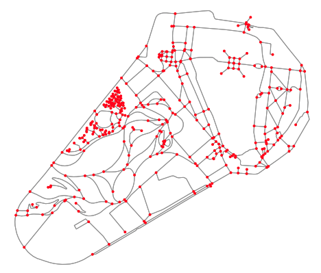

# Geospatial Data


*Landsat 8, Unfriendly Landscape, NASA*


## Module Summary


In this module we will go over the fundamental concepts of working with spatial data in Python. We will rely heavily on two Python libraries that make working with geographies easy, namely GeoPandas and Shapely. The module is divided into three parts. The first dives into GeoDataFrames and geographic data in tabular format. In the second we discuss geographies as polygons and ways to map or manipulate them using Shapely. Finally, in the third section we take a look at points, lines, and networks. Finally, in the third section we take a look at points, lines, and networks. We cover what sought of information is usually conveyed in these formats, how we can transfer between aforementioned data structures, and the use cases for doing so.

This module is by no means an exhaustive look at all possible geospatial data structures, rather it is a cursory introduction to some of the basic formats which we will build upon in later modules. Note also, we will be using the terms geospatial, spatial, and geographies interchangeably throughout the module.


## Why is this important?

There are two aspects to geospatial data that make it distinct from other data points: the first and most obvious is that it references a location on Earth, the second, is that it usually has a temporal aspect, a time that the measurement was taken. As such, spatial data is easy to grasp for people as they will always be able to contextualize data points from locations they're familiar with, particularly when seen plotted on a 2D surface or map. But more than just a point on a map or a clock position, having a space-time reference allows us to understand the relationships between records, and subsequently conduct better analysis or make better inferences.

So why work with spatial data in Python when there are other tools like ArcGIS? There are two major advantages that come from working with spatial data in Python. The first is the flexibility that comes from working in code. Whereas in (Arc) or (Q)-GIS you are limited to working with particular filetypes (shapefile, DWG, geojson, etc), and are constrained by the interface in the platform, with Python you can turn any piece of information into a spatial object as long as you can tie it to a location. The second advantage of Python over GIS software is that of scale. The slick interface of ArcGIS, the things that make it easy to upload and interact with shapefiles, are the same things that limit the amount of information ArcGIS can handle. If you were to work with a shapefile containing every road in South America, the software would crash. Whereas in Python, you could theoretically work with a dataset of any size, the only limiting factor would be the size of your machine.


---

<br/>
<br/>

### GeoDataFrames

Similar to DataFrames in Pandas that we covered in previous modules, GeoDataFrames are a way to represent geographies in tabular format. GeoDataFrames however can be thought of as smarter tables than the ones we covered in Pandas. Here columns represent an attribute of the the data (e.g. the name of the record, it's latitude, description, etc), while rows usually represent a single geography (e.g. a country, city, point of interest, etc). What makes GeoDataFrames distinct from Pandas DataFrames is the required inclusion of a geometry column and it's Cordinate Reference System (CRS). Geometry columns contain the types of geographies that the table represent, be it points, lines, or (multiple) polygons, and allow us to easily visualize data in 2 or 3 dimensions. However, the geometries are meaningless without the CRS, which tells Python how those coordinates relate to places on the Earth. Or specifically how we want to project some arbitrary point to a 2D representation of Earth.  


To demonstrate the functionality of GeoDataFrames we will use the [New York City parks](https://data.cityofnewyork.us/Recreation/Open-Space-Parks-/g84h-jbjm) dataset from the open data portal and load this as a GeoDataFrame object in Python. Click on the `Export` button at the top right of the map and select `GeoJSON`. Once this is located in the convenient place on your laptop, you can load this into GeoPandas with the `.read_file()` method:

```
path = '/Users/cbailey/Downloads/Open Space (Parks).geojson'
gdf = gpd.read_file(path)
```

The `read_file` method supports many different file formats, including: DXF, CSV, ESRIJSON, ESRI Shapefile, etc. To have a glance at what is contained in this dataset, we will select a subset of the columns and display the first five rows using the `head()` method:

```
columns_of_interest = ['park_name', 'landuse', 'shape_area', 'geometry']
gdf[columns_of_interest].head()
```

**park_name**|**landuse**|**shape_area**|**geometry**
:-----:|:-----:|:-----:|:-----:
Commodore Barry Park|	Community Park|	41539.8013629| MULTIPOLYGON (((-73.97922 40.69800, -73.97925 ...
Pierrepont Playground|	Neighborhood Park|	21960.4949197| MULTIPOLYGON (((-73.99732 40.69601, -73.99732 ...
Cobble Hill Park|	Neighborhood Park|	28079.0762647| MULTIPOLYGON (((-73.99557 40.68793, -73.99557 ...
Commodore Barry Park|	Community Park|	438416.114511| MULTIPOLYGON (((-73.97747 40.69651, -73.97746 ...
Brooklyn Heights Promenade|	Triangle/Plaza|	14465.699799| MULTIPOLYGON (((-73.99747 40.69692, -73.99766 ...

Every row in this dataset is a park, with associated features like name, type of park, area, geometry, etc. In most cases, the geometry column in the geometry column is represented in either one of two formats: Well Known Text (often written WKT) or GeoJSON. These are two markup languages for representing vector based objects. GeoDataFrame objects, similar to Pandas DataFrame objects, make it very easy to visualize the underlying geographies. Using the `.plot()` method alongside a conditional filter, we are able to quickly visualize all parks within Manhattan:


```
mask = gdf['parknum'].str.contains('M', na=False)
gdf[mask].plot()
```

Above we use the mask variable to hold the condition, in which we use the `.str.contains()` method to find all the rows that contain the letter "M". The `.str` method is a method for accessing vectorized string functions. We then use the mask on our `gdf` GeoDataframe variable to plot all the parks in Manhattan. After running this in your notebook you should see a plot (though probably smaller) like the one below.


---

### Polygons

Polygons within the context of spatial data are 2-dimensional shapes that represent a geography. Polygons are used to represent anything from the boundary of a city, country, park, or even a building, amongst others. In Python we will be using the shapely library to analyze and manipulate polygons, which makes use of the GEOS library, a programming framework for working with geometry in code. Each polygon is associated with three sets of (possibly infinite) points on a plane. The number of points is proportional to the level of detail of a particular shape, the more points the mored detailed. Each point represents a latitude longitude pair representing a position on the globe.

To demonstrate how polygons are represented and manipulated in Shapely we will extract a single park from the NYC parks dataset. We will again use conditional indexing to get the geometry for Prospect park in Brooklyn.

```
# Create a condition that looks for rows with the source ID of Prospect park
mask = gdf['source_id'] == '19498000554'

# Use the mask to filter rows GeoDataFrame
prospect_park = gdf[mask]

# Retrieve the polygon from the geometry column
# (values returns a list so we select the first item)
polygon = prospect_park['geometry'].values[0]
polygon
```

Now that we have extracted the polygon we can use Shapely to extract measurements or manipulate the shape. The polygon class has a number of built-in methods for tasks like these. For example, getting the shapes area is as simple as:

```
polygon.area

# which will should print 0.00020482609342158714
```

Similarly, there are a number of other manipulations we can do to get things like the center of an area, the bounding geometry (or convex hull), a surrounding buffer zone, or even simplify the complexity of shape using dot notation.

```
polygon.centroid

polygon.buffer(.005)

polygon.simplify(0.5)

polygon.convex_hull
```




Where these operations really shine are when we use them for analysing spatial relationships between geographies. For example answering questions like: What is the density of public transit stations within a certain radius? Or more generally, what points of interest are inside a certain area? We will dive more in depth on these topics in the spatial analytics module.

---

<br/>
<br/>

### Graphs

Graphs are a mathematical structure representing a set of objects that generally have relationships between them. They are comprised of points (often called nodes or vertices) and edges, which are the links between points. In the context of spatial data, graphs are usually used to represent road or transportation networks, but can also be expanded to represent abstract relationships between points of interest or places. In Python graphs can either be represented as a standalone network (a collection of points and edges), using libraries like NetworkX or OSMNX (which is a wrapper around NetworkX allowing for easy querying of OpenStreetMap data). Or they can be represented in tabular format in a GeoDataFrame, where each row would be a single edge or point.

To demonstrate we will use the OSMNX to query OpenStreetMap and download a road network.

```
gov_island = osmnx.graph_from_place("Governors Island, New York, United States")
osmnx.plot_graph(gov_island)
```




<br>

## Additional Resources

- [Python for Data Analysis](https://www.oreilly.com/library/view/python-for-data/9781449323592/) Is a great nuts and bolts overview of the Pandas library written by it's original author, Wes McKinney.
