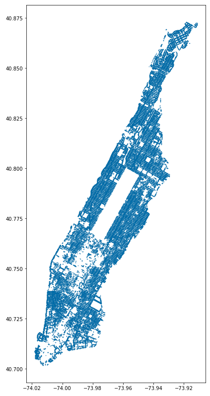
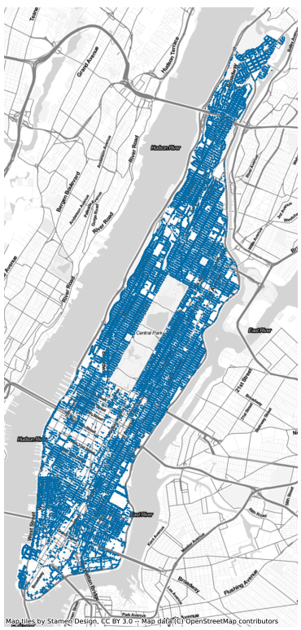
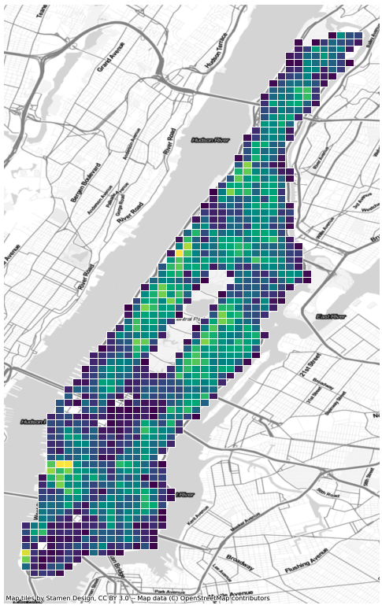
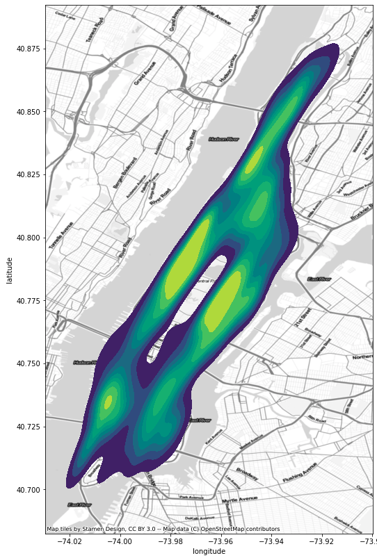

# Spatial Analysis


*Random City, Patricio Gonzalez*


## Module Summary


In this module we discuss analytic methods commonly used to interrogate spatial data, namely, point pattern analysis, spatial auto-correlation and clustering. These techniques are concerned with discovering regularities or underlying structure in spatial data, understanding how or why things are located where they are. Point pattern analysis concerns the spatial arrangement and distribution of things in geographic space. Spatial auto-correlation explores the relationship between properties in geographic space – seeing whether an objects placement can tell us something about another phenomena. While, clustering is concerned with grouping geographies (or more broadly objects), based on the similarities between them. For example, we might consider the location of trees in NYC and ask: are trees equally dispersed throughout the city (point pattern analysis)? Is there a relationship between the density of trees in a neighborhood and the income of it's residents (correlation)? Or, can we characterize places by the types of trees within them (clustering)? These techniques help us answer these questions quantitatively and help us towards visualizing them or describing them statistically.

We will extend some of the topics explored in the previous module on geospatial data, that of discretization, to develop new methods for characterizing spatial phenomena. Again, we will be using the GeoPandas and Shapely libraries to manipulate geometric and geographic data in Python.


## Why is this important?

Add content...


---

### Point Pattern Analysis

Points in the context of spatial data usually take one of two forms. 1) Points can represent a spot measurement taken from a larger continuous process – for example, when measuring temperature in an urban environment, the temperature is recorded at a particular latitude longitude where the sensor is located. Here the location of points could take place anywhere, but is generally limited to few locations that are determined by the cost of sampling or the desired resolution of gathering readings. 2) Points can also represent a fixed object in space, say, a location of trees or the location of a schools in a city. Points in this context usually are driven by some underlying process that makes their location not random. It is this latter event that we will be concerned with for point pattern analysis. Our goal in point pattern analysis is to determine the underlying process as to why the particular object or event occurred where it did. To stick with the NYC tree census example, we might ask: is there a pattern to the location of trees? why are there trees in some places and not in others? We could ask these same questions for practically any object you find in cities or rural communities.

We will introduce concepts of point pattern analysis sticking with the 2015 NYC tree census data. To get started let's load the data into a Pandas DataFrame:

```python
path = 'data/2015_Street_Tree_Census_-_Tree_Data.csv'
df = pd.read_csv(path)
```

As we loaded the data from a `.csv` we will next need to convert this to a GeoDataFrame so that we can easily visualize and manipulate the data spatially. To do that we will create a function to convert the `'latitude'` + `'longitude'` columns (float values) to a Shapely `Point` object (a geometry class in Python). The function will take an input called `data` and return a Shapely object. We will make use of `.apply` functions in Pandas to conveniently iterate over the entire DataFrame:

```python
def lat_lng_to_point(data):
    return Point([data['longitude'], data['latitude']])

df['geom'] = df.apply(lat_lng_to_point, axis=1)
```

You should now see an extra column in the DataFrame called `'geom'` that consists of Point objects:

```python
df['geom'].head()
```

```
0    POINT (-73.84421522 40.72309177)
1    POINT (-73.81867946 40.79411067)
2     POINT (-73.9366077 40.71758074)
3    POINT (-73.93445616 40.71353749)
4    POINT (-73.97597938 40.66677776)
Name: geom, dtype: object
```

Now we are ready to convert the DataFrame to a GeoDataFrame with geographies. To do this we need to tell GeoPandas what column contains geometries and the CRS we want to use for projection (we will first use [a common CRS](https://geopandas.org/en/stable/docs/user_guide/projections.html) projection):

```python
gdf = gpd.GeoDataFrame(df, geometry='geom')
gdf.crs = 'EPSG:4326'
```

Now let's visualize the data! To do so we will first filter the GeoDataFrame to only show trees in Manhattan. We can use the `'zip_city'` column and add a condition that only includes rows that are in 'New York' (AKA the Manhattan borough). Notice that we specify the marker and figure size (with the `figsize` + `markersize` arguments) in order to increase the resolution of the plot:

```python
gdf.loc[gdf['zip_city']=='New York'].plot(figsize=(12,14), markersize=0.25)
```



Although we can make out the shape of Manhattan, the tree locations by themselves appear as dots in arbitrary whitespace, lacking geographical context. Luckily, adding context in GeoPandas is fairly easy with the `contextily` Python library. Contextily works by loading Web map tiles into the GeoPandas plot. Web map tiles are usually provided in a certain CRS projection, `EPSG 3857`, so we will have to update the CRS of our GeoDataFrame to match:

```python
# change the CRS
gdf = gdf.to_crs(epsg=3857)

ax = gdf.loc[gdf['zip_city']=='New York'].plot(figsize=(12,14), markersize=0.25)
cx.add_basemap(ax, source=cx.providers.Stamen.TonerLite)
ax.set_axis_off()
```



The above plots do not tell us much about the structure of points across the city however, sheer the amount of points on the map hide the underlying distribution not revealing whether some areas have a higher concentration than others. One way to get around this is to use polygons, or an underlying grid, to bucket the points into regular intervals / areas and then count the number of points within each area. This is similar to the use of [histograms](https://en.wikipedia.org/wiki/Histogram) to visualize the distribution of numerical data.

To create the grid in GeoPandas we will use the x + y bounds of the tree dataset to define our overall region, and subdivide this region into grid cells (giving each cell a unique identifier to help with analysis):

```python
# filter the tree dataset to only those within Manhattan
manhattan_trees = gdf.loc[gdf['zip_city']=='New York']

# get the outer bounds of the points
xmin, ymin, xmax, ymax = manhattan_trees.total_bounds

# specify the number of cells along x + y axis
x = 40
y = 80
wide = abs(xmin - xmax)/x
length = abs(ymin - ymax)/y

# create a list of points that will define grid corners
cols = np.arange(xmin, xmax + wide, wide)
rows = np.arange(ymin, ymax + length, length)

# iterate over list of corners to create Shapely Polygon objects
polygons = []
for x in cols[:-1]:
    for y in rows[:-1]:
        polygons.append(Polygon([(x,y), (x+wide, y), (x+wide, y+length), (x, y+length)]))

grid = gpd.GeoDataFrame({'geometry':polygons, 'cell_id': list(range(len(polygons)))})
grid.crs = 'EPSG:4326'
```

Then we will merge the grid cells with our trees, count the number of trees within each cell and visualize the results:

```python
# merge the two datasets
grid_trees = gpd.sjoin(grid, manhattan_trees)

# count the number of trees in each cell
grid_tree_count = grid_trees.groupby('cell_id')['tree_id'].count()

# rename the column for convenience
grid_tree_count.rename('tree_count', inplace=True)

# merge the two tree counts with the grid GeoDataFrame and plot
grid.merge(grid_tree_count, on='cell_id').plot(
  column='tree_count', figsize=(12,14), edgecolor='white')
cx.add_basemap(ax, source=cx.providers.Stamen.TonerLite, crs='EPSG:4326')
ax.set_axis_off()
```



Discretizing points into grids is a fast and efficient way of describing density across regions. But it suffers from the loss of information that comes with binning the data. Another approach is that of Kernel Density Estimation (KDE). KDE is a common tool in statistics and machine learning, often used to describe the continuous distribution of data using "kernels". In our case, it gives us a method for visualizing the density of points across the city, without having to buckets the data into grids.




- ways of describing: point density --> visualize through KDE
- central tendency and dispersion -->
- discretizing into different units -->

---

### Correlation

- overview and ways of describing --> how much information can one variable tell us about another?
- described with simple stats
- tree and income example
- same question at different resolutions

---

### Clustering

- ways to think about distance and proximity
- similarities between neighborhoods
- discretizing trees into neighborhoods and species
- clustering

<br/>
<br/>


---

# Module on distance and similarities

According to Waldo Tobler, the First Law of Geography is "everything is related to everything else, but near things are more related than distant things." This simple but profound statement assumes that geographic distance can explain the processes behind why things are located where they are. But what does the word near or distance mean in this context? Distance in most geographic or urban theory literature refers to the distance between 2 points in euclidean space. But if we borrow from maths or machine learning, distance could be extended to mean cosine (the angle between two vectors) or jaccard distance, the overlap of two sets of objects.

<br>

## Additional Resources

- [Python for Data Analysis](https://www.oreilly.com/library/view/python-for-data/9781449323592/) Is a great nuts and bolts overview of the Pandas library written by it's original author, Wes McKinney.
