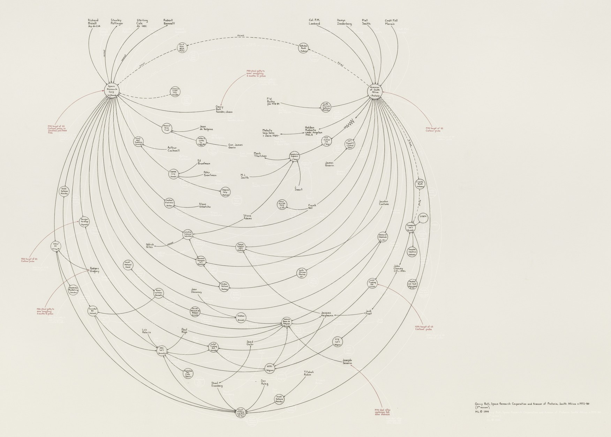
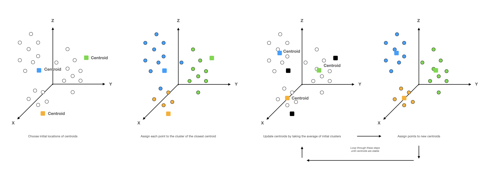
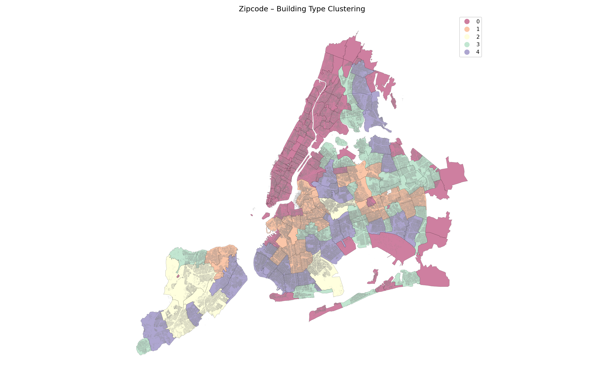
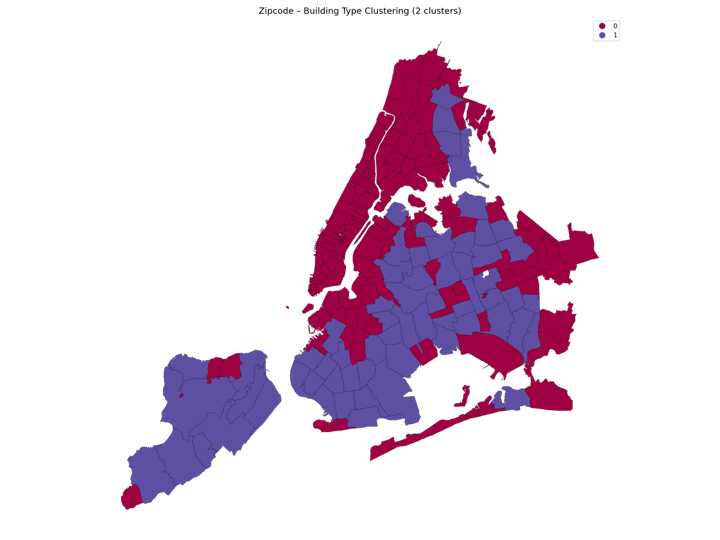

# Spatial Analysis – Clustering


*Gerry Bull, Space Research Corporation and Armscor of Pretoria, South Africa, c. 1972–80 1999*


## Module Summary

In this module we introduce clustering as a method for spatial analysis. Clustering involves grouping sets of objects such that members of the same group (called a cluster) are more similar to each other than those in other clusters. Clustering falls within a branch of unsupervised statistical learning, where algorithms themselves learn the structure of data, rather than being taught it (supervised learning). It's core conceptual underpinning is that you can use an algorithm to summarize characteristics about a group of objects, across many (often hundreds) of variables. But unlike many other statistical methods, there is often no correct answer as to what makes a good or bad cluster, or whether an object belongs in a certain group or not. As such, clustering can be misused when applied to socio-economic settings without rigorous critical thinking. Clustering is used across a range of applications from grouping emails by their textual content, to grouping [hair styles](https://pudding.cool/2019/11/big-hair/) across decades, to even grouping [geographies](https://doc.arcgis.com/en/esri-demographics/data/tapestry-segmentation.htm) based on the attributes of residents or buildings within them. In this module we will use clustering to group geographies, based on the attributes of buildings found within them. We will work with the NYC Planning Department's [building data](https://www1.nyc.gov/site/planning/data-maps/open-data/dwn-pluto-mappluto.page).

---

<br/>
<br/>

For this module we will be using the [Pandas](https://pandas.pydata.org/), [GeoPandas](https://geopandas.org/en/stable/) and [Scikit-Learn](https://scikit-learn.org/stable/) Python libraries. Ensure to `pip install` them on your machine, if you don't already have them, and import like so:

```python
import pandas as pd
import geopandas as gpd
from sklearn.cluster import KMeans
import matplotlib.pyplot as plt
```

---

<br/>
<br/>

### Clustering

In the previous module on spatial correlation we began by discussing Tobler's First Law of Geography: "everything is related to everything else, but near things are more related than distant things." Similarly, clustering algorithms look at the distances between objects to determine whether something belongs to a group. [K-means](https://scikit-learn.org/stable/modules/clustering.html#k-means) clustering, by far the most widely used clustering algorithm, and the algorithm we will use for this demonstration, takes any number of objects (think point in high dimensional space) and groups points into clouds, where the centroid of each cloud is used to determine groups, such that the distance between every point in a group and the centroid is minimized.

The algorithm is iterative and has three main steps: 1 – choose the location of centroids for K groups (you have to tell the algorithm before hand how many clusters to create, this number is called K.) and then assign each object (or point) to the cluster of the nearest centroid. 2 – The algorithm then finds the new average (or centroid) of the groups assigned in the previous step. 3 – It then updates the group assignments based on the (new) location of the centroids. It does these steps until the centroids of each group does not move between iterations (in other words until the groupings are optimized). The below image shows what the K-means process would look like in 3-dimensions, when trying to group 3 clusters. However, often times we cannot visually represent the clustering process as it is done across much more than 3-dimensions.



Although an intuitive understanding of the algorithm is enough, formally, the process of minimizing the distance between points and cluster centroids can be written mathematically as such:

<p>
        <span class=math>&Sigma;</span>
        min<sub>&mu;<sub>j</sub>&isin;K</sub> (||x<sub>i</sub> - &mu;<sub>j</sub>||<sup>2</sup>)
</p>

Where we minimize the squared absolute difference between points x<sub>i</sub> for *n* number of points and centroids &mu;<sub>j</sub> in *K* clusters.

In this module we will cluster NYC zipcodes based on the attributes of the building's within them. To do this we will first classify building's into 11 types based on their height, count how many buildings of each type are in every zipcode, and then use the K-means algorithm to group zipcodes based on the distribution of building types.

The first step will be to download and load the [zipcode](https://www2.census.gov/geo/tiger/TIGER2021/ZCTA520/tl_2021_us_zcta520.zip) + [NYC building](https://www1.nyc.gov/site/planning/data-maps/open-data/dwn-pluto-mappluto.page) data into GeoPandas and Pandas respectively:

```python
# load zip codes
path = 'data/tl_2021_us_zcta520/tl_2021_us_zcta520.shp'
zips = gpd.read_file(path)

# update the zipcode CRS and rename the ID column (for readability)
zips = zips.to_crs("EPSG:4326")
zips.rename(columns={'ZCTA5CE20': 'region_id'}, inplace=True)

# load PLUTO buildings
path = 'data/nyc_pluto_21v3_csv/pluto_21v3.csv'
pluto = pd.read_csv(path)
```

We then need to convert the building data into a GeoDataFrame by turning the latitude and longitude columns into Shapely `Point` objects. To do this we will make use of the `lambda` function in Python. Lambda functions (sometimes called anonymous functions) are just like normal functions except they do not have a name or use the `def` keyword). They are pretty useful for doing quick operations on large lists:

```python
# create a function that takes a latitude + longitude and returns a Point
create_point = lambda x: Point([x['longitude'], x['latitude']])

pluto['geom'] = pluto.apply(create_point, axis=1)

# now we can create a GeoDataFrame using the new geom column
pluto = gpd.GeoDataFrame(pluto, geometry='geom', crs='EPSG:4326')
```

Now we have the building Point objects and the zip codes loaded, we can use GeoPandas to do a spatial join between the two dataframes to combine them. The spatial join will join a single building (a row from the PLUTO dataset) to a zipcode, based on whether the building falls within said zip code:

```python
pluto_zips = gpd.sjoin(zips, pluto)
print(pluto_zips.shape)
```

After joining and displaying the shape of the data, you should see approximately 856879 rows and 101 columns.

In order to classify buildings based on their height, we will use the `numfloors` (number of floors) column to bucket them into 10 distinct categories. We will make use of the [Pandas](https://pandas.pydata.org/docs/reference/api/pandas.cut.html) `cut` function which segments values into bins. As with most datasets, there are a buildings with missing floor information, so we will remove those:

```python
# remove rows without floor number information
pluto_zips = pluto_zips[pluto_zips['numfloors'].notnull()]

# create buckets and bucket the data
bins = [0, 1, 2, 4, 5, 6, 10, 15, 20, 40, 110]
pluto_zips['binned'] = pd.cut(pluto_zips['numfloors'], bins)
```

Here we created a new column, `binned` that buckets the number of floors of a building with the intervals used in the `bins` list.

Next we will count the number of each category within every zipcode. To do this we will use the Pandas `groupby` function to group rows by their `region_id` and `binned` category, then count the number of buildings. Afterwards we will use the `pivot_table` function to transpose the dataframe so that the columns are the floor height categories, the indices are the zipcode names, and the values are the counts of each.

```python
# group rows by the zipcode and binned columns,
# and count buildings within groups
temp = pluto_zips.groupby(
    ['region_id', 'binned'])['bbl'].count().reset_index()

floor_vectors = pd.pivot_table(temp, index='region_id',
                               columns='binned',
                               values='bbl').fillna(0)
```

Now if you display the first 5 rows of the resulting `floor_vectors` dataframe – `floor_vectors.head()` – you should see:

<br>

region_id|**(0, 1]**|**(1, 2]**|**(2, 4]**|**(4, 5]**|**(5, 6]**|**(6, 10]**|**(10, 15]**|**(15, 20]**|**(20, 40]**|**(40, 110]**
:-----:|:-----:|:-----:|:-----:|:-----:|:-----:|:-----:|:-----:|:-----:|:-----:|:-----:
07305 |0 |0 |0 |0 |0 |0 |0 |0 |0 |0
10001 |33 |36 |252 |110 |72 |80 |161 |59 |65 |23
10002 |63 |83 |302 |557 |373 |112 |43 |21 |19 |1
10003 |35 |43 |558 |514 |298 |196 |110 |49 |18 |0
10004 |4 |1 |20 |20 |4 |11 |5 |5 |27 |5

<br>


Here in the `floor_vectors` dataframe we've created high dimensional vectors of zipcodes. Vectors here are similar to the vectors you may be used to from high school geometry. But rather than the 2 or 3 dimension vectors where the x, y, and z denote direction; the above vectors have 10 dimensions to denote their direction. Each building type can be thought of as a independent dimensions of a zipcode, and the values can be thought of as their magnitude in each. This is an important concept as it is what the K-means clustering algorithm will use to determine distances between zipcodes, and subsequently whether two or more zipcodes belong in the same cluster.


We can make this more concrete by plotting the distribution of building types for two vastly different zipcodes. Zipcode `11236`, Carnasie Brooklyn has thousands of 1-4 storey (residential) buildings, so the data is skewed left. While the `10006` zipcode, Financial District Manhattan is skewed the other direction with mostly 20-40 storey buildings. As such, our K-means clustering algorithm will learn that the Financial District is more similar (closer in vector space) to neighborhoods like Midtown Manhattan (as there are similar distributions of high-rise buildings with few low-rise) than Carnasie, thus will most likely place FiDi + Midtown in the same cluster and have a separate cluster for Carnasie.

<br>

With an intuitive understanding in place, we can move on to clustering our data. We will begin by instantiating an instance of the K-Means clustering algorithm – this is where you call the Scikit-learn [KMeans](https://scikit-learn.org/stable/modules/generated/sklearn.cluster.KMeans.html) object and set the hyperparameters for the algorithm. The main parameters for any implementation of the k-means algorithm is the number of clusters you want to create – here that parameter is called `n_clusters`. For the purposes of this demo we will set that number to 5 (feel free to play around and see how the output changes as you increase/decrease that argument). There is an element of randomness to the initial location of the centroids for the clustering, so we will attempt to make our results reproducible / remove this randomness by setting the `random_state` argument. Feel free to play around with other [parameters](https://scikit-learn.org/stable/modules/generated/sklearn.cluster.KMeans.html) listed in the documentation to see their affects

```python
km = KMeans(n_clusters=5, random_state=42)
```

The next step is to fit our algorithm on the floor_vectors dataframe using the sklearn `.fit()` method. This is where the algorithm will segment the data into clusters. As our data is small this should only take a few seconds to process:

```python
km.fit(floor_vectors)
```

Now we can call the `.labels_` attribute to see the assigned cluster for every zipcode – this returns an a list of numbers, where the numbers denote the names of the cluster from 0 up to 4 (remember we said to segment the data into 5 clusters and in Python counting starts from 0, hence 0-4).

```python
km.labels_

# output
array([0, 0, 0, 0, 0...],
      dtype=int32)
```

Next we'll create a map showing zipcodes colored with their assigned clusters. To do this we will create a temporary dataframe of cluster labels and zipcode IDs, in order to join this with the zipcode geometries:

```python
# create temporary dataframe
temp = pd.DataFrame(
  {'labels': km.labels_,
   'region_id': floor_vectors.index
   })

# merge with zipcode geometries
cluster_map = zips.merge(temp, on='region_id')

# remove weird zipcode off coast of Manhattan
mask = ~cluster_map['region_id'].str.startswith('07')

# plot the cluster map
fig, ax = plt.subplots(1, figsize=(14,8))
cluster_map[mask].plot(column='labels', figsize=(12,12), ax=ax,
                       linewidth=.25, edgecolor='0.2',
                       categorical=True, legend=True, cmap='Spectral')
ax.axis('off')
ax.set_title('Zipcode – Building Type Clustering',fontsize=14)
plt.tight_layout()
```



As you can see the K-means algorithm has learnt that the majority of Manhattan, Williamsburg, Dumbo and the Bronx are the similar, while residential and commercial areas of Brooklyn and Queens are split, and Staten Island is almost a cluster on to itself. This makes sense when considering the density of building types and various zoning laws that exist across parts of the city.

We can confirm this intuition by looking at aggregate statistics for each cluster. We can use the Pandas `.groupby` method to group our dataset by cluster ID and take the average number of buildings in each category across zip codes:

```python
# combine cluster labels and floor_vectors
clusters = temp.merge(floor_vectors, on='region_id').drop('region_id', axis=1)

# group by cluster labels and take the average number of
# floor number categories within each
clusters.groupby('labels').mean().T
```

<br/>


**labels**|**0**|**1**|**2**|**3**|**4**
:-----:|:-----:|:-----:|:-----:|:-----:|:-----:
(0, 1]| 69.672131| 955.714286| 2452.4| 484.583333| 313.566667
(1, 2]| 234.336066| 6213.571429| 11855.4| 3059.472222| 2671.100000
(2, 4]| 322.540984| 2013.250000| 3002.0| 1168.027778| 3126.433333
(4, 5]| 119.385246| 12.857143| 8.4| 17.583333| 57.566667
(5, 6]| 65.885246| 33.357143| 6.4| 34.722222| 80.033333

<br/>


We can now plot the average proportion of each building category within each cluster using Pandas' plot method:

```python
averages = clusters.groupby('labels').mean().T

totals = clusters.groupby('labels').mean().sum(axis=1)

proportions = averages / totals
proportions.plot(kind='bar', width=0.75, cmap='Spectral',
                 alpha=0.75, edgecolor='black')
plt.legend(title='clusters')
plt.xlabel('Number of floors')
plt.ylabel('Proportion');
```

<br/>

In the next module we will add interactivity to the map in order to be able to interrogate the results better.

## Challenge



The above image was created using a Python loop to plot different clustering results when changing the number of K in the K-means clustering. Complete the below code to produce your own series of images and then use photoshop, keynote, or any other image editing softwaree to make your own gif:

```python
for i in range(2, 13):
  # your code should go here

  # this line saves an image
  plt.savefig('data/images/nyc_cluster_{}.png'.format(i), dpi=150)
```

<style>
span.math {
    position: relative;
    font-size: 2.5em;
    display: inline-block;
    line-height: .7em;
    vertical-align: middle;
}

span.math:before {
    font-size: 12px;
    display: block;
    position absolute;
    left: 0;
    top: 0;
    content: "n";
    width: 22px;
    text-align: center;
}

span.math:after {
    font-size: 12px;
    display: block;
    position absolute;
    left: 0;
    bottom: 0;
    content: "i=0";
    width: 27px;
    text-align: center;
}
</style>
