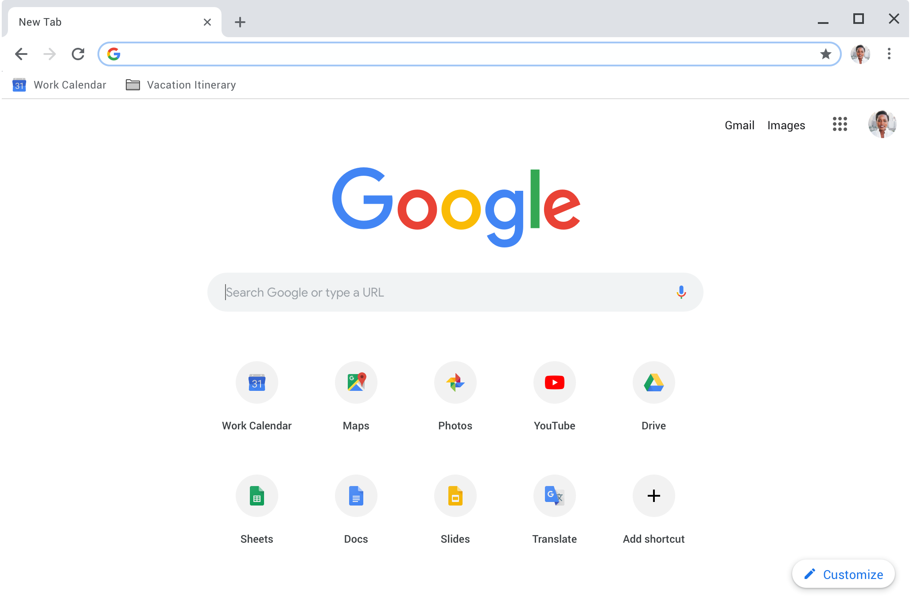
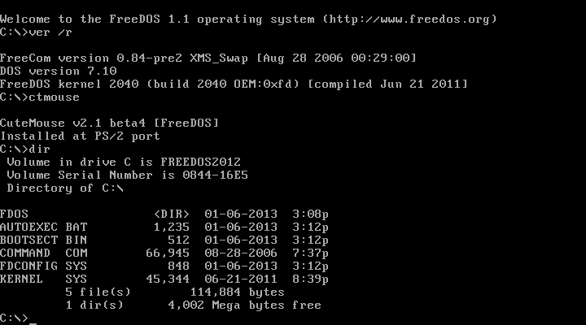
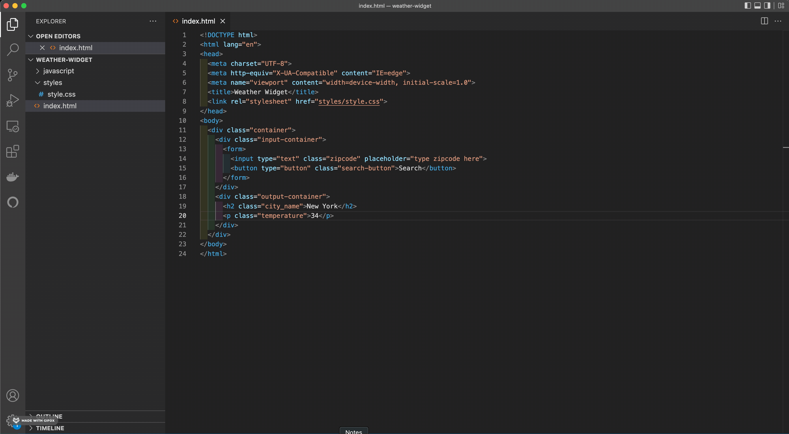
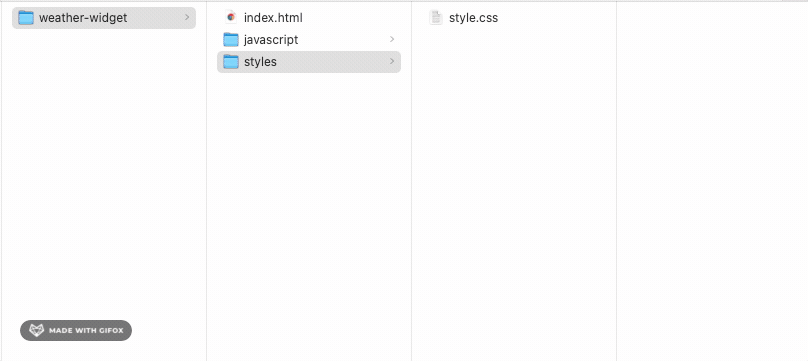
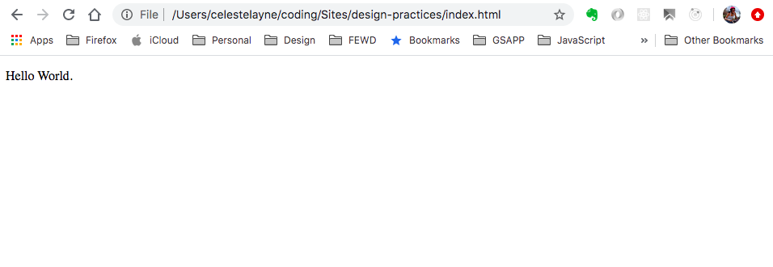

# Javascript in the Browser - Getting Started

Digital technologies increasingly form the backdrop for our everyday work and play – Zoom, FaceTime, Slack, Instagram, GMail, Spotify, the list is almost endless. Something as simple as a weather widget mediates awareness of the world in ways that matter to the person using it – should I walk with an umbrella? do I need my sunglasses? maybe I should pack an extra sweater? since its raining, maybe I'll go to the museum instead of the park?

This module will walk through the steps of building a weather widget – starting with the basic HTML structure and building out the styles and interaction. The challenge is to design a display of current weather conditions for a single city that will be determined by the user of your site. The premice of this experiment is to guide you through the steps of using client-side JavaScript in the browser to request JSON data directly from a weather service and render that JSON data to the web browser, in a delightful manner.

__Note:__ This experiment is meant to be used as a technical guide. Consider _all_ the data that is returned from the weather service, not just the temperature and let that inform your design choices. What kind of experience could you create to accomodate all possible weather conditions? Consider how your agency as a designer can enter into the _development_ of this interface.

### References

* [Weather Gradient](https://weathergradient.com/)
* [Do I Need a Jacket](https://doineedajacket.com/)

## Getting Started

_The following are the instructions for getting your computer set up to complete the modules in this sequence._

#### Set-up the following accounts and software

* [Google Chrome](https://www.google.com/chrome/downloads/)
* [VS Code](https://code.visualstudio.com/), [Sublime Text](https://www.sublimetext.com/) or [Atom](https://atom.io/)
* [GitHub](https://github.com/)

#### Browser



This sequence uses Google Chrome as the preferred browser for its robust [DevTools](https://developer.chrome.com/docs/devtools/). If you don’t already have it, please follow the installation instructions for [Google Chrome](https://www.google.com/chrome/downloads/).

It is recommended that you install the following Chrome Extensions:

* [JSON View](https://chrome.google.com/webstore/detail/jsonvue/chklaanhfefbnpoihckbnefhakgolnmc)

#### Window Manager
While programming it's pretty common to need to juggle the placement of multiple windows. To speed up this process install Spectacle, a program that does this for us (and gives us a bunch of convenient keyboard shortcuts).

* Download [Spectacle](https://www.spectacleapp.com/) 
 * Next, extract it and drag the application icon into your `Applications` directory.
 * Finally, launch the app by right-clicking on the Spectacle icon and click open, follow the instructions to enable the accessibility options. 
* It will serve you well to familiarze yourself with Spectacle commands and keyboard shortcuts, like:
 * Move window to the left-half: Command+Option+LeftArrow
 * Move window to the right-half: Command+Option+RightArrow
 * Maximize a window: Command+Option+F	

#### Text Editor

##### What is a Text Editor?

* Text editors provide an interface for viewing and modifying text files.
* There are different kinds of text editors:
 * Terminal/command line: Vim, Emacs, GNU nano
 * Window-based: VS CODE, Sublime, Atom, TextMate, Notepad++

##### Modern Text Editors

* Can open a file or directory.
* Can understand context.
 * Feature context-sensitive help.
 * May highlight errors or bad practices in your code.
 * Adapt to different file formats.
 * Provide syntax highlighting. 
* Provide extensions and plugins to add additional features to a text editor.

##### Types of Text Files

* Plaintext
* Markdown
* HTML
* JavaScript
* Python
* BASH


##### Get Up and Running with VS Code

1. Go [here](https://code.visualstudio.com/) to download Visual Studio Code.
2. Open the downloaded zip file.
3. Drag the unzipped `Visual Studio Code` app to your `Applications` folder.
4. Launch the application by clicking on the icon or press `Command + Spacebar` and type VS Code in the input field that appears

References: [Visual Studio Code Tips and Tricks](https://code.visualstudio.com/docs/getstarted/tips-and-tricks)

#### Add Packages

Visual Studio Code’s core functionality can be extended using thousands of third-party packages that can help reduce your errors, and increase your productivity. Install [VS Code Extensions](https://code.visualstudio.com/docs/editor/extension-marketplace) in the VSC extensions sidebar.

1. Click on the `Extensions` icon and search for `indent-rainbow` extension.
2. When you have found the package, click on the green `install` button.
3. You may be prompted to reload your Visual Studio Code. That’s perfectly fine!
4. After reloading, you will now have that extension installed and activated!
5. Now, try searching for and adding the `open in browser` extension as well.

#### Terminal

Have you ever opened up the Terminal, then you may have wondered what to do next? You're not alone. Developers on macOS and Linux machines use Bash to interact with files and applications. Bash is a command-line interface shell program used extensively in Linux and macOS. The name Bash is an acronym for "Bourne Again Shell," developed in 1989 as a successor to the Bourne Shell.

##### What is a GUI (pronounced gooey)?

There was a point when computers didn't come with a Graphical User Interface (GUI). Instead, everyone interacted with the computer using text commands in what we call a Command Line Interface (CLI).



_FreeDOS 1.1 is a free software operating system for IBM PC compatible computers_

Today, the command line still exists, even though you may have never seen it as a casual computer user. As a developer, you will regularly intereact with the command line to manage your files and tell your computer how to run the programs you write. It will greatly speed up your development process and help you take ownership of your computer at a deeper level. 

##### What is a shell?

"What's a shell?" you ask? A shell is a computer program that allows you to directly control a computer's operating system (OS) with a graphical user interface (GUI) or command-line interface (CLI). Simply put, it is a program that accepts text as input and translates that text into the appropriate functions that you want your computer to run. For example, Windows 10 is based on the Windows shell that allows you to control your OS with a desktop, taskbar, and menus.

While Bash is famous for being the go-to CLI shell in Mac and Linux, Windows uses Command Prompt and PowerShell to perform the same functions as Bash. But, it's now possible to install Bash on Windows 10 to provide almost the same functionality as Bash in Mac and Linux.

##### Basic Bash Commands

| Key/Command | Description 				                |
| :---        | :---                                    |    
| Tab         | Auto-complete files and folder names    | 
| cd [folder]  | Change to a different directory                       | 
| ls  | Lists the contents of a directory                       | 
| open [file]  | Opens a file                       | 
| open .  | Opens the directory                      | 
| clear  | Clear terminal screen                       | 
| touch [file]  | Create new (empty) file                       | 
| pwd  | Full path to working directory                       | 
| mkdir [dir]  | Create new directory                      | 
| cp [file] [dir]  | Copy file to directory                      | 
| mv [file] [new filename]  | Move/Rename, e.g. mv -v [file] [dir]                      | 

#### Open Visual Studio Code from Terminal



1. With Visual Studio Code open, type the following shortcut to pull up the command pallette: `command + shift + P`
2. Enter the command `install 'code' command in PATH` and press Enter.
3. Now you will be able to type `code` in the Terminal to open Visual Studio Code.

##### How?

Real-world software projects often involve many files, which are organized into folders. It's handy to be able to see all files in our project while working in our text editor. VS Code makes this easy, as it supports a project mode. To use this mode, we simply pass in a directory.

1. Navigate to the root of your project folder.
2. In the command line type `code .` and VS Code will launch with the project folder ready to edit.

```
code weather-widget
```
or

```
cd weather-widget
code .
```
Notice that the sidebar now has a folders section that shows all files and folders in the project. Clicking on a folder expands the view to display its contents.

3. To open VSC with a specific file, we can use the command line once again, this time passing in a file name like so:

```
cd weather-widget
code index.html
```

#### Configure Git to Use Visual Studio Code

When you forget to enter a commit message in the Terminal, git opens a text editor and reminds you to add a commit message.

Run the following command in the Terminal to configure git to open VS Code instead of the default text editor:

```bash
 $ git config --global core.editor "code --wait"
```

#### Version Control

If you don’t already have it, sign up for an account on [github.com](). This sequence uses it to track code changes and collaborate with others on projects.

_Confirm Install_

To check whether git is installed on your system, run the Terminal command:

```bash
$ which git
$ git --version
```
The output should be a directory path like `/usr/bin/git`. This is where git is installed on your machine. If you don't see any output, git is not installed on your computer.

If you don’t have it installed already, the `git --version` command will prompt you to install it.

There are also a few ways to install Git on Windows. The most official build is available for download on the Git website. Just go to [https://git-scm.com/download/win](https://git-scm.com/download/win) and the download will start automatically.

_Configure Git_

Configuring your git settings will help GitHub track your contributions and to make it easier and smoother to commit changes. Please be sure to use the same email as the one used to creat your GitHub account.

```md
 $ git config --global user.name "YOUR_GITHUB_USERNAME"
 $ git config --global user.email "YOUR_GITHUB_EMAIL_ADDRESS"
```

Reference:

* [Git First Time Setup](https://git-scm.com/book/en/v2/Getting-Started-First-Time-Git-Setup)
* [Setting your commit email address](https://docs.github.com/en/account-and-profile/setting-up-and-managing-your-github-user-account/managing-email-preferences/setting-your-commit-email-address)

#### Directory Structure
The following is a suggested structure for your sequence folder.


```md
weather-widget
├── index.html
├── styles
│   └── style.css
└── javascript
    └── main.js
```
It is best practice to separate out the structure of your project _index.html_ from the styles _style.css_ from the behaviors _main.js_. 



* Type the command `pwd` into the Terminal and hit enter. After entering the command, you should see something like: `/Users/username` directly above a new prompt.
* Create a new project folder that will hold all the work created in this sequence. Type the command `mkdir /weather-widget` and hit enter. If you re-type `ls` , the "list" command, you should notice a new folder called "weather-widget"
* Navigate into this new directory: `cd /weather-widget`. Type the command to print your working directory, `pwd`. You should now be inside the folder called `/weather-widget`
* Create the subfolders for the sequence: `mkdir styles javascript`. Check that you created the  folders by typing `ls`.

##### Creating and Opening Files

* Double-check you’re in the root folder `/Users/yourusername/weather-widget`
* Create a new file using the following command: `touch index.html`
* Open the file in the text editor: `code index.html`

##### Creating Local Site

Did you know that you can create web pages without being connected to the internet? Webpages are simply files, often with the extension `.html`. To preview them, just drag the file to your Chrome web browser. You’ll notice the top URL starts with `file://...` This is the indication of a local file. Local files are running on your computer, whereas when the top URL bar starts with `http://...` , it means it’s running on the internet and can be seen by anyone.

```html
<!DOCTYPE html>
<html>
  <head>
    <meta charset="utf-8">
    <title>Programming for Design Practices</title>
  </head>
  <body>
    <h1>Hello World.</h1>
  </body>
</html>
```

1. Add content to your `index.html` file
 * Open up your `index.html` file in the text editor
 * Copy and paste the above code into your `index.html`
 * Save it
2. Test that the page works locally. To do this, drag your `index.html` into your Chrome web browser. You should get something that looks like the following screenshot.



### Final Check of Mac OS Applications
* __Spectacle (for Mac):__ Open [Spectacle](https://www.spectacleapp.com/) using Spotlight, by pressing `⌘-Space` and typing Spec, and then pressing Return. It will direct you to change your Accessibility settings to allow it to control window management.
* __Terminal:__ Open Terminal using Spotlight (⌘-Space, and type Term), and then open the Preferences pane (⌘-,), choose Profiles, and then import the profile "Tomorrow Night.terminal" from the Desktop by clicking on the gear symbol at the bottom of the list of themes and choosing Import.... Then set that profile to the default by clicking on it and choosing "Default." When you open a new terminal window it should have a black background.


#### Create Remote Site
To set up your site on the web, see [How to Git & Github?](git-and-github)
