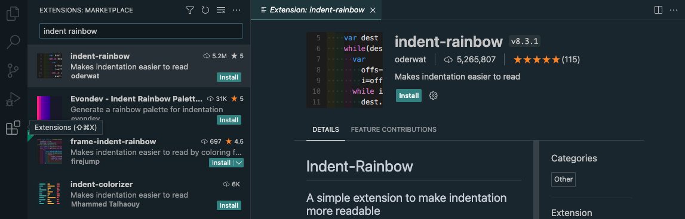

# Javascript in the Browser - Getting Started

* Duration: 1 hour
* Deliverable: [Challenge](#challenge) 

Digital technologies increasingly form the backdrop for our everyday work and play – Zoom, FaceTime, Slack, Instagram, GMail, Spotify, chatGPT, the list is almost endless. Something as simple as a weather widget mediates awareness of the world in ways that matter to the person using it – should I walk with an umbrella? do I need my sunglasses? maybe I should pack an extra sweater? since its raining, maybe I'll go to the museum instead of the park?

This project-based tutorial will walk through the steps of building a weather widget – starting with the basic HTML structure and building out the styles and interaction. The challenge is to design a display of current weather conditions for a single city that will be determined by the user of your site.

### References

* [Weather Gradient](https://weathergradient.com/)
* [Do I Need a Jacket](https://doineedajacket.com/)

## Getting Started

_The following are the instructions for getting your computer set up to complete the modules in this sequence._

#### Set-up the following accounts and software

* [Google Chrome](https://www.google.com/chrome/downloads/) 
* [VS Code](https://code.visualstudio.com/)
* [GitHub](https://github.com/)
* [GitHub Desktop](https://desktop.github.com/)

### Web Browser

This sequence uses Google Chrome as the preferred browser for its robust [DevTools](https://developer.chrome.com/docs/devtools/). If you don’t already have it, please follow the installation instructions for [Google Chrome](https://www.google.com/chrome/downloads/).

It is recommended that you install the following Chrome Extensions:

* [JSON View](https://chrome.google.com/webstore/detail/jsonvue/chklaanhfefbnpoihckbnefhakgolnmc)

### Code Editor
 // replace image with course repo

#### What is a Code Editor?

* Code editors provide an interface for viewing and modifying files.
* There are different kinds of code editors:
  * Terminal/command line: Vim, Emacs, GNU nano
  * Window-based: VS CODE, Sublime, Atom, TextMate, Notepad++

#### Modern Code Editors

* Can open a file or directory.
* Can understand context.
 * Feature context-sensitive help.
 * May highlight errors or bad practices in your code.
 * Adapt to different file formats.
 * Provide syntax highlighting. 
* Provide extensions and plugins to add additional features to a text editor.

#### Types of Text Files

* Markdown
* HTML
* JavaScript
* Python

#### Get Up and Running with VS Code

This sequence uses Visual Studio Code as the preferred code editor because it is free, open-source and cross-platform meaning that it supports macOS, Linux, and Windows - so you can hit the ground running. For more detials, read [Get Up and Running with VS Code](). 

1. Download Visual Studio Code:
   * See the installation guides for [Mac](https://code.visualstudio.com/docs/setup/mac) and [Windows](https://code.visualstudio.com/docs/setup/windows)
2. Open the downloaded zip file.
3. Drag the unzipped `Visual Studio Code` app to your `Applications` folder.
4. Launch the application by clicking on the icon or press `Command + Spacebar` and type VS Code in the input field that appears

References: [Visual Studio Code Tips and Tricks](https://code.visualstudio.com/docs/getstarted/tips-and-tricks)

#### Add Packages

Visual Studio Code’s core functionality can be extended using thousands of third-party packages that can help reduce your errors, and increase your productivity. Install [VS Code Extensions](https://code.visualstudio.com/docs/editor/extension-marketplace) in the VSC extensions sidebar.

1. Click on the `Extensions` icon and search for `indent-rainbow` extension.
2. When you have found the package, click on the green `install` button.
3. You may be prompted to reload your Visual Studio Code. That’s perfectly fine!
4. After reloading, you will now have that extension installed and activated!
5. Now, try searching for and adding the `open in browser` extension as well.

#### Next Steps: Create Remote Site
To set up your site on the web, see [How to Git & Github?](./modules/11-interactive-web/111-git-and-github.md)
