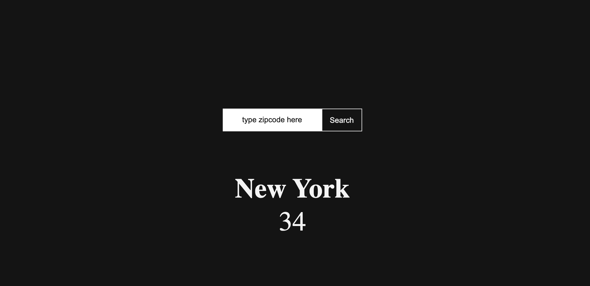

---

moduleid: 110
title: Javascript in the Browser I - Weather UI Design
published: True
slug: javascript-in-browser
authors:
 - "Celeste Layne"
---

===========================================

# Javascript in the Browser I - Weather UI Design

Digital technologies increasingly form the backdrop for our everyday work and play. Something as simple as a weather widget mediates awareness of the world in ways that matter to the person using it. Design a display of current weather conditions for a single city which will be determined by the user of your site. The premice of this experiment is to guide you through the steps of using client-side JavaScript in the browser to request JSON data directly from a weather service and render that JSON data to the web browser.

__Note:__ This experiment is meant to be used as a technical guide. Consider _all_ the data that is returned from the weather service, not just the temperature and let that inform your design choices. What kind of experience could you create to accomodate all possible weather conditions? Consider how your agency as a designer can enter into the design of this interface – as a system, what is the weather?

#### References

* [Weather Gradient](https://weathergradient.com/)
* [Do I Need a Jacket](https://doineedajacket.com/)


### Set Up Your HTML Project

1. Set up a new project using a text editor, like [Visual Studio Code](https://code.visualstudio.com/) a free, open source code editor available for Mac, Windows, or Linux.
2. Open up a new project folder and name it `weather-widget`. To create a new project folder in Visual Studio Code, navigate to the “File” menu item in the top menu and select “Add Folder to Workspace.” In the new window, click the “New Folder” button and create a new folder called `weather-widget`.

Inside that folder, create this recommended project structure:

```md
weather-widget
├── index.html
├── styles
│   └── style.css
└── javascript
    └── main.js
```

In your blank `index.html` file, set up the bones for what will be your weather application.

```html
<!DOCTYPE html>
<html lang="en">
<head>
  <meta charset="UTF-8">
  <meta name="viewport" content="width=device-width, initial-scale=1.0">
  <title>Document</title>
</head>
<body>
  <!-- your code goes in here -->
</body>
</html>
``` 

### Start with the basic layout of the page

This is what we're going to be building:



1. Define two sections with the following class names: `input-container` and `output-container`.
2. The `input-container` will include a form with a search field where the user will type in their zipcode and a submit button that makes the request for the current weather to the weather service.
3. The `output-container` will include the name of the city and current temperature. By default, the `output-container` won't contain any content. However, once the user makes the request for the weather of a specific zipcode, if weather data is available, the relevant data will be returned and rendered to the web browser.

The following is the initial page layout and goes in between the body tags:

```html
<div class="container">
  <div class="input-container">
    <form>
      <input type="text" class="zipcode" placeholder="type zipcode here">
      <button type="button" class="search-button">Search</button>
    </form>
  </div>
  <div class="output-container">
    <h2 class="city_name"></h2>
    <p class="temperature"></p>
  </div>
</div>
```

### Style the layout

First, let's use the universal selector property to strip all the elements of their inherent margins and padding.

```css
* {
  box-sizing: border-box;
  margin: 0;
  padding: 0;
}
```

Next, we'll set the height of the HTML element to 100% as well. Body looks to its parent (HTML) for how to scale the dynamic property, so the HTML element needs to have its height set as well. This will give our layout a nice snug fit within the browser window.

```css
html,
body {
  height: 100%;
  background-color: #141414;
}
```
Now, we need to center the input and button in the browser window. There are a couple ways we can accomplish this; but for the sake of simplicity we will use flexbox.

```css
.container {
  height: 100%;
  display: flex;
  flex-direction: column;
  align-items: center;
  justify-content: center;
}

form {
  display: flex;
}
```

__Note:__ we've added the `display: flex` property to the form element which defines it as a flex container because we want the button to sit snugly next to the input field and the default `flex-direction`, the firection flex items are placed insode the flex container is row.

Resource: 
[A Complete Guide to Flexbox]() by Chris Coyier. CSS Tricks.
[Basic concepts of flexbox](https://developer.mozilla.org/en-US/docs/Web/CSS/CSS_Flexible_Box_Layout/Basic_Concepts_of_Flexbox) MDN Documentation

### Style the input and output containers

Add styles to the input field and the search button of the `input-container`.

```css
input[type="text"] {
  width: 100%;
  height: 40px;
  border: none;
  text-align: center;
}

input::placeholder{
  color: #141414;
}

.search-button {
  color: #f4f4f4;
  background-color: #141414;
  width: 100px;
  height: 40px;
  text-align: center;
  line-height: 40px;
  border: 1px solid #f4f4f4;
}
```

### Style the data appended to the DOM

Add styles to the `h2` and `p` tags of the `output-container`. This is where the current temperature about the requested city will be rendered.

```css
.output_component{
  position: absolute;
  top: 60%;
  left: 50%;
  transform: translate(-50%, -50%);
}

.city_name, .temperature{
  text-align: center;
  font-size: 3em;
  line-height: 1.2em;
}
```

### Weather Icons

The weather service we will be using in this module is called Open Weather Map and it comes with its own [icon set](https://openweathermap.org/weather-conditions). However, you can create your own set of weather icons informed by your design choices for this widget. Maybe your designs don't require icons at all. Alternatively, you can use one of the following UI kits:

* [Font Awesome](https://fontawesome.com/v5.15/icons?d=gallery&p=2&c=weather)
* [The Noun Project](https://thenounproject.com/search/icons/?iconspage=1&q=weather)

At this point, we’re ready to build the core functionality of our weather widget. If you haven't done so already, let’s do it!