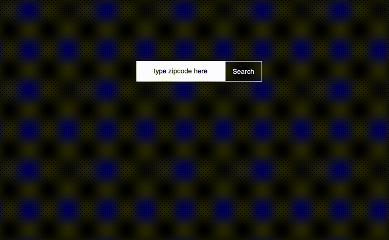
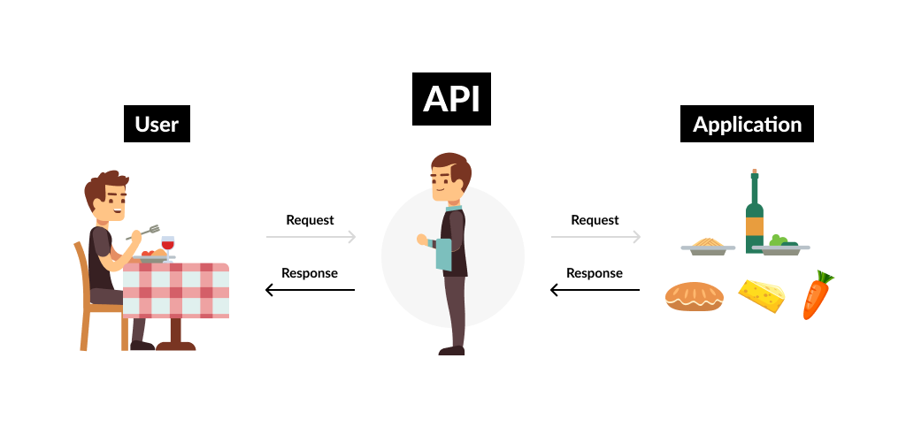
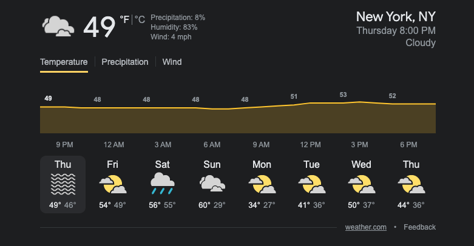
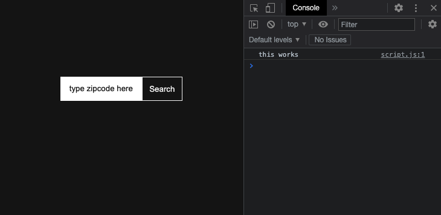
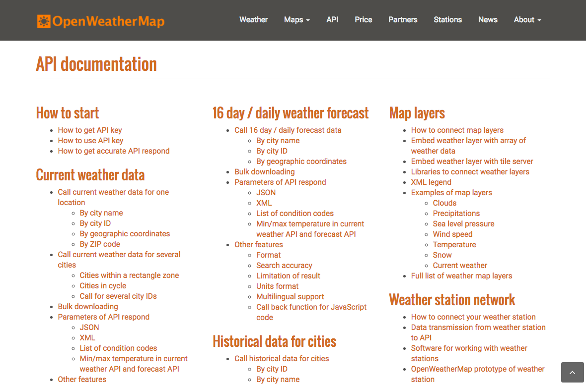
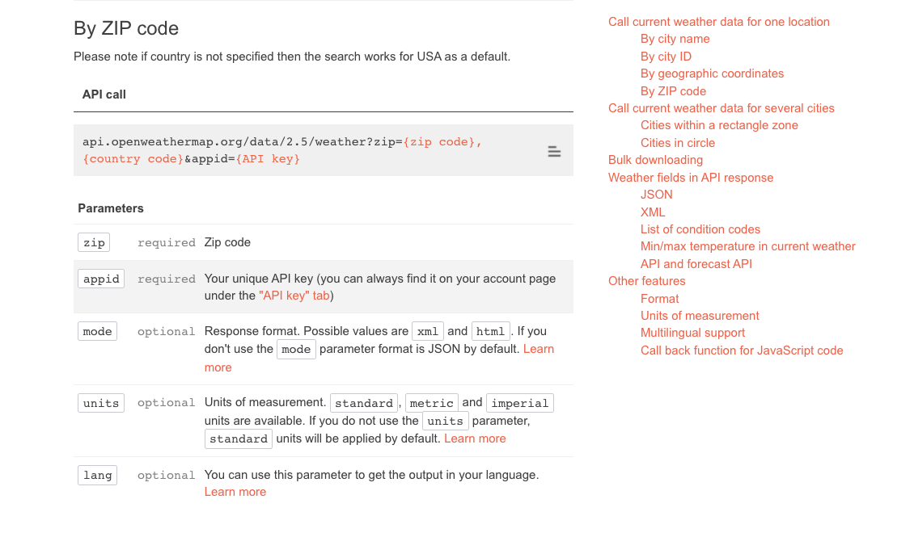
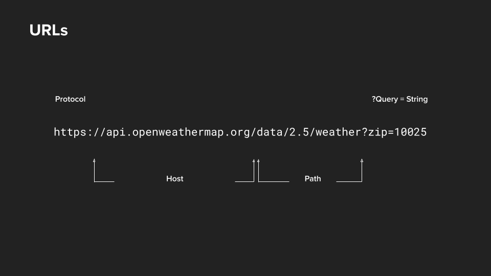
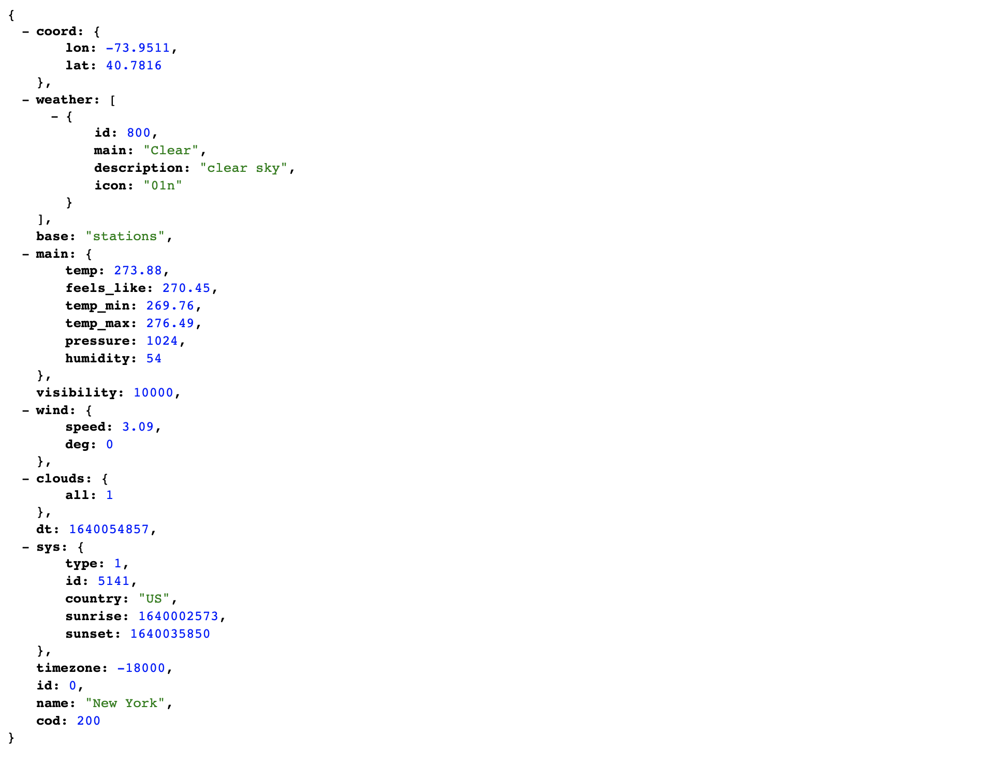
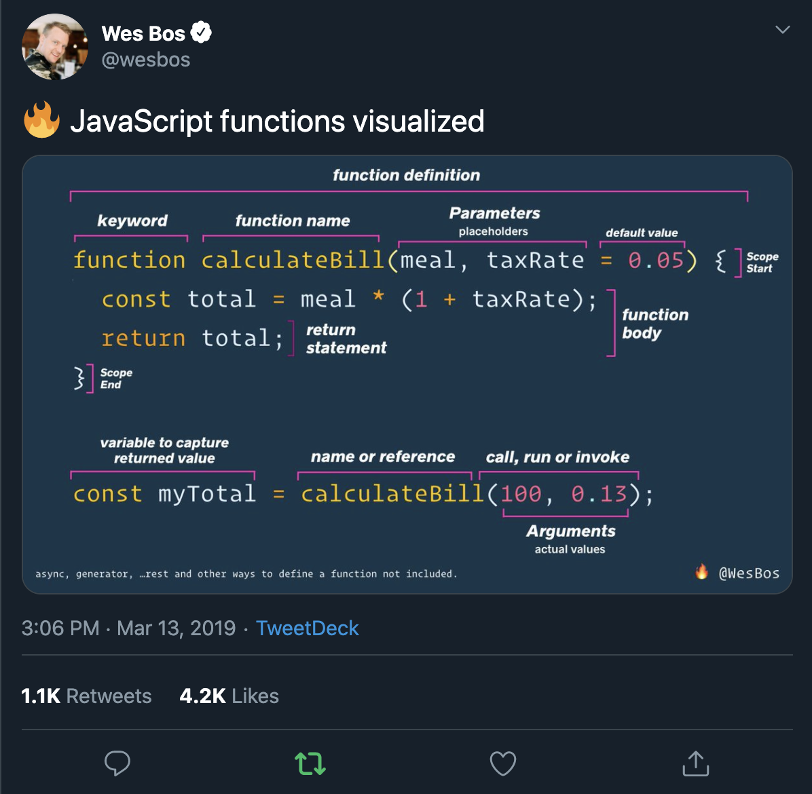

===========================================

# Data and APIs

## What are we building?



Using [Open Weather Map API](https://openweathermap.org/api), we will build a weather application that allows a user to type their zipcode and render the current weather forcast to the browser window.

### What is an API?
First things first, API stands for “Application Programming Interface”. It is a way for you to get raw public data that organizations (Google, NASA, City of New York) make available for you to use in your own website. This raw data is accessed using a web URL:

```js
http://api.openweathermap.org/data/2.5/forecast?id=524901&appid={API key}
```

Sometimes the easiest way to understand the function of an API is to think about a metaphor. A common metaphor used is that of the customer, a waiter, and a restaurant kitchen: Imagine you’re sitting at a table in a restaurant with a menu of choices to order from. The kitchen is the part of the “system” that will prepare your food order. What is missing is the critical link to communicate your food order to the kitchen and deliver your actual food (raw data) back to your table. That’s where the waiter or API comes in. The waiter is the messenger — or API — that takes your request or food order and tells the kitchen — the system — what to do. Then the waiter delivers the response (raw data) back to you; in this case, it is the food.



### Where Do We Find APIs?
APIs are published everywhere. Chances are good that most major content sources you follow online publish their data in some type of serialized format. Here are a few examples:

* [Open Weather Map](https://openweathermap.org/api)
* [NYC Open Data](https://opendata.cityofnewyork.us/)
* [The New York Public Library Digital Collections API](http://api.repo.nypl.org/)
* [Cooper Hewitt, Smithsonian Design Museum Collections](https://collection.cooperhewitt.org/api/)

### The API in action
One common example of an API that we come into contact with on a daily basis is _weather data_. These rich weather snippets are found on many platforms like Google Search or smart home devices (Echo Dot, Google Nest, Facebook Portal). For example, if you search “weather + [your city’s name]” on Google, you will see an interactive widget at the top of the search results with the current weather conditions and forecast. 



Here, Google sources this weather data from a third party which sends back the latest weather details in a way that is easy to format. In this case, they are using the [Weather Channel](https://weather.com/weather/today/l/40.7500,-73.9967) API.

### Why Just Data?
Sometimes thats’s all we need. The amount of data we produce daily is mind blowing. In 2020, 2.5 quintillion bytes of data was created daily. _There are 18 zeros in a quintillion_. For those times, we want a concise format. All this raw data, from all these browsers and servers, has to travel through the internet. This can be the slowest part of the request-response cycle. Using our previous metaphor, imagine the waiter having to navigate through Grand Central Station at rush hour to place our order with the kitchen. We want to minimize the amount of food (raw data) he needs to bring back to the table. For those times, we want a concise format.

### What is Serialized Data?
All data sent via [HTTP](https://developer.mozilla.org/en-US/docs/Web/HTTP/Overview "An overview of HTTP, MDN Documentation") are strings. Unfortunately, what we really want to pass between web applications is structured data (i.e. arrays and objects). So, native data structures can be serialized into a string representation of the data.

One of these serialized data formats is JSON.

### JSON
JSON stands for “JavaScript Object Notation” and has become a universal standard for serializing native data structures for transmission. It is light-weight, easy to read and quick to parse.

#### The Structure of JSON

```js
{
  "users": [
    { "name": "Carl", "id": 536 },
    { "name": "Heather", "id": 857 }
  ]
}
```

__Note:__ JSON is a serialized format. While it may look like an object, it needs to be parsed so we can interact with it as a true Javascript object.

#### Accessing the data in the JSON object

Within each of those objects, there is an object that contains information we want to access about the `users`: name and id. To access the name in this dataset, we can use the following syntax:

```js
// dot notation
users.name

// bracket notation
users["name"]
```

## Let's See That Data, Shall We?

If you haven't done so already, create a new project.

### Step 0 – Create Directory
Create a directory to organize your program files. Here, I am creating a folder called `weather-widget`. Inside that directory, is a recommended project structure:

```md
weather-widget
├── index.html
├── styles
│   └── style.css
└── javascript
    └── main.js
```

### Step 1 – Execute JavaScript in a web page

1. Open the `weather-widget` in your text editor and add the following log to the top of the `main.js` file:

```js
console.log("this works");
```
2. Link the JavaScript file to the HTML file with a script tag. When implementing JavaScript on your webpages, insert the script just above the closing `</body>` tag. The browser renders HTML onto a page in the order you’ve written it. We load `<script>` tags just before the end of the document to ensure that the rest of our content has loaded first.

```js
<body>
  ...
  
  <script src="javascript/main.js"></script>
</body>
```

### Step 2 – View logged message in the browser

Most modern web browsers provide you with access to a Developer Console where you can work with JavaScript in an interface similar to a Terminal shell. To see a message that you've created using `console.log()`, open a chrome browser window:

1. using the keyboard shortcut on macOS: COMMAND + OPTION + J 
2. using the browser menu bar: View → Developer → JavaScript Console.

At the top of the pane that appears, choose the Console tab. Any messages that you send from your `main.js` file will appear here.



The JavaScript Console is a text-only interface. When we type into the console, we’re writing expressions in real-time. These expressions must be written using JavaScript syntax. Let’s start with an alert that prints out the string Hello, World:

```js
alert(“Hello, World!”);
```

Once you press the ENTER key following your line of JavaScript, you should see the alert pop up in your browser. Press OK to close the window. To have the same result printed to the console, replace the `alert()` with `console.log()`:

```js
console.log("Hello, World!");
```

##### Resource:
[Get Started With Running JavaScript In The Console](https://developer.chrome.com/docs/devtools/console/javascript/) by Kayce Basques, Technical Writer, Chrome DevTools & Lighthouse

## Set Up the API

### Step 1 – Create an account
If you don’t already have an Open Weather Map account, [sign up for a free one here](https://home.openweathermap.org/users/sign_up).

#### Look at the Documentation
Now, let's familiarize ourselves with the API documentation. There are no rules governing how to write documentation for an API, so its content is presented differently each time. Knowing how to quickly find key pieces of information is the most important part of reading API documentation.



### Step 2 – API Key
Once you've signed up, you're given an [API key](https://home.openweathermap.org/api_keys). Copy the API key and create a variable in your `main.js` file to store the key. You can place it just below the `console.log()`.

```js
 const API_KEY = “”;
```

#### API Keys
While the majority of APIs are free to use, many of them require an API “key” that identifies the developer requesting data access. This is done to regulate usage and prevent abuse. Some APIs also rate-limit developers, meaning they have caps on the free data allowed during a given time period.

When we click on the “How to Start” link, we are taken to a page that provides us with information on how to get an API key.

An API key is like a signature that uniquely identifies a user. This helps APIs keep track of their traffic and monitor any suspicious activity, such as an individual user sending too many requests.

For example, malicious users might try using multiple usernames until they find one that works. Keys can help prevent these kinds of attacks by limiting how many requests one user can make.

OpenWeatherMap’s documentation makes it easy for us to obtain an API key. We simply click the “Sign Up” button and create an account, and then you can get an API key.

To make an API call, we’ll need to add our key to the URL:

```js
http://api.openweathermap.org/data/2.5/forecast/city?id=524901&APPID={APIKEY}
```

Now that we have our key, let’s look back at some of the other information the API documentation can provide. Spend a few minutes exploring the documentation. See what different types of data you can get from the API.

### Step 3 - Current Weather Data by Zipcode

Recall, we are building a weather widget that allows a user to enter a zipcode and render the current weather forcast to the web browser. For documentation on how to set that up, navigate to [Open Weather Map](https://openweathermap.org/api) and scroll down, you'll see a section called "API Documentation." Click on the [By Zip Code](https://openweathermap.org/current#zip) link.



#### URLs
Before taking a look at the JavaScript, let’s take a step back and find out how we can access the weather data for New York City using the Open Weather Map API. To access this information, we’ll need a URL where we can find the JSON data for a city that matches the zipcode.

Let’s take a look at the different components of a URL that could be used for an API call:

* __The Protocol:__ HTTP — or Hypertext Transfer Protocol — is a system of rules (“protocol”) that determines how web pages (“hypertext”) are sent (“transfer”) from one place to another.
* __The Host:__ This is the domain name for the site. This request will be sent to a Domain Name Server (DNS), which will look up the IP address and find out where the files for that resource are stored. An IP address is a unique string of numbers that helps us locate the correct server.
* __The Resource Path:__ Where the resource (HTML, JSON, PDF, images, etc.) is located.
* __The Query:__ We can use queries to “filter” the data we find and retrieve certain results.



### Step 4 – Constructing the URL
We can use string concatenation or string templating to add the right zipcode to the URL, and then locate weather information about that city:

```js
// using concatenation
"https://api.openweathermap.org/data/2.5/weather?zip=" + zipcode

// using string templating
`https://api.openweathermap.org/data/2.5/weather?zip=${zipcode}`
```

For now, we're going to hard code our own zipcode and API key into the URL. Paste the below URL into your web browser and take a look at the JSON object that is returned. _Remember to swap out your own zipcode and API key_.

```js
https://api.openweathermap.org/data/2.5/weather?zip=10128&APPID=[PUT YOUR API KEY HERE]
```

You can see that we have an object with several properties including coordinates, weather, wind, clouds, timezone, name and main:



__Note:__ If you don't see the data, check that your API key matches the one in your account.

## Making an API Call

### Getting Data from an API with JavaScript Fetch

Now that we know more about the URL, we’ll use that information to make the API call and log that data to the developer console. Let’s dig into the core functionality of the weather widget using a basic JavaScript fetch request:

```js
fetch(`http://api.openweathermap.org/data/2.5/weather?zip=10128&APPID=${API_KEY}`)
  .then(response => response.json())
  .then(data => console.log(data));
```

Here we are fetching a JSON file across the network and printing it to the console. _Remember: To access the data in the browser concole, use the hot keys CMD + Option + i_ The simplest use of `fetch()` takes one argument — the path to the resource you want to fetch — and returns a promise containing the response. This is just an HTTP response, not the actual JSON. To extract the JSON body content from the response, we use the `json()` method.


##### Resource:
* [Using Fetch](https://developer.mozilla.org/en-US/docs/Web/API/Fetch_API/Using_Fetch), MDN Documentation
* [How to Use the JavaScript Fetch API to get Data](https://www.digitalocean.com/community/tutorials/how-to-use-the-javascript-fetch-api-to-get-data) by Sara Vieira. Scotch.io

### Wrap it in a `getWeatherData()` function

Function is a term that comes out of mathematics. You may remember hearing it in your high school algebra class. The basic idea of a function is simple — it’s a relationship between a set of inputs and a set of outputs.

#### What is a Function?

A function is a block of code that returns a result. Think of a function like a box that isn’t aware of the outside world. It only knows what you tell it and when you ask it something (run or call), it will reply with an answer.

Functions encapsulate a set of commands pertaining to one set of functionality. In this case, the input is the zipcode and the output is the weather data. The purpose of this function is to get the weather data. To make it clear, that's what we'll name the function. _Don't forget to invoke the function_.

```js
const getWeatherData = () => {
  // fetch request goes in here :-)
}

getWeatherData()
```
#### Why Use Functions?

1. Group Steps – Functions allow you to break up your code into smaller organized chunks.
2. Reusability – You can repeat functions throughout your code by calling the function. This saves you time from writing more code.
3. Store Steps – Provides us with a way to ‘store’ the steps needed to achieve a task.

#### Anatomy of a Function

