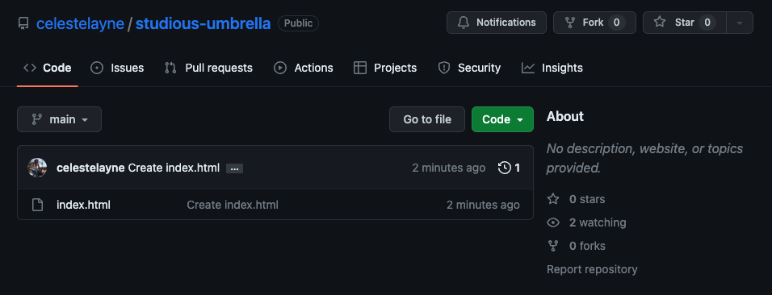

# Javascript in the Browser - Git and GitHub Foundations

* Duration: 1 hour
* Deliverable: [Challenge](#challenge) 

### Github, what is it?
At a high level, GitHub is a website and cloud-based service that helps developers store and manage their code, as well as track and control changes to their code. To understand exactly what GitHub is, you need to know two connected principles:

* Version control
* Git

### What is Version Control?
Version control is the management of changes to documents, computer programs, websites, and other collections of information.

### What is Git?
Git is a specific open-source version control system created in 2005 by Linus Torvalds, the creator of Linux. Specifically, Git is a distributed version control system, which means that the entire codebase and history is available on every developer’s computer.  It can be used with any file type such as such as [Unity projects](https://unityatscale.com/unity-version-control-guide/how-to-setup-unity-project-on-github/) or [WebVR projects](https://aframe.io/), but is most often used for tracking simple codebases. 

GitHub is a Git repository hosting service. It allows developers and engineers to create remote, public-facing repositories on the cloud for free. While Git is a command line tool, GitHub provides a Web-based graphical interface.

For the following reasons, GitHub is the version control manager of choice:

* It manage changes over time.
* It aids sharing and collaboration.
* It allows for experimentation.

* [Getting Started with GitHub Desktop](https://docs.github.com/en/get-started/quickstart/hello-world), GitHub Desktop Documentation 

What is the difference between Git and GitHub? Find an answer [here](https://stackoverflow.com/questions/11816424/understanding-the-basics-of-git-and-github).


## GitHub Desktop 

Download the [GitHub Desktop](https://desktop.github.com/) application and install it on your computer.


## GitHub.com

Follow [these instructions](https://docs.github.com/en/get-started/signing-up-for-github) and sign up for a **free** personal [GitHub](https://github.com/) account.

### Create Repository

Log into [github.com](https://github.com/) and create a new repository using the link under the `+` icon in the upper right of the GitHub homepage.


Name the repository. For example, I named this one `studious-umbrella`. Thanks for the recommendation, GitHub! Check the box to add a README file. This repository will be the home for the work produced in this module. __Click the green create repository button__.


Once you’ve initialized the repository, it will take you to the home screen. __Click the green Code button__. Then select, Open with GitHub Desktop.


When you press this button, you may see an alert window asking, Open GitHub Desktop? __Click the Set up in Desktop__ button. This will launch the GitHub Desktop application.


Now…(this is important) choose a place on your computer where you want this repository to live. My local path is: `/Users/your-computer-name/Documents/GitHub/studious-umbrella`. __Click the blue Clone button__.


Yay! You’re in your local repository. GitHub Desktop provides some friendly suggestions for where to go next:

* Open the repository in your IDE (Visual Studio Code)
* View the files in the [Finder](https://support.apple.com/en-us/HT201732) on MacOS or [File Explorer](https://support.microsoft.com/en-us/windows/find-and-open-file-explorer-ef370130-1cca-9dc5-e0df-2f7416fe1cb1) on Windows
* Open the repository page on GitHub in your web browser

If you select, `Show in Finder`, you will be taken to a folder named `studious-umbrella`, this is the `local` version of your GitHub repository. It’s local address is: `/Users/your-computer-name/Documents/GitHub/studious-umbrella`. We will use this as a space to archive the work in this tutorial.

Selecting `Open in Visual Studio Code` will immediately open the project folder, `studious-umbrella` in your IDE. You're ready to start coding.


## Create Your First Webpage

See detailed instructions in the following document, [Exercise 01: Hello World](https://docs.google.com/document/d/10F3U7-U3mJdA2MdlDdrkt6iuydT4sq3Nv9OJk92AQKE/edit)

1. Open the repository in your code editor
2. Make a new HTML file named `index.html` in Visual Studio Code.
3. In VS Code, click on the `index.html` file which is currently blank and set up the bones for what will be your website by copying and pasting in the following code snippet, or using the one found [here](https://www.w3schools.com/html/html_basic.asp).
4. Modify the code with the words Hello World and save the file to your local GitHub repository.

```html
index.html

<!DOCTYPE html>
<html lang="en">
<head>
  <title>Document</title>
</head>
<body>

  <!-- your code goes in here -->

</body>
</html>
``` 

### Push Local Code to Remote Repository


1. Confirm that you see changes made to your file in the Changes Tab on the GitHub Desktop app.
2. Click the blue `Commit to main` button, then the blue `Publish branch` button.
3. Now, check to make sure that your changes were pushed to the `main` github.com repository (click on the `View on GitHub` link). Reload the page if you don’t yet see changes.



### Publish Your Website


1. In your github.com repository, find the `Settings` tab.
2. Scroll to the `Pages` section in the left menu. Under the `Build and Deployment` heading, click the dropdown menu under the `Branch` sub-heading and select the `main` branch as your publishing source. Keep the `/(root)` folder for your publishing source.
3. Click Save.


4. Now, drumroll please! In the same GitHub Pages section, you should see a green success bar appear that says: "Your site is live at `https://yourusername.github.io/studious-umbrella`." _Note:_ This may take a few minutes to occur.
5. Click on the link. Voila!


## Challenge

Submit your website to this Google Form [Interactive Web | Student GitHub Links](https://forms.gle/kTGHSLyyLvBBorBc9).

#### Next Steps: [HTML and CSS](./modules/11-interactive-web/112-html-and-css.md)