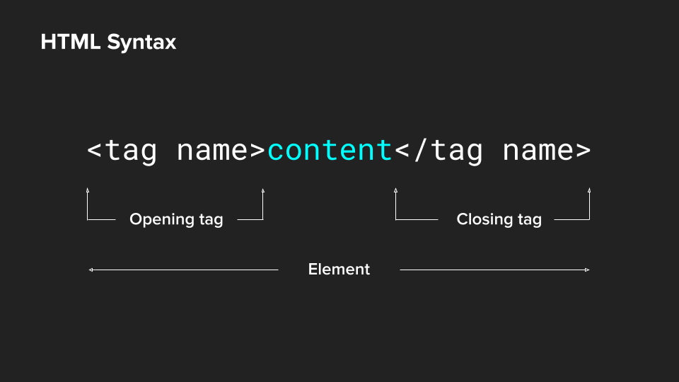

===========================================

# Sequence: Interactive Web
## Sequence Summary:
## Why?
## Modules:
* History of the Internet and Web
* Introduction to HTML and CSS
* Navigation
* Layout & Responsive Web
* Intro to JavaScript
* Motion: Intro to Animation
* Functions: Little Programs

# Interactive Web: Introduction to HTML & CSS

## Module Summary
HTML is a markup language typically used to structure content on a web page with tags that convey to the browser the type of content and how it should be presented. In this lesson, we are going to use HTML in a visual manner that takes into consideration graphic space, design and meaning.

## Why is this important?
_HTML is a markup language typically used to structure content on a web page with tags that convey to the browser the type of content and how it should be presented. In this lesson, we are going to use HTML in a visual manner that takes into consideration graphic space, design and meaning._


## What is HTML?
HTML stands for HyperText Markup Language and was invented in 1989 by Sir Timothy Berners-Lee, a computer scientist. Every website you’ve ever visited is rendered in HTML. Your web browser parses the HTML then renders the results.

HyperText is text that contains links to other texts. Markup describes a system of describing or annotating text files. Just like any language, HTML has its own vocabulary, grammar and syntax.

## Structural Markup



The fundamental building block of HTML is the element. Elements consist of an opening tag, closing tag and content (text, image, video) sandwiched in between. The content is what the user sees on the webpage. The tags tell the browser the type of content and how to present it. 

For example:

```html
<p>This is an example of a paragraph tag.</p>
```

## Tutorial 01

Using a pen and paper, let's draw an HTML element.

## Semantic Markup
Semantic elements tell web browsers something about the contents of the element. They are designed to communicate the meaning of the content to the browser, developer, reader, and any other technologies interpreting the document (e.g. voice assistants, search engine web crawlers, browser translation tools, or assistive technologies such as screen readers).


There are approximately 100 semantic elements available. The following is a list of commonly used ones:

### View Source

## Tutorial 02
For this exercise, let’s focus on presenting the text in different hierarchies and scales using the following HTML elements: . Do not link to external sites, rather link to parts of your poem using an attribute to assign an id . In doing so, think about how you can use the anchor links to meaningfully translate movement to your content.

Starter code for this tutorial can be found [here]().

## Page Structure

### Nesting
Think of HTML tags as boxes that hold your content. That content can be text, images, or video. Sometimes, you need to place boxes inside of other boxes. Those “inner” boxes are nested inside of others. A perfect example of this is the bulleted list. The list items are nested inside of the unordered list tag.

[add image here]

### Relationships — HTML Hierarchy
We often use the same terms that we would use to describe the relationship between family members, to describe the relationship between HTML elements. Each element is related to another element in a parent-child-sibling relationship.

An element that is directly above another element in the hierarchy is called the parent of the element below it. The element below the parent is called the child. When two elements are equal in the hierarchy, they are known as siblings.

[add image here]

### Document Object Model (DOM) Tree
In the DOM Tree, the opening and closing  elements form the foundation upon which the rest of the document is built.

[add image here]

### Indentation
While indentation has no bearing on how the page is rendered in the browser, it is especially important for readability of your code. Indented code is easier to read, easier to understand, easier to modify, and easier to maintain (e.g. is you forget to include a closing tag). Common practice is to indent one tab space for any tags that are nested inside other tags.

[add image here]

Whatever format you decide to use, just be consistent.

### Block vs Inline Elements

Historically, elements could be classified as either: block-level elements or inline elements. Block-level elements have built-in line breaks, causing them to automatically stack vertically, while inline elements wrap within their containing elements.

[add image here]

### Elements and Attributes

#### Links

#### Image

## What is CSS?

If HTML is a set of instructions telling the web browser what to display, CSS tells the web browser how to display it. CSS stands for Cascading Style Sheet and was invented in 1994 by Håkon Lie. It handles the presentation layer of our webpage and allows us to associate style rules with HTML elements.

It provides the browser with precise instructions on how to style each element we want displayed on the page and can affect the text format — like font, size, color — the size and position of various objects on the page, colors, spacial layouts, etc.

### CSS Syntax

[add image here]

### Three Ways to Apply CSS to a Website

#### Inline
If you’re looking to add a unique style for a single HTML element, you can use an inline style by adding the style attribute to the relevant tag. The style attribute can contain any CSS property. In this example, we’re changing the paragraph text color to blue and its size to 2 ems.

#### Embed a style tag in the head tag
You can include CSS rules by placing them inside a `<style>` element, which usually sits inside the `<head>` tag.

#### Link to an external file using the link tag
The <link> tag should live inside the `<head>` of the document and tells the browser where to find the CSS file that should be used to style the web page.

The benefit of using an external stylesheet allows you to use the same style sheet for multiple pages, e.g. if you want your About, Home and Contact pages to all have the same styling. As a result, you only have to make changes to one file.

## Tutorial 03

### Inheritance

## Cascading Style Sheets

### The Cascade

#### Specificity

### Selectors

#### The Class Selector. 
The class selector finds elements with a specific class, and as an attribute, allows us to target several elements that may share similarities.

#### The ID Selector. 
The ID selector uses the id attribute of an HTML tag to find one specific element. We can give any name we want to our ID attribute, besides the obvious reserved words, such as tag names, etc.

#### Specificity. 
One of the most important concepts with CSS is specificity. Imagine you select an element by it’s class and give it some style; then, on the next line, you select the same element by it’s element name and it’s ID — how does the browser know what style to apply?

## CSS Properties

### Color
Color brings your web pages to life. Every color on a computer screen is created by mixing amounts of red, green, and blue. There are three ways to specify colors in CSS:

#### Color Keywords
These can be found on MDN and are case-insensitive keywords that represent a specific color. The chart on MDN also includes the RGB hex value. For example:

#### Hexadecimal
Hexadecimal is a scale from 0 -> F with digits 0–9 the jumping to characters starting from ‘A’ to ‘F’ which altogether contains 16 different values.

#### rgb() and rgba()
Colors can be defined according to their red, green, and blue components (the RGB model) by using hexadecimal and functional notations. The optional alpha component represents transparency. The RGB scale is from 0 to 255.

### Web Typography
Web typography can be split into two groups: properties that affect the font and its appearance and those that have the same effect regardless of the font.

## Box Model
All HTML elements can be considered boxes. Even if you see a circle, it lives within a box. This box will either be a block-level box or an inline box.

The CSS box model describes this principle — a box wraps around all HTML elements, and it consists of: margins, borders, padding, and the actual content. This model allows us to place a border around elements and space elements in relation to other elements.
