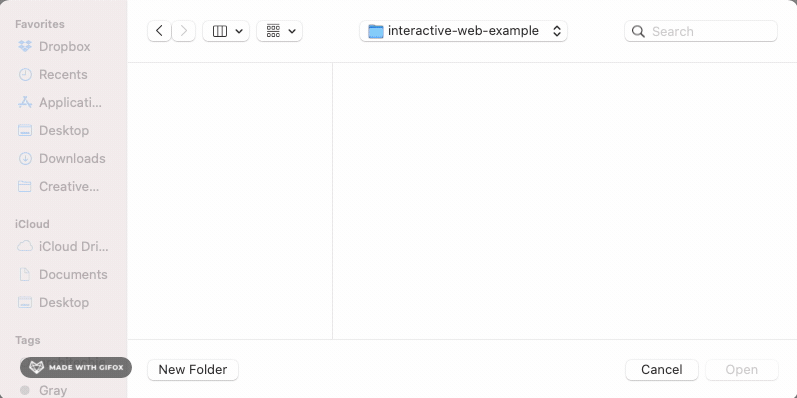
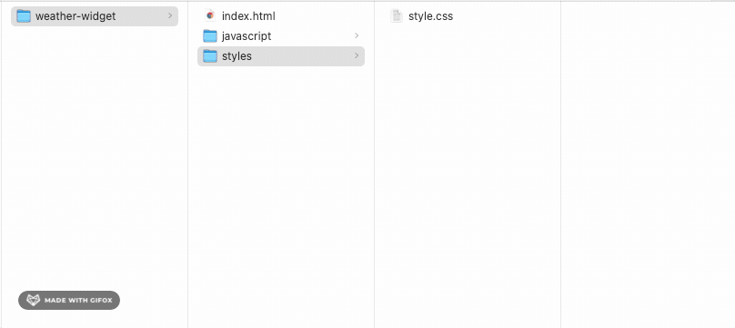

# Javascript in the Browser - HTML & CSS

Duration: 1 hour

Digital technologies increasingly form the backdrop for our everyday work and play – Zoom, FaceTime, Slack, Instagram, GMail, Spotify, the list is almost endless. Something as simple as a weather widget mediates awareness of the world in ways that matter to the person using it – should I walk with an umbrella? do I need my sunglasses? maybe I should pack an extra sweater? since its raining, maybe I'll go to the museum instead of the park?

This module will walk through the steps of building a weather widget – starting with the basic HTML structure and building out the styles and interaction. The challenge is to design a display of current weather conditions for a single city that will be determined by the user of your site. The premice of this experiment is to guide you through the steps of using client-side JavaScript in the browser to request JSON data directly from a weather service and render that JSON data to the web browser, in a delightful manner.

__Note:__ This experiment is meant to be used as a technical guide. Consider _all_ the data that is returned from the weather service, not just the temperature and let that inform your design choices. What kind of experience could you create to accomodate all possible weather conditions? Consider how your agency as a designer can enter into the _development_ of this interface.

#### References

* [Weather Gradient](https://weathergradient.com/)
* [Do I Need a Jacket](https://doineedajacket.com/)

### Set Up Your HTML Project

1. Set up a new project using a text editor, like [Visual Studio Code](https://code.visualstudio.com/) a free, open source code editor available for Mac, Windows, or Linux.
  * See the installation guides for [Mac](https://code.visualstudio.com/docs/setup/mac) and [Windows](https://code.visualstudio.com/docs/setup/windows)
2. Open up a new project folder and name it `weather-widget`. To create a new project folder in Visual Studio Code, navigate to the “File” menu item in the top menu and select “Add Folder to Workspace.” In the Finder window, click the “New Folder” button and create a new folder called `weather-widget`.



Inside that folder, we will create this recommended project structure:

* Within the `weather-widget` folder, create an `index.html` file and two subfolders called `/styles` and `/javascript` respectively
* Inside the styles folder, create a `style.css` file 
* Inside the javascript folder, create a `main.js` file.

```md
weather-widget # project folder
├── index.html # entry point of the website
├── styles # subfolder for css files
│   └── style.css
└── javascript # subfolder for javascript files
    └── main.js
```
__Note:__ It is best practice to separate out the structure of your project _index.html_ from the styles _style.css_ from the behaviors _main.js_. 



Let's take a step back and look at each of these file types. Think of an HTML file like a building without any walls, paint, electricity or applicances. HTML stands for HyperText Markup Language. The building below can be thought of as HTML without Cascading Style Sheet (CSS) or JavaScript. CSS handles the presentation layer of our webpage and gives each website its own look or brand. JavaScript is a set of instructions that orchestrates the behavior of our webpage.


In your blank `index.html` file, set up the bones for what will be your weather application by copying and pasting in the following code snippet, or using the one found [here](https://www.w3schools.com/html/html_basic.asp).

```html
index.html

<!DOCTYPE html>
<html lang="en">
<head>
  <title>Document</title>
</head>
<body>

  <!-- your code goes in here -->

</body>
</html>
``` 

In the code editor, you should see the following:


Alternatively, you can use one of the VS Code shortcuts. In the body of the `index.html` file:

* type `html` and select html:5 from the dropdown (_see image below_)
* type `!` and then press enter


One of the benefits of using VS Code adopts a common user interface and layout of an `explorer` on the left, showing all of the files and folders you have access to, and an `editor` on the right, showing the content of the files you have opened. In the sidebar, you should see the list of open editors. Currently, `index.html` is the only open file so that is the only one listed. Below the open editors tab is your [workspace](https://code.visualstudio.com/docs/editor/workspaces), in this case its called `weather-widget`. In most cases, you will have a single folder opened as the workspace.

### Start with the basic layout of the page

Now that we have a basic HTML template in our `index.html` file, let's create a basic layout for the webpage. Below, is what we're going to be building:


At this point, we will be setting up our HTML file to be styled. How? By using CSS classes

1. Define two sections with the following class names: `input-container` and `output-container`.
2. The `input-container` will include a form with a search field where the user will type in their zipcode and a submit button that makes the request for the current weather to the weather service.
3. The `output-container` will include the name of the city and current temperature. By default, the `output-container` won't contain any content. However, once the user makes the request for the weather of a specific zipcode, if weather data is available, the relevant data will be returned and rendered to the web browser.

The following is the initial page layout and goes in between the opening and closing body tags:

```html
index.html

<div class="container">
  <div class="input-container">
    <form>
      <input type="text" class="zipcode" placeholder="type zipcode here">
      <button type="button" class="search-button">Search</button>
    </form>
  </div>
  <div class="output-container">
    <h2 class="city_name"></h2>
    <p class="temperature"></p>
  </div>
</div>
```
Copy and paste the above code snippet into the `index.html` file.


### Viewing Your Local HTML File in the Web Browser

Now, let's see what we have so far. You can view your  `index.html` file in the Chrome browser a few ways:

 a. Drag the `index.html` file from Finder and drop it into your web browser window.
 
 b. CTRL + Left Click (on Mac) or Right Click (on Windows) to open the `index.html` file in the browser.
 


 c. Copy the full path of your file and paste it into the browser address bar. CTRL + Left Click (on Mac) or Right Click (on Windows) on the index.html file in the panel on the left and select “Copy Path”. Then, paste the path in the web browser.


__Note:__ refresh the browser window as you build out your website to see the changes you make locally in your GitHub repository.

### Connecting Style to Structure

There are three ways to add styles to your HTML:

 1. inline
 2. internal
 3. external

For this exercise, we will be using an external file which we have already created, `styles.css`. The benefits of using an external stylesheet include:

 * Multiple pages can use the same stylesheet
 * Only have to make changes to one file
 * Keep your content separate from the presentation

Link the stylesheet to the HTML file using the link tag. The link tag takes two attributes, `rel` which sets the relationship between the HTML page and the file its linked to and `href` which sets the path to the stylesheet. In this case, the relationship is that our file is the stylesheet to the HTML file and the path is the location of the stylesheet in our project folder. Here, our stylesheet is located in the styles subfolder, `styles/style.css`

```
index.html

<!DOCTYPE html>
<html lang="en">
<head>
	<link rel="stylesheet" href="styles/style.css">
</head>
```

### Style the layout

Now that we've connected our stylesheet to our HTML file, let's set up our webpage with a basic layout using CSS styles. First, use the universal selector property to strip all the elements of their inherent margins and padding. Many HTML tags have [default browser values](https://chromium.googlesource.com/chromium/blink/+/master/Source/core/css/html.css) that we would have to take into account when we are designing our webpage. So, some developers use a simple reset. For example, the default browser style for an `<h2>` tag is:

```
style.css

h2 {
    display: block;
    font-size: 1.5em;
    font-weight: bold
}
```

We want to reset these default browser styles and apply our own. So, one way of accomplishing that is to zero out the padding and margin. We also adjust the `box-sizing` to `border-box`. [Box-sizing](https://developer.mozilla.org/en-US/docs/Web/CSS/box-sizing) is a CSS property sets how the total width and height of an element is calculated. By default the width and height you assign to an element is applied only to the element's content box. 

#### Box Model

Every box (HTML element) has three properties that can be adjusted to control its appearance:

* margin
* border
* padding


To learn more about the box model, these two resources can be quite helpful:

1. [Introduction to the CSS basic box model](https://developer.mozilla.org/en-US/docs/Web/CSS/CSS_Box_Model/Introduction_to_the_CSS_box_model), MDN Documentation
2. [The CSS Box Model](https://css-tricks.com/the-css-box-model/), CSS Tricks

For this exercise, we want the browser to account for any border and padding in the values we specify for an element's width and height. In the `style.css` file copy and paste the following code snippet: 

```css
style.css

* {
  box-sizing: border-box;
  margin: 0;
  padding: 0;
}
```

Next, we'll set the height of the HTML tag to 100%. The `<body>` tag looks to its parent, `<html>` tag for how to scale the dynamic property, so the HTML tag needs to have its height set as well. This will give our layout a nice snug fit within the browser window.

```css
style.css

html,
body {
  height: 100%;
  background-color: #141414;
}
```
At this point, you should see the styles refelected in your browser window -- the background color should be black.

Now, we need to center the input tag and button in the browser window. There are a couple ways we can accomplish this; but for the sake of simplicity we will use [flexbox](https://css-tricks.com/snippets/css/a-guide-to-flexbox/). It's best practice to place the `display: flex;` property on the parent element. In this case, its the element with the `.container` class. Nested inside are two child elements, `input-container` and `output-container`. We want these elements centered on the page, so first apply `flex-direction: column;` to the parent element so that the `input-container` and `output-container` stack on top each other like blocks -- the default behavior is `flex-direction: row;`. Then, flexbox provides two properties that make centering simple: `align-items: center;` and `justify-content: center;`.

```css
style.css

.container {
  height: 100%;
  display: flex;
  flex-direction: column;
  align-items: center;
  justify-content: center;
}

form {
  display: flex;
}
```
The unstyled form should look like the following:


At this point, the `style.css` file should look like the following:


__Note:__ we've added the `display: flex` property to the form element which defines it as a flex container because we want the button to sit snugly next to the input field and the default `flex-direction`, the direction flex items are placed inside the flex container is row.

Resources: 

 * [A Complete Guide to Flexbox]() by Chris Coyier. CSS Tricks.
 * [Basic Concepts of Flexbox](https://developer.mozilla.org/en-US/docs/Web/CSS/CSS_Flexible_Box_Layout/Basic_Concepts_of_Flexbox) MDN Documentation

### Style the input and output containers

At this point, you can decide to style the form, submit button and text in any manner you choose. For the sake of simplicity, this webpage will have minimal styling. 

The `input-container` contains a `<form>` tag and nested inside the `<form>` tag are the `<input>` element and `<button>` element. Recall, we've added the `display: flex` property to the form element which defines it as a flex container. With a default `flex-direction:row`, the input field and button will fall side by side and there is no need to declare it in our `style.css` file.

Copy and paste the following code snippet for the input field and the search button. 

```css
style.css

input[type="text"] {
  width: 100%;
  height: 40px;
  border: none;
  text-align: center;
}

input::placeholder{
  color: #141414;
}

.search-button {
  color: #f4f4f4;
  background-color: #141414;
  width: 100px;
  height: 40px;
  text-align: center;
  line-height: 40px;
  border: 1px solid #f4f4f4;
}
```


### Style the data appended to the DOM

The `output-container` contains an `<h2>` tag and `<p>` tag. Add the following styles to these elements. This is where the current temperature about the requested city will be rendered. In the mean time, we can hard code a city name and temperature to verify that our styles work.

```css
style.css

.output_component{
  position: absolute;
  top: 60%;
  left: 50%;
  transform: translate(-50%, -50%);
}

.city_name, .temperature{
  text-align: center;
  font-size: 3em;
  line-height: 1.2em;
  color: white;
}
```


### Weather Icons

The weather service we will be using in this module is called Open Weather Map and it comes with its own [icon set](https://openweathermap.org/weather-conditions). However, you can create your own set of weather icons informed by your design choices for this widget. Maybe your designs don't require icons at all. Alternatively, you can use one of the following UI kits:

* [Font Awesome](https://fontawesome.com/v5.15/icons?d=gallery&p=2&c=weather)
* [The Noun Project](https://thenounproject.com/search/icons/?iconspage=1&q=weather)

At this point, we’re ready to build the core functionality of our weather widget. If you haven't done so already, let’s do it!

## Challenge