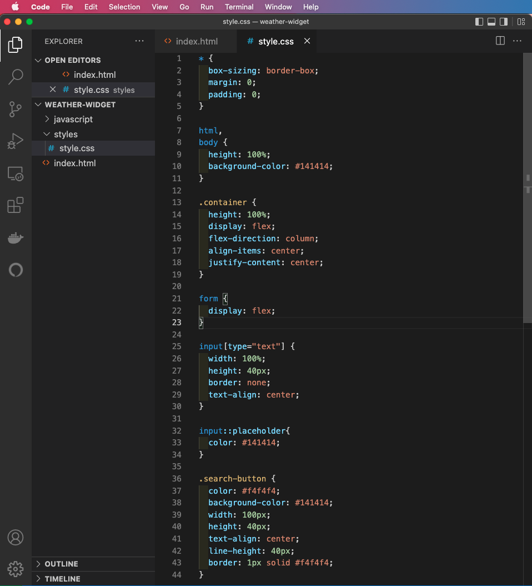

# Javascript in the Browser - HTML & CSS

* Duration: 1 hour

Digital technologies increasingly form the backdrop for our everyday work and play – Zoom, FaceTime, Slack, Instagram, GMail, Spotify, chatGPT, the list is almost endless. Something as simple as a weather widget mediates awareness of the world in ways that matter to the person using it – should I walk with an umbrella? do I need my sunglasses? maybe I should pack an extra sweater? since its raining, maybe I'll go to the museum instead of the park?

This project-based tutorial will walk through the steps of building a weather widget – starting with the basic HTML structure and building out the styles and interaction. The challenge is to design a display of current weather conditions for a single city that will be determined by the user of your site.

### References

* [Weather Gradient](https://weathergradient.com/)
* [Do I Need a Jacket](https://doineedajacket.com/)

## What is HTML?


HTML stands for HyperText Markup Language and was invented in 1989 by Sir Timothy Berners-Lee while working at the European Organization for Nuclear Research (CERN). Every website you’ve ever visited is rendered in HTML. Your web browser parses the HTML then renders the results.

_HyperText_ is text that contains links to other texts. _Markup_ describes a system of describing or annotating text files. Just like any language, HTML has its own vocabulary, grammar and syntax.

HTML provides structure to the content appearing on a website, such as images, text, or videos. The fundamental building block of HTML is the element. Elements consist of an opening tag, closing tag and content (text, image, video) sandwiched in between. The content is what the user sees on the webpage. The tags tell the browser the type of content and how to present it.

**Required Read:** [Getting Started with HTML](https://developer.mozilla.org/en-US/docs/Learn/HTML/Introduction_to_HTML/Getting_started)


*Anatomy of an HTML element*

## Set Up Your HTML Project

At this point, your GitHub repo should look like the following:


Now, we are going to create a new folder called, `weather-widget` that sits next to the `index.html` file. 

1. Open your code editor. Hover over and click on the `New Folder..` icon.
2. Type the name of the project, `weather-widget`. We will use this folder to store the files created for this module.
3. You should __also__ see the folder created in the Finder window on the right.


### Project Architecture

Inside the `weather-widget` folder, we will create the following project structure:

```md
weather-widget # project folder
├── index.html # entry point of the website
├── styles # subfolder for css files
│   └── style.css
└── javascript # subfolder for javascript files
    └── main.js
```
1. Within the `weather-widget` folder, create an `index.html` file and two subfolders called `/styles` and `/javascript` respectively
2. Inside the `styles` folder, create a `style.css` file 
3. Inside the `javascript` folder, create a `main.js` file.

__Note:__ It is best practice to separate out the structure of your project _index.html_ from the styles _style.css_ from the behaviors _main.js_. 


In VS Code, click on the `index.html` file which is currently blank and set up the bones for what will be your weather widget by copying and pasting in the following code snippet, or using the one found [here](https://www.w3schools.com/html/html_basic.asp).

```html
index.html

<!DOCTYPE html>
<html lang="en">
<head>
  <title>Document</title>
</head>
<body>

  <!-- your code goes in here -->

</body>
</html>
``` 

Your VS Code editor should look like the following:


Alternatively, you can use one of the VS Code shortcuts. In the body of the blank `index.html` file, type `html` and select `html:5` from the dropdown (_see image below_)


One of the benefits of using VS Code is that it adopts a common user interface and layout of an `explorer` on the left, showing all of the files and folders you have access to, and an `editor` on the right, showing the content of the files you have opened. In the sidebar, you should see the list of open editors. Currently, `index.html` is the only open file so that is the only one listed. Below the open editors tab is your [workspace](https://code.visualstudio.com/docs/editor/workspaces), in this case its called `weather-widget`. In most cases, you will have a single folder opened as the workspace. However, as your projects become more complex, there will be  multiple opened editors and workspaces.

Read [this documentation](https://code.visualstudio.com/docs/getstarted/userinterface) on the layout of the VS Code user interface.

## Start with the basic layout of the weather widget

Now that we have a basic HTML template in our `index.html` file, let's create a basic layout for the weather widget. Below, is what we're going to be building:


At this point, we will be setting up our HTML file to be styled. How? By using [CSS class selectors](https://developer.mozilla.org/en-US/docs/Web/CSS/Class_selectors):

1. Define two sections with the following class names: `input-container` and `output-container`.
2. The `input-container` will include a form with a search field where the user will type in their zipcode and a submit button that makes the request for the current weather to the weather service.
3. The `output-container` will include the name of the city and current temperature. By default, the `output-container` won't contain any content. However, once the user makes the request for the weather of a specific zipcode, if weather data is available, the relevant data will be returned and rendered to the web browser.

The following is the initial page layout and goes in between the opening and closing body tags:

```html
index.html

<div class="container">
  <div class="input-container">
    <form>
      <input type="text" class="zipcode" placeholder="type zipcode here">
      <button type="button" class="search-button">Search</button>
    </form>
  </div>
  <div class="output-container">
    <h2 class="city_name"></h2>
    <p class="temperature"></p>
  </div>
</div>
```
Copy and paste the above code snippet into the `index.html` file. Place the code between the open and closing `<body>` tags.


_Code snippet placed in between the `<body>` tags of the VS Code Editor_

## Viewing Your Local HTML File in the Web Browser

We've already seen how to view our code via GitHub Pages after pushing it to our repo on Github.com using the GitHub Desktop client. Now, let's view the code that we have locally on our laptops -- the code available to us _before_ we push it to GitHub.com. You can view your `index.html` file in the Chrome browser a few ways:

 a. Drag the `index.html` file from Finder and drop it into your web browser window.

 b. CTRL + Left Click (on Mac) or Right Click (on Windows) to open the `index.html` file in the browser (see image below).
 

_CTRL + Left Click (on Mac) or Right Click (on Windows) to select Open in Default Browser_

 c. Copy the full path of your file and paste it into the browser address bar. CTRL + Left Click (on Mac) or Right Click (on Windows) on the `index.html` file in the panel on the left and select "Copy Path". Then, paste the URL link in the web browser (Google Chrome).


_CTRL + Left Click (on Mac) or Right Click (on Windows) to select Copy Path and paste into web browser address bar_

__Note:__ refresh the browser window as you build out your website to see the changes you make locally in your GitHub repository.


_The URL of the web page should match the location of the files on your computer_

## Connecting Style to Structure

There are three ways to add styles to your HTML:

 1. inline
 2. internal
 3. external

For this exercise, we will be using an external file which we have already created, `styles.css`. The benefits of using an external stylesheet include:

 * Multiple pages can use the same stylesheet
 * Only have to make changes to one file
 * Keep your content separate from the presentation

Link the stylesheet to the HTML file using the link tag. The link tag takes two attributes, `rel` which sets the relationship between the HTML page and the file its linked to and `href` which sets the path to the stylesheet. In this case, the relationship is that our file is the stylesheet to the HTML file and the path is the location of the stylesheet in our project folder. Here, our stylesheet is located in the styles subfolder, `styles/style.css`

```html
index.html

<!DOCTYPE html>
<html lang="en">
<head>
	<link rel="stylesheet" href="styles/style.css">
</head>
```

Required Reading: [Getting Started with CSS](https://developer.mozilla.org/en-US/docs/Learn/CSS/First_steps/Getting_started)

## Style the layout

Now that we've connected our stylesheet to our HTML file, let's set up our webpage with a basic layout using CSS styles. First, use the [universal selector property](https://developer.mozilla.org/en-US/docs/Web/CSS/Universal_selectors) to strip all the elements of their inherent margins and padding. Many HTML tags have [default browser values](https://chromium.googlesource.com/chromium/blink/+/master/Source/core/css/html.css) that we would have to take into account when we are designing our webpage. So, some developers use a simple reset. For example, the default browser style for an `<h2>` tag is:

```css
style.css

h2 {
    display: block;
    font-size: 1.5em;
    font-weight: bold
}
```

We want to reset these default browser styles and apply our own. So, one way of accomplishing that is to zero out the padding and margin. We also adjust the `box-sizing` to `border-box`. [Box-sizing](https://developer.mozilla.org/en-US/docs/Web/CSS/box-sizing) is a CSS property sets how the total width and height of an element is calculated. By default the width and height you assign to an element is applied only to the element's content box. 

### Box Model

Every box (HTML element) has three properties that can be adjusted to control its appearance:

* margin
* border
* padding


To learn more about the box model, these two resources can be quite helpful:

1. [Introduction to the CSS basic box model](https://developer.mozilla.org/en-US/docs/Web/CSS/CSS_Box_Model/Introduction_to_the_CSS_box_model), MDN Documentation
2. [The CSS Box Model](https://css-tricks.com/the-css-box-model/), CSS Tricks

For this exercise, we want the browser to account for any border and padding in the values we specify for an element's width and height. In the `style.css` file copy and paste the following code snippet for [universal selector property](https://developer.mozilla.org/en-US/docs/Web/CSS/Universal_selectors): 

```css
style.css

* {
  box-sizing: border-box;
  margin: 0;
  padding: 0;
}
```

Next, we'll set the height of the HTML tag to 100%. The `<body>` tag looks to its parent, `<html>` tag for how to scale the dynamic property, so the HTML tag needs to have its height set as well. This will give our layout a nice snug fit within the browser window (without that hideous gap at the bottom of the screen).

```css
style.css

html,
body {
  height: 100%;
  background-color: #141414;
}
```
If you already have your local code rendering in the browser, then refresh the window (CTRL + R). At this point, you should see the styles you've just written refelected in your browser window -- the background color should be black. If you do not see the changes in the web browser, save your code (CTRL + S) and refresh the page again.

Now, we need to center the input tag and button in the browser window. There are a couple ways we can accomplish this; but for the sake of simplicity we will use [flexbox](https://css-tricks.com/snippets/css/a-guide-to-flexbox/). It's best practice to place the `display: flex;` property on the parent element. In this case, its the element with the `.container` class. Nested inside are two child elements, `input-container` and `output-container`. We want these elements centered on the page, so first apply `flex-direction: column;` to the parent element so that the `input-container` and `output-container` stack on top each other like blocks -- the default behavior is `flex-direction: row;`. Then, flexbox provides two properties that make centering simple: `align-items: center;` and `justify-content: center;`.

```css
style.css

.container {
  height: 100%;
  display: flex;
  flex-direction: column;
  align-items: center;
  justify-content: center;
}

form {
  display: flex;
}
```
The minimally styled form should look like the following:


_Code rendered in the web browser_

At this point, the `style.css` file should look like the following:


_Code snippet for the universal selector, HTML tag and container styles in the VS Code Editor_

__Note:__ we've added the `display: flex` property to the form element which defines it as a flex container because we want the button to sit snugly next to the input field and the default `flex-direction`, the direction flex items are placed inside the flex container is row.

**Required Read:** 

 * [A Complete Guide to Flexbox](https://css-tricks.com/snippets/css/a-guide-to-flexbox/) by Chris Coyier. CSS Tricks.
 * [Basic Concepts of Flexbox](https://developer.mozilla.org/en-US/docs/Web/CSS/CSS_Flexible_Box_Layout/Basic_Concepts_of_Flexbox) MDN Documentation

### Style the input and output containers

At this point, you can decide to style the form, submit button and text in any manner you choose. For the sake of simplicity, this webpage will have minimal styling. 

The `input-container` contains a `<form>` tag and nested inside the `<form>` tag are the `<input>` element and `<button>` element. Recall, we've added the `display: flex` property to the form element which defines it as a flex container. With a default `flex-direction:row`, the input field and button will fall side by side and there is no need to declare it in our `style.css` file.

Copy and paste the following code snippet for the input field and the search button. 

```css
style.css

input[type="text"] {
  width: 100%;
  height: 40px;
  border: none;
  text-align: center;
}

input::placeholder{
  color: #141414;
}

.search-button {
  color: #f4f4f4;
  background-color: #141414;
  width: 100px;
  height: 40px;
  text-align: center;
  line-height: 40px;
  border: 1px solid #f4f4f4;
}
```
_style.css file_


_CSS styles in the VS Code Editor_


_Code rendered in the web browser_

## Style the data appended to the DOM

The `output-container` contains an `<h2>` tag and `<p>` tag. Add the following styles to these elements. This is where the current temperature about the requested city will be rendered. In the mean time, we can hard code a city name and temperature to verify that our styles work.

```css
style.css

.output_component{
  position: absolute;
  top: 60%;
  left: 50%;
  transform: translate(-50%, -50%);
}

.city_name, .temperature{
  text-align: center;
  font-size: 3em;
  line-height: 1.2em;
  color: white;
}
```
_style.css file_

```html
        <div class="output-container">
          <h2 class="city_name">New York</h2>
          <p class="temperature">34</p>
        </div>
```
_Hard-coded city name and temperature content in the index.html file_


_Hard-coded city and temperature data rendered in the web browser_

At this point, we’re ready to build the core functionality of our weather widget. 

## Challenge

Submit your progress to the cloud via GitHub Desktop. Forgot how? 


See the changes on the right. Newly written code is rendered in green while deleted code is rendered in red. In the bottom left corner of the application window, type the following message:

```md
HTML and CSS # replace Create index.html
Interactive Web submission # replace Description
```
Check your personal GitHub Pages link to make sure it works: `https://yourusername.github.io/studious-umbrella/weather-widget`. Replace `yourusername` with the name of your GitHub account.