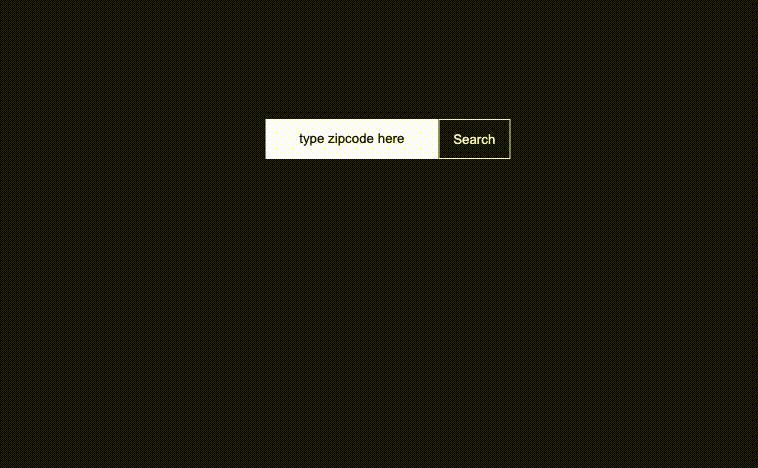
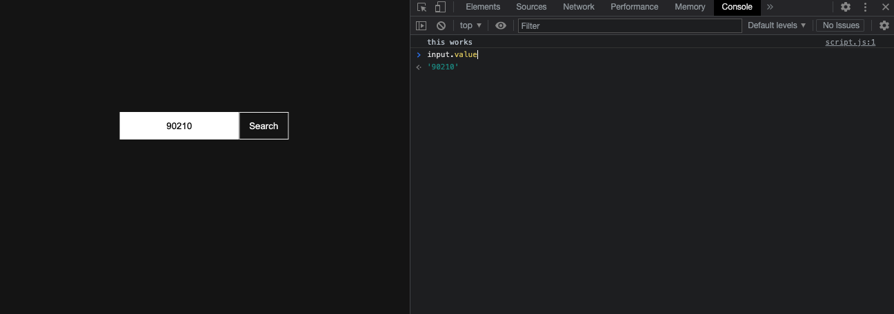

===========================================

# JavaScript in the Browser II - Events and UIs

Wouldn’t it be nice if we could write code that allows elements on the webpage to respond to user interactions? The DOM not only lets us manipulate the document (or webpage) using JavaScript, but also gives us the ability to write JavaScript that responds to interactions with the page. These interactions are communicated as events. We can listen for certain kinds of user-driven events, such as clicking a button, entering data into a form, pressing a particular key on your keyboard, and more.

## What are we building?



### Events

Recall, we are building a weather widget that allows a user to enter a zipcode and click a button that renders the current weather forcast to the web browser. 

This clicking action is called an __event__.

JavaScript is different than most other programming languages because it is designed specifically to work in the event-driven environment of a browser window.

### Step 1 – Store the JSON data in a variable

Building off the `getWeatherData` function we created in the previous module, let's store the data returned from the weather service to a variable called `local_weather_data`. If you want to see what this data being returned looks like, you can log that variable to the console. In this case, you would call `console.log(local_weather_data)` _after_ the variable.

```js
function getWeatherData() {
  fetch(`http://api.openweathermap.org/data/2.5/weather?zip=10128&APPID=${API_KEY}`)
    .then((response) => response.json())
    .then((data) => {
      // store the data in a variable of our choosing
      let local_weather_data = data;
      // log the data to the browser console
      console.log(local_weather_data);
    });
}
```

#### Basics of Interaction

There are many events that can trigger a function. Some commonly used ones include click, scroll, keydown and hover. There are two steps to working with events:

1. Set up an __event listener__ with the `.addEventListener` method
2. Define an __event handler__, a function that gets passed to `.addEventListener`

Here is an example of the syntax:

```js
const gsapp = document.querySelector(‘.gsapp’);

function sayHello(){
	console.log(“hello!”);
}

gsapp.addEventListener(‘click’, sayHello)
```

### Step 2 – Set Up An Event Listener

In order to listen for an event, we need to define an event listener. Below you’ll find a simple event listener associated with a 'click' event on a button element. First, target the HTML element with a class name `search-button` and save it to a variable.

```js
let btn = document.querySelector(".search-button");
```

Then, tell JavaScript to listen for an event when the button is clicked. The first argument is the event (click) and the second argument is the function (event handler) that will run once the button is clicked:

```js
btn.addEventListener('click', handleClickEvent);
```

### Step 3 – Set Up An Event Handler

Define the function that will be called whenever the button is clicked (event occurs). In this case, when we click the search button __we want to get the zipcode__ that the user types into the input field and use it to fetch the weather data. 

This is just a function, but it has a special name due to how it’s being used — a callback function:

```js
function getZipCode() {
  console.log('I was clicked!');
}
```

### Step 4 – Putting it all togehter

```js
<button type="button" class="search-button">Search</button>

let btn = document.querySelector(".search-button");
btn.addEventListener('click', getZipCode);

function getZipCode() {
  console.log('I was clicked!');
}
```

* The button refers to the DOM node to which we want to tie the event
* Then, it attaches an event listener to the button element with the `addEventListener()` method
* The `addEventListener()` method takes two arguments:
  * The event we want to listen for
  * The function that should be called whenever that event is invoked.
* In the case of the code above, we’re saying we want to listen for click events on our button, and whenever someone does click on our button, call the `getZipCode()` function.

##### Resource:

* [Introduction to events](https://developer.mozilla.org/en-US/docs/Learn/JavaScript/Building_blocks/Events), MDN Documentation
* [Event Object](https://developer.mozilla.org/en-US/docs/Learn/JavaScript/Building_blocks/Events#event_objects), MDN Documentation
* [Handling Events](https://eloquentjavascript.net/15_event.html), Eloquent JavaScript

#### The Event Object
Now that we’ve gotten the hang of writing event handlers, let’s talk a bit about the event object.

When an event occurs, we might want to find out some information about it. For example, which element did the user interact with to cause the event? What type of event was it? A click event? A mouseover?

To obtain this information, we use the event object.

##### Accessing the Event Object
How do we gain access to the event object? First, we will need to pass the event object as a parameter to our function.

```js
function getZipCode(e) {
  console.log(e);
}
```

Now if we simply use whichever parameter name we chose (in our case, “e”) from within the function, we have access to the event object. We can also use, `evt` or `event`.

Each time a user submits the form by clicking the submit button, we’ll do two things:

1. Stop the form from submitting, this prevents the page from reloading every time we look up a zipcode
2. Grab the value typed into the input field 

#### Preventing Default Behavior
As you may be able to tell from its name, `preventDefault()` allows us to prevent the default browser behavior for an event.

Some events, such as clicking on a link or submitting a form, are meant to take a user to another page. But maybe when a user clicks on a link or submits a form, __we don’t want to take them to another page__. Instead, we want to get whatever information was typed into the form field.

```js
function getZipCode(e) {
  e.preventDefault();
  console.log(e);
}
```

We want to override the default functionality of submitting the form, and capture whatever the user types in the input field instead of taking the user to another page. To prevent this default behavior, we can use the event object's `preventDefault()` method.

#### Let's get that zipcode, shall we?

We need something to capture the zipcode numbers we type. In the `index.html`, we have the following HTML code:

```html
  <div class="input-container">
    <form>
      <input type="text" class="zipcode" placeholder="type zipcode here">
      <button type="button" class="search-button">Search</button>
    </form>
  </div>
```

The input element is where we will be typing in our zipcode and clicking on the button will capture that data, store it to a variable and use that variable to fetch the weather data.

First, we want to select the input element with a class name called `zipcode` and save it to the variable named input. 

```js
let input = document.querySelector(".zipcode");
```

Now that we have our element name, `input`, we can access its properties:

```js
let ZIP_CODE = input.value;
```

In this case, we're using the `.value` property to access the text we type into the input field.



Just as an exercise, type your zipcode into the input field, then in the developer console, type `input.value` into the console. You should get back a string with the zipcode you've typed into the input field.

The last step is to pass the zipcode variable into the `getWeatherData()` function we wrote in the previous module. 

```js
const getZipCode = (e) => {
  e.preventDefault();
  let ZIP_CODE = input.value;
  getWeatherData(ZIP_CODE);
};
```
Now, when we initially wrote the `getWeatherData()` function, we did not pass in a parameter because we did not yet have one. So, we're going to pass in a parameter called `zip` that will stand in for the zipcode we captured from the `getZipCode` function.

```js
function getWeatherData(zip) {
  ...
}
```

Let's replace the hard coded zipcode with the zipcode variable and while we're at it, let's save it to its own variable:

```js
const API_ENDPOINT = `http://api.openweathermap.org/data/2.5/weather?zip=${ZIP_CODE}&APPID=${API_KEY}`
```
What does our `main.js` file look like at this point?

```js
let input = document.querySelector(".zipcode");
let btn = document.querySelector(".search-button");

getWeatherData = (zip) => {
  let API_KEY = "[YOUR API KEY HERE]";
  let API_ENDPOINT = `https://api.openweathermap.org/data/2.5/weather?zip=${zip}&APPID=${API_KEY}`;

  fetch(API_ENDPOINT)
    .then((response) => response.json())
    .then((data) => {
      let local_weather_data = data;
    	console.log(local_weather_data)
    }
}

const getZipCode = (e) => {
  e.preventDefault();
  let ZIP_CODE = input.value;
  getWeatherData(ZIP_CODE);
};

btn.addEventListener("click", getZipCode);
```


