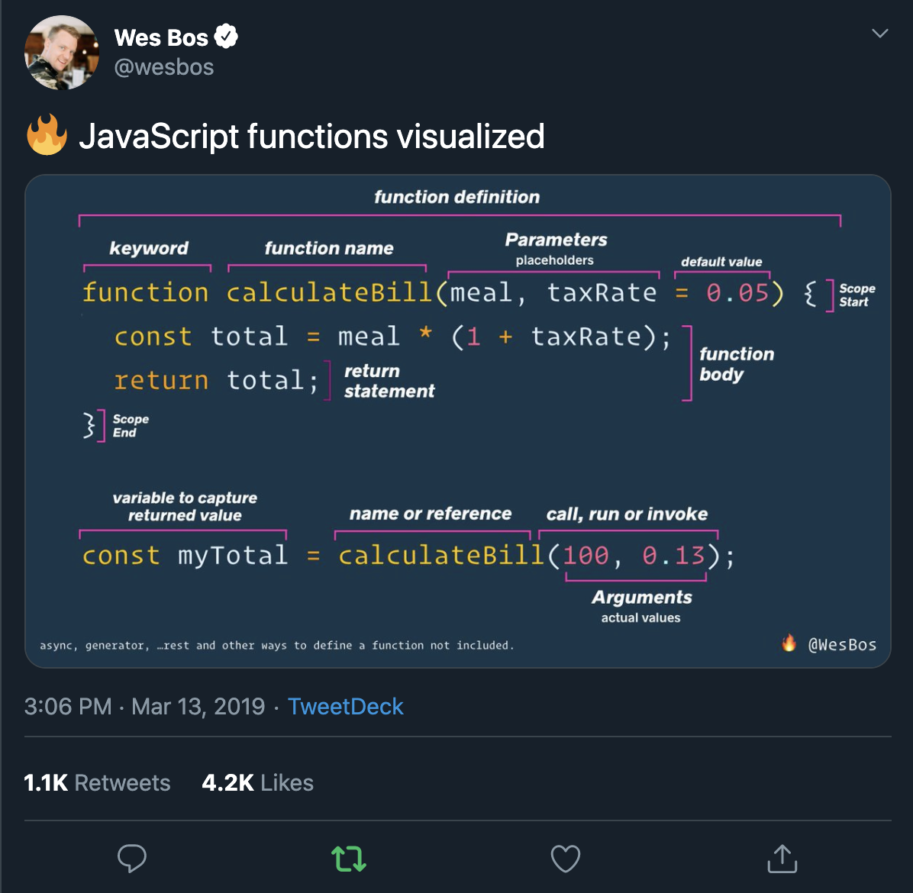

===========================================

# Data and APIs

## What are we building?

[add GIF iamge here]

Using [Open Weather Map API](https://openweathermap.org/api), we will build a weather application that allows you to enter your zipcode and render the current weather forcast to the web browser.

## Making an API Call

### Getting Data from an API with JavaScript Fetch

Now that we know more about the URL, we’ll use that information to make the API call and log that data to the developer console. Instead of hardcoding our zipcode and API key, let's save them to a variable. `input.value` will capture anything you write in the input field and save it to the ZIP_CODE variable.

```js
const API_KEY = "YOUR_OWN_KEY";
const ZIP_CODE = input.value;
```

Now, let's dig into the JavaScript using a basic JavaScript fetch request and modify the URL using string templating to replace the previously hardcoded zipcode and API key:

```js
fetch(`http://api.openweathermap.org/data/2.5/weather?zip=${ZIP_CODE}&appid=${API_KEY}`)
  .then(response => response.json())
  .then(data => console.log(data));
```

Here we are fetching a JSON file across the network and printing it to the console. _Remember: To access the data in the browser concole, use the hot keys CMD + Option + i_ The simplest use of `fetch()` takes one argument — the path to the resource you want to fetch — and returns a promise containing the response. This is just an HTTP response, not the actual JSON. To extract the JSON body content from the response, we use the `json()` method.

##### Resource:
* [Using Fetch](https://developer.mozilla.org/en-US/docs/Web/API/Fetch_API/Using_Fetch), MDN Documentation
* [How to Use the JavaScript Fetch API to get Data](https://www.digitalocean.com/community/tutorials/how-to-use-the-javascript-fetch-api-to-get-data) by Sara Vieira. Scotch.io

### Wrap it in a `getWeatherData()` function

Function is a term that comes out of mathematics. You may remember hearing it in your high school algebra class. The basic idea of a function is simple — it’s a relationship between a set of inputs and a set of outputs.

#### What is a Function?

A function is a block of code that returns a result. Think of a function like a box that isn’t aware of the outside world. It only knows what you tell it and when you ask it something (run or call), it will reply with an answer.

Functions encapsulate a set of commands pertaining to one set of functionality. In this case, the input is the zipcode and the output is the weather data. The purpose of this function is to get the weather data. To make it clear, that's what we'll name the function. _Don't forget to invoke the function_.

```js
const getWeatherData = () => {
  // fetch request goes in here :-)
}

getWeatherData()
```

#### Why Use Functions?

1. Goup Steps – Functions allow you to break up your code into smaller organized chunks.
2. Reusability – You can repeat functions throughout your code by calling the function. This saves you time from writing more code.
3. Store Steps – Provides us with a way to ‘store’ the steps needed to achieve a task.

#### Anatomy of a Function



#### Accessing the data in the JSON object

Within each of those objects, there is an object that contains information we want to access about the zipcode: city name, humidity, temperature, and description to name a few. To access the temperature in this dataset, we can use the following syntax:

```js
// dot notation
data.main.temp

// bracket notation
data["main"]["temp"]
```
Replace the data in the `console.log` with one of the above code snippets to see the temperature in Kelvin displayed in the developer console.
