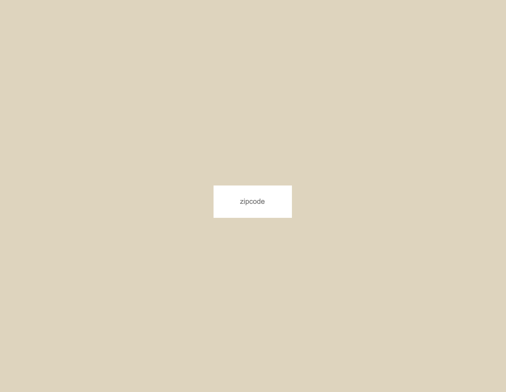

===========================================

# Data and APIs

## What are we building?

[add GIF iamge here]

Using [Open Weather Map API](https://openweathermap.org/api), we will build a weather application that allows you to enter your zipcode and render the current weather forcast to the web browser.

### What is an API?
First things first, API stands for “Application Programming Interface”. It is a way for you to get raw public data that organizations (Google, NASA, City of New York) make available for you to use in your own website. This raw data is accessed using a web URL:

```js
http://api.openweathermap.org/data/2.5/forecast?id=524901&appid={API key}
```

Sometimes the easiest way to understand the function of an API is to think about a metaphor. A common metaphor used is that of the customer, a waiter, and a restaurant kitchen: Imagine you’re sitting at a table in a restaurant with a menu of choices to order from. The kitchen is the part of the “system” that will prepare your food order. What is missing is the critical link to communicate your food order to the kitchen and deliver your actual food (raw data) back to your table. That’s where the waiter or API comes in. The waiter is the messenger — or API — that takes your request or food order and tells the kitchen — the system — what to do. Then the waiter delivers the response (raw data) back to you; in this case, it is the food.

[add image here]

### Where Do We Find APIs?
APIs are published everywhere. Chances are good that most major content sources you follow online publish their data in some type of serialized format. Here are a few examples:

* [Open Weather Map](https://openweathermap.org/api)
* [NYC Open Data](https://opendata.cityofnewyork.us/)
* [The New York Public Library Digital Collections API](http://api.repo.nypl.org/)
* [Cooper Hewitt, Smithsonian Design Museum Collections](https://collection.cooperhewitt.org/api/)

### The API in action
One common example of an API that we come into contact with on a daily basis is weather data. These rich weather snippets are found on many platforms like Google Search or smart home devices (Echo Dot, Google Nest, Facebook Portal). For example, if you search “weather + [your city’s name]” on Google, you will see an interactive widget at the top of the search results with the current weather conditions and forecast. 

[add image of rich weather snippet]

Here, Google sources this weather data from a third party which sends back the latest weather details in a way that is easy to format. In this case, they are using the [Weather Channel](https://weather.com/weather/today/l/40.7500,-73.9967) API.

### Why Just Data?
Sometimes thats’s all we need. The amount of data we produce daily is mind blowing. In 2020, 2.5 quintillion bytes of data was created daily. There are 18 zeros in a quintillion. For those times, we want a concise format. All this raw data, from all these browsers and servers, has to travel through the internet. This can be the slowest part of the request-response cycle. Using our previous metaphor, imagine the waiter having to navigate through Grand Central Station at rush hour to place our order with the kitchen. We want to minimize the amount of food (raw data) he needs to bring back to the table. For those times, we want a concise format.

### What is Serialized Data?
All data sent via [HTTP](https://developer.mozilla.org/en-US/docs/Web/HTTP/Overview "An overview of HTTP, MDN Documentation") are strings. Unfortunately, what we really want to pass between web applications is structured data (i.e. arrays and objects). So, native data structures can be serialized into a string representation of the data.

One of these serialized data formats is JSON.

### JSON
JSON stands for “JavaScript Object Notation” and has become a universal standard for serializing native data structures for transmission. It is light-weight, easy to read and quick to parse.

#### The Structure of JSON

```js
{
  "users": [
    { "name": "Carl", "id": 536 },
    { "name": "Heather", "id": 857 }
  ]
}
```

Note: JSON is a serialized format. While it may look like an object, it needs to be parsed so we can interact with it as a true Javascript object.

## The Set Up

#### Step 0 – Create Directory
Create a directory to organize your program files. Here, I am creating a folder called `weather-app`. Inside that directory, is a recommended project structure:

```md
weather-app
├── index.html
├── styles
│   └── style.css
└── javascript
    └── main.js
```

#### Step 1 – Create an account
If you don’t already have an Open Weather Map account, [sign up for a free one here](https://home.openweathermap.org/users/sign_up).

#### Step 2 – API Key
Once you've signed up, you're given an [API key](https://home.openweathermap.org/api_keys). Copy the API key and create a variable in your `main.js` file to store the key.

```js
 const API_KEY = “”;
```
Go to [Open Weather Map](https://openweathermap.org/api) and scroll down, you'll see a section called "API Documentation."

## Making an API Call

#### The UI (User Interface)

The user interface is the part of a computer and its software that people can see, hear, understand or direct. The user interface has two components: input and output. The input is how a user communicates their needs to the computer. Some common input components are keyboard, mouse or voice. The output is how th ecomputer conveys the results back to the user; this is usually done through the display screen. 

Before we embark on building our application, let's consider how do we want people to interact with our weather application. The wireframe is a great tool to illustrate how the user interfaces with our application. Most wireframes are free of any color or visual design elements, and simply show boxes and lines with notations to outline user interactions.

Wireframes will look different depending on who creates them, but they should always include details about the functionality. If building a website or application was like building a house, wireframes would be considered the blueprint. They're an important element of communication between design and web development.

[add wireframe here]

Let’s start with a simple HTML input field where a user can type in their zipcode – give it a class called `zip-code` and a search button that the user clicks to render the results to the web browser. Finally, create an output element where the information that the computer returns to you will be displayed – in this case we create an h2 element to render the city name and a paragraph element to render the weather forecast.

##### HTML

```html
<div class="container">
  <div class="input_component">
    <form>
      <input class="zipcode" type="text" placeholder="zipcode">
    </form>
  </div>
  <div class="output_component">
    <h2 class="city_name"></h2>
    <p class="temperature"></p>
  </div>
</div>
```

Next, we style the web page for ease of use.

##### CSS

```css
* {
  box-sizing: border-box;
  margin: 0;
  padding: 0;
}

html,
body {
  height: 100%;
  background: #e0d4bb;
  font-family: "Roboto", sans-serif;
}

.container {
  display: flex;
  height: 100%;
  flex-direction: column;
  align-items: center;
  justify-content: center;
}

input[type="text"] {
  width: 100%;
  height: 60px;
  border: none;
  text-align: center;
  cursor: pointer;
}

input[type="text"]:focus {
  background: #c6bca6;
  outline: none;
  color: #f2f2f2;
}
```

The result should look something like the following:



### URLs
Before taking a look at the JavaScript, let’s take a step back and find out how we can access the weather data for New York City using the Open Weather Map API. To access this information, we’ll need a URL where we can find the JSON data for a city that matches the zipcode.

Let’s take a look at the different components of a URL that could be used for an API call: