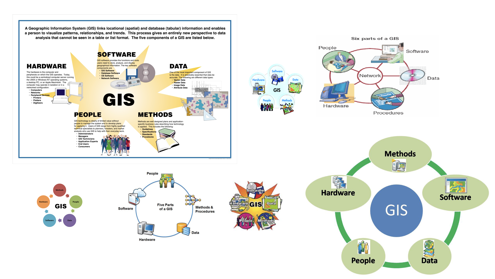
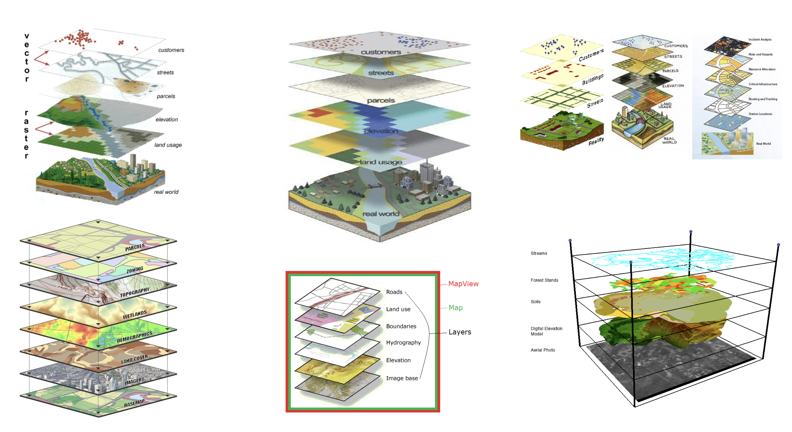

# What is Geographic Information Systems?


## Module Summary

This module will introduce geographic information systems (GIS) and their application for research and design of the built environment. It begins with a definition of GIS that considers how this set of technologies is shaped by and shapes its social context. From this premise it discusses the forms of abstraction at the heart of this work and asks readers to consider their significance and potential.  


## A definition

In an article published in 1999 geographer Nicholas Chrisman discusses the many available definitions of the collection of methods, approaches, tools, and activities know as GIS. This article was written at the end of a decade (the 1990s) that saw tremendous development of desktop Geographic Information Systems software and the expansion of access to and the use of spatial analytical methods across the social sciences, environmental sciences, and (to a slightly lesser degree) design disciplines. That there is an article length discussion of the (many) definitions of GIS (including debates over what GIS stands for) should indicate that there are multiple perspectives on this definition and a large degree of nuance to understanding GIS. Within this context Chrisman put forward a definition of GIS that he developed for a late 1990s GIS textbook together with colleagues:  

```
"Geographic Information System (GIS) – The organized activity by which people
- measure aspects of geographic phenomena and processes;  
- represent these measurements, usually in the form of a computer database, to emphasize spatial 
themes, entities, and relationships;  
- operate upon these representations to produce more measurements and to discover new 
relationships by integrating disparate sources; and  
- transform these representations to conform to other frameworks of entities and relationships.    

These activities reflect the larger context (institutions and cultures) in which these people 
carry out their work. In turn, the GIS may influence these structures."  (Chrisman 1999)
```

This definition, though wordy, is a strong starting point for developing a collective understanding of what GIS is and what it does.  

Let's break it down a little bit:  
***"The organized activity by which people..."***  
**People do it!** In other words GIS is not a software but rather a set of practices performed by people.  

***"measure aspects of geographic phenomena and processes"***  
GIS is about space, and what happens in space.

***"represent these measurements, usually in the form of a computer database, to emphasize spatial themes, entities, and relationships"***  
It requires representation or abstraction. That abstraction is used to highlight or emphasize specific things. And those representations are linked to computer databases.

***"These activities reflect the larger context (institutions and cultures) in which these people carry out their work. In turn, the GIS may influence these structures."***  
GIS is not independent of its social, political and cultural context. Instead  GIS methods (as well as spatial datasets, the models used to record spatial datasets, the computer programs used to execute GIS methods etc.) reflect the norms and assumptions of the context in which they have been developed. Meanwhile, these tools, methods, and approaches may begin to shape the contexts in which they are used.

## A diagram: components of a GIS



The diagrams above of the *Components of a GIS* are ubiquitous in GIS instructional materials (these specific examples are some of the top results from an image search for 'GIS components'). These five components of a GIS are generally described as:  
- **people**
- **data**
- **methods**
- **software**
- **hardware**

Sometimes **networks** are included as a sixth component given the increasing prevalence of web-based maps and spatial databases.


Despite being visually jarring (read: ugly!!) they are a helpful way to visualize aspects of our above working definition of GIS. The diagrams again emphasize that **GIS is not a software** but rather a set of related methods, tools, and data that are put to work by people.  

## Another diagram: layers, the fundamental abstraction of GIS





As Nicholas Chrisman describes above GIS requires the representation of measurements about geographic phenomena. There are many different ways that this representation takes place but fundamentally GIS-based work relies on one overall method of abstraction: **layers**.  

GIS is based on a layered model of the world. In this abstracted world each layer is distinguished by the type of phenomena, observation, or process it represents; the data type or geometry type used to represent those observations; the way in which the observation was recorded (satellite imagery, survey, etc) among other things.  

This layered model of the world is the underlying premise on which all GIS work and spatial data is based. The [next module]() discusses spatial data in detail.  

## Challenge

TBD


## References & further reading

[many sources to be added here will likely use the below categories]

#### Histories & definitions of GIS  

Nicholas R. Chrisman “What Does ‘GIS’ Mean?” Transactions in GIS 3, no. 2 (1999): 175–86.

Wilmott, Clancy. *Mobile Mapping: Space, Cartography and the Digital.* Amsterdam University Press, 2020. https://doi.org/10.2307/j.ctvx8b7zc.7.

Wilson, Matthew W. *New Lines: Critical GIS and the Trouble of the Map.* Minneapolis: The University of Minnesota Press, 2017.

#### Mapping sciences & geopolitics

Rankin, William. After the Map: Cartography, Navigation, and the Transformation of Territory in the Twentieth Century. After the Map. Chicago: University of Chicago Press, 2016. http://chicago.universitypressscholarship.com/view/10.7208/chicago/9780226339535.001.0001/upso-9780226339368.

Wilson, Mabel. “The Cartography of W.E.B. Du Bois’s Color Line.” In W.E.B. Du Bois’s Data Portraits: Visualizing Black America: The Color Line at the Turn of the Twentieth Century, edited by Whitney Battle-Baptiste and Britt Rusert, First edition. [Amherst, Massachusetts] : Hudson, NY: The W.E.B. Du Bois Center at the University of Massachusetts Amherst ; Princeton Architectural Press, 2018.

#### Maps & design process

Corner, James. “The Agency of Mapping.” In Landscape Imagination: Collected Essays of James Corner 1990-2010. New York, UNITED STATES: Princeton Architectural Press, 2014. http://ebookcentral.proquest.com/lib/columbia/detail.action?docID=3387582.


Desimini, Jill. “Cartographic Grounds.” Places Journal, January 17, 2013. https://doi.org/10.22269/130117.

Mattern, Shannon. “Methodolatry and the Art of Measure.” Places Journal, November 5, 2013. https://doi.org/10.22269/131105.

#### Evolution of spatial analysis

McHarg, Ian L. *Design with Nature.* New York: J. Wiley, c1992.

#### Textbooks
Maantay, Juliana, and John Ziegler. GIS for the Urban Environment. Redlands, Calif: Independent Publishers Group (IPG) [distributor], 2006.


-------
tutorial credit information, to be added in standard format
