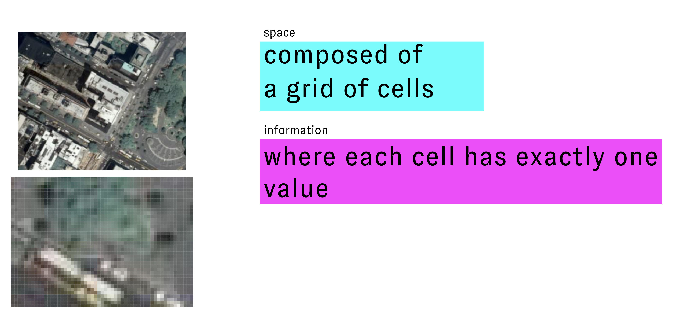

# What is Spatial Data?

## Module Summary

This module introduces vector and raster spatial data types and discusses the different forms of representation and abstraction required by each. It asks readers to think critically about the affordances and limitations offered by each type of spatial data.  

## Spatial data: information linked to a space
Spatial analysis and geographic information systems are powerful tools for understanding and designing the built environment. Our ability to interpret the world through computational tools for spatial analysis however relies in part on special forms of data that support linking information to a spatial location.  

Lets look again at Nicholas Chrisman's definition of GIS from the previous module:  

```
"Geographic Information System (GIS) – The organized activity by which people
- measure aspects of geographic phenomena and processes;  
- represent these measurements, usually in the form of a computer database, to emphasize spatial 
themes, entities, and relationships;  
- operate upon these representations to produce more measurements and to discover new 
relationships by integrating disparate sources; and  
- transform these representations to conform to other frameworks of entities and relationships.    

These activities reflect the larger context (institutions and cultures) in which these people 
carry out their work. In turn, the GIS may influence these structures."  (Chrisman 1999)
```

So a core element of GIS is that it is an activity where people ***"measure aspects of geographic phenomena and processes"***  and then ***"represent these measurements, usually in the form of a computer database, to emphasize spatial themes, entities, and relationships."***  

Both of these aspects of GIS are directly related to spatial data: how we **measure geographic phenomena** and then how we **represent** those measurements.  

So, then, what is spatial data??

I like to use a very straightforward definition: ***information tied to a space***


These statements in the image to above are all examples of spatial data. Each is an example of information linked with a spatial location. 

**"Where I grew up"** is spatial data about me where the reference to location might only be clear to people who know me well. **"Newark has 300k residents**" tells us how many people live in a particular city. **"Mount Mitchell is 6,684 feet tall"** helps us understand the height of the tallest mountain east of the Mississippi River. **"39.083055, -94.586736 is Kansas City"** tells us a name that has been given to the place with those latitude and longitude coordinates.  

None of these statements however, could be easily read or interpreted by a computer. How does information about space get encoded so that it can be read by a GIS application? There are two primary **[data models](https://en.wikipedia.org/wiki/Data_model).**

## Two data models: vector & raster  

In order to encode spatial information in ways that can be interpreted by a computer and stored in a database two spatial data models have been developed. First, a data model is the name that is given to a system for abstracting and storing information that defines standards for how each piece of information relates to each other and to the "real-world" phenomena it is representing.  

### Vector data

Vector spatial data is a method for representing geographic spaces, and attributes of those spaces, using discrete geometric shapes. The example below shows tax parcels (represented as polygons) for the City of Newark, NJ with information about the ownership and address of each parcel. 

Vector spatial data is composed of geometry and attributes associated with that geometry. Most often those attributes are stored in the form of a table (though in certain file formats they are stored in a structure called a dictionary).  

These elements link directly with our basic definition of spatial data: information (attributes) tied to a space (geometry).  


Each feature in the dataset (or each individual element) is represented as a single entry in the attribute table.  


Vector spatial data can have one of three different geometry types. An individual vector dataset can only have one type of geometry, for example: there cannot be a single dataset with both points and lines.

Each geometry type is defined computationally by the following features:
- **Points**
  - defined as a node
  - can have multi-point data, where a single feature (i.e. single row in attribute table) is associated with multiple points
- **Lines**
  - nodes & verticies connected in an arc
  - nodes are encoded with start and end, and so define a direction
- **Polygons**
  - bounding arcs that enclose an area. Embedded with concept of a centroid
  - can have multi-part polygons (whose centroid might be outside of any of the parts...)

The things that each type of geometry is used to represent is subjective and depends on the scale of the dataset. For example points could represent fire hydrants on a map of a city block. Or, on a map of the whole world points could represent the location of the largest cities. Likewise the Hudson River could be represented as a single curving line on a map of the U.S. or could be represented as a polygon showing the river's varying width on a map of New York State.  

### Raster data



## Storage types: Vector Data

### Shapefile

Old file format, developed in 1990s by ESRI. Still industry standard even though it is proprietary.  

Up to seven different files, all with the same name
**.shp – the geometry
**.dbf – the table containing the variables
**.shx – a positional index connecting the shp & dbf
**.prj – contains the projection information
**.shp.xml – contains the metadata
**.sbn, **.sbx – spatial index files to help draw faster

### geojson
open source
one file
standard format for mapping on the internet
### KML/KMZ
developed specifically for Google Earth

### Geodatabase
ESRI proprietary developed format, essentially a database in disguise as a file. Can be opened with QGIS or ESRI softwares. Also possible to open using Python (osgeo library needed)


-------
tutorial credit information, to be added in standard format
