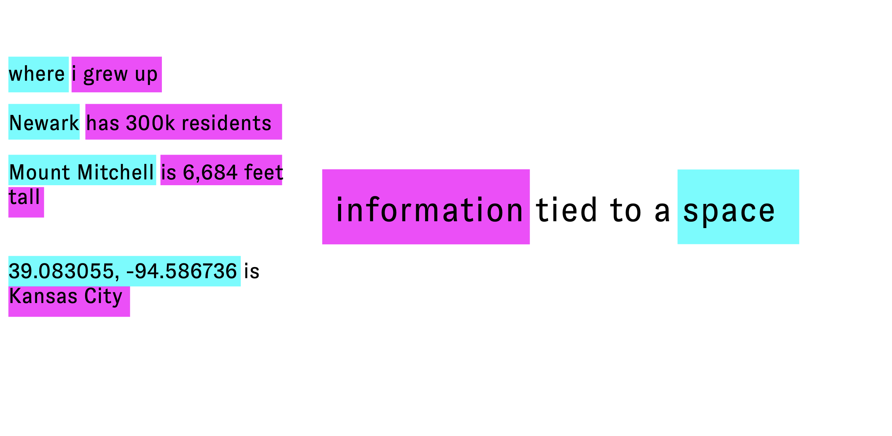
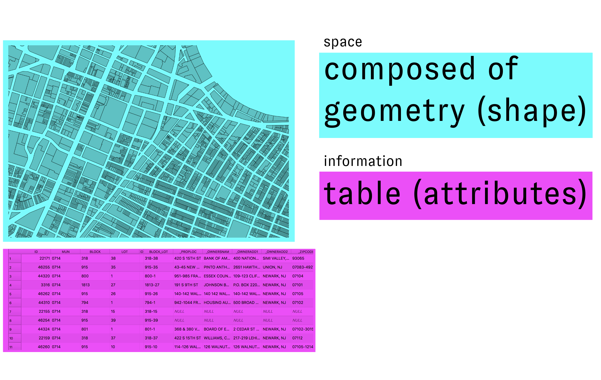
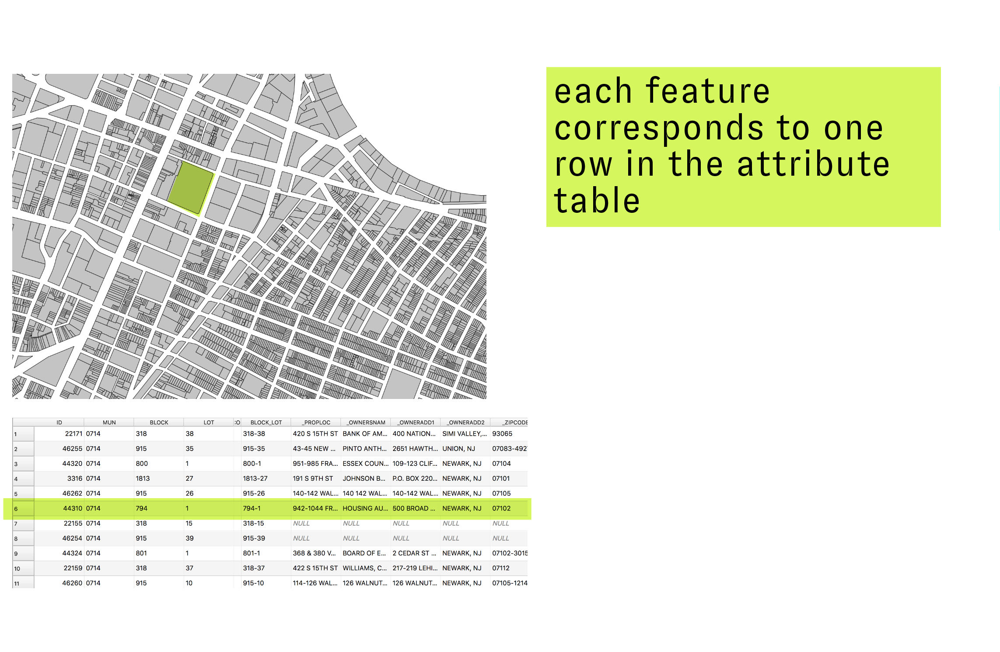
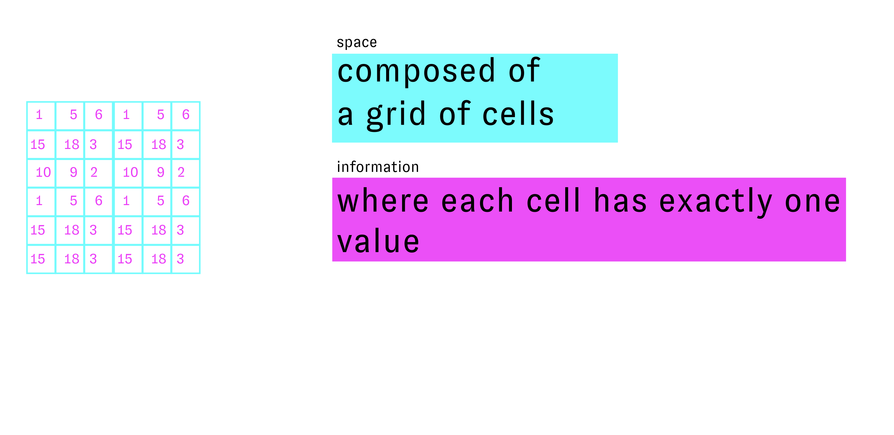

# Spatial Data Types

*"the technical question of the most appropriate data structure for the representation of geographic phenomena begs the philosophical question of the most appropriate conceptualization of the geographic world."*  
Helen Couclelis. 1992. "People Manipulate Objects (but Cultivate Fields): Beyond the Raster-Vector Debate in GIS."

## Module Summary

This module introduces vector and raster spatial data types and discusses the different forms of representation and abstraction required by each. It asks readers to think critically about the affordances and limitations offered by each type of spatial data.  

## Spatial data: information linked to a space

Spatial analysis and geographic information systems are powerful tools for understanding and designing the built environment. Our ability to interpret the world through computational tools for spatial analysis however relies in part on special forms of data that support linking information to a spatial location.  

Lets look again at Nicholas Chrisman's definition of GIS from the previous module:  

```
"Geographic Information System (GIS) – The organized activity by which people
- measure aspects of geographic phenomena and processes;  
- represent these measurements, usually in the form of a computer database, to emphasize spatial 
themes, entities, and relationships;  
- operate upon these representations to produce more measurements and to discover new 
relationships by integrating disparate sources; and  
- transform these representations to conform to other frameworks of entities and relationships.    

These activities reflect the larger context (institutions and cultures) in which these people 
carry out their work. In turn, the GIS may influence these structures."  (Chrisman 1999)
```

So a core element of GIS is that it is an activity where people ***"measure aspects of geographic phenomena and processes"***  and then ***"represent these measurements, usually in the form of a computer database, to emphasize spatial themes, entities, and relationships."***  

Both of these aspects of GIS are directly related to spatial data: how we **measure geographic phenomena** and then how we **represent** those measurements.  

So, then, what is spatial data??

I like to use a very straightforward definition: ***information tied to a space***


*Spatial data in concept*

These statements in the image to above are all examples of spatial data. Each is an example of information linked with a spatial location.

**"Where I grew up"** is spatial data about me where the reference to location might only be clear to people who know me well. **"Newark has 300k residents**" tells us how many people live in a particular city. **"Mount Mitchell is 6,684 feet tall"** helps us understand the height of the tallest mountain east of the Mississippi River. **"39.083055, -94.586736 is Kansas City"** tells us a name that has been given to the place with those latitude and longitude coordinates.  

None of these statements however, could be easily read or interpreted by a computer. How does information about space get encoded so that it can be read by a GIS application? There are two primary **[data models](https://en.wikipedia.org/wiki/Data_model).**

## Two data models: vector & raster  

In order to encode spatial information in ways that can be interpreted by a computer and stored in a database two spatial data models have been developed. First, a data model is the name that is given to a system for abstracting and storing information that defines standards for how each piece of information relates to each other and to the "real-world" phenomena it is representing.  

### Vector data

Vector spatial data is a method for representing geographic spaces, and attributes of those spaces, using discrete geometric shapes. The example below shows tax parcels (represented as polygons) for the City of Newark, NJ with information about the ownership and address of each parcel.

Vector spatial data is composed of geometry and attributes associated with that geometry. Most often those attributes are stored in the form of a table (though in certain file formats they are stored in a structure called a dictionary).  

These elements link directly with our basic definition of spatial data: information (attributes) tied to a space (geometry).  


*Components of vector data*  

*Attributes and features of vector data*  

Each feature in the dataset (or each individual element) is represented as a single entry in the attribute table.  

*Types of vector features*  

Vector spatial data can have one of three different geometry types. An individual vector dataset can only have one type of geometry, for example: there cannot be a single dataset with both points and lines.

Each geometry type is defined computationally by the following features:

- **Points**
  - defined as a node
  - can have multi-point data, where a single feature (i.e. single row in attribute table) is associated with multiple points
- **Lines**
  - nodes & verticies connected in an arc
  - nodes are encoded with start and end, and so define a direction
- **Polygons**
  - bounding arcs that enclose an area. Embedded with concept of a centroid
  - can have multi-part polygons (whose centroid might be outside of any of the parts...)

The things that each type of geometry is used to represent is subjective and depends on the scale of the dataset. For example points could represent fire hydrants on a map of a city block. Or, on a map of the whole world points could represent the location of the largest cities. Likewise the Hudson River could be represented as a single curving line on a map of the U.S. or could be represented as a polygon showing the river's varying width on a map of New York State.  

### Raster data

Raster datasets are composed of a grid of cells where each cell contains exactly one numeric value, as illustrated schematically in the diagram below. Each cell has a dimension and therefore corresponds with some square area of the Earth's surface. Raster datasets must always be rectangular.


*Raster data in concept*  

*Examples of raster data from a satellite image*  

In contrast to vector dataset's discrete entities (features), rasters represent information as a continuous surface. Each cell does not necessarily represent a different entity but instead represents some observed numeric value associated with a specific square area of the earth's surface. This is a fundamentally different way of abstracting phenomena in the world.  

For example, imagine a vector dataset of building footprints. This dataset divides up an area into defined, discrete zones that fall within or outside of specific bounded building footprint.  

In contrast, a 'true-color' satellite image of a city (a raster dataset like the one on the right) might also depict or capture buildings, but it represents them in an entirely different way. The dataset is comprised of a grid of cells each corresponding to an area on the earth's surface (say 1 square meter). Each grid cell has a specific numeric value that represents the color of the reflected light within that grid cell. Buildings are visible, as a collection of similarly grey-ish grid cells not as a bounded entity. The viewer brings meaning and interpretation to patterns visible in the collection of cells.  

This makes raster ideal for representing continuous phenomena like elevation, temperature, electromagetic radiation (i.e. remotely sensed imagery).  

The conceptual and theoretical differences between vector and raster data are described at length in Helen Couclelis' 1992 conference paper ["People Manipulate Objects (but Cultivate Fields): Beyond the Raster-Vector Debate in GIS"](https://www.researchgate.net/publication/221589734_People_Manipulate_Objects_but_Cultivate_Fields_Beyond_the_Raster-Vector_Debate_in_GIS). Couclelis is masterful in how she manages to describe the philosophical differences between these two data types in terms that are directly relevant to the use of spatial data in practice.  

## Storage Types  

Vector and raster datasets are distributed and stored in a number of different file types. The lists below provide a (non-exhaustive) overview of some of the most common data storage types you might encounter.  

### Vector Data

- [Shapefile](https://www.loc.gov/preservation/digital/formats/fdd/fdd000280.shtml)
  - old file format, developed in 1990s by [ESRI](https://www.esri.com/en-us/home) (the maker of ArcGIS software). Still largely the industry standard even though it is quite old.  
  - up to seven different files, all with the same name
    - **.shp – the geometry
    - **.dbf – the table containing the variables
    - **.shx – a positional index connecting the shp & dbf
    - **.prj – contains the projection information
    - **.shp.xml – contains the metadata
    - **.sbn,**.sbx – spatial index files to help draw faster
- [GeoJSON](https://www.loc.gov/preservation/digital/formats/fdd/fdd000382.shtml)
  - open source file format
  - one file, uses a `*.geojson` file extension
  - standard format for mapping on the internet
- [KML/KMZ](https://www.loc.gov/preservation/digital/formats/fdd/fdd000340.shtml)
  - stands for "Keyhole Markup Language", often distributed in a compressed format through a `*.kmz` file.
  - uses an XML format designed for storage of geographic data  
  - developed specifically for the software that would become Google Earth
- [ArcGIS geodatabase](https://www.loc.gov/preservation/digital/formats/fdd/fdd000293.shtml)
  - format developed by ESRI, essentially a spatial database in disguise as a file. Can be opened with QGIS or ESRI softwares. Also possible to open using Python (osgeo library needed)
- Spatial databases
  - large scale projects are often best executed using spatial databases such as [PostgreSQL](https://en.wikipedia.org/wiki/PostgreSQL) with [PostGIS](https://en.wikipedia.org/wiki/PostGIS)

## Storage Types: Raster Data

- [GeoTIFF](https://www.loc.gov/preservation/digital/formats/fdd/fdd000279.shtml)
  - most common & most well supported file type
  - extension of the TIFF data standard that allows for embeded geospatial metadata
  - can also still be opened by non-spatial enabled software (i.e. photoshop)
  - when a georeferenced raster dataset does not include 'inline' geographic metadata it may be accompanied by a [`*.tfw` world file](https://en.wikipedia.org/wiki/World_file) with the same file name which contains the spatial reference information for the raster dataset that is stored in the TIFF file.
    - When a raster dataset inlcudes a `*tfw` file, you need to make sure to place the `*.tiff` and `*.tfw` file in the same folder and maintain their matching names (just like with shapefiles).  
- [JPEG 2000](https://www.loc.gov/preservation/digital/formats/fdd/fdd000303.shtml)
  - similar to GeoTIFF, it is an extension of the JPEG file standard
- [ERDAS IMAGINE (IMG) Format](https://www.loc.gov/preservation/digital/formats/fdd/fdd000420.shtml)
  - often used for multilayer remote sensing data
  - can hold classification information (such as for land use land cover maps)

## Challenge

Read the text below and consider, *what are the conceptual differences between vector and raster data?*

Helen Couclelis. 1992. ["People Manipulate Objects (but Cultivate Fields): Beyond the Raster-Vector Debate in GIS."](https://www.researchgate.net/publication/221589734_People_Manipulate_Objects_but_Cultivate_Fields_Beyond_the_Raster-Vector_Debate_in_GIS)
In: Frank A.U., Campari I., Formentini U. (eds) *Theories and Methods of Spatio-Temporal Reasoning in Geographic Space. Lecture Notes in Computer Science*, vol 639. Springer, Berlin, Heidelberg. 1992.
