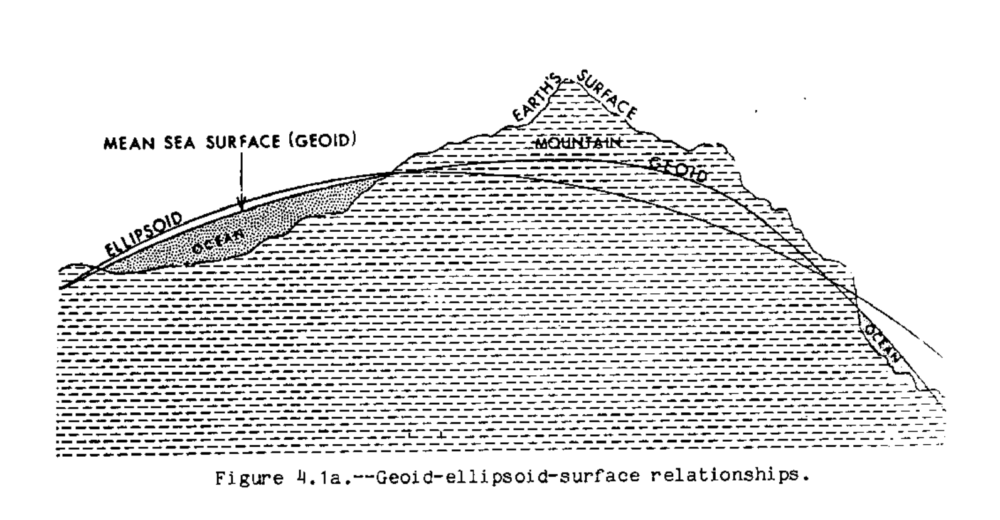
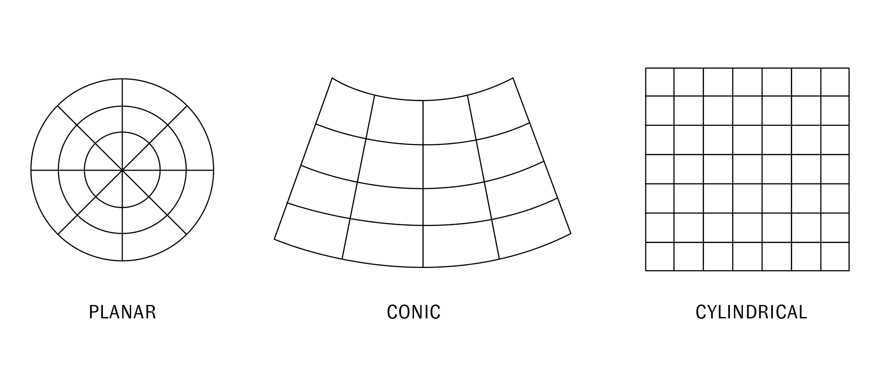

# Coordinate Reference Systems & Projections

## Module Summary

This module covers fundamental concepts related to coordinate reference systems and map projections -- in other words it provides answers to the questions: how do we define location? and how do we represent the round earth on a flat plane?

## Conceptual Introduction

If, as covered in the [previous module](), our operating definition of spatial data is "information tied to a space" then one fundamental aspect of work with spatial data is developing a system for defining the locations of things in space. This is the work of **coordinate reference systems.**  

Most maps are flat, but represent features of our round planet (or of any round planet, see for example [this beautiful map of the moon](https://commons.wikimedia.org/wiki/File:Lunar_Earthside_Map_-_3rd_Edition_-_1976_-_NASA.jpg)). Projected coordinate reference systems use mathematical transformations to allow us to represent the round surface of the planet on a flat plane.
.jpg#img-full)
*Earth in the Goode homolosine projection*  

## Coordinate reference systems

A coordinate reference system (CRS) is a method for representing locations in relation to known reference points or to a reference surface.  

*A simple coordinate reference system*  

There are two categories of coordinate reference systems: **geographic coordinate reference systems** and **projected coordinate reference systems**

A **geographic coordinate reference system** is a system for defining location in relation to a three dimensional spherical model of the earth’s surface.  

A **projected coordinate reference system** defines a set of transformations for representing the spherical earth on a flat plane. Today, these are always based on a geographic coordinate system.  

*Geographic vs projected coordinate reference systems*  

Geographic coordinate reference systems are in turn always based on a **[geodetic datum](https://en.wikipedia.org/wiki/Geodetic_datum)**, which is a [spheroid](https://en.wikipedia.org/wiki/Spheroid) model approximating the lumpy planet that is our earth. Each geodetic datum is based on a reference ellipse which is a closer approximation of the **Geoid** (or the mathematical model of mean sea level across the globe taking into account the influence of gravity and the Earth's rotation.)
  
  
*Transformations to produce a coordinate reference systems*  
This diagram at the right conceptually illustrates  this progression of mathematical models and transformations required to approximate the earth in a geographic and then projected coordinate reference system.  

The diagram below illustrates the relationship between the geoid, earth's actual surface, and the reference ellipsoid.

*Ellipsoid, Geoid, and Earth's actual surface from [Stem, James. “State Plane Coordinate System of 1983.” Rockville, MD: National Oceanic and Atmospheric Administration, January 1989,](https://www.ngs.noaa.gov/PUBS_LIB/ManualNOSNGS5.pdf) page 46.*

## Geographic coordinate reference systems

*Latitude and longitude illustrated*

Geographic coordinate reference systems use angular units to identify locations on Earth's surface. Latitude and longitude coordinates are the most common system. In units of degrees these measure the angles between the axis of rotation and the equatorial plane formed by an imaginary vector that stretches from the center of the earth to some location on the earth's surface.  

*Longitude does not give a consistent measure of distance*

Parallels of latitude and meridians of longitude form an imaginary grid across the Earth's surface.  

Geographic coordinate systems use an angular system of measurement. **Therefore they do not represent consistent measures of distance on the earth's surface.**  

What does this mean exactly? Consider, at equator the diameter of the parallel of latitude is approximately equal to the diameter of the meridian of longitude. 1° of latitude = 1° of longitude. However as you approach the poles, the diameter of each parallel of latitude gets smaller. So accordingly as you approach the poles, 1° of longitude represents a shorter and shorter distance on the earth's surface.  

### WGS 84 & GPS

The **World Geodetic System of 1984 (WGS 84)** is today the most widely used geographic coordinate reference system largely because it serves as the basis for the latitude and longitude coordinates provided by the **Global Positioning System (GPS)**. All coordinates in use within GPS enabled military, commercial, personal navigation devices, survey instruments, and mobile phones rely on this particular mathematical model of the earth. The WGS 84 is the fourth version of the World Geodetic System that began with the development of WGS 60 by the United States Department of Defense during the 1950s. It replaced earlier geographic datums which were designed (calculated) for specific regions (including the [North American Datum (NAD), European Datum (ED), Tokyo Datum (TD)](https://www.ngs.noaa.gov/PUBS_LIB/Geodesy4Layman/TR80003E.HTM)).

That there is a single global geographic coordinate system, and that it is so widely used is not politically neutral. In his [history of cartographic technologies and territory in the 20th century](http://www.afterthemap.info/) William Rankin cautions: "Thus GPS coordinates are not generic global coordinates; they are tied to particular values for the size and shape of the earth...GPS thus integrated the day-to-day surveying of property boundaries or engineering work with intercontinental war, without any special effort. By extension, WGS 84 has also become the unofficial standard for most computerized mapping data, especially data collected in the field. Even for very local projects, coordinates are now global by default" (Rankin 2016, 281).  

## Projected coordinate reference systems

Projected coordinate reference systems are mathematical transformations that allow for the representation of the spherical earth on a two dimensional surface.  

There are many different types of projected coordinate reference systems. Each projected coordinate reference system is categorized and described by two attributes:  

- the shape of the projection surface it uses  
- and the type(s) of distortion it minimizes

### Projection surfaces

*Tyes of projection surfaces*

There are three primary projection surfaces - plane, cone, cylinder – and so there are three primary categories of projections: planar (or azimuthal), conic, and cylindrical.  

The shape of the projective surface used influences the geometry of the resulting map (see below).  

The point or line where the projection surface is tangent to the earth is the location with the least distortion. For azimuthal projections there is a single point where the projection plane touches the earth's surface (this corresponds to the point in the middle of the grid below. For conic and cylindrical projections there is at least one line of tangency between the projection surface and the earth (not pictured, **secant projections** have two lines of tangency). This line of tangency is called the **standard parallel** and it can be located at the equator, meridian, or any Great Circle.  

*Projections from different projection surfaces*

### Types of distortion

All projected coordinate reference systems require / impose some kind of distortion. In the process of transforming the curved surface of the earth into a flat plane there is always some for of stretching or compression, shearing, tearing etc.  

[Evelyn Lambart's *The Impossible Map*](https://www.nfb.ca/film/impossible_map/) is a 1947 educational documentary that provides an amusing and intuitive illustration of these types of distortion using a grapefruit and then a turnip.  
  
*Film stills from Evelyn Lambart's The Impossible Map, 1947*

Projected coordinate reference systems thus distort some combination of:  

- Area
- Distance
- Angle
- Shape

Projected coordinated reference systems can likewise be designed to preserve one of the above relationships (at the expense of others). Projections that preserve area are called **equal area** or **equivalent** projections. Those that preserve distance are known as **equidistant** projections while those that preserve angles and shapes are known as **conformal** projections. ‘Compromise’ projections do not preserve any spatial property, but they do minimize distortion of all properties.  

*An example of a Tissot's indicatrix*

These forms of distortion can be illustrated with something called **Tissot's Indicatrix** which is a drawing of imaginary circles placed a regular intervals on the earth's surface. In this imagined world each circle is perfectly round. However under each projection it is distorted in various ways. The Norman B. Leventhal Map and Education Center at the Boston Library has a [great exhibition with an interactive Tissot's Indicatrix](https://www.leventhalmap.org/digital-exhibitions/bending-lines/how-to-bend/projections/).  

## Working with coordinate reference systems in practice

With the above introduction behind you, practically in working with spatial data and geographic analysis it is important:

1. to understand that there are differences between geographic and projected coordinate reference systems
2. to be aware of the different types of projections and how they are defined/created
3. to grasp the limitations and abilities of different types of projections.  

Practically, the thoughtful use of spatial data requires that you consider "what is the right coordinate reference system for the project I am about to work on?" This should take into account:

1. Where on the earth's surface is your project located?

2. What is the scale of your project? (what are its spatial extents?)
    - If the project covers a small area (a city, a small-ish region) then there is likely a projected coordinate reference system defined for that area (i.e. one whose standard parallel intersects your area of interest). Perform research to find if such a projected coordinate reference system exists and re-project your data to use this coordinate reference system.
    - If the project covers a large area (think national, continental, global) then you need to consider which type of distortion you hope to minimize and should choose a projected coordinate reference system accordingly. In addition you should select a projected coordinate reference system a whose standard parallel is located in the center of the geographic region covered by your project.

*Blue Marble, NASA, 1972*

## Challenge

Locate 3-4 different archival maps that depict an area of your choosing at a few spatial scales. All of the maps should show an area that is smaller than the whole globe, but larger than a city (think: regional or above).  

Identify the coordinate reference system used, either the specific projected coordinate reference system from a citation in the map's legend (if available) or by analyzing the map and inferring the type of projective surface that likely defines the projection.  

Make sure that your example maps do not all use the exact same coordinate reference system.  

Design a series of slides that highlight differences across these depictions which are created by differences in the coordinate reference systems used.  
