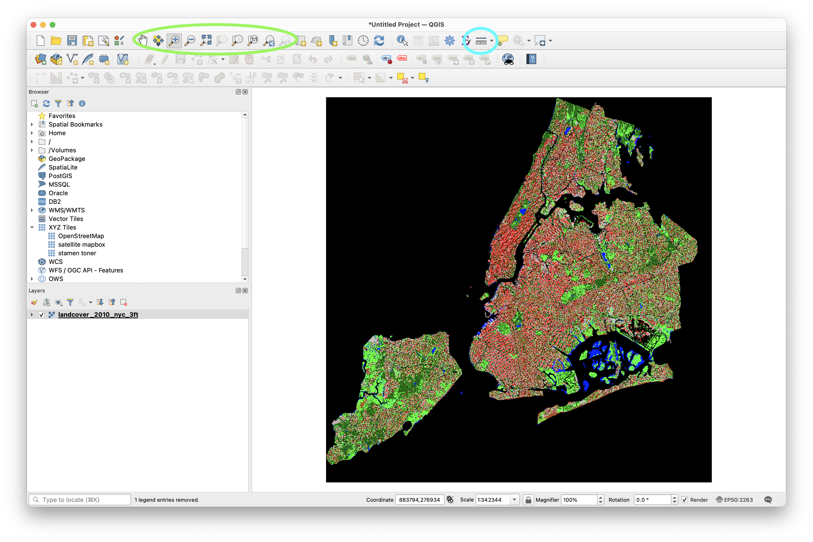
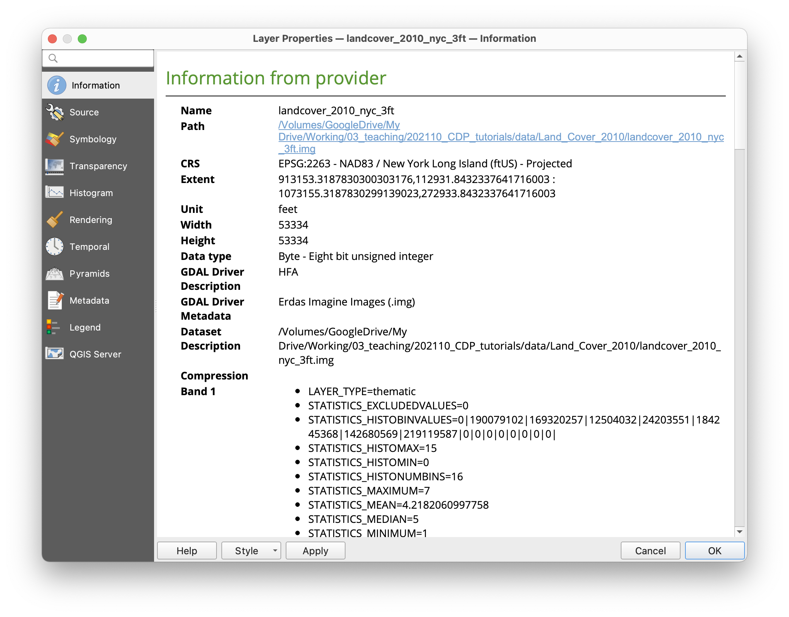
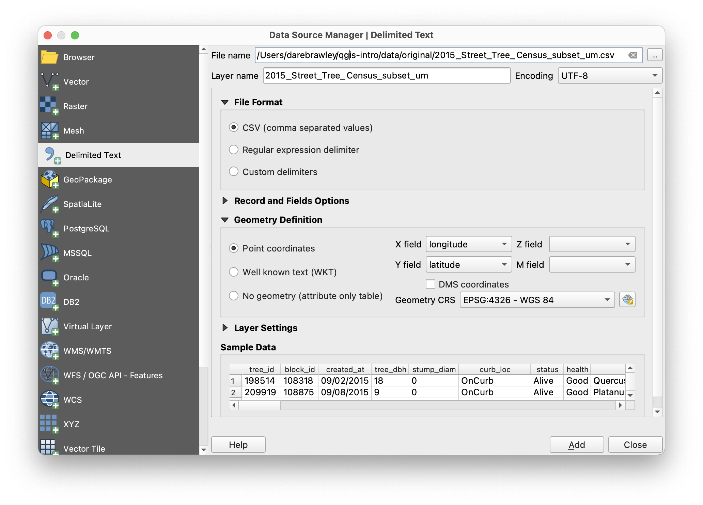
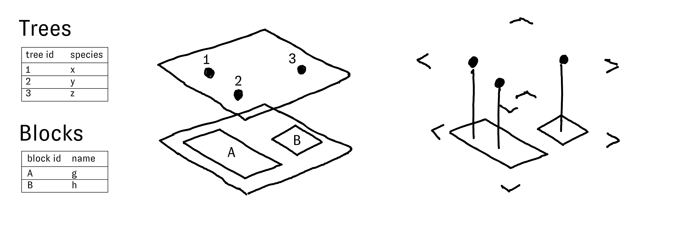
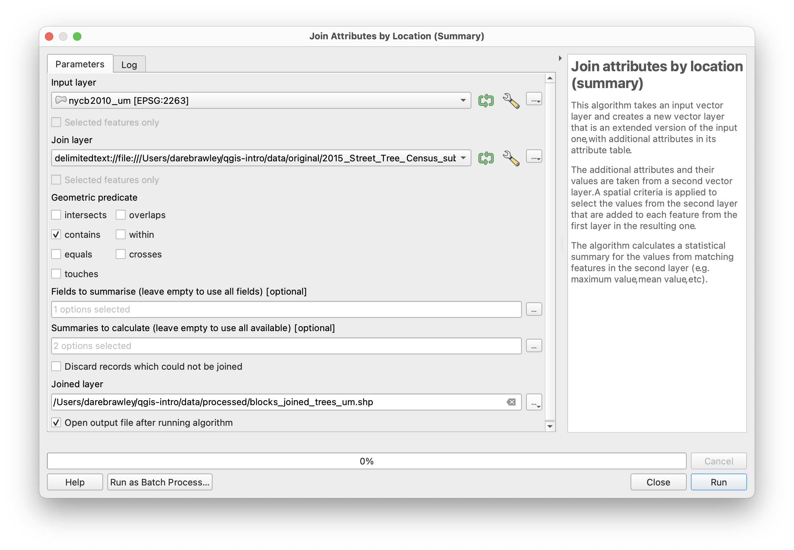
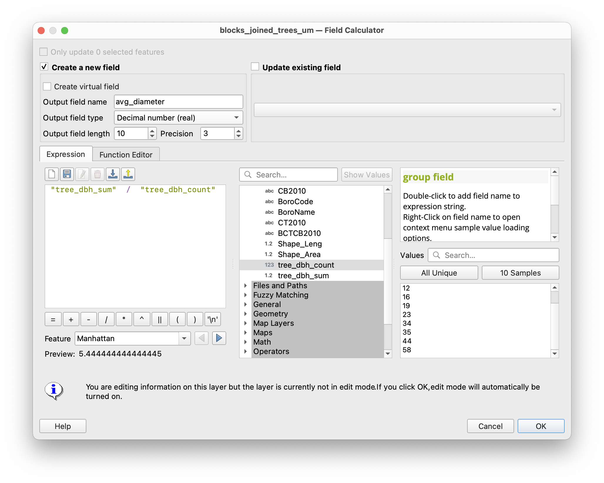
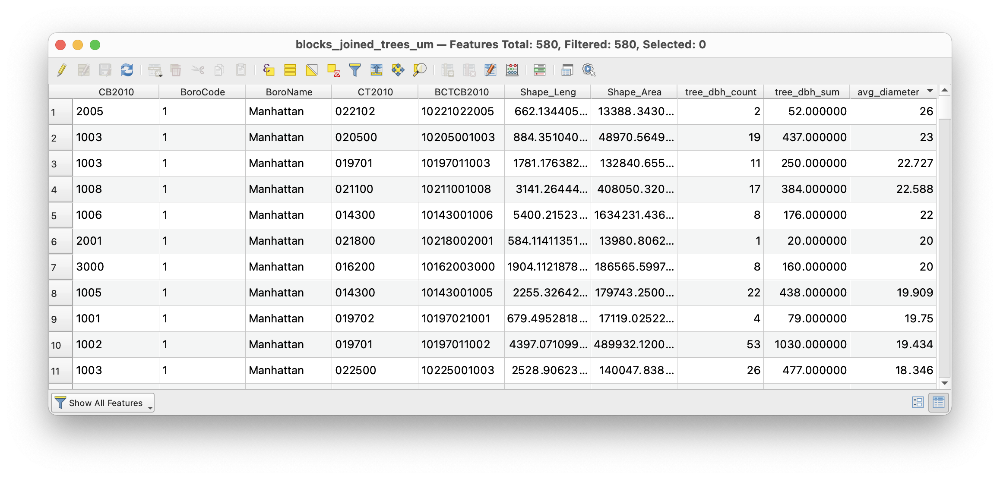
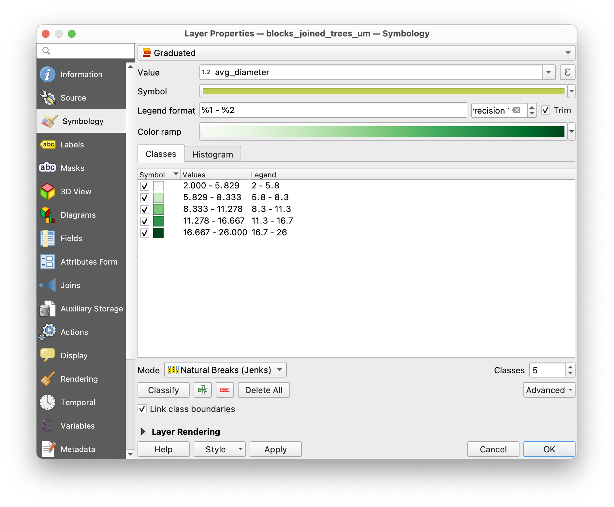
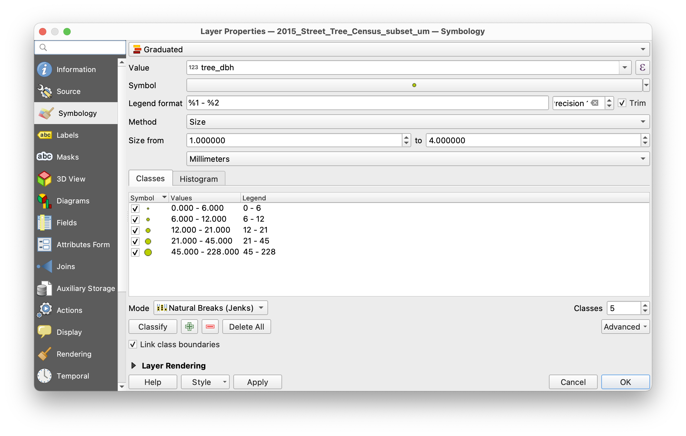
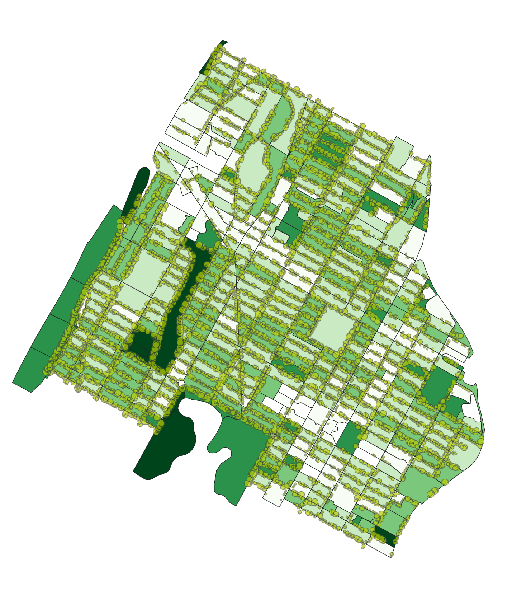

# Mapping Where: Seeing the Forest and the Trees

This module covers the basics of working with raster and vector spatial data within QGIS. After completing this module you will learn how to load datasets into a new QGIS project; modify coordinate reference systems; manipulate layer symbology based on attribute information; carry out spatial selections; and perform basic (but powerful!) spatial joins.

These concepts will be introduced through a series of studies of the trees of New York City.  

## Setup

### File management 

All datasets within your QGIS project are not embedded but rather are stored as links to wherever the dataset is stored. Because of this file and data management is an important component of work in QGIS.  

Create a new folder for your work on this series of modules. Inside it create a `data` folder and then and `original` and a `processed` folder. All downloaded datasets should be saved in the `data`>`original` folder. Any new datasets you create in the process of completing the modules should be saved within the `data`.`processed` folder.  

### Data downloads

In this module you will be making a series of maps about the urban forest in New York City. Download the following datasets: 

- [New York City Landcover 2010 (3ft version)](). A raster dataset created to describe major land use categories for New York City derived from satellite imagery. Full metadata and other downloads available via NYC Open Data [here](https://data.cityofnewyork.us/Environment/Landcover-Raster-Data-2010-3ft-Resolution/9auy-76zt). Download this dataset and unzip its contents. You should have a folder titled `Land_Cover_2010` with six files in it. 
- [New York City 2015 Street Tree Census]() This dataset was collected by more than 2000 volunteers visiting each street tree within the five boroughs of NYC. For more background on this amazing effort (the third such census over the past 30 years) see the NYC Parks department website [here](https://www.nycgovparks.org/trees/treescount). The link above provides a subset of the data for an area in Harlem to make for easier processing. For those interested the full dataset is available for download directly via NYC Open Data [here](https://data.cityofnewyork.us/Environment/2015-Street-Tree-Census-Tree-Data/pi5s-9p35)
- [New York City Census Blocks 2010](). As with the stree trees above, this is a subset of the full NYC Census Blocks file for an area of Harlem. The smaller file makes for easier processing in this tutorial however if you wish to conduct the analysis below for all of NYC the original dataset is available [here.](https://data.cityofnewyork.us/City-Government/2010-Census-Blocks/v2h8-6mxf)

### QGIS interface

Open QGIS and create a new project.  

The QGIS interface consists of a selection of **Panels** and **Toolbars** and a **Map canvas**.  

All toolbars and panels can be moved or removed from the QGIS interface. If you need to access a specific panel or toolbar right click anywhere within the grey areas surrounding a panel or toolbar to open the toolbar and panels browser (shown at right).  

The **Browser Panel** provides the ability to browse, search and inspect spatial datasets from your local file system, database connections, and online sources.  

The **Layers Panel** will show all datasets (layers) that you have added to your project. After adding datasets to your project you can access properties and analytic tools for each layer via its name in the layer panel. The order of the datasets listed here controls their rendering order in the **Map canvas`. 

The **Map canvas** provides a view of the datasets you have added to your project.  

**Toolbars** provide access to various tools within the program.

## Adding raster data: mapping tree cover from land use

The first layer we will add to our project is a raster dataset of landcover for New York City from 2010. This dataset was developed by researchers using satellite imagery to identify major categories of materials (cement, buildings, open ground, water, vegetation, tree cover) for all of New York City.

We will use this layer to visualize the canopy of New York City's trees.  

Before completing the steps below review the introduction to raster and vector datasets in [this module.]()  

From the top menu bar select `Layer` and then `Add Layer` > `Add Raster Layer`.  

When the `Data Soursce Manager` menu appears select the Source Type as `File` then click on the `...` and navigate to the `Land_cover_2010` folder within data folder you created for this series of modules. Select the file named `landcover_2010_nyc_3ft.img`. Take care to select the file with the **.img** file extension. The five files with the same name except for their file extension together comprise this particular raster dataset (for more on the specific file format that this dataset uses see [here](https://www.loc.gov/preservation/digital/formats/fdd/fdd000420.shtml)). QGIS will do the work of interpreting each of the five files together. Click `Add`. Then click `Close`.  

The land cover dataset's name should now appear in the layers panel and the dataset should be visible in the map canvas.  

Open the `Layer Properties` menu for this dataset to look at its source and coordinate reference system information. This is always a good thing to do when you add a new dataset to your project.  

Notice that the coordinate reference system is already defined as EPSG:2263 which refers to the New York State Plane Coordinate reference system for the Long Island region. This is the projected coordinate reference system that produces the smallest level of distortion for NYC and should be used for all local maps of NYC. Because the dataset already uses this coordinate reference system  

Save your project within the folder you created for this series of modules. Save the QGIS project as a `.qgz` file.  

Use the map navigation tools (circled above in green) to zoom to an area that interests you. The view on the right shows Harlem between Morningside and Marcus Garvey parks.  

Continue to zoom in until individual raster cells are visible.  

Next use the Measure Line tool (circled above in cyan) to measure the size of each raster cell (aka pixel). Set the units to feet, in the map canvas click where you want to start measuring then click again where you want to stop. Each cell is 3 feet. This matches the information conveyed in the metadata for the dataset.  

Next use the identify features tool (circled in green above) to examine the value contained in a few of the rasters cells. Remember for raster datasets each cell represents a specific area on the earths surface (its cell size) and each cell has exactly one numeric value. With the identify features tool selected click on a raster cell. The `Identify Results Panel` will show you the numeric value for each cell that you click.  

The meaning of these values is explained in the data dictionary provided with the data (see `Landcover2010_DataDictionary_20171012.xlsx` within the `Land_Cover_2010` folder). Open this file from your data folder to take a look at it. Notice that cells with a value of 1 correspond to areas classified as within the 'tree canopy' for NYC.  

Our goal in this part of the module is to design a map showing the tree canopy for New York City aka ***A View of NYC Trees #1***.

To do this we will manipulate the symbology for this land cover layer. Right click on the layer's name in the layers panel. Open the layer `Properties` menu. Open the Symbology tab. Currently you'll notice that each numeric value, which each correspond to a specific land cover designation, has been assigned a unique color. You can change the color assigned to each land cover category by right clicking on a row in the symbology menu and then selecting Change Color.  

Select all of the values except for 1. Right click to change their color.  

Change them all to white. Click `OK` on the change color menu then click `Apply` on the layer properties symbology menu. You should now see a map showing just those areas classified as tree canopy in this land cover dataset. Click `OK` to close the layer properties menu. 

## Adding vector data: mapping tree concentrations

Next we will visualize a subset of New York City's trees through a different dataset and different set of methods. Throughout consider how this representation of NYCs trees differs from the approach using the raster dataset completed above? How are the two representations different? similar? which is more 'accurate'? (that's a trick question...)  

In this section will answer the question: which census blocks have the greatest number of street trees?  

To do this we will add two new datasets to our project, a shapefile containing census block boundaries, and the 2015 street tree census for New York City.  

To reduce processing times you will conduct the next section with a subset of data covering part of upper Manhattan (from 105th Street to 141st Street). If you have a powerful computer (or don't mind waiting several minutes between steps) feel free to download the complete versions of the datasets for NYC as a whole.
- [Download NYC Street Tree Census for all of NYC.](https://data.cityofnewyork.us/api/views/5rq2-4hqu/rows.csv?accessType=DOWNLOAD) Metadata available [here](https://data.cityofnewyork.us/Environment/2015-Street-Tree-Census-Tree-Data/pi5s-9p35).
- [Download Census Blocks for all of NYC.](https://data.cityofnewyork.us/api/geospatial/v2h8-6mxf?method=export&format=Shapefile) Metadata available [here](https://data.cityofnewyork.us/City-Government/2010-Census-Blocks/v2h8-6mxf).

First we will add the shapefile of New York City census block boundaries.  

From the top menu bar select `Layer` and then `Add Layer` > `Add Vector Layer`.  

When the `Data Source Manager` menu appears select the Source Type as `File` then click on the `...` and navigate to the data folder for this assignment. Within the **nycb2010** folder select the **nycb2010.shp** file. Take care to select the file with the **.shp** file extension. QGIS will do the work of interpreting the full shapefile and will pull the projection and database information from the other files in the roads folder. Click `Add`.

## Creating points from XY values

Next we will add the results of the 2015 Street Tree Census to the map. This dataset is made available in tabular form (as Comma Separated Values) with coordinates specifying the location of each tree stored as columns in the dataset. QGIS can read these values and create a new vector dataset of points representing their locations.  

From the top menu bar select `Layer` and then `Add Layer` > `Add Delimited Text Layer`.  

When the `Data Source Manager` menu appears click on the `...` and navigate to the data folder for this assignment. Select the `2015_Street_Tree_Census.csv` file. Take a look at the preview of the dataset that appears at the bottom of the window. This allows you to see the columns included in the dataset as well as sample values. Scroll to the right to take a look at the available columns of information about each tree. You'll notice that there are columns at the far right that specify the latitude and longitude coordinates for each tree. We will use these to create our new vector dataset specifying the point location of each tree.  

Select the fields (columns) from the dataset that should be used to generate the X (longitude) and Y (latitude) coordinates for each point, QGIS may have already pre selected them for you.  

Then make sure to specify the `Geometry CRS` as World Geodetic System (WGS) 84 (which has EPSG code 4326). This tells QGIS which coordinate reference system your point coordinates are defined in. We didn't have any information with this dataset about the specific coordinate reference system used, however we can be confident of our choice of WGS 84 because (1) latitude and longitude coordinates always refer to a geographic coordinate reference system (they are angular units) and (2) the Global Positions System (GPS) which was most certainly used to generate these point locations uses WGS 84. Review [this module]() to refresh yourself on coordinate reference systems.  

Click `Add`. It may take a few seconds to render the street tree locations.  

Turn off the blocks and land cover datasets in the layers panel (uncheck the box next to the name of each) so that only the street tree locations are visible. Zoom in until you see an area that is a few blocks wide so that the individual trees are more visible.  

Notice how the outlines of streets are visible in the patterns formed by the trees. It is also clear that some blocks have many trees and others have very few.  

Because we created the street tree dataset from latitude and longitude coordinates, the dataset is not yet in the correct projected coordinate reference system for New York City. Like you did for the land cover data above, confirm the current coordinate reference system by right clicking on the street trees layer in the layers panel to open the `Layer Properties` menu. What is the current coordinate reference system (or CRS) for the street trees?  

Because it is not yet in the New York State Plane-Long Island coordinate reference system we need to re-project the data.  

To do this we will export a copy of the dataset and specify the new projected coordinate reference system that we wish to use.  

Again right click on the street trees layer in the layers panel. Select `Export`>`Save features as` then in the Save vector features as dialogue window opens use the `...` button to choose a location to save the new dataset you are creating (within the data>original folder you created for this project is a good spot). Specify the correct coordinate reference system for NYC (New York State Plane - Long Island with EPSG:2263). If it is not visible in the drop down menu click the `Select CRS` button to open the coordinate reference system dialog box and search for the correct coordinate reference system for NYC. Make sure `Add saved file to map` is selected and click `OK`. It may take a few minutes for this action to finish processing (there are a lot of street trees!).

Once the new dataset of street trees in the correct projected coordinate reference system you can remove the original street trees dataset from your project. Right click on its name in the Layers Panel and select `remove layer`.  

## Spatial Join: which census blocks have the most street trees?
Our goal is to understand the variation in the number of street trees by block in New York City. Specifically we are aiming to answer the research question: which census blocks (in Morningside Heights and Harlem) have the most street trees? and which census block has the largest proportion of mature street trees (as determined by trunk size)?

To answer this question we will perform a **spatial join** between the 2010 census blocks and the street trees. 

A **spatial join** is an analysis operation that allows you to associate attributes from one dataset with the attributes of another dataset based on some spatial relationship between the two datasets. It is a simple but deeply powerful analytic tool that is not possible without geographic information systems. Remember that vector spatial data is comprised of two core components: geometry and geographic information (what you see on the map canvas) and a table of attributes corresponding to each geometric/geographic entity. In performing a spatial join we are able to add information from one dataset to the attribute table of another dataset based on how they are related to one another in space even when we have no other information about how the two datasets are related to one another.  

Take our street trees and census blocks as an example: we are hoping to learn which census blocks have the most street trees. If you open the attribute table for the census blocks dataset you will see that there is currently no information about street trees present. Likewise if you open the street trees attribute table you will notice that there is no information about which census block the tree sits within. So in order to determine now many trees fall within each census block we will need to perform a spatial join to associate attribute information about our street trees with the attributes for each census block.  

Before we execute a spatial join in QGIS for the first time, consider the diagram below to have a stronger conceptual grasp of spatial joins. The diagram shows the geometry and the attribute tables for two layers: trees and blocks. There are three three trees and two blocks. The trees and the blocks are spatially co-located so it is possible to perform a spatial join between the two layers.  

The diagram at the right shows the results of a spatial join from the dataset of blocks to the dataset of street trees. This operation results in adding new information to the attributes of each tree based on which block each tree overlaps. In other words we will add new columns to the attribute table for the street trees and the values in these new columns will correspond with the attribute information for the block that each tree grows within.  

If instead, we join the street trees to the blocks we will add new information to the attributes of each block based on the attributes of the trees within that block. The diagram to the left illustrates these results. In this scenario however there are multiple trees within each block. Because each block corresponds with exactly 1 row in the attribute table this means that we must summarize the information about the trees that we are joining to the blocks. In this example we have chosen to count the trees, however a number of other summary methods could have been used for any numeric values in the dataset (minimum, maximum, average, etc.).

This second version of the possible spatial joins between these two datasets is what we need to execute in order to find an answer to the questions: which census blocks have the most street trees? which blocks have the most mature trees (as measured by trunk diameter)

## Spatial Join in action

To find out which census blocks have the most street trees, and which blocks have the most mature trees, we will be perform a spatial join to tally up the number of trees within in each census block. Let's begin.  

Open the `Processing Toolbox` (either with the gear icon in the toolbar or through the panels menu). In the search bar look up "Join attributes" to find the `Join attributes by location (summary)` tool.  

In the Join Attributes by Location (Summary) dialog window select the blocks as the input layer (the layer you are joining information *to*) and the trees as the join layer. Select contains as the geometric predicate.  

Then use the `...` button to open the fields to summarize menu and select which columns from the trees attribute table you wish to join to the attribute table for the blocks. Select the `tree_dbh` (tree diameter)  field.  

For the summaries to calculate again use the `...` button to select `count` and `sum` as the summary methods. This will mean that you add two new columns to the attribute table for the blocks: a count and a sum of the tree diameter field for each block. (It is a good practice to anticipate the results of each geoprocessing step you perform this way, if the results are different than what you anticipated you will notice and be able to more easily troubleshoot any errors).

Specify a location to save the resulting new dataset (the processed folder within your data folder for this series of modules is a good spot). Then click `Run`. This is a computationally intensive process and it may take a few minutes for QGIS to execute the spatial join.  

Once the spatial join has completed the results (a new dataset) should have a new dataset added to your project.  

This new dataset will have the geometry of the census blocks and should have two new columns in the attribute table that summarize information about the street trees.  

Open the attribute table to check.  

You can now remove the original NYC census blocks dataset from your project.  

## Calculating new fields

So that we can distinguish between blocks with many small trees and blocks with mature trees we will calculate a new field to give us the average tree diameter for each block. In other words, for each block we will calculate the value of `total tree diameter / total number of trees`

Open the `field calculator`. Circled in green above. Create a new field, specify the output field type as decimal number. Then use the `Fields and Values` expandable menu to select the two fields needed to calculate the average tree diameter per block. When you have constructed the expression and made the selections shown below click `OK`.  

Using the field calculator turns on edit mode (a setting that allows you to directly modify a dataset within your project). Click on the `toggle edit mode` button (a pencil icon at the far left of the attribute table or in the toolbar) to end the edit session. Be sure to select to save your changes (aka save the new field you just calculated).  

You should see the new `avg_diameter` field added to the attribute table. You can sort the attribute table by any field by clicking on the field name. Sort the attribute table to find out:

- Which census block has the most street trees?  
- Which census block has the highest total street tree diameter?  
- which census block has the largest average trees?  

## Quantitative symbology: average street tree diameter by block

Now that we have created information about the number of street trees on each block we can visualize this information through the symbology of our map drawing ***A View of NYC Trees #2***.

Open the layer properties for the census blocks joined with trees layer. Open the `Symbology` tab. This menu allows you to specify the symbology for this vector dataset.  

First we will visualize the average tree diameter per block  through a [choropleth map](https://en.wikipedia.org/wiki/Choropleth_map). Blocks with a higher average tree diameter have on the whole larger or more mature trees.  

Make the selections shown below and click `Apply`.  

The classification mode determines the groups that your data are assembled into. The classification mode you choose will greatly influence the argument that you map conveys. The `Histogram` menu helps to show you the relationship between the distribution of your data and the classification mode you have chosen. Compare a few different classification modes by changing the mode and then returning to the histogram (you may need to select `Load Values`) to see how the groupings change across the distribution of your data. For more on data classification see [Mark Monmonier's *How to Lie With Maps*](https://clio.columbia.edu/catalog/2668118).

### On your own

Map ***A View of NYC Trees #3***: How does the average tree diameter per block compare with the total number of trees per block?  

Duplicate the blocks layer (right click on the layer name in the layers panel and select `Duplicate Layer`). Open the layer symbology menu and repeat the steps above for the `tree_dbh_count` field. What are some of the differences you see?  

## Quantitative symbology: graduated symbols

Next we'll make ***A View of NYC Trees #4:*** or a map of trunk diameter by tree.  

Open the layer properties menu and the symbology tab for the `2015_Street_Tree_Census_subset_um` layer. Choose graduated symbols and then make the following selections:  

Your map should look something like this:

## Assignment: 
Design a map, or a series of maps showing your four ***Views of NYC Trees***. This is an opportunity to experiment with the nuance Complete the [next short module]() on the print layout functions of QGIS cartographic design before embarking on this.

Consider:  
How can your design convey similarities and differences across each of the four ways of understanding trees of New York City?  

Will you privilege one view over the others? or give equal voice to all four?  

What are the limitations of each view? strengths of each view? how can you communicate these limitations/strengths through your graphic presentation of data?  

Format:  
Your designed map compositions must thoughtfully include:

- title
- legend
- scale bar
- north arrow (your map doesn't need to have north be pointing vertically...)
- citations for all data sources
- projection used
- your name

-------
tutorial credit information, to be added in standard format
