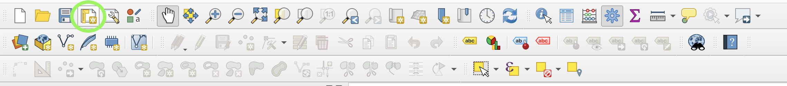
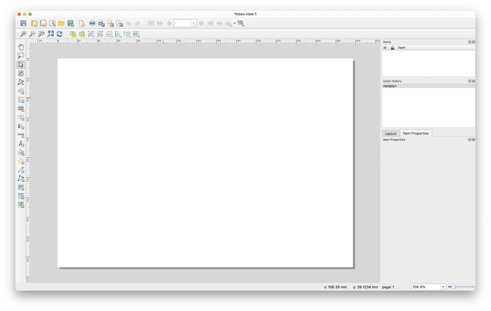
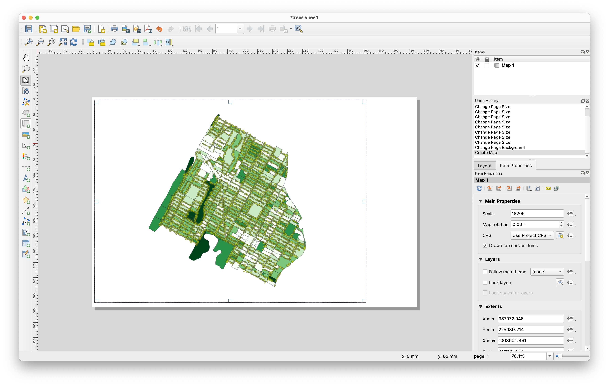
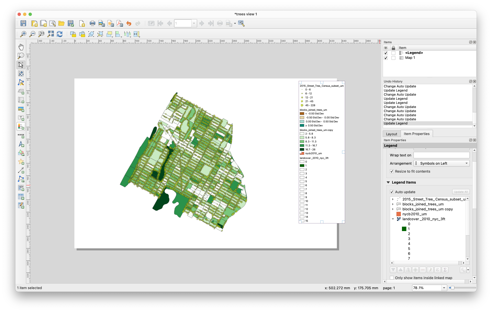
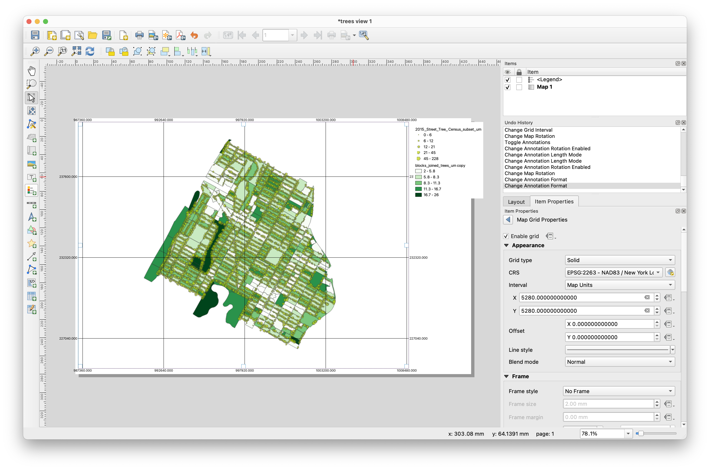
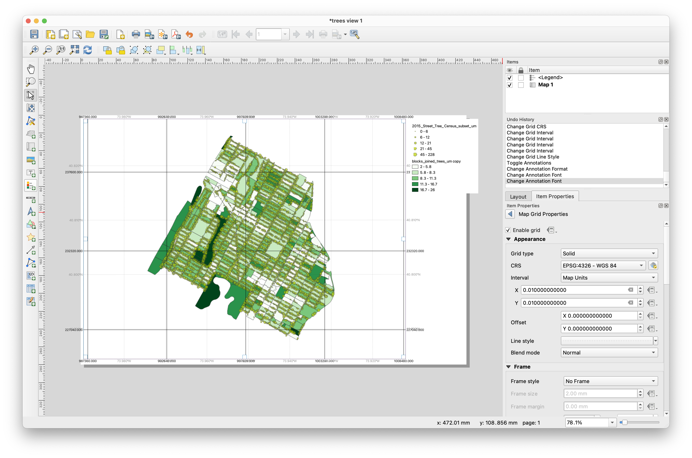
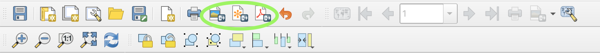

# Print Layouts in QGIS

 From left: International Map of the World, Hudson River, 1927, US Geological Survey; Maps by Studio Joost Grootens from [*Atlas of the New Dutch Water Defense Line* by Clemens Steenbergen et al](https://www.google.com/books/edition/Atlas_of_the_New_Dutch_Water_Defence_Lin/v51sTO-RpHwC?hl=en&gbpv=0), 2009; Passonneau & Wurman, ["Cleveland"](https://www.davidrumsey.com/luna/servlet/detail/RUMSEY~8~1~307890~90077767:Cleveland--Residential-Population-D?sort=Pub_List_No_InitialSort%2CPub_Date%2CPub_List_No%2CSeries_No&qvq=q:wurman%20cleveland;sort:Pub_List_No_InitialSort%2CPub_Date%2CPub_List_No%2CSeries_No;lc:RUMSEY~8~1&mi=2&trs=9) in [*Urban Atlas: 20 American Cities*](https://www.davidrumsey.com/luna/servlet/view/search?q=pub_list_no%3d%2210195.000%22&qvq=sort:Pub_List_No_InitialSort%2CPub_Date%2CPub_List_No%2CSeries_No;lc:RUMSEY~8~1&mi=0), 1966.

This short module covers the basics of creating a print layout in QGIS and some considerations for cartographic design in general. The technical material covered allows you to move your QGIS projects from map space to paper space and to export your work either in a final presentation format or in a form that allows you to continue design work in another software environment.  

## Map space / paper space  

So far you have worked within QGIS's map canvas viewing and analyzing datasets. This environment gives a view of your data from whatever spatial scale you set through the zoom and pan setting in the map canvas view. We can refer to this environment as **map space**. In order to export your work from QGIS so that it can be viewed as a static image outside of the program you must fix the spatial scale of your work. Like work in CAD softwares this can be understood as **paper space**. The `Print Layout` function within QGIS is a tool that enables this transition into paper space.  

## Cartographic design

The transition from map space to paper space also affords you the opportunity to begin to think about aspects of cartographic design that are not relevant when performing analysis in QGIS.  

How will you orient readers of your map to the geographic context of your map? How will you convey the meaning(s) of the symbols you have chosen?  

Maps typically have:
- a legend
- an indication of scale (either a scale bar or in the case of printed maps a written scale 1"=1000 feet for example)
- a note showing the projection used
- a north arrow
- citations for all data sources
- the name of cartographer and/or publisher
- (sometimes) a grid and/or a graticule to convey the coordinate reference system

The examples shown at the opening of this module highlight some examples of the above listed map elements.  

## Set up

Open a QGIS project (your work for the [Mapping Where]() module is a good option).  

In the main toolbar select the `New Print Layout` tool, or select `Project`>`New Print Layout` from the top menu. You will be prompted to specify a name for your new layout. Each QGIS project can have multiple associated print layouts so choose a descriptive name for the layout you are hoping to create so that you can distinguish it if you ever add an additional layout view.  

Once you have specified the name of your first layout the print layout tool will open.  

## Set page size

To set the page size right click anywhere on the blank page and select `Page Properties`. The `Item Properties` menu should appear. Use this to specify the dimensions of the page. There are preset paper sizes and you may also specify your own size using the `Custom` option and choosing specific dimensions and units.  

## Add a map

Use the `Add Map` button and then click to draw a rectangle over the area on your page that you want the map to cover.  

## Edit item properties

In general, to adjust styling or properties for each map element within the print layout tool select the element on the map and then open the `Item Properties` tab. The Item Properties menu provides styling and other options specific for each map element.  

For a map element you can adjust the scale, the coordinate reference system(CRS) that the data is viewed in, the rotation of the map, which layers are visible, the spatial extents of the map view (specified in coordinates of the CRS of your map project) among other options.  

Set your preferred map scale & experiment with the map rotation. Setting the map rotation at -28.7° when using the New York State Plane Long Island projected coordinate reference system will align the Manhattan street grid with the page.  

## Add a legend

Select the `Add Legend` button and again draw a rectangle over the area where you want your legend to be placed.  

By default all layers from your QGIS project will be included in the legend. If, within the Item Properties for your legend, you select `Only show items inside linked map` then only the currently visible map layers will be included in the legend. If you would like to manually select which elements to include in the legend then deselect `Auto Update`. You can then use the `+` and `-` buttons to add and remove legend elements.  

## Add a grid

A grid can help to convey the location of a map within a given coordinate reference system. A map grid displays vertical and horizontal lines at defined intervals of given coordinate reference system. A graticule refers specifically to the display of geographic coordinates (degrees of latitude and longitude).  

A map can have multiple grids and/or a graticule to convey the location of the map across multiple coordinate reference systems.  

Add a grid for the coordinate reference system of our map (New York State Plane Long Island NAD 1983) as well as a graticule.  

Select the map and view its item properties. Scroll to and expand the `Grids` section. Use the green `+` to add a new grid. Name the grid EPSG 2263 (the CRS of the map).

Select modify the grid. And make the following selections: for CRS `EPSG: 2263`; interval `map unit`; x `5280` y `5280` (aka 1 mile). Scroll down to Draw coordinates. Select the check box. For format select `decimal`. You can also adjust the size, placement, and font of these coordinates within this item properties menu. Once you are pleased with their appearance, leave the grid item properties menu with the blue arrow at the top of the item properties menu. 

The map now displays a grid showing the coordinate reference system.

Next create a graticule to overlay on the map. Create a new grid as before. Name it WGS84 (this is a geographic coordinate reference system). Select modify grid make the following selections: CRS `EPSG: 4326`; interval `map unit`; x & y as `0.03`/

So that you can distinguish with the other grid change the color or stroke style by selecting the `Line` dropdown menu. Scroll to enable Draw Coordinates. Format as `degree, minute`. Change the font color to match the color you chose for the lines

Note: `Grid enabled` at the top of the grid properties menu toggles visibility for the grid.

Notice difference between the grid and the graticule. Based on the [projections and coordinate reference systems module]() can you interpret these differences?

## Add additional map elements

Use the left toolbar to add a north arrow and a scale bar. Adjust the style and settings for each using the Item Properties menu for each element.  

## Exporting

It is possible to export a print layout in multiple formats including as a PDF, as an image file (in multiple formats), or in SVG format.  

Export options can be accessed via `Layout` in the top menu bar or the export buttons in the Layout toolbar (circled below).

### Notes on workflow

It is possible to use the print layout tool within QGIS to design visually compelling maps. However, it is generally much faster to use the print layout to: define a map/paper size, set the spatial scale of your map(s), and add any orienting map elements (scale, legend) and then export to continue your work in a dedicated graphics editing software.  

Exporting maps with vector-based data in SVG format allows you to edit the representation of your data in Illustrator or another vector graphics software.  

Any raster-based data should be exported separately as in a high resolution image format which can be layered in your graphics editor of choice with any vector-based elements.

## Further resources

Print-layout how-to:  

- The QGIS documentation has a detailed overview to the Print Layout tool, available via the docs [here](https://docs.qgis.org/3.22/en/docs/training_manual/map_composer/map_composer.html)

Map design more generally:

- Mark Monmonier's [*How to Lie with Maps*](https://press.uchicago.edu/ucp/books/book/chicago/H/bo27400568.html) is a classic now in its 3rd edition on concerns and approaches for cartography and cartographic design.  
- In cartography (as with all design work) being able to produce thoughtful projects begins by developing visual literacies and fluency with cartographic conventions and how to subvert or extend them. The best way to approach this is to look at many many precedent projects. Historical and/or maps designed for print are often a good starting point as they tend to be more thoughtful in their use of cartographic elements than maps designed for the web. [David Rumsey Map Collection](https://www.davidrumsey.com/) is a good source for archival maps with global coverage. Spend time with atlases and search for cartographers whose visual style you like.

## Assignment: build and use an atlas of references

1. Locate at least five to ten examples (the more the better!) of maps you find visually compelling, especially clear in their narrative, or otherwise enjoy looking at. Design a method for keeping track of these examples and their sources (for example: [are.na](https://www.are.na/) channel, a well organized folder structure, or a [Zotero](https://www.zotero.org/) library).  

2. In conjunction with the assignment for the [mapping where]() module: choose 2-3 individual elements from within your reference atlas and apply them in the design of your *Four Views of Trees in New York City*.  

---
Module by Dare Brawley, fall 2021.  
tutorial credit information, to be added in standard format
