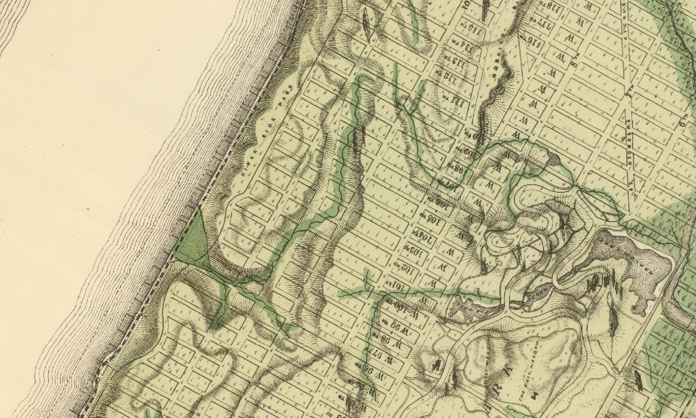

# Making Data from Archives

In this module you will learn techniques for creating spatial data from archival sources. In it we will cover how to georectify raster datasets (in this case a scanned paper map), giving them geographic coordinates based on reference data. Then the module will cover how to outline and trace features to create new vector-based data from those scanned materials, this is a process we call digitizing.  

These are key skills for doing work on historical events with spatial methods, and can also be useful for data collection in geographically remote areas (see Field Papers in the next module).  

Creating data from historical sources can reveal histories of [food production and transportation in urbanizing Brooklyn](https://mappinghny.com/case-studies?lng=-73.9539&lat=40.6667&zoom=12.19&maps=%5B%7B%22center%22%3A%7B%22lng%22%3A-73.95389999999998,%22lat%22%3A40.66669999999999%7D,%22demographicOpacity%22%3A1,%22demographicsFilters%22%3A%7B%7D,%22filters%22%3A%7B%7D,%22layers%22%3A%5B%5D,%22rasterOpacity%22%3A1,%22year%22%3A%221880%22,%22zoom%22%3A12.19%7D%5D&rasterOpacity0=1&compareEnabled=true&rasterOpacity1=1&caseStudyStep=0&caseStudyId=farm-to-city-bk); show [land use patterns that predate zoning](https://www-tandfonline-com.ezproxy.cul.columbia.edu/doi/full/10.1080/24694452.2016.1177442). Other projects have used historical military maps to [trace the erasure of Palestinian towns and villages](https://palopenmaps.org/). Others using [historical sources have created the means to study the spatial histories of housing policy](https://dsl.richmond.edu/panorama/redlining/#loc=5/39.1/-94.58) and disinvestment across U.S cities.

In this tutorial you will georeference a map of Manhattan's topography and original waterways produced in 1874. After georeferencing the map you will digitize historic features of the natural landscape of the island uncovering invisible ecologies buried beneath pavement and buildings in present day New York.  
  

## Data download

Begin by downloading the map we will georeference in this module. It is published by the [David Rumsey Map Collection](https://www.davidrumsey.com/), which is a good resource and extensive collection of (largely but not exclusively) historical maps from around the world.  

The map we will use in this exercise is *(Composite of) Topographical Atlas Of The City Of New York Including The Annexed Territory. Showing original water courses and made land. Prepared Under The Direction Of Egbert L. Viele, Civil and Topographical Engineer. 234 Broadway, N.Y. 1874.*. Download it [here](https://www.davidrumsey.com/luna/servlet/detail/RUMSEY~8~1~37622~1210617:Composite--Topographical-Atlas-Of-T?sort=Pub_List_No_InitialSort&qvq=w4s:/where%2FNew%2BYork%2B%252528N.Y.%252529;q:park;sort:Pub_List_No_InitialSort;lc:RUMSEY~8~1&mi=14&trs=72#).  

Select Export, then choose Large or Extra Large as the export size. 

Save the compressed (`.zip`) folder that downloads in the data folder you created for this series of modules, and [uncompress it](https://www.google.com/search?q=How+do+I+unzip+a+compressed+file%3F&client=firefox-b-1-d&ei=ZdW3Ye7uOrLH_QaYmJiwCQ&ved=0ahUKEwiutcyf9eH0AhWyY98KHRgMBpYQ4dUDCA0&uact=5&oq=How+do+I+unzip+a+compressed+file%3F&gs_lcp=Cgdnd3Mtd2l6EAMyBQgAEIAEMgYIABAWEB4yBggAEBYQHjIGCAAQFhAeMgYIABAWEB4yBggAEBYQHjIGCAAQFhAeMgYIABAWEB4yBggAEBYQHjIGCAAQFhAeSgQIQRgASgQIRhgAUABYAGDXBmgAcAJ4AIABT4gBT5IBATGYAQCgAQKgAQHAAQE&sclient=gws-wiz).  

## Reference data

Now open a new blank QGIS project.  

In order to assign a coordinates to the scanned map we will match locations identifiable on the scanned map with known coordinates for those locations from a reference map or dataset. You can use any spatial dataset for this that will have features you can identify from your scanned map (think, a shoreline, roads, buildings that still exist etc.). In this module we will map tiles to view basemap features such as roads and buildings. Map tiles are a type of spatial data that provide a raster representation of a location at varying levels of detail depending on the zoom level (think Google Maps).  

We will connect to [Open Street Maps](https://en.wikipedia.org/wiki/OpenStreetMap) from within our QGIS project to access map tiles of streets, buildings, and other basemap features.  

In the Browser Panel, right-click “XYZ Tiles” and select “New Connection”. Give your new connection a name like “Open Street Map”, and paste the following URL into the URL field:

`https://tile.openstreetmap.org/{z}/{x}/{y}.png`

You should now see your entry for `Open Street Maps` if you expand the `XYZ` option in the browser panel. Drag this to your layers panel to add it to your QGIS project.  

Zoom in to New York City.  

## Projections and coordinate reference systems

When beginning to georeference some scanned material you should first check to see whether a coordinate reference system is mentioned in the legend or title mapterials of the map. If you can identify the projected coordinate reference system used then you can re-project your reference data to the same CRS and you can expect to get a more accurate result from your georeferencing.  

If you cannot find the coordinate reference system then you should choose a coordinate reference system for your reference data that minimizes distortion for the area depicted in your scanned map.  

If you are trying to georeference a map that covers a large region and not a local area look at the grid or graticule lines if available, and/or the shape of features to deduce which type of projection was used. Was it a conic projection? With its distinctive curving lines of latitude. Or an azimuthal projection? with greatest distortion towards the edges of a circle? Review the Coordinate Reference Systems Module in the previous sequence for a reminder about projection types. 

In our case because we are trying to georeference a map of a relatively small area we can assume that the original cartographer was likely using a local grid and distances were largely based on surveyed measurements and triangulations between them. Reprojecting our reference data using the best (aka least distorting) projected coordinate reference system for Manhattan will be a good approach for us here.  

With map tiles it is not possible to change the coordinate reference system of the underlying data but instead we can change the coordinate reference system for our QGIS project. (Remember that in your QGIS project coordinate reference systems, the CRS of each dataset in your project and the CRS of the project itself. The project CRS dictates the way data is rendered in the map canvas, and the coordinates of the map canvas and certain calculations that are performed in the program).  

Open the Project Properties window (`Project`>`Properties` via the top menu bar). Search for EPSG: 2263 (the code for the New York State Plane Long Island Projection). Click `Apply` then `OK`.  

Now you are ready to begin georeferencing!  

## Begin georeferencing: setting control points 

Open the `Georeferencer` tool via the `Raster` menu in the top menu bar.  

When the Georeferencer window opens select the `Open Raster` button (far left side, looks like a chess board). Navigate to where you have save the 1874 map of Manhattan and select it. You will now create `control points` by selecting location on the scanned map and then corresponding location on the reference dataset. This is much more of an art than a science and requires you to look carefully at the historical source and then think critically about what features are likely to still be visible in the reference data you are using.  

We'll start with the north side of Central Park, at the corner of 7th Avenue and the park. Use the `Add point` tool then select a corner of the block at the intersection of 7th Ave and Central Park North. 

After you select this point the `Enter Map Coordinates` dialog window should open. Choose `From Map Canvas`. The Georeferencer window should then automatically minimize and your map canvas should become visible. If it doesn't navigate to the map canvas. Zoom and pan to this area north of Central Park and select the same corner. 

Continue to find locations in the 1874 map that you can location in present day reference data for NYC. Create at least 4 control points. Try to distribute them across as large of an area within the scanned map as possible (see the red dots below.)

## Transformation settings

Once you have created all of your control points you need to define the transformation settings for the georectifying process. In this step you are specifying what kind of mathematical transformation QGIS should execute in order to warp the scanned map based on the control points you have set.  

A bit of background on types of transformations:  

- Linear
  - Not an actual transformation
- Helmert
  - Simple scaling and rotation
- Polynomial (1,2 & 3)
  - Most commonly used, especially for scanned maps
  - Least square fitting (LSF) algorithms
  - There will be residuals
  - Higher orders allow for more complex fitting algorithms (linear, quadratic cubic) and “warping”
  - Try to use the lowest order you can
- Thin Plate Spline
  - Spline function
  - Localized transformations - “Rubbersheeting”

For this map you can either a Helmert or Polynomial 1 transformation will work well. Set the Target Spatial Reference System (SRS) to the projected coordinate reference system for New York City (EPSG: 2263, NY State Plane LI). QGIS will automatically save your georeferenced GeoTIFF output raster in the same folder as the original scanned map. It is a good idea to save your GCP points in case you wish to use the same points but change the transformation type for a subsequent georectification of the same scanned map.  

Click `OK`. You have now set the transformation settings and can run the georectification. Back in the Georeferencer window, select the `Start georeferencing button`. A progress bar should open. This may take several minutes depending on the size of your scanned map.  

Once the process finishes your scanned map will be added to your QGIS project. It will look like the image at the right. The black pixels surrounding the scanned map are raster cells with no data. Remember that raster data is composed of a grid of cells. This grid must always be rectangular, so because the scanned map needed to rotate to match the coordinate reference system we have chosen, the resulting raster is surrounded by cells with a value of 0 to create this rectangular shape. In the layer properties for the georectified scanned map we can tell QGIS to render these cells as transparent and eliminate the black triangles. Set the `Additional no data value` as 0 then click `Apply` and `OK`.

Your map should now look like the image to the right. You can use the same Layer Properties menu to adjust the overall transparency of the scanned map layer and then zoom in to check how good of a fit you were able to achieve with the georeferenced map. If you are pleased with the results you can close the Georeferencer window. Otherwise adjust your control points and re-run the transformation to get a better fit.  

## Digitizing

Digitizing is the process of creating new vector datasets based on features traced from some scanned material. In this next section we will create a map of the historic streams of the Upperwest Side.  

In this example we will digitize these streams as line features, however you could also choose to digitize them as polygon features, or could digitize each stream head as a point (data types are all representations and how you choose to represent is indeed a choice).  

To begin create a new vector layer by selecting `Layer`>`Create Layer`>`New Shapefile Layer`. In the dialogue box that opens specify a name and location where the file should be saved using the `...` button. Specify the geometry type as Line, then choose the correct projected coordinate reference system for New York City (EPSG: 2263). Add any fields you wish to have in the attribute table. For this example we will specify an **outlet** for each stream so that we can name the location that each stream flows into. Specify the type of this new field as Text, and `Add to Fields List`. Click `OK`

With the **streams_uws** layer selected in the layers panel begin an edit session by clicking the pencil icon in the Digitizing Toolbar (circled in magenta below). Then select the Add Line Features tool (circled in green below) to begin to trace a new stream.  

Use your mouse to click the starting point of one of the streams, continue to click adding verticies to the line feature until you reach the end of a stream. To complete the line feature right click, you will be prompted to give the feature an id, and enter the name of the outlet for the stream (if you added this to the attribute table in the step above.). Now you have created your first feature, save it with the `Save Layer Edits` button (floppy disk with a pencil icon).  

Continue to digitize streams the rest of the stream of the Upper Westside/Morningside Heights. When you have finished turn off your editing session by selecting the pencil icon again. When prompted make sure to save all of your edits to the layer.  

Change the layer symbology for your new streams layer so that they are visible on top of the scanned map.  

## Assignment

Design a map of NYC's disappeared ecologies.  
Continue to digitize other natural features, such as marshes, topography, or shorelines. Each feature type should be its own new layer. Experiment with digitizing point, and polygon features.  

Design a basemap using present day data for NYC such as [building footprints](https://data.cityofnewyork.us/Housing-Development/Building-Footprints/nqwf-w8eh), [curblines](https://data.cityofnewyork.us/dataset/Curbs/ikvd-dex8), or other planimetric feature

Present your hidden ecologies map as a designed map composition that includes:  
- a title
- scale bar
- legend
- north arrow

You do not need to map all of Manhattan but rather should find a location that interests you and make an argument about that location through your map design.  

---
Module by Dare Brawley, fall 2021.  
tutorial credit information, to be added in standard format
