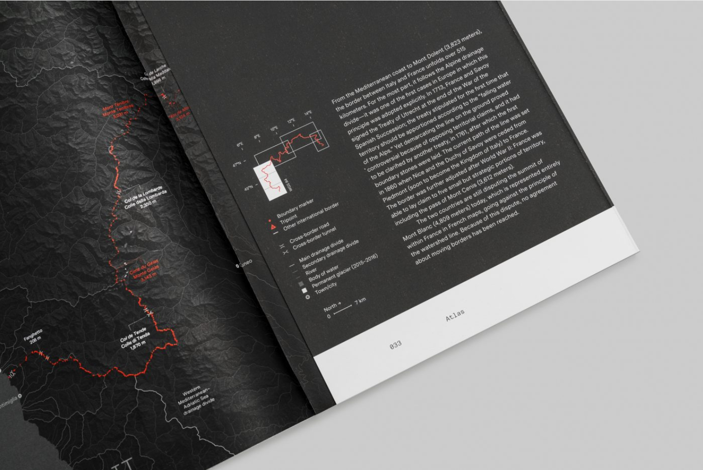

# Final Assignment: A Subjective Atlas

  
*[Jelte Boeijenga, Jeroen Mensink. Vinex Atlas. Cartography & book design by: Studio Joost Grootens. 2008](https://www.joostgrootens.nl/#atlases). See also [this video](https://vimeo.com/55867581) of the work.*

Design an atlas composed of your responses to each assignment from this module sequence.  

In the process of making your atlas revisit each assignment and revise your initial work. Some questions to consider when revising:

- what precedents is the project drawing on?
  - what are some similar or relevant precedent projects that I can draw from for inspiration/guidance?
- what is the core argument or narrative?
  - how might I make the subject/perspective/argument of this map more clear?  
  - how might I make the graphic approach more coherent? more related to the subject of the map?
  - what is the basemap? does it help to orient the reader? does it help to make the argument of the map more clear? if not, can it be re-designed to accomplish those goals?  
- what design approaches are used for the map elements?
  - how is color being used? does it help to convey the narrative of the map?  
  - how are symbols being used? does each symbol convey a unique type of information?  
  - what role does each element of the map play in conveying the argument/narrative of the map? are there any unnecessary elements?  

Assemble your final maps into a single designed PDF booklet (with a designed cover page).  

Please include a thoughtful but (very) concise (1-2 sentence) description of each map.  

  
*[Studio Folder and Andrea Bagnato. A Moving Border: Alpine Cartographies of Climate Change, 2019](http://www.studiofolder.it/a-moving-border-cartographies-of-climate-change)*

## Precedents  

When working on your atlas make sure to seek out many different precedent projects to help inform your work and graphic approach.
Some places to start:

### General Critical GIS/Radical Cartography resources

- [Exhibitions](https://collections.leventhalmap.org/exhibits) from the Norman B. Leventhal Map & Education Center
  - especially [Bending Lines: Maps and Data from Distortion to Deception. Boston: Leventhal Map & Education Center at the Boston Public Library, 2020.](https://www.leventhalmap.org/digital-exhibitions/bending-lines)

- [Rankin, Bill. Radical Cartography [blog]](http://www.radicalcartography.net )

- [Bloomberg CityLab: Maplab](https://www.bloomberg.com/citylab )

- [Link collection + mapping resources from Shannon Mattern](https://pinboard.in/u:shannon_mattern/t:mapping/)

- [kollektiv orangotango+, *This is not an Atlas: A Global Collection of Counter Cartographies*. 2018. Transcript Verlag](https://notanatlas.org/about/)
  - Companion documentary: [*This is not an Atlas: A Documentary on Counter-Cartographies*](https://www.youtube.com/watch?v=T8-GKyy3j6I&feature=youtu.be)

- [Adam Loften & Emmanuel Vaughan-Lee, "Counter Mapping" Emergence Magazine](https://emergencemagazine.org/story/counter-mapping/) on Maps of the Zuni world.

## Making Data from Archives

- [Visualizing Palestine, “Palestine Open Maps,”](https://palopenmaps.org/)

- [Marshall, Bob, Brian Jacbos and Al Shaw. "Losing Ground," ProPublica and The Lens. August 28, 2014](https://projects.propublica.org/louisiana/)

- [David Rumsey Map Collection.](https://www.davidrumsey.com) Large collection of scanned archival maps.

- [Stanford Spatial History Project](https://web.stanford.edu/group/spatialhistory/cgi-bin/site/gallery.php)

- [University of Richmond Digital Scholarship Lab](https://dsl.richmond.edu/)

- Price Fishback et al. "New Evidence on Redlining by Federal Housing Programs in the 1930s". September 2021. Working paper. [New research complicating the narrative on HOLC (aka "redlining") maps.](https://www.nber.org/papers/w29244?utm_campaign=ntwh&utm_medium=email&utm_source=ntwg12). Uses data from University of Richmond.

## Making Data From Observation & Sensing

- [Fawaz, Mona, Dounia Salamé and Isabela Serhan. "Seeing the City as a Delivery Driver: Practices of Syrian Men in Beirut, Lebanon." in *Refugees as City Makers* eds. Fawaz, Mona, Ahmad Gharbieh, Mona Harb, and Dounia Salamé. Beirut: Lebanon. 2018.](https://www.aub.edu.lb/ifi/Documents/publications/research_reports/2018-2019/20180910_refugees_as_city_makers.pdf) **See page 62 of PDF**.

- [*Digital Matatus* 2014-ongoing.](http://digitalmatatus.com/about.html)

- [Prado-Núñez, Viviana. “Boundaries and Border Crossings: On Public Spanish in Washington Heights,” Conflict Urbanism: Language Justice.](http://language-ecologies.c4sr.columbia.edu/seminar/Case-Studies/WashingtonHeights/index.html)

- Kim, Annette. “Mapping the Unmapped: Mixed Use Sidewalk Spaces,” Sidewalk City: Remapping Public Space in Ho Chi Min City. University of Chicago Press, 2015 pp. 100-169. [Book available to view online via CLIO](https://clio.columbia.edu/catalog/11744583?counter=1)
  - See also online: [https://slab.today/maps-2019/](https://slab.today/maps-2019/).

- [House, Brian. "Stalking the Smart City." 2019](https://urbanomnibus.net/2019/05/stalking-smart-city/)

- [Folder. *Italian Limes*. 2014](http://www.italianlimes.net/)
  - [Recorded lecture by Marco Ferrari](https://vimeo.com/268248381)

- [Weckert,Simon. "Google Maps Hacks." 2020](http://www.simonweckert.com/googlemapshacks.html)

- [Berardi, Francesca & Grga Basic. "We Can NYC." 2018](https://canners.nyc/)

- [Troittin, Masson, Tallon. *Usages: A subjective and Factual Analysis of Uses of Public Space*. 2011](http://www.marin-trottin.com/usages)

- [Svarre, Birgitte and Jan Gehl. *How to Study Public Life*. 2013. ebook via Columbia Library](https://clio.columbia.edu/catalog/14098130?counter=1)

- [MIT Sensable City Lab. "Trash Track." 2008](https://senseable.mit.edu/trashtrack/how-it-works.php?id=3)

## Making Data from Satellites

- [Benson, Michael, "Watching the Earth Burn" The New York Times. December 28, 2020](https://www.nytimes.com/2020/12/28/opinion/climate-change-earth.html)

- [Wallace, Tim, Derek Watkins, and John Schwartz. “A Map of Every Building in America.” 2018](https://www.nytimes.com/interactive/2018/10/12/us/map-of-every-building-in-the-united-states.html)
  - Brief technical documentation: [Microsoft/USBuildingFootprints. 2018. Microsoft, 2020.](https://github.com/microsoft/USBuildingFootprints)

- [NASA, "Vegas Sprawl" 1971- 2012](https://www.youtube.com/watch?v=xFzdyxwx50M)

- [Badger, Emily and Quoctrung Bui, "A Decade of Urban Transformation, Seen From Above" Dec. 27, 2019](https://www.nytimes.com/interactive/2019/12/27/upshot/america-from-above.html)

- [Pietrusko, Robert. "Test Sites." ongoing](http://www.warning-office.org/wo-test-sites)

- [Shlomo Angel, Jason Parent, Daniel L. Civco, and Alejandro M. Blei. "Atlas of Urban Expansion" Lincoln Institute of Land Policy. 2012](https://www.lincolninst.edu/research-data/data/atlas-urban-expansion)

- [K.K. Rebecca Lai, Denise Lu and Blacki Migliozzi, "What Satellite Imagery Tells Us About the Amazon Rain Forest Fires" The New York Times, August 24, 2019](https://www.nytimes.com/interactive/2019/08/24/world/americas/amazon-rain-forest-fire-maps.html)

- [Eames Office. *Powers of Ten*. 1977](https://www.youtube.com/watch?v=0fKBhvDjuy0)

- [Begley, Josh, “Officer Involved.” The Intercept. December 30 2017.](https://theintercept.co/officer-involved/)

- [Begley, Josh, “Best of Luck with the Wall.” Field of Vision. 2016](https://theintercept.com/2016/10/26/best-of-luck-with-the-wall/)

- [Cooper, Danika, “Invisible Desert.” E-Flux Architecture. February 5, 2020](https://www.e-flux.com/architecture/new-silk-roads/313103/invisible-desert/)

- Paglen, Trevor. Blank spots on the map: the dark geography of the Pentagon's secret world. London: Penguin, 2009. [Preview available online [here](https://www.google.com/books/edition/Blank_Spots_on_the_Map/oM8u2198DcsC?hl=en&gbpv=1&printsec=frontcover)]

- [Odell, Jenny. "Satellite Landscapes." 2013-2014.](https://www.jennyodell.com/satellite-landscapes.html)

- [Folder. "Uncharted – Footnotes to the Atlas." Oslo Architecture Triennale 2016](http://uncharted.ooo/explore.html)

- [Fattaleh, Nadine and Adam Vosburgh, “Research Towards a New Politics of Care.” Center for Spatial Research. 2020.](https://centerforspatialresearch.github.io/summer2020_research/2020/08/30/supply-chain.html)

## Maps & Narrative

- [Wood, Dennis. "Everything Sings: Maps for a Narrative Atlas." In Places Journal. 2011.](https://placesjournal.org/article/everything-sings-maps-for-a-narrative-atlas/?cn-reloaded=1)([Columbia Library holding](https://clio.columbia.edu/catalog/12408640))

- Solnit, Rebecca and Joshua Jelly-Schapiro, Nonstop Metropolis: A New York City Atlas. California: University of California Press, 2016.  

- [*Bear 71.* Directed by Jeremy Mendes and Leanne Allison and the National Film Board of Canada. [web film]](https://bear71vr.nfb.ca/)

- Mogel, Lize, and Alexis Bhagat, eds. An Atlas of Radical Cartography. Los Angeles: Journal of Aesthetics & Protest Press, 2008. ([Columbia Library holding](https://clio.columbia.edu/catalog/6359214?counter=1) and website with book excerpts [here](http://www.an-atlas.com/))

- [Forensic Architecture's Investigations.](https://forensic-architecture.org/) Many projects, lots of different examples on maps and/as investigations/narratives.

### New York Times Graphics Department map-forward stories

- See [2020: The Year in Visual Stories and Graphics](https://www.nytimes.com/interactive/2020/12/30/us/2020-year-in-graphics.html?searchResultPosition=2) for a compiled list of visual stories from 2020. Not all of these are map based, but many are. At the bottom of the page are links to similar compilations going back to 2012.

- [Serkez, Yaryna. “Opinion | Every Place Under Threat.” The New York Times, October 2, 2020, sec. Opinion.](https://www.nytimes.com/interactive/2020/10/02/opinion/amazon-under-threat.html)

- [Wallace, Tim. 2016. “The Two Americas of 2016.” The New York Times, November 16, 2016.](https://www.nytimes.com/interactive/2016/11/16/us/politics/the-two-americas-of-2016.html)

- [Aisch, Gregor, Benoît Morenne, Josh Keller, K. K. Rebecca Lai, and Sergio Peçanha. 2017. “How the Election Split France.” The New York Times, April 23, 2017, sec. World.](https://www.nytimes.com/interactive/2017/04/23/world/europe/french-election-results-maps.html)

- [Almukhtar, Sarah, and Josh Williams. 2018. “Trump Wants a Border Wall. See What’s in Place Already.” The New York Times, February 5, 2018, sec. U.S.](https://www.nytimes.com/interactive/2018/02/05/us/border-wall.html)

- [Fountain, Henry. 2017. “Alaska’s Permafrost Is Thawing.” The New York Times, August 23, 2017, sec. Climate.](https://www.nytimes.com/interactive/2017/08/23/climate/alaska-permafrost-thawing.html)
  
- [Gillis, Justin, Jonathan Corum, Evan Grothjan, Graham Roberts, Rumsey Taylor, Derek Watkins, and Jeremy White. 2017. “Miles of Ice Collapsing Into the Sea.” The New York Times, May 18, 2017, sec. Climate.](https://www.nytimes.com/interactive/2017/05/18/climate/antarctica-ice-melt-climate-change.html)

- [Koeze, Ella, Jugal K. Patel, and Anjali Singhvi. 2020. “Where Americans Live Far From the Emergency Room.” The New York Times, April 26, 2020, sec. U.S.](https://www.nytimes.com/interactive/2020/04/26/us/us-hospital-access-coronavirus.html)

- [Plumer, Brad, Nadja Popovich, and Brian Palmer. 2020. “How Decades of Racist Housing Policy Left Neighborhoods Sweltering.” The New York Times, August 31, 2020, sec. Climate.](https://www.nytimes.com/interactive/2020/08/24/climate/racism-redlining-cities-global-warming.html)
