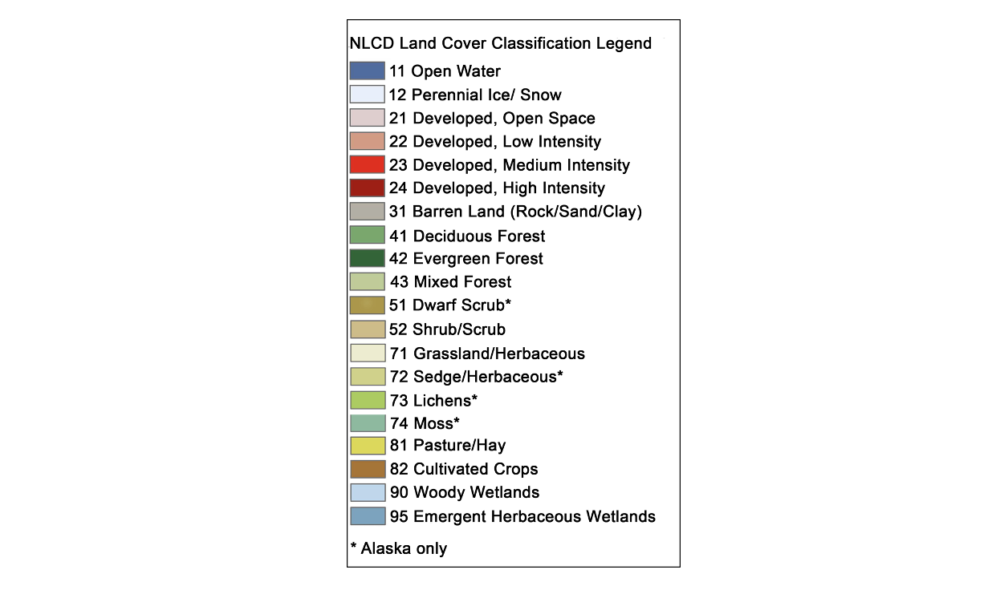
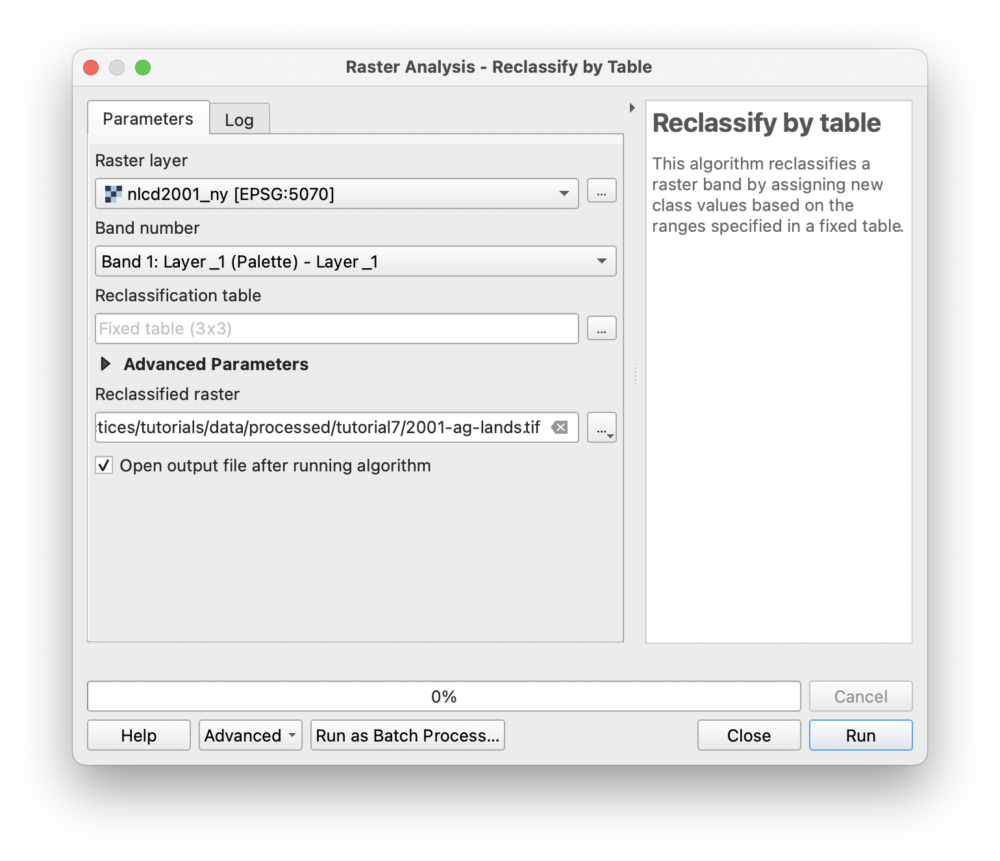
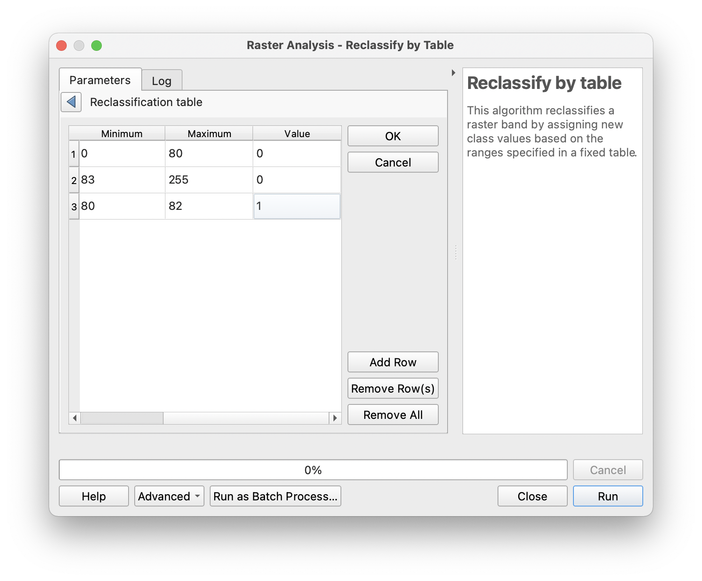
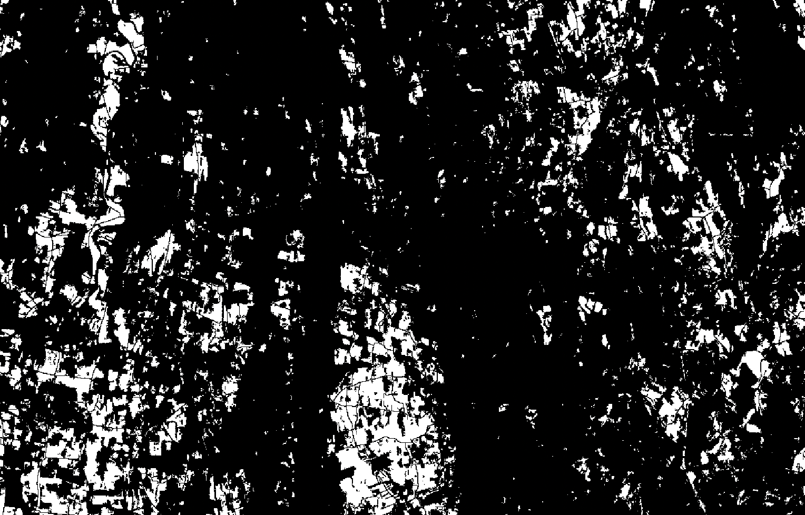
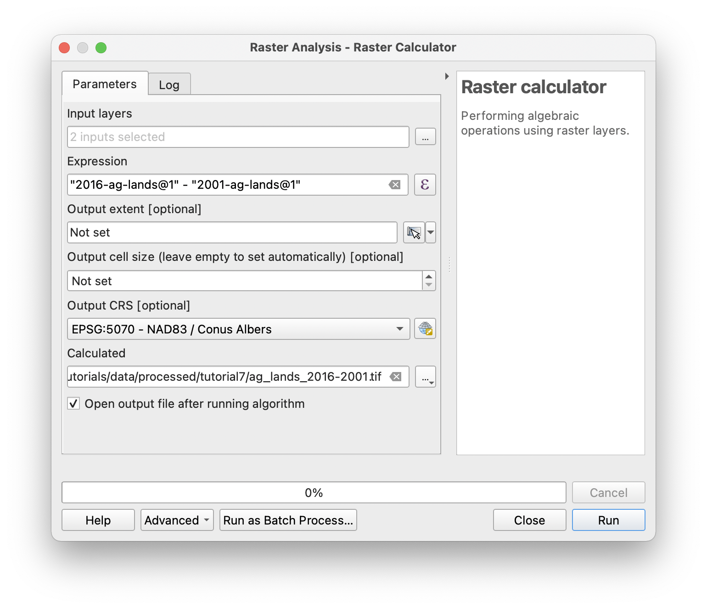
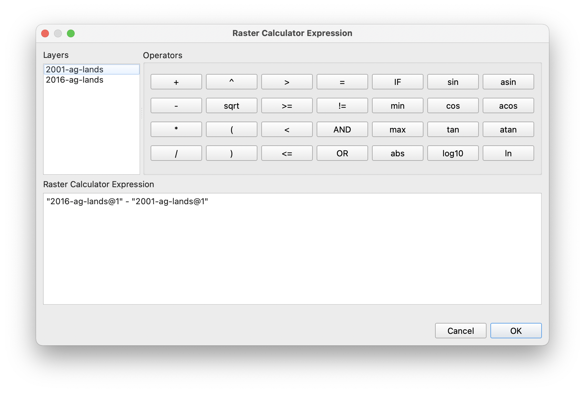
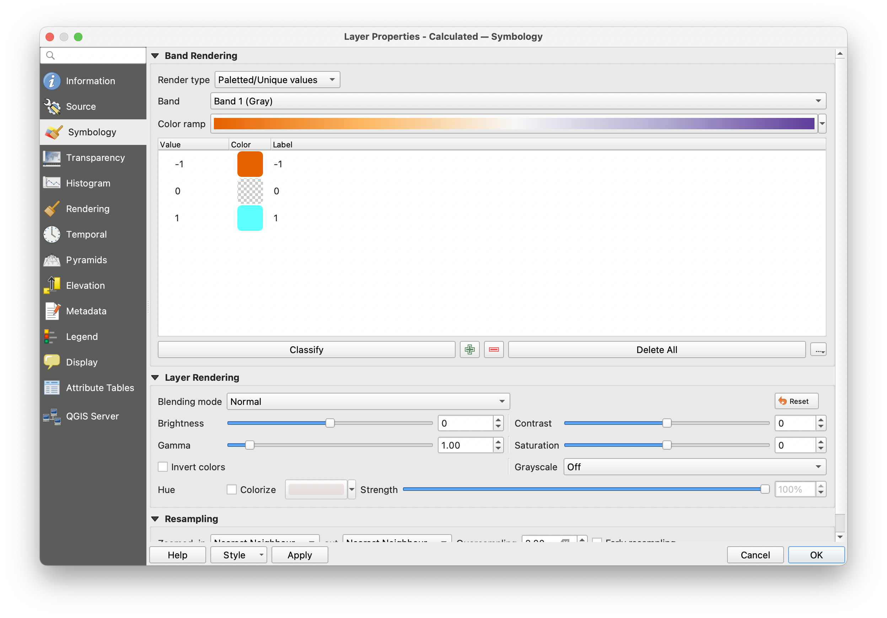
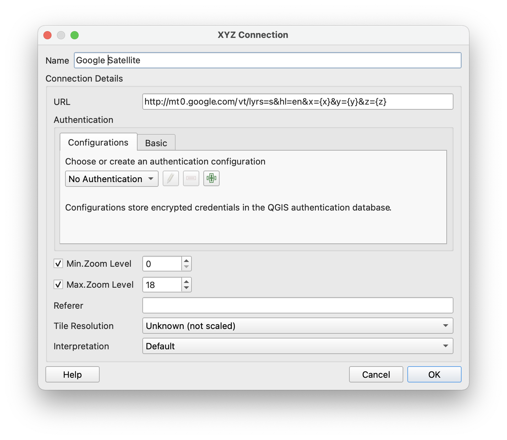

## Mapping change

In this tutorial you will use land use land cover raster data and raster math operations to map change in agricultural lands in New York state between 2001 and 2016. 

## Data downloads
Begin by dowloading the following two datasets. These are two raster datasets that depict land use categories for New York State, as classified from remotely sensed information. 

- [NY State Land Use Land Cover Raster for 2016](https://cugir.library.cornell.edu/catalog/cugir-009031)
- [NY State Land Use Land Cover Raster for 2001](https://cugir.library.cornell.edu/catalog/cugir-008002)

## Exercise

Open a new QGIS project and add the two land use land cover datasets. 

### Reclassify rasters

You will create a map of change in the amount and extent of agricultural land between 2001 and 2016. 

To do this you will first reclassify each of the raster datasets so that all agricultural land has a value of 1 and all non-agricultural land has a value of 0. 

First take a look at the metadata describing what land use type each value in the land use land cover raster corresponds to. This is provided with each of the years of data that you downloaded and is shown below. Notice that values of 81 and 82 correspond with Pasture/Hay and Cultivated Crops. These are the two categories we will focus on in this tutorial. 

Open the `Processing Toolbox`. Search for `Reclassify by Table` or expand the `Raster analysis` section and find the `Reclassify by Table` tool. 

Launch the tool. Then select the raster you wish to reclassify. Specify where you would like to save your reclassified raster dataset. Then use the `...` button to open the reclassification table menu. 

Define a reclassification table so that values associated with agricultural lands are set to be 1, and all other values are set as 0. 

Your results should appear on your map as a raster dataset with values of 0 or 1. Values of 1 indicate that the area either belongs to the Pasture/Hay or Cultivated Crops category.

Repeat the same process for the second year of data. 

### Raster math

Next you will identify areas of change in agricultural lands between 2001 and 2016 by subtracting the two reclassified rasters. 

Open the `Processing Toolbox`. Search for `Raster calculator` or expand the `Raster analysis` section and find the `Raster calculator` tool. 

Select the two reclassified rasters as the input layers. Select a location to save your resulting output raster layer. Then select the epsilon to write your expression. 

In the calculator menu that appears construct the expression shown below to subtract the two raster datasets from one another and create a dataset showing change in agricultural lands. By subtracting 2001 agricultural land from 2016 agricultural land values of -1 in the output will correspond with loss of agricultural areas, and values of positive 1 will indicate new agricultural areas present in 2016 that had other land uses in 2001. 

### Symbolize

Open the output raster's layer property menu and change the symbology for `paletted / unique values`. Click `Classify` and then select a color ramp. You may choose to adjust the symbology for all 0 values to be transparent by right clicking on the color square for that value and selecting `Change opacity`. 

To visualize your areas of change in agricultural lands in context add Google-provided true color satellite imagery to your project by adding a new XYZ Tiles layer with the following URL: `http://mt0.google.com/vt/lyrs=s&hl=en&x={x}&y={y}&z={z}`

Pan and zoom to find areas with a high amount of change in agricultural lands. 

