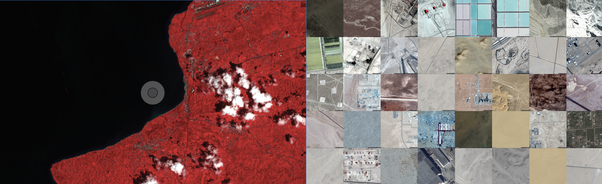

# Sequence: Introduction to Geographic Information Systems in QGIS

## Sequence Summary

This sequence of modules introduces key methods within geographic information systems (GIS) through hands-on work in the open source software platform QGIS.  

## Why?

Maps and geographic analysis are key tools for interpreting the built and social characteristics of cities. Thoughtful uses of spatial data can expose invisible patterns, and can change the way we see and engage with our world. However, maps are never just representations, they are always active in shaping the worlds they describe. With this in mind, the modules introduce approaches to gathering, visualizing, and interpreting spatial data as a starting point in the design process.

## Modules

- Mapping Where
- Print Layouts and Cartographic Design
- Making Data from Archives
- Making Data From Field Observations
- Making Data from Satellites
- Making Data from Aerial Imagery
- Making Data from Street View
- Final Project: A Subjective Atlas

*Examples from this sequence: Tree canopy of Manhattan and parts of the Bronx, Queens, and Brooklyn. Streams of Upper Manhattan in 1874*  

## Modules overview/sequence

- **Mapping Where**  
    This module covers the basics of working with raster and vector spatial data within QGIS. After completing this module you will learn how to load datasets into a new QGIS project; modify coordinate reference systems; manipulate layer symbology based on attribute information; carry out spatial selections; and perform basic (but powerful!) spatial joins.
    These concepts will be introduced through a series of studies of the trees of New York City.  
- **Making Data from Archives**
    In this module you will learn techniques for creating spatial data from archival sources. In it we will cover how to georectify raster datasets (in this case a scanned paper map), giving them geographic coordinates based on reference data. Then the module will cover how to outline and trace features to create new vector-based data from those scanned materials, this is a process we call digitizing.  
- **Making Data From Observation & Sensing**  
    In this module you will be introduced to basic methods for field data collection through designing a method for recording information about your surroundings. Using the GPS capabilities of your cellphone you will turn this information into data that you can work with in GIS environment.  
- **Making Data from Satellites**  
    This module will introduce you to multispectral satellite imagery, and to the process of visualizing phenomena through 'false color composites'.  
- **Making Data from Aerial Imagery**  
    This is an introduction to batch downloading true color satellite imagery/aerial photography using the Google Static Maps API.  
- **Making Data from Street View** 
    THis is an introduction to batch downloading ground photographs from the Google Street View API.
- **Final Project: Urban Atlas**  
    Instructions and precedent projects to develop an atlas of your mapping assignments thus far.

*Examples from this sequence: false color composite using the Landsat satellite. A grid of extraction sites obtained through Google's static maps API.*  
