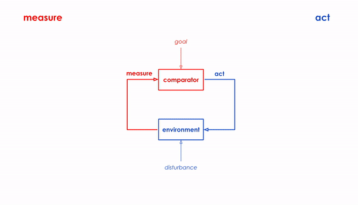

TK
 

Concept from cybernetics about measurement and feedback.

Take a stance that we should see buildings as ongoing living systems to be designed and changed. How should standards continually adapt?
Architects have this long problem - when they design buildings they have to wait decades before they understand how it all pans out - so they use models to predict how a building or neighborhood will behave
But you can’t really program and deploy changes to smart home products so quickly - you need to have immense programming experience to build something like an Amazon Echo
Arduinos however are much easier to program - they are much easier to understand and program
Finally microservices like IFTTT allow you to program and prototype applications in human readable language

Whats interesting about this to me is that Individuals can deploy and test changes that will immediately influence their behavior

Where it once required a monolithic application to program something
Now with “End User Programming” you can just prototype something on the fly with a short sentence that is strung together to longer programs
This can fundamentally change who has agency.
