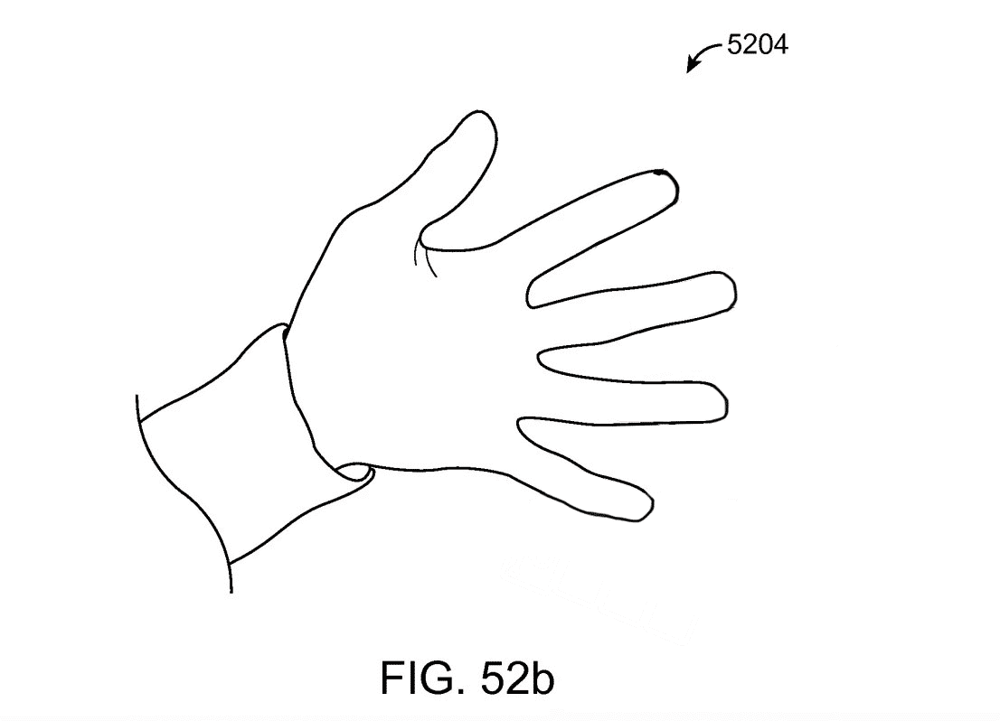
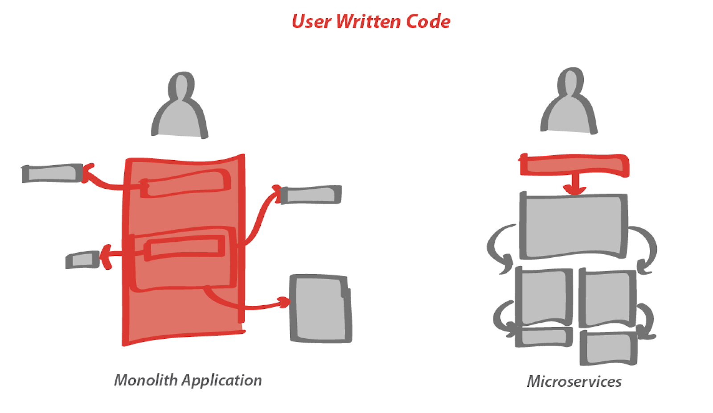

# Sequence: Ambient Computing

## Sequence Summary
**Ambient computing** broadly refers to devices that are embedded in an environment and networked together and context aware i.e. pick up cues from the environment to create seamless experiences. Related to **internet-of-things** and **tangible computing**, ambient computing focuses on computing that blends with the environment to prioritize human centered experiences that don't separate the human from the environment.

This sequence of modules introduces concepts of ambient computing including interactivity in [Processing](https://processing.org/), a common programming environment for interactive art. You will learn how to use Processing to create interactive and user interfaces that are spatial. You will learn how to connect Processing to smart home products and web apps using Webhooks; how to work with sound and speech with a microphone and speakers; how to work with Processing Libraries; and how to track the movement of objects and people via a webcam.

*Diagram of a smarthome*

## Why?
### Ambient Computing - Physical and Digital Worlds Intertwined
As computers get smaller and less expensive and cloud computing allows functionality between devices, ambient computing will be the most pertinant mode of computing in the near future. They are particularly important to spatial designers, the designs of homes and cities as they are concerned with how our digital interactions relate to physical space and social contexts. But what is vs isn't ambient computing? So much of our interactions with technology occur in physical space. Ambient computing has two main properties to be aware of. First it is networked, and second it is embedded.

**Networked (context, profile-based)**   
Smart home products, wearables, Amazon Go Stores, and mixed reality all fall within ambient computing with the importance being on devices that are in the environment and thus **networked** with other devices (often the cloud) so that these devices can make **contextual decisions** (who you are, who your with, where you are, when it is, etc). The fact that the devices are networked allows decisions **based on an individual user profile** - i.e. your user profile on Amazon web services is information used by a Amazon echo device to make decisions about your preferences. Beyond these examples the rise of remote work has put increasing pressure on **profile-based** computing where a worker can access their individual work setup with their profile and preferences regardless of where they work. 

*network diagram*

**Embedded (spatially, bodily)**  
Consider that today's UIs (User Interfaces) are often apathetic to spatial context. An instagram feed on your phone doesn't have any context about whether you are commuting on a train with strangers or at home alone on your couch. Adiitionally the strangeness of today's UIs is that they are not very physical. Before digital inventions, mechanical interfaces were physical and bodily. An oven has dials and knobs that take up physical space, so that when you interact with the oven you are not estranged from your environment. In contrast, dialing into a zoom call, one can be completely disembodied from their environment. You may forget that you are even sitting at home doing remote work while in a video call. What if we created new modes for communication where people were not required to actively stare at screens? Could we leverage ambient devices to make interactions that are tangible? In 10 years time, I hope we’re not all still buried in our phones or locked to video calls. I can’t imagine that’s possible with this suite of technologies burgeoning with spatial potential — it’s only a matter of time and the desire to move beyond the screen. Tech that acknowledges our bodily, social, and physical reality is critical if we want a future where we are awake and tuned in to our world.

What would happen in a world that preferenced **Spatial Interfaces > User Interfaces**?
  
*example patent drawing*

### Ethical Questions for Today's Designers   
Todays designers will have to grapple with the ethics of designing for these context aware systems. What kind of permissioning should be allowed on smart home technologies that are typically set up for individual profiles but impact many people who live in the home with the smart device? How about a visitor who comes to a friends house with a smart home nanny cam with computer vision? Should the visitor have to consent to being recorded and tracked? Designers with have to consider **governance of groups** and what is consent in group spaces? They will need to consider the ethics of privacy and tracking. They will need to consider how invisible or obvious ambient devices should be. Does every sensor require a sign to promote transparency i.e.: a camera with a sign reading "you're on camera"; a humidity sensor with a sign reading: "this is a humidity sensor owned by the local weather station used for daily weather reporting". How **predictive** should ambient systems be? Is it ethical for devices to make decisions based on guesses about what the user will want?

Designers that can understand the complexity of networked devices as well as understanding the social responsibility of their design systems can have the tremendous impact on the world.

Rather than one-person, one-computer, we can think about whole groups sharing experiences. We can design whole environments (rooms, public plazas) to have the intelligence of our computers, rather than individualized computers having such intelligence. This is a big opportunity to change the way people interact with technologies. Consider the social impact of devices structured around the individual rather than the group. Consider this scene: a family sitting around a television together vs a family where each individual is on their own device (phones, ipads, computers). How does individualized technology impact relationships? Designers should think about long term societal impacts of the behavior change their technologies influence. If they do not, who will?

What would happen in a world that preferenced **Social Experiences > User Experiences**?

**The Rise of End User Programming and Low Code**   
Ambient computing often relies on microservices, or small applications and web services that are easily tied together into more complex functionality through the internet. What's so critical about low code environments is that they change the who and how easily someone can control the digital layers of space. Its important to recognize these are the governing and maintenance layers of physical space.  

 
*Microservice Architecture* 

  
*microservice "low code" sentence structure*

### Example Student Projects Using Ambient Computing   
The following are example student projects from a course called Measuring the Great Indoors co-taught by Gaby Brainard and Violet Whitney.

<iframe src="https://player.vimeo.com/video/705148926?h=3f0fef7dcb" width="640" height="564" frameborder="0" allow="autoplay; fullscreen" allowfullscreen></iframe>

[Synchronized Wallpaper — Daniel Chang, Yanan Zhou, Enrique Bejarano](https://vimeo.com/705148926)   

<iframe src="https://player.vimeo.com/video/705149312?h=0aad7723dc" width="640" height="564" frameborder="0" allow="autoplay; fullscreen" allowfullscreen></iframe>
[Projecting the Great Outdoors, by: Tianyu Yang, Alec Harris, Maria Berger](https://vimeo.com/705149312)

## Modules
[Intro to Processing](171-Intro-to-Processing-Lighting.md)   
[Webhooks](172-Webhooks-Connecting-IFTTT-and-Processing.md)   
[Sounds, Speech and Macros](173-sounds-speech-and-macros.md)   
[Markers and Tracking](174-Markers-and-Tracking.md)   
[Computer Vision](175-Computer-Vision.md)   

