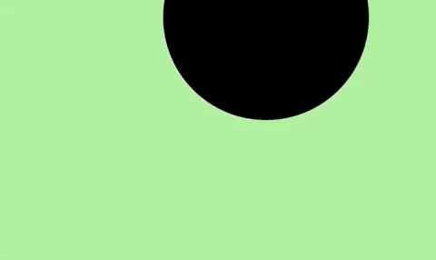
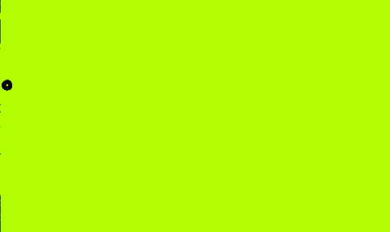

# Sequence: Ambient Computing: Interactivity
## Sequence Summary:
This sequence of modules introduces concepts of ambient computing including inclding interactivity inside of Processing. You will learn how to use Processing and create an interactive sketch. You will learn how to connect Processing to Microservices using Webhooks; how to work with sound and speech with a microphone and speakers; how to work with Processing Libraries; and how to track the movement of objects and people via a webcam.
## Why?
ambient computing 
low code prototypeability
interactivity

Ambient computing - the breakdown of separation between the computer and your environment - including XR
this moment of remote - telepresence and ability to communicate seamlessly between locations
ability to not leave your environment means ability to flip the notion of personalized devizes. Rather than one-person, one-computer, we can think about whole groups sharing experiences. We can design whole environments (rooms, public plazas) to have the intelligence of our computers, rather than individualized computers having such intelligence.
Whats at stake? Importance of breaking down the unintended consequences of individualized computing, 
Concepts designers must think through - permissioning (governance of groups), ethics of privacy and tracking, what is consent in group spaces?


## Modules:
Intro to Processing
Webhooks
Sounds, Speech and Macros
Markers and Tracking
Computer Vision

Ambient Computing:
===========================================

# Interactivity - Intro to Processing 
## Module Summary
In this module you will get an intro to the Processing environment, build a simple sketch and learn how to find, understand, and use Processing Documenation in your own sketches.

## Conceptual Introduction, or: Why is this interesting / important?
Processing is a flexible software sketchbook and a language for learning how to code within the context of the visual arts. Its an especially great environment for ambient computing because it will allow you to prototype projection mapping that responds to interactive inputs like (a web cam, markers, or a multitude of triggers from the web). Many artists choose to work with Processing because of its visual interface and its simplicity. Processing can be a great environment to prototype user interfaces, tie together IOT devices, and work with interactive audio.

Below are some examples of artists using Processing in their own work:


## Tutorial

1. **Download Processing.**  
Place [Processing](https://processing.org/download) in the Applications folder on your computer (or Program Files for Windows). When you double click Processing, it should install and launch the application with a new empty sketch. A sketch is where you will write your code. We’ll be writing code in Java inside of Processing.

2. **Basics**  
Processing includes 
   * a text editor - where you write your code (called a "sketch" in Processing)
   * a compiler - translates code written in a high-level language into a set of machine-language instructions that can be understood by a digital computer's CPU 
   * a display window - where visuals created by your sketch are displayed


You will have two basic parts within a Processing "sketch", the **“setup”** and the **“draw”** loop. The setup loop runs once when launching your script, whereas the draw loop runs repeatedly. This allows you to save computing power by sticking parts of the code that only need to run at the start in the setup loop. The draw loop will continually update so it can change over time, or get realtime information such as the location of your mouse or update a camera feed.

```
void setup() {
  size(1280, 960);
}
  
void draw() {
  background(0);
  ellipse(mouseX,mouseY,500,510);
}
```

VIOLET EXAMPLE INSERT HERE - draw and setup in action

3. **Documentation Intro**  
The basis of learning to code is really about learning how to find and use information (usually online). Rarely does anyone know off hand the exact syntax and operations to write all of their code from scratch. Rather, creative technologists and even seasoned software engineers regularly use the documentation pages for a programming language or a development environment to understand how a particular programming language functions, its operations, and so they can borrow from what's already written.
You can find Processing's documentation here:
[Processing Documentation](https://processing.org/reference/)

4. **Using Documentation**  
If we look around within Processing's documentation, we'll see all kinds of operations and parameters we can use in our code. So much possibility! Poke around and click into some of the functions you see. Lets look into `background()`. You'll see if we click into [background](https://processing.org/reference/background_.html) we'll get information on how to use this function, what parameters it expects, and some examples. It looks like it takes a single number `background(51);` for a value between black and white, or 3 numbers `(background(152,190,100);` for RGB values.


**CHALLENGE**  
Can you change the background to yellow?


Here are some other fun functions to play with in your sketch.
```
fill()
noFill()
stroke()
brightness()
color()
hue()
saturation()
```

**CHALLENGE**  
Can you change the fill and stroke of the ellipse?

5. **Understanding the Draw Loop**  
Remember the draw loop runs continuously so you can build interactive functionality. Lets take advantage of this to see other ways we can get our ellipse on the screen to move. You can think about your sketch as one long algebra formula where substitutions can be made to the code. Most locations where you see `()` accept parameters that are specific to the function. Remember the "R,G,B" number values we added as parameters to our `background()` function.
To make the ellipse move we can edit its `x` and `y` parameters. [Let's look up what parameters the ellipse accepts](https://processing.org/reference/ellipse_.html). Looks like its syntax is `ellipse(x-coord, y-coord, width, height)`	where each of those parameters is a number (a float to be more specific).

`x` moves each `second`             |  `width` and `height` grow each `second`         |  `width` and `height` grow each `millis`
:-------------------------:|:-------------------------:|:-------------------------:
  |    |  


**CHALLENGE**  
With the help of the tutorials above, please create you own combination of colors, shape, time, Processing’s movie input, and video camera input to create your own lighting phenomena. Please also use one new function not referenced in this tutorial from the Processing Documentation, such as `text()`.

Document your lighting effects through videos and gifs. Extra bonus points for testing some light projection with a projector! Can you play with aspects of the room to get your projection to align with the space?

* Some other useful tips
   * If you are looking for more examples — you can find some great things to try under `File` > `Examples`. This brings up a lot of various examples which you can play around with and learn how different bits of code are functioning.
   

**TIPS & TRICKS** 
   ```
   //these two slashes create a comment in your code
   ```
  `print()` allows you to see the values of a parameter in the console. For example, if you add this `print(second());` in the draw loop, you will see a continual update in the console of your second parameter. Give it a try! 
