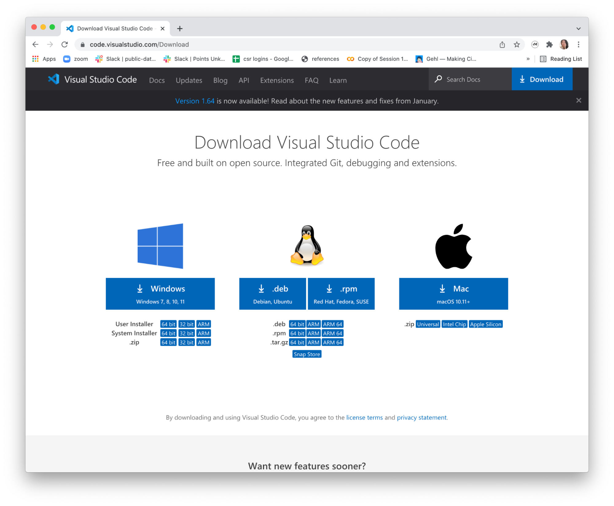
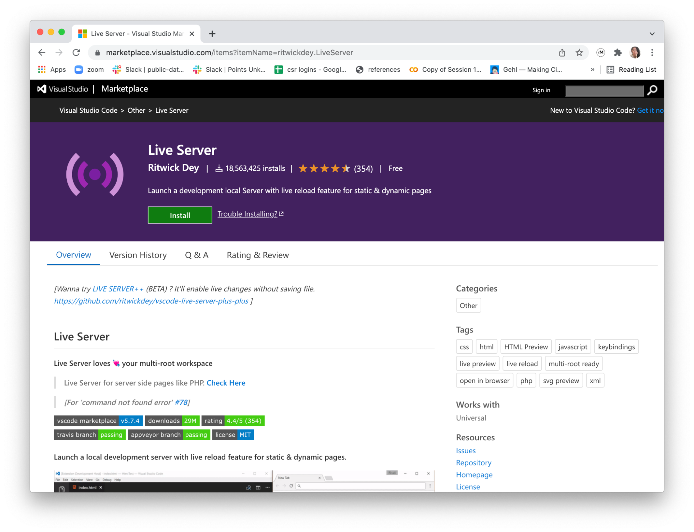
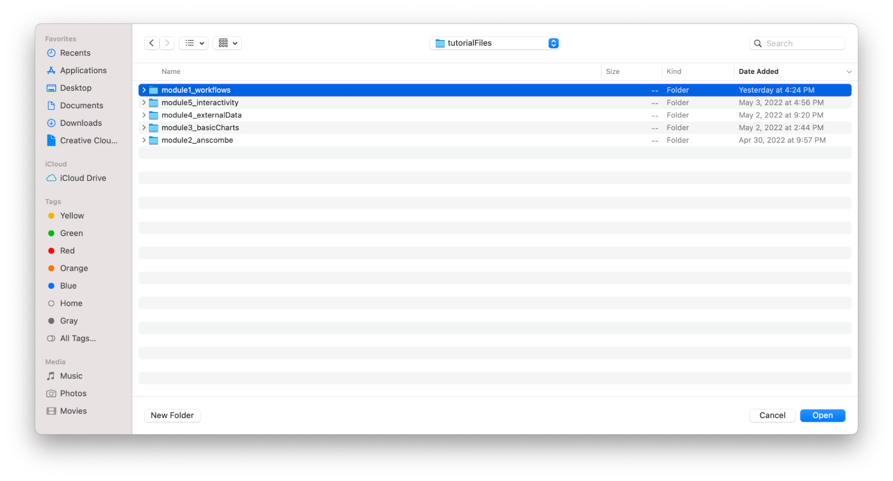
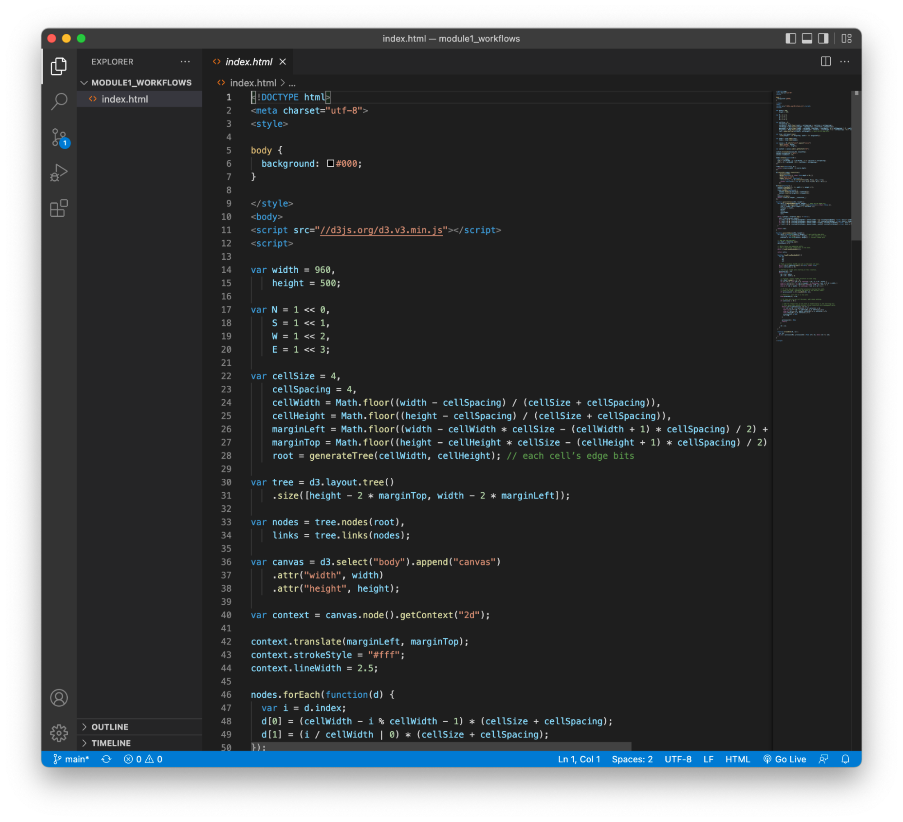
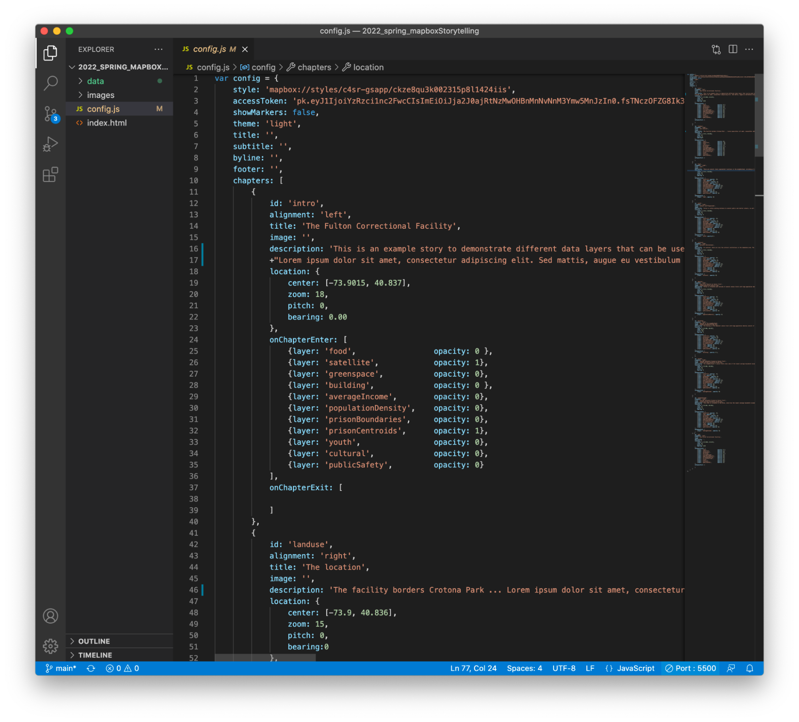

**Introduction**

There are many different ways to set up your workspace to start programming for the web. If you have a favorite text editor and method to run the local server, perhaps directly from the terminal, please feel free to do so. For the purpose of this class, we will use visual studio as our text editor, and its live server extension to run the local server to view our code in the browser. In this short tutorial, you will download and install the software necessary to run javascript code on your local server. This is the work environment we will be using for the rest of the modules.

**Step 1 Download and Install Software**

Visual Studio Code: [https://code.visualstudio.com/Download](https://code.visualstudio.com/Download)

And Live Server (extension for VS): [https://marketplace.visualstudio.com/items?itemName=ritwickdey.LiveServer](https://marketplace.visualstudio.com/items?itemName=ritwickdey.LiveServer)

**Step 2 Download Example Files**

Go to [https://github.com/CenterForSpatialResearch/fall2022_data_visualization](https://github.com/CenterForSpatialResearch/fall2022_data_visualization)

Click on the green “Code” button and select “Download ZIP”

 

Unzip the downloaded contents and save to somewhere you will be storing your project (usually Documents).

**Step 3 Open downloaded files in Visual Studio Code**

Open Visual Studio and click on “Open Folder” or go to “File” and select “Open Folder” Navigate to the folder  you downloaded and unzipped earlier, and select the **module 1 folder** inside to open.

The file browser panel on the left hand side of your Visual Studio window should list the same items as if you view the project folder in the finder. In this case you should see index.html as the only file in this module.

**Step 4 Run your code in the browser**

Click “Go Live” on the blue bar at the bottom of the window

The Go Live text will change to “Starting” and then to show a port number.

This is the local address where your webpage will be shown

A browser window will popup automatically to show our webpage. You can also view the webpage by opening a new browser window and going to the address “http://localhost:” plus the port number displayed in your window. In the case above, our port is 5500, so the URL in the browser would be: http://localhost:5500/

You should see an animated version of the image below if the server is running properly. You are now ready to code and test your code on the web.

**Sidenote**

This animation a very early example of d3, written in d3 version 3, and dates all the back to before 2017. I love to use this example to test our server because it is an apt illustration of the power of representation. The maze and tree represent the same information, yet the orientation changes our perception of it drastically. The charts we will be building are visually less complex, the transformations less dramatic than shown here. However, through different chart types and graphical strategies, we will essentially be doing the same with our data throughout this sequence.

**Recap**

Please remember these same steps to start your coding projects each time.
1. Open visual studio code
2. Open the folder you are working on
3. “Go Live”
You are now ready to work on your code
