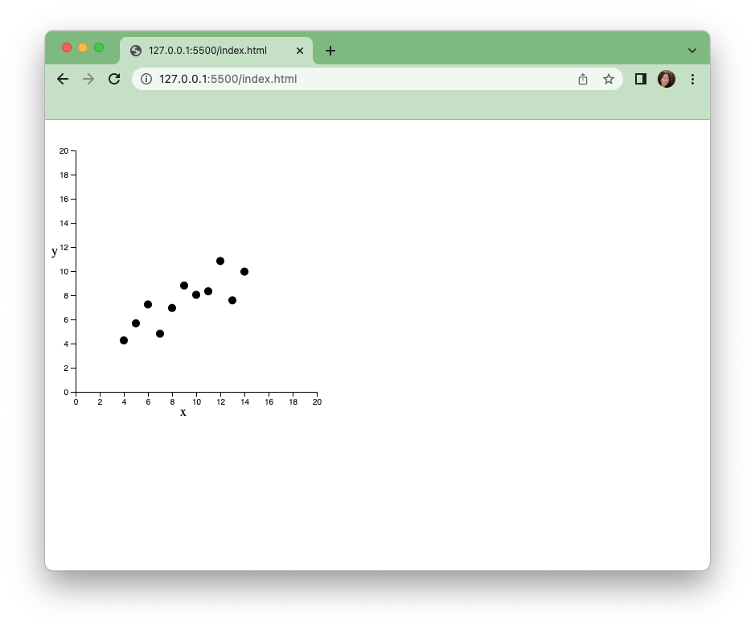
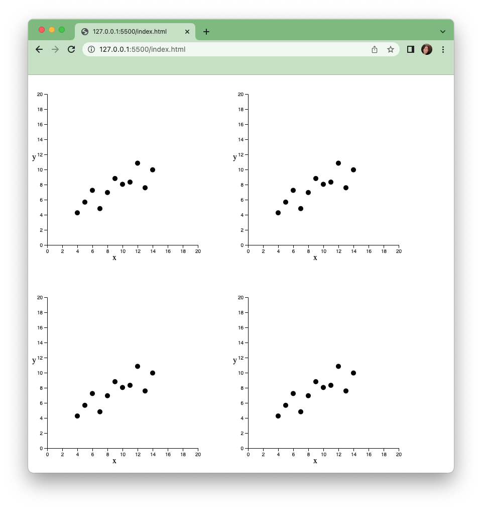

**Introduction**

In this module you will be introduced to working with d3.js and create a simple graphic whose dimensions are determined by a famous dataset. 

Anscombe’s quartet contains 4 datasets with identical descriptive statistical qualities but different distributions. It is often used to illustrate the importance of exploratory visualization and statistical graphics. Although you don’t need historical knowledge of Anscombe, if interested, you can read about it here: https://en.wikipedia.org/wiki/Anscombe%27s_quartet

In this tutorial we will start with 1 set of this famous historical quartet to make our first chart - a scatter plot. Then we will replicate the chart by encapsulating our code into a function to produce 3 more scatter plots to complete the visualization quartet.

**Prerequisite:**

Intro to HTML, CSS 

**Step 1. Setup**

Download the files for module 2 from the fall 2022 course github repository.

[https://github.com/CenterForSpatialResearch/fall2022\_data\_visualization/tree/main/](https://www.google.com/url?q=https://github.com/CenterForSpatialResearch/fall2022_data_visualization)

Inside module2_anscombe you will find the 3 files below:

**Index.html** - This is where the structure of our webpage will live. We will create “div” objects by hand inside this html file to place our charts. **To start, this is a blank template.**

**D3.js** - this is the d3 library file, we are using version 6. We will not be altering this file at all. We will link this file to our html file so that we can access its contents and use d3.js methods.

**anscombe.js** - This is the file you will write your javascript code in. It will be linked to your Index.html file in the same way as the d3.js library file. **To start, this file is blank.**

Open the folder with Visual Studio Code. Go to “File” menu in Visual Studio Code, and then clicking on “Open Folder”, or simply by dragging the folder to the application’s icon.

Click the “Go Live” button on the lower right corner of the file window. 

This will open a new browser window with your index page already loaded. Since we have not written any code yet, the new browser window will simply say “this is a blank page”, as it is written in our index.html file.


**Step 2. Link Files**

To Start, let’s erase the words this is blank page from our html. 

Next our index.html file needs access to both the d3 library and the code that we will write ourselves. This is done by creating 2 references within the head section of index.html, for d3.js in the head section of the page, and for anscombe.js in the body section.

```
    <script src="d3.js"></script>

    <script src="anscombe.js"></script>
```


**Step 3. A Simple SVG Drawing**

Now that we have access to all of d3’s methods, we can start writing code in our own javascript file (`anscombe.js`). 

Drawing and manipulating svgs, or scalable vector graphics is one of the most useful tools that dD3 provides. These vector graphics are the same as those generated by Illustrator, but we are using code and data to do so instead of drawing by hand. In more advanced projects, you can export vector graphics from Illustrator to be further edited with d3 code.

Think of the svg as a canvas that we insert into a html div element. 

If we were working with just HTML, we would define a svg that is 400x400 within a div element by placing the svg directly within the page, somewhere inside the body section of the HTML structure.


```
<svg width="400" height="400"></svg>
```


In d3 code, we would insert that same svg into the body of the page as such:


```
var svg = d3.select("body")
   .append("svg")
   .attr("width",400)
   .attr("height",400)
```
In the browser, nothing would have visibly changed. The svg is a blank canvas and not visible. Go to the web inspector and click on the elements tab, a svg should appear within the body section (highlighted in light blue below).


Let’s draw a simple circle on our svg. Dot notation is used to chain lines of code together in d3 - you already saw this above with the creation of the svg. We will follow a similar pattern to create a circle. First we append the circle to our svg variable, then we set its attributes. A circle is defined by a minimum of these 3 attributes, “r” for radius, “cx” for the x coordinate of its center, and “cy” for the y coordinate of its center.

```
svg.append("circle")
.attr("r",5)
.attr("cx",20)
.attr("cy",20)
```

Now you should see a circle appear on the page.


And this is our first SVG drawing using d3. Not very exciting yet, so let’s continue using the same pattern and create a chart by adding some data.


**Step 3.The scatterplot**

A scatterplot is simply a set of circles where the x and y coordinates are determined by attributes within a dataset. For our example, we will be using the first dataset from Anscombe’s quartet. Here is that data as a variable called “set1”. Copy and paste this variable in its entirety into your javascript code at the very top of the file.

```
var set1 = [{x:10,y:8.04},{x:8,y:6.95},{x:13,y:7.58},{x:9,y:8.81},{x:11,y:8.33},{x:14,y:9.96},{x:6,y:7.24},{x:4,y:4.26},{x:12,y:10.84},{x:7,y:4.82},{x:5,y:5.68}]
```

Here is a quick review of data structures in javascript. The set1 variable we are using above is a list(array) of 10 objects. Each object has an index in the array, starting with 0. Each object is made of 2 key and value pairs. The keys here are “x”, and “y”. The values are the corresponding numerical values for x and y. 

So to get the value of the first item in set1, we would write set1[0], this would yield us {x:10,y:8.04}

If we print out this first item to the developer’s console by writing:

```
console.log(set1[0])
```
We would see the below in the developer’s console:


If we would like to access the x value of the first object within set1, then we would get the first object using the index 0 again, and then use the key “x” to access that value.

We can use dot notation


```
console.log(set1[0].x)
```

Or we can use square brackets once again, by placing the x in quotation marks. X is in quotation marks here because we are using it as a string in the context of a key, and not a variable.

```
console.log(set1[0]["x"])
```
These both work to access the value 10 by itself and print it out to the console.

Now that we have the data for set1, and have reviewed how to access values within it, let’s start building our d3 chain and our scatterplot.

We start once again with a selection, then we will set the data as set1, and attach circles to it.

```
svg.selectAll("circle")
.data(set1)
.enter()
.append("circle")
```


Svg is the canvas we created in step 2, which we will be placing our circles on, so we are starting with it. We are selecting circles to create an empty selection in which to place our circles. This is a bit counterintuitive, but something you will quickly get used to in d3 syntax.

.data(our dataset here) counts and parses the data we want to use. In this case, we are using set1. Set1 is an array with 10 objects in it, therefore everything past this point is done 10 times, 1 for each item in the array.

.enter() binds the elements you will create to the data you have chosen above.

.append(element)

We are appending circles for a scatterplot in this case, but you can append anything from HTML paragraphs, to jpeg image tags. 

Now if we look at the page, nothing will be on the page itself, we will not see circles. That is because we have not set the radius, cx, and cy for these circles. However we can check that they are there by opening the developer’s console and expending the svg section in the elements tab. We can see that there are 10 circle elements in our svg. Next we will set their attributes so that they are visible.


Let’s add the following to our chain:

```
.attr("r",5)
.attr("cx",function(d){
   return d.x
})
.attr("cy",function(d){
   return d.y
})
```

Here we are setting the radius of each of our 10 circles to 5 pixels. And we are setting the circle’s x and y values to the x and y values of each of the objects in set1.

In our developer’s console’s elements tab, we see that the circle elements inside the svg now has r, cx, and cy attributes set for each one, and we can check that the x and y values do in fact correspond to our dataset set1.


Now let’s go to our browser window. We can see the circles on the page, although they are very close together in the very upper left corner. 


Why is that? The x and y values we used here are directly translated to pixel values on the screen, which means that the first circle is placed only 10 pixels to the right and 8 pixels from the top of the window.  In fact, all these values are too small to be drawn directly without scaling. You will find that it is often the case that values need to be scaled up or down to be visually legible on the screen. Next we will implement a d3 scale to solve this problem.

**Step 5 Scale**

A d3 scale take a set of values as input, and scales them to a different set of values that are more suited for a specific visualization. In this case, we are scaling numerical values that are between 4 and 14 to fit our svg which has the width and height of 400 pixels. D3 has different types of scales, but in this example we will start with a linear scale.

We declare a variable as a linear scale.

```
var xScale = d3.scaleLinear()
```


Then we set the input and output of that scale, these are the domain and range.The domain(input) is the extent of values found in your dataset, and the range(output) is the set of resulting values you would like to use for your visualization. Let’s add those to our scale.


```
.domain([0,20])
.range([0,300])
```


For the y scale, we will do something similar, but this time, our smallest values will map to 300, because we want the smaller y values to be at the bottom of our chart.


```
var yScale = d3.scaleLinear()
.domain([0,20])
.range([300,0])
```


 Now we apply the scale by calling it on specific values, in our case the d.x, and d.y values we are using in drawing our circles like below.


```
.attr("cx",function(d){
   return xScale(d.x)
})
.attr("cy",function(d){
   return yScale(d.y)
})
```


Now looking at our browser window, we have a clearer view of the circles and the main portion of our first scatterplot is complete.


**Step 6 Axis and Labels**

No chart is complete without references to scale and labeling. Let’s add those next. D3 has builtin functionality to create the axis. We start by declaring a variable for the x axis and the y axis.
```
var xAxis = d3.axisBottom().scale(xScale)
```
Every axis needs 2 things, its orientation(left, right, bottom, top) and the scale it uses. 

In our case, our xAxis is on the bottom of the chart, so we will use axisBottom, and we will be using the scale variable we already created to place the circles here. 

Similarly for the y axis:


```
var yAxis = d3.axisLeft().scale(yScale)
```


We will see that once again nothing has appeared on the screen, that is because we must now add these to our svg.

As a rule of thumb, we add each axis as a group, or “g” element. This keeps the axis components such as ticks and labels together when they need to be altered or styled.

So we take 2 steps for each axis, add a group to the svg, and then call the axis.


```
svg.append("g").call(xAxis)
svg.append("g").call(yAxis)
```


Now we can see the x axis at the top of the page - although it is oriented for the bottom with the ticks and number labels below. Similarly we can see a line to the left, that is the y axis with ticks and labels off the screen to the left.


The axis are oriented the right way but their position is at the top and very left of the page. We now need to reposition them, and also our scatterplot circles on the svg so that everything makes sense.

In order to see the ticks and labels of the y axis, we must move it over to the right and down.

Let’s add an attribute to move the axis 30 pixels in each direction.


```
svg.append("g").call(yAxis).attr("transform","translate(30,30)")
```


For the x axis, we will need to move the axis 30 pixel each way as well to accommodate what we just did with the y axis. In addition, we will move the x axis to the bottom of the chart by adding 300 pixels(the pixel value which is the maxim for our scale). 


```
svg.append("g").call(xAxis).attr("transform","translate(30,330)")
```


And finally let’s not forget that we need to move all our circles 30 pixels in each direction as well to align with the axis. Let’s add this line to the bottom of our circle drawing chain.


```
.attr("transform","translate(30,30)")
```

The circles have shifted slightly to align with the axis.

Finally let’s add text labels to our x and y axis. We will position the labels manually for now.


```
svg.append("text").text("x").attr("x",160).attr("y",360)
svg.append("text").text("y").attr("x",0).attr("y",160)
```


And here is our completed scatterplot.





We can now go and take a look at the original plot for this set on wikipedia here: https://en.wikipedia.org/wiki/Anscombe%27s_quartet

It is very similar to the first dataset plot pictured here. Now let’s try to make the second set.


**Step 7 Experiment with changing the data**

Let’s add a second dataset from the quartet. Copy and paste this new dataset varaible below set1.
```
var set2 = [{x:10,y:9.14},{x:8,y:8.14},{x:13,y:8.74},{x:9,y:8.77},{x:11,y:9.26},{x:14,y:8.1},{x:6,y:6.13},{x:4,y:3.1},{x:12,y:9.13},{x:7,y:7.26},{x:5,y:4.74}]
```
And let’s see what this one looks like. We can simply go back to where we set the chart data to set1, and change the data to the values in the variable set2
```
.data(set2)
```
When we save this file, we will see an entirely new plot replace our first. 


**Step 8 Encapsulation**

Simply by changing the data we use, we can generate a new plot. What if we can use the code we have written to generate plots for all 4 sets of data in the quartet without repeating the code? We can encapsulate our current code within a function so that when the input into the function changes, a plot using a different dataset is generated.

Let’s try it.

First let’s declare a function. We name the function for what it does so make function names as simple but as descriptive as possible.
```
function scatterPlot(){

}
```
We will copy our existing drawing code inside this function between the 2 curly braces {}, and then call it to draw the scatterplot.


```
function scatterPlot(){
   var svg = d3.select("body")
   .append("svg")
   .attr("width",400)
   .attr("height",400)

   var xScale = d3.scaleLinear()
   .domain([0,20])
   .range([0,300])

   var yScale = d3.scaleLinear()
   .domain([0,20])
   .range([300,0])

   svg.selectAll("circle")
   .data(set1)
   .enter()
   .append("circle")
   .attr("r",5)
   .attr("cx",function(d){
       return xScale(d.x)
   })
   .attr("cy",function(d){
       return yScale(d.y)
   })
   .attr("transform","translate(30,30)")

   var xAxis = d3.axisBottom().scale(xScale)
   var yAxis = d3.axisLeft().scale(yScale)

   svg.append("g").call(xAxis).attr("transform","translate(30,330)")

   svg.append("g").call(yAxis).attr("transform","translate(30,30)")

   svg.append("text").text("x").attr("x",160).attr("y",360)

   svg.append("text").text("y").attr("x",0).attr("y",160)

}
```
 Once you save this change, you will see the scatterplot disappear from the browser page. That is because we must call the function for it to run again. To call a function:
```
scatterPlot()
```


And if we call this function multiple times, we will see multiple svgs with scatterplots appear on the page. Try 4.
```
scatterPlot()
scatterPlot()
scatterPlot()
scatterPlot()
```



However, each of these are identical. To really be useful, the plot would be set independently for each time the function is run. Let’s reproduce the quartet next with its 4 sets of data. 

**Step 9 Reproducing the rest of the quartet**

First here are the rest of the quartet as 2 additional variables. Let's copy these into the top of our code.

```
var set3 = [{x:10,y:7.46},{x:8,y:6.77},{x:13,y:12.74},{x:9,y:7.11},{x:11,y:7.81},{x:14,y:8.84},{x:6,y:6.08},{x:4,y:5.39},{x:12,y:8.15},{x:7,y:6.42},{x:5,y:5.73}]

var set4 = [{x:8,y:6.58},{x:8,y:5.76},{x:8,y:7.71},{x:8,y:8.84},{x:8,y:8.47},{x:8,y:7.04},{x:8,y:5.25},{x:19,y:12.5},{x:8,y:5.56},{x:8,y:7.91},{x:8,y:6.89}]
```


Let’s specify an input for the function we already wrote so that we can set it for each time the function is run. For clarity, we will call it inputDataset and place it between the parentheses where the function was declared:


```
function scatterPlot(inputDataset){....}
```


Next, we will use this input inside the function. Let’s set the .data() part of our code to use inputDataset each time. 


```
   .data(inputDataset)
```


Now when we call the function, we will have to provide a inputDataset.  Let’s try it.

Here we are calling the function with the set1 variable as the input.


```
scatterPlot(set1)
```


We can see that the set1 plot has reappeared on the page. Let’s try with the other sets:


```
scatterPlot(set1)
scatterPlot(set2)
scatterPlot(set3)
scatterPlot(set4)
```


And here we have it, Anscombe’s quartet in d3.js


