**Introduction**

In this module you will be introduced to bar, line, and pie charts in d3.js.

We will again use the anscombe dataset, but this time create 3  additional types of charts. We will then put these chart types of the same data side by side to compare and contrast the merit and applicability of each type for any particular dataset. Along the way we will practice encapsulation again and become more familiar with the use of functions to create visualizations.

**Setup**

Download the files for module 3 from the fall 2022 course github repository.

[https://github.com/CenterForSpatialResearch/fall2022\_data\_visualization/tree/main/](https://www.google.com/url?q=https://github.com/CenterForSpatialResearch/fall2022_data_visualization)

**Index.html** - this is where the structure of our webpage will live. We will create “div” objects by hand inside this html file to place our charts. It is blank to start with.

**D3.js** - this is the d3 library’s contents. We will not be altering this file at all. We will link this this file to our html file so that we can access its contents and use d3.js methods.

**charts.js** - This is the file you will write your javascript code in. It is linked to your index.html file in the same way as the d3.js library file.  **This files is blank with the exception of having the 4 variables for the datasets within anscombe’s quartet.**

As in Module 2, we will link both d3.js and charts.js to our index.html file. **Please do so now.**

**Barchart**

A bar chart is simply a series of rectangles with positions and dimensions determined by data.

Let’s start straight away with a function this time. We will also be placing our svg inside a div element this time. Let’s create that element inside the body of index.html. Make sure this line goes above the charts.js reference, as we need this chart div to exist before we run charts.js.

    <div id="chart">our chart will go here

We should see that the text “our chart will go here” appears on the browser page once we save our changes.

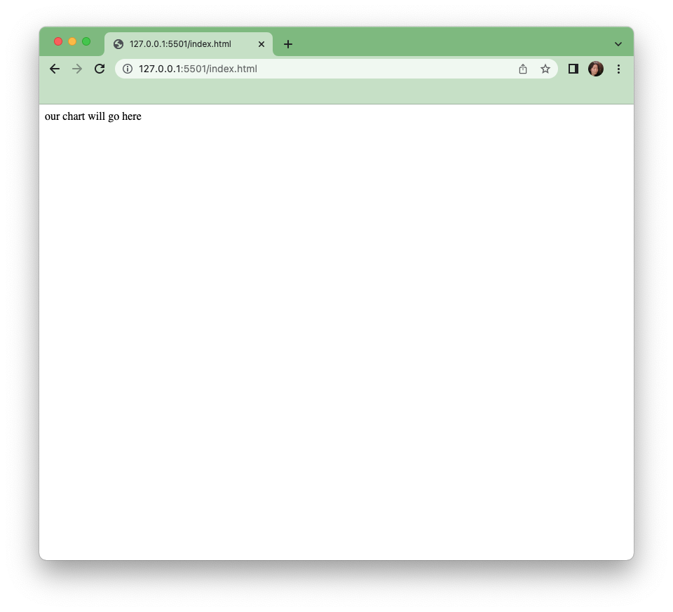

Now let’s turn to the chart.js file to create that initial chart. chart.js is blank to start with except for the 4 variables set1 - 4 below which are our datasets.

    var set1 = [{x:10,y:8.04},{x:8,y:6.95},{x:13,y:7.58},{x:9,y:8.81},{x:11,y:8.33},{x:14,y:9.96},{x:6,y:7.24},{x:4,y:4.26},{x:12,y:10.84},{x:7,y:4.82},{x:5,y:5.68}]

    var set2 = [{x:10,y:9.14},{x:8,y:8.14},{x:13,y:8.74},{x:9,y:8.77},{x:11,y:9.26},{x:14,y:8.1},{x:6,y:6.13},{x:4,y:3.1},{x:12,y:9.13},{x:7,y:7.26},{x:5,y:4.74}]

    var set3 = [{x:10,y:7.46},{x:8,y:6.77},{x:13,y:12.74},{x:9,y:7.11},{x:11,y:7.81},{x:14,y:8.84},{x:6,y:6.08},{x:4,y:5.39},{x:12,y:8.15},{x:7,y:6.42},{x:5,y:5.73}]

    var set4 = [{x:8,y:6.58},{x:8,y:5.76},{x:8,y:7.71},{x:8,y:8.84},{x:8,y:8.47},{x:8,y:7.04},{x:8,y:5.25},{x:19,y:12.5},{x:8,y:5.56},{x:8,y:7.91},{x:8,y:6.89}]

**Barchart Step 1**

Start by creating a function called barcharts, which takes 1 input - a dataset variable.

    function barChart(dataset){
    }

And let’s run this function right away with the variable set1. This function call can be above or below the function declaration. However, it must come after the variable declaration, or set1 would be undefined.

    barChart(set1)

The first thing we can do is add a blank svg to our function. This should be familiar from the last module.

    function barChart(dataset){

       var svg = d3.select("#chart")
                .append("svg")
                .attr("width",400)
                .attr("height",400)

    }

We can see that this is correctly run if we open the developer’s console and look at the elements tab. We can see that if we expand the div with id “chart”, there is a svg in it.

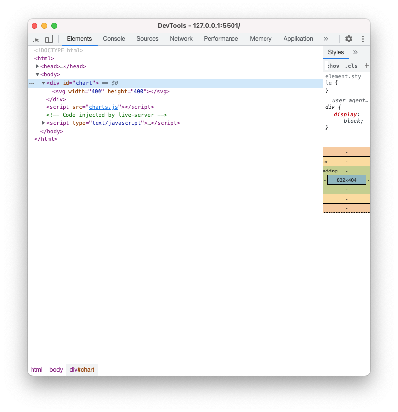

**Barchart Step 2**

Next let’s start drawing our bar chart inside our drawChart function. Once again, we will use the d3 syntax for chaining elements and data together - select, data, enter, append. This time we are appending a “rect” for rectangle. Remember that “dataset” is whatever data we passed into the function, in this case it is set1 because we called the function with the command barChart(set1) above.

    svg.selectAll("rect")
       .data(dataset)
       .enter()
       .append("rect")

Take a look at the developer’s console after you save this step. You should see if you expand the svg element, that there are 11 rectangle elements inside. Although for now they do not have any attributes and are invisible on the browser page.

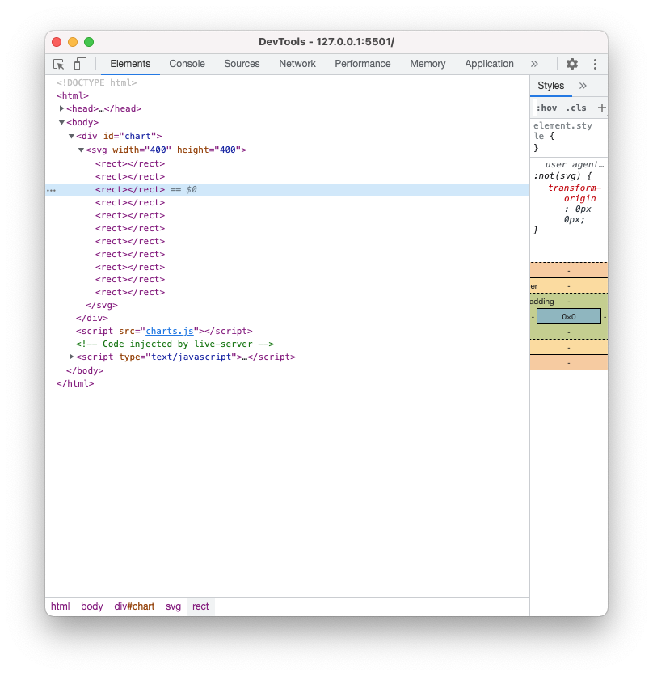

**Barchart Step 3**

Let’s set attributes with our data. The necessary attributes in a “rect” element are x, y, width, and height. A rect is drawn from the left upper corner of the coordinate system. So we will have to do some basic math to make sure the bars are in the right position.

First, we will set the width of each of the bars to 1 pixel(this is temporary).

    .attr("width",1)

And the height of each of the bars to the x values of set1.

    .attr("height",function(d){
           return d.x
       })

Then we will set the y to 0 - so that these bars are drawn from the top down.

    .attr("y",0)

And finally we will use the index value(the order that the objects our data is in) to set the x value of each bar. The d is our data of each item in our data array, and i is the index value of each item in our data array.

    .attr("x",function(d,i){
           return i
       })

When we save these attributes, we will see a very very small upside down barchart in our window on the upper left corner.

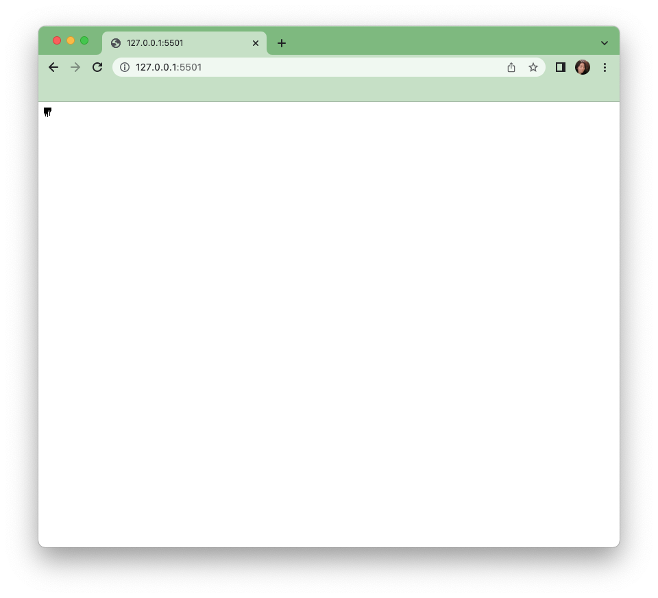

Let’s zoom in on the browser window. We can do so by pressing the command and the + keys together.

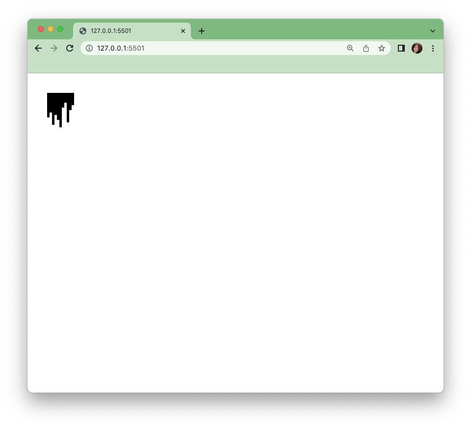

**Barchart Step 4**

There are some adjustments we must make here, applying a scale, flipping the chart right side up to be a more traditional bar chart orientation as well as adding axes and labels.

Let’s start with the familiar d3 scale from the last module.

    var yScale = d3.scaleLinear().domain(\[0,20\]).range(\[0,300\])

And apply it to the height of the bars

    .attr("height",function(d){
           return yScale(d.x)
       })

Now our bars are tall but still 1 pixel wide.

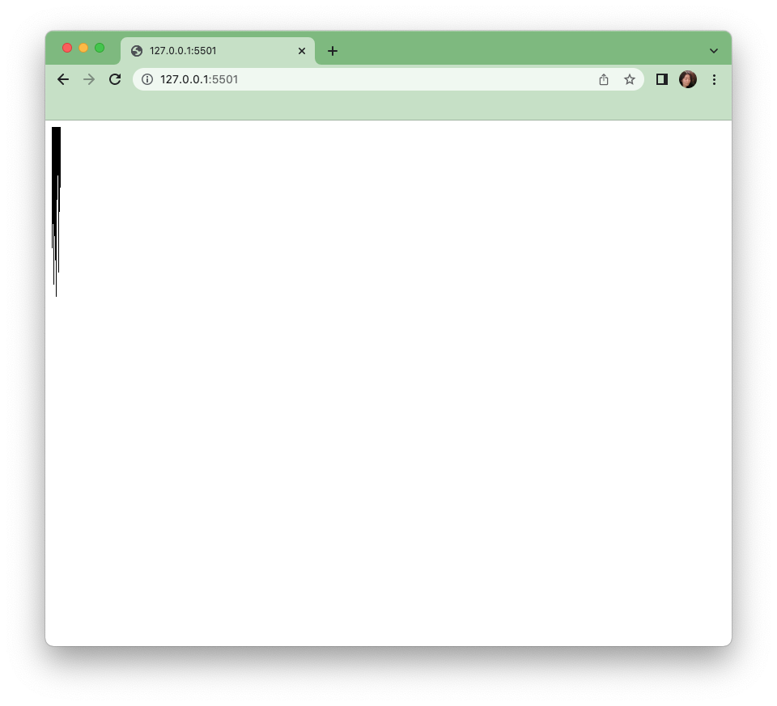

Next let’s scale the width of the bars. We can once again use a linear scale. But a simpler method would be to directly scale the bars by setting the bar width to more than 1, and multiplying the index by that width to get the x position.

    .attr("width",10)
    .attr("x",function(d,i){
         return i*10
     })

**Barchart Step 5**

We now have a full size bar chart that is upside down. To get the right position, let’s think through the coordinate system a bit. The rectangles are drawn from the top down, but we want to look as if they are bottom up. It is pretty straightforward if we think about this. If we want a bar that is 2 pixels high at the bottom of a 3 pixel high canvas, then we would need to figure out how far down to start the bar, which would be 3-2 in this case, the height of the canvas minus the height of the bar. So let’s do that in our code. Currently we have:

    .attr("y",0)

Let’s build a function so that we can access our variables.

yScale(d.x) is the height of our bars, and 300 is the height of our canvas, therefore:

    .attr("y",function(d){
           return 300-yScale(d.x)
       })

Now we have a barchart of sorts.

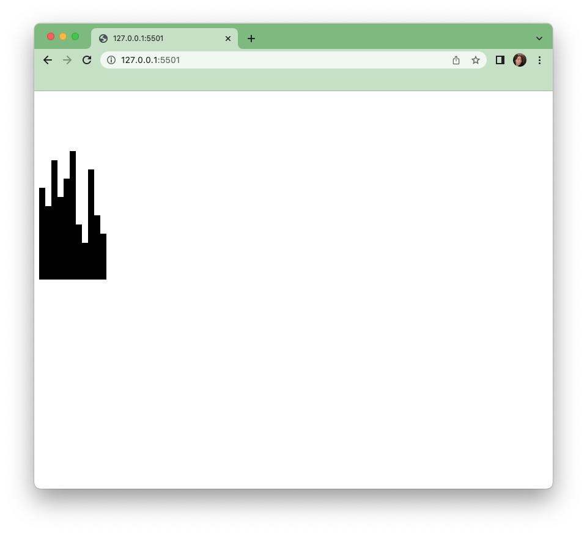

**Barchart Step 6**

We have so far built this inside a function, and we can change our data between any of the sets we have by simply calling the function again with a different variable input.

    barChart(set1)
    barChart(set2)
    barChart(set3)
    barChart(set4)

And here we have bar graphs of the x values of each set.

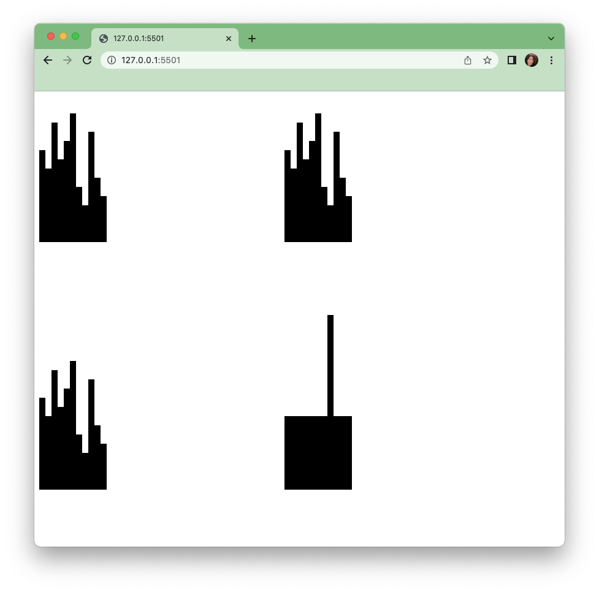

We can see the isolated value of x more clearly than the scatterplot from our previous module. In fact we can see right away that the x values of the first 3 sets are identical.

**Barchart Step 7**

Next let’s chart the y values. To create a barchart for the y values, we can make another function, or we can expand the flexibility of our current function by adding another input to our existing function.

We access the x value (d.x in our code) in 2 places in our function - in the height and y attributes. Let’s change that to use an input.

    d.x

Can also be written as

    d["x"]

Let’s change the “x” to be any column we input into the function. I am using “columnInUse” as the variable name here.

    d[columnInUse]

Let’s also add it to our function declaration at the top,

    function barChart(data,columnInUse){...

and to our function calls. Here we are drawing a barchart for set1 using the x values

    barChart(set1,"x")

To draw a bar chart for set1 but using y values:

    barChart(set1,"y")

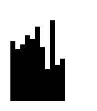

**Barchart Step 8**

However no chart is complete without axis and labels that show the scale of our data and what the dataset is. Let’s add a title for now to show that this is a barchart of x or y values. We will use the columnInUse input we added above to create a text element.

    svg.append("text").text(columnInUse).attr("x",10).attr("y",10)

This puts a simple title on bar chart. However, in  order to make this function reusable, we would have to change the title depending on the data and column we use. Now if we call the function with x and y values separately...

    barChart(set1,"x")
    barChart(set1,"y")

We would see the titles x and y applied on the top of each.

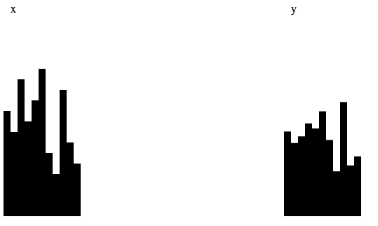

**Barchart Step 9**

Along those lines we can also pass different inputs to extinguish between the 2 charts as well, using the same function. Let’s try a color. Whenever we add an input into a function, we need to edit our code in 3 types of places. The first is the function declaration

    function barChart(data,columnInUse, fillColor){

The 2nd includes all the places where we would like to use the input inside our function. Here we are adding another line to our dot chain by setting the attribute fill for rectangles to the variable input fillColor.

    .attr("fill",fillColor)

Finally, we will have to include the actual value of the input in our function call.

    barChart(set1,"x","red")
    }barChart(set1,"y","blue")

Save your edits and we have 2 charts, red for the x values, and blue for the y.

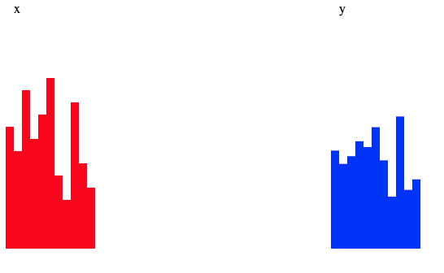

**Barchart Step 10 On your own:**

Create x and y charts for each of the 4 sets. You can simply call the function multiple times with different inputs to cover all the values, or you can try to implement a loop if you know how. Both methods are acceptable. Once you have done so, take a look back at our scatterplot work and compare what you see to these pairs of bar charts. Which aspects of the data are more clear with either representation? Which do you prefer? Why?

Once you have completed the bar charts, let’s move on to drawing lines.

**Bonus**

Add x and y axes to your chart function. Note - You may have to get creative with the scale of your y axis.
