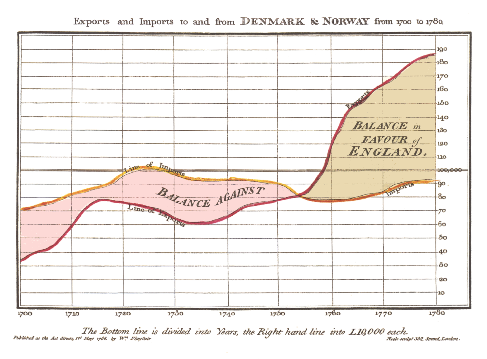
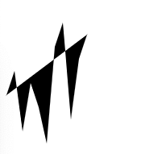
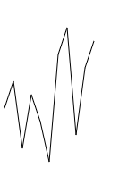
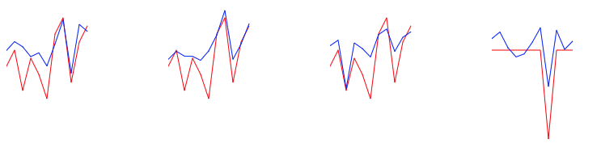
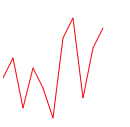
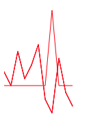
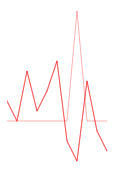
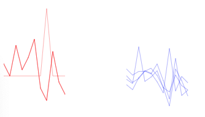

Please complete part 1: bar before moving onto this section of the module.

**Introduction**

Line

Here is one of the earliest examples of a line chart, it looks very much like something we would create today. Its subject matter is trade between countries, one of the most popular topics of early charts that gave rise to statistical graphics in its golden age(1900-). It is also of note because the author William Playfair, perhaps the most prolific early data visualizer, also invented the bar chart and many of the other graphical strategies we use today.

In this section we will be further familiarizing ourselves with functions, and also adding some logic structures such as loops to make some design decisions for our data.

[https://upload.wikimedia.org/wikipedia/commons/5/52/Playfair\_TimeSeries-2.png](https://www.google.com/url?q=https://upload.wikimedia.org/wikipedia/commons/5/52/Playfair_TimeSeries-2.png&sa=D&source=editors&ust=1651774865439910&usg=AOvVaw2BO6EidGTLv7hBwC5TTqY2)

**Setup**

We will work with the same 3 files as in the bar section. Download the files for module 3 from the fall 2022 course github repository.

[https://github.com/CenterForSpatialResearch/fall2022\_data\_visualization/tree/main/](https://www.google.com/url?q=https://github.com/CenterForSpatialResearch/fall2022_data_visualization)

**Index.html** - this is where the structure of our webpage will live.

**D3.js** - this is the d3 library’s contents. We will not be altering this file at all. We will link this this file to our html file so that we can access its contents and use d3.js methods.

**charts.js** - This is the file you will write your javascript code in. It is linked to your index.html file in the same way as the d3.js library file.  This file now contains 4 dataset variables, a function for bar charts, and perhaps some function calls that you made.

**Line Chart Step 1**

Inside charts.js, create another function for line charts with the input that we will definitely need- the dataset. Call the function with set1, so that as we code we can see the changes implemented.

We will also borrow from our bar chart code to create a svg(a smaller svg this time 200x200), and a y scale(also smaller)

    function lineChart(data){
      var svg = d3.select("#chart")
            .append("svg")
            .attr("width",200)
            .attr("height",200)
      var yScale = d3.scaleLinear().domain(\[0,20\]).range(\[0,200\])
    }

    lineChart(set1)

**Line Chart Step 2**

Lines are a little bit different than the circles and rectangles we have already drawn. Although it uses the exact same order of operations, lines are often defined separately for clarity. Lines need 2 values at every step, x and y(not to be confused with with the x and y values in our dataset)

In this case, the x coordinates of our line is determined by the index of the values - as we had done with our barchart. And the y is determined by a data value we select, let’s use x for now.

So here is how we would define our line variable using these parameters.

    var ourLine = d3.line()
       .x(function(d,i){return i\*10})
       .y(function(d,i){return yScale(d.x)})

Now we use the more familiar d3 dot syntax to chain our data to this line. Line is a special case because it requires the use of datum rather than data. The difference here is that .datum is looking for a complete array to be passed to the line element we define, whereas .data allows us to break apart the array we to draw individual elements(rectangles and circles)

    svg.append("path")
       .datum(data)
       .attr("d",ourLine)

Alternatively, we can also wrap our data in square brackets so that it is treated as a whole array when passed in by writing the chain like this:

    svg.append("path")
       .data(\[data\])
       .attr("d",ourLine)  

Both of the above syntax will create the same result.

**Line Chart Step 2 Styling the line**

Black fill, and no stroke is the default in d3, so we must set fill to “none” and the stroke to black to see a traditional line chart.

       .attr("fill","none")
       .attr("stroke","black")

Here it is, the x values of set 1 as a line. 

**Line Chart Step 3 Multiple lines**

One advantage that lines have over bars is that they can be overlaid or stacked on top of eachother, whereas bars under normal circumstances can only be stacked. So let’s use that to our advantage and draw 2 overlapping lines for the x and y values.

We need 2 line definitions then in our function, an xLine and yLine. Let’s change the name ourLine to reflect the value it is mapping.

    var xLine = d3.line()
       .x(function(d,i){return i\*10})
       .y(function(d,i){return yScale(d.x)})

And add another

    var yLine = d3.line()
       .x(function(d,i){return i*10})
       .y(function(d,i){return yScale(d.y)})

And append those lines to our svg using different stroke colors.

    svg.append("path")
           .data([data])
           .attr("d",xLine)  
           .attr("fill","none")
           .attr("stroke","red")

    svg.append("path")
           .data([data])
           .attr("d",yLine)  
           .attr("fill","none")
            .attr("stroke","blue")

Our x and y line chart is complete.

**Line Chart Step 4 Multiple line Charts**

how do they look when called using the other 3 dataset variables?

    lineChart(set1)
    lineChart(set2)
    lineChart(set3)
    lineChart(set4)

Looking at these, the pattern of the 3 identical red lines are actually obscured by the blue, maybe a better use of the line chart is to create 2 charts, 1 containing the x values of all 4 sets, and the 2nd containing all the y values. 

**Line Chart Step 5 Different Multiple line Charts**

How would we do that? There are many ways to do this, depending on your final intentions and also your own preferences. Let's walk through 1 way of doing it.

Let’s create a second line chart function. Since we want to draw 4 lines on the same svg, we do not draw a svg each time the function is called, we would have to create the svg outside of the function and pass it as a input.

    var svg = d3.select("#chart")
        .append("svg")
        .attr("width",200)
        .attr("height",200)

    function lineChart2(data,svg){

     }

We can reuse our yScale and line definition. We can append the line with the same code as well:

    var svg = d3.select("#chart")
        .append("svg")
        .attr("width",200)
        .attr("height",200)

    var ourLine = d3.line()
       .x(function(d,i){return i*10})
       .y(function(d,i){return yScale(d.x)})

    svg.append("path")
       .data([data])
       .attr("d",ourLine)  
       .attr("fill","none")
       .attr("stroke","red")

When we call this new function with the data and svg

    lineChart2(set1,svg)

A single line for set1 x values appear

If we call this function again with set2

    lineChart2(set1,svg)
    lineChart2(set2,svg)

Nothing appears to have changed on the browser page, but in our developer console’s elements tab, we can see that there are in fact 2 path elements in the svg. The lines being drawn are not apparent because they have the same values and sit on top of each other exactly.

When we draw all 4 lines

    lineChart2(set1,svg)
    lineChart2(set2,svg)
    lineChart2(set3,svg)
    lineChart2(set4,svg)

We see that set4’s x value line is distinct. Whereas the other 3 lines are identical.

A transparency might be a good way to clarify the data represented in this chart. The opacity attribute can be set for svg elements with a numerical value between 0 and 1.

0 is invisible and 1 is fully opaque.

    .attr("opacity",.3)

Now we can see how the lines compare.

**Line Chart Step 5 On your own**

Let’s repeat the process for the y values for all 4 sets. You have many options here, editing your existing function, using a loop, or simply calling the function 4 times. Start by creating a second svg to draw your y values. You will end up with something like this:

How do these compare to our last 3 sets of charts? What aspects of the data do these highlight? What do they obscure? How might we improve on the graphical encoding of this with line weight, and stroke color?
