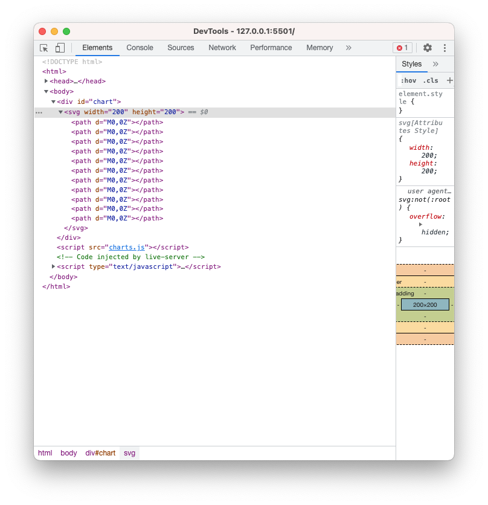
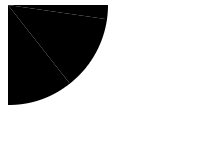
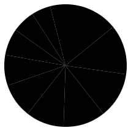
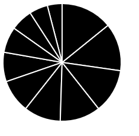
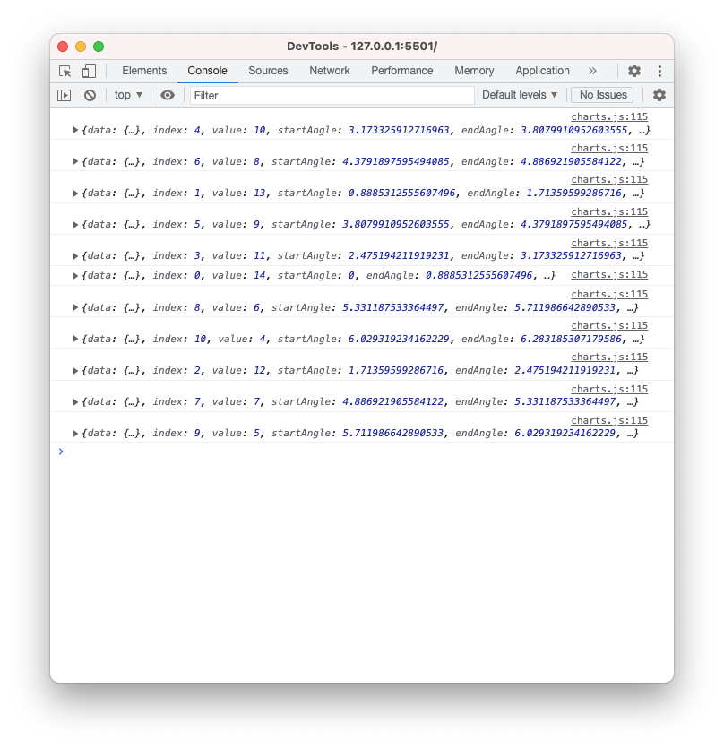
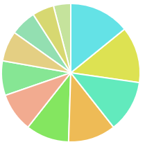
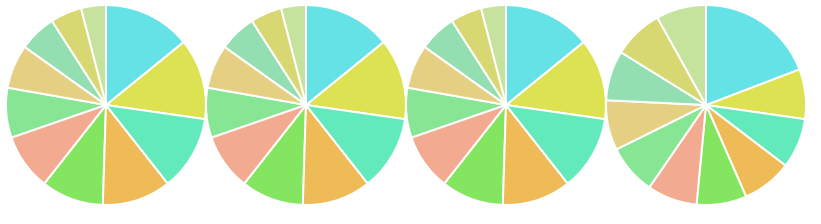
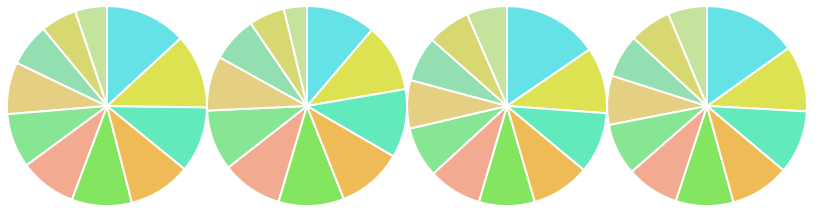
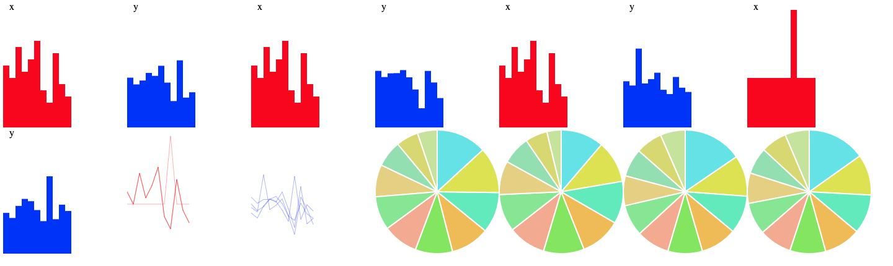

PPlease complete part 1: bar and part 2: line before moving onto this section of the module

**Pie**

Pies are highly debated, and surprisingly controversial in the dataviz world. The visual encoding on pies are generally considered less efficient and accurate than those used by the scatter plot, bar chart, and line chart which all leverage position rather than angle.

**Setup**

We will work with the same 3 files as in the bar section. Download the files for module 3 from the fall 2022 course github repository.

[https://github.com/CenterForSpatialResearch/fall2022\_data\_visualization/tree/main/](https://www.google.com/url?q=https://github.com/CenterForSpatialResearch/fall2022_data_visualization)

**Index.html** - this is where the structure of our webpage will live.

**D3.js** - this is the d3 library’s contents. We will not be altering this file at all. We will link this this file to our html file so that we can access its contents and use d3.js methods.

**charts.js** - This is the file you will write your javascript code in. It is linked to your index.html file in the same way as the d3.js library file.  This file now contains 4 dataset variables, a function for bar charts, and 2 functions for line charts.

**Pie Chart Step 1**

We are all familiar with our setup at this point, let’s create the function and svg. We will then also call it with set1.

    function pieChart(data){
       var svg = d3.select("#chart")
        .append("svg")
        .attr("width",200)
        .attr("height",200)
    }

    pieChart(set1)

A pie chart is created as a path in d3, so our code will resemble the line chart we have already created. Before drawing the path, we need to take the additional step of turning our data values into degree values(radians in this case).

Here we are setting up our definition of the pie, we are using the x values in our set1

    var pie = d3.pie()
       .value(function(d){
           return d.x
       })

We then apply this definition to our data

    var pieData = pie(data)

Before adding it to our svg as a path

    svg.selectAll("path")
       .data(pieData)
       .enter()
       .append('path')
       .attr('d', d3.arc()

Although nothing appears in the browser page, we can see that the paths are being drawn when we look at the elements tab of the developer console.

Next let’s set a inner and outer radius for our pie to draw them. If we set a inner radius that is larger than 0, then we have created a donuts chart.

    .innerRadius(0)
    .outerRadius(100)

We have  a pie chart, unfortunately its center is set at 0,0 so only a quarter is visible. We will shift it to the right and down by 100 pixels. It is easiest to do this as a whole, so let’s add a group and the transform attribute to our svg definition

    var svg = d3.select("#chart")
        .append("svg")
        .attr("width",200)
        .attr("height",200)
        .append("g")
        .attr("transform", "translate(100,100)")  

Our whole pie is now visible, although it is hard to distinguish the slices without color coding.

First we can set the stroke color and width so the slices have better separation

         .attr("stroke","white")
         .style("stroke-width", "2px")

Next let’s introduce some colors. Here is an array of hex color values that we can assign to slices

    var colors = ["#53e2e8","#dce539","#4cecbb","#f1be47","#79e950","#f6ac8d","#7be98e","#e5d17c","#8ce1af","#d6db66","#c2e596","#b4e462"]

We can use the index value in our data to access these colors. Before we do that, let’s take a closer look at exactly what pie data looks like. Let’s add a attribute for the fill, but instead of assigning a color right away, we will log the values for d out to the console.

         .attr('fill', function(d){
             console.log(d)
           })

In the Console tab of your devTools, you will see the data for each slice of pie printed out. Each slice has the data, endAngle, sartAngle, value, and index.

Let’s use the index value of each slice(d.index) to assign the colors. For clarity we will assign this value to a new variable called sliceIndex.

        .attr('fill', function(d){
              console.log(d)
              var sliceIndex = d.index
           })

Next, we will use the index to access the colors array. So the index of the pie slice will determine which color it gets assigned.

        .attr('fill', function(d){
              console.log(d)
              var sliceIndex = d.index
              colors\[sliceIndex\]
           })

When you save this last change, we can see that the pie chart is still black. There is a bug, can you see what it is? We are missing the return statement.

         .attr('fill', function(d){
              console.log(d)
               var sliceIndex = d.index
               return colors\[sliceIndex\]
           })

Now that our pie chart is somewhat complete, what do we think of how it has represented the data? Perhaps drawing out the whole set will help. Here are our 4 x value pies.

And our y value pies.

These are pretty difficult to decipher for this dataset. What would be a good dataset to map a pie to? Take a look back at all 4 types of charts from this and the last module and consider what basic chart type you would use to make your point with this data.

