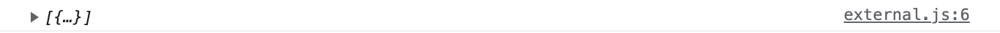
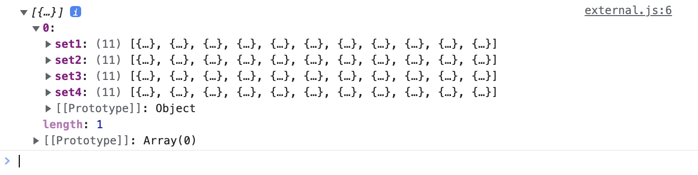
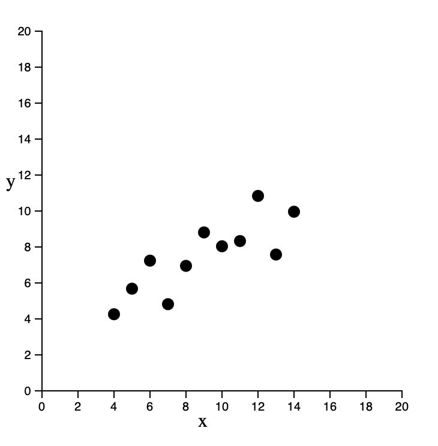

**Introduction**

Up until now, we have used data that is written directly into the code as a variable. In this short module, you will load an external json file into your code and create charts out of its data.

**Setup**

We will have the same anscombe data, but this time as 2 different a external data.json file. Download the files for module 4 from the fall 2022 course github repository.

[https://github.com/CenterForSpatialResearch/fall2022\_data\_visualization/tree/main/](https://www.google.com/url?q=https://github.com/CenterForSpatialResearch/fall2022_data_visualization)

**Index.html** \- this is where the structure of our webpage will live.

**D3.js** -  this is the d3 library’s contents. We will not be altering this file at all. We will link this this file to our html file so that we can access its contents and use d3.js methods.

**external.js** - This is the file you will write your javascript code in. It is linked to your index.html file in the same way as the d3.js library file.  This file is blank to start.

**anscombe.json** - this is a javascript object notation format of anscombe data

As in Module 2 and 3, we will link both d3.js and external.js to our index.html file. **Do this now.**

**Step 1 Loading data**

D3 has built in functionality to parse different data formats. Json is among the most common so we will use it as an example. To have d3 read a json file:

    var jsonData = d3.json("anscombe.json")

Next we must load the parsed file into our browser memory so that we can draw with the data. And we must only start drawing after the files have been loaded.

    Promise.all([all your files will go here])
    .then(function(data){
        all your code that uses the files will go here   
    })

Promises takes an array as input, and when the files are loaded, .then springs into action to perform the code you have written that addresses the array. For us, we will load the parsed .json so our code looks like this.

    Promise.all([jsonData])
    .then(function(data){

    })

Let’s check what we have loaded by logging the data out in our console.

    Promise.all([jsonData])
    .then(function(data){
       console.log(data)
    })

Under console in our devTools window, we should see the data being printed out. The data is nested inside an array. This is useful for when we load more than 1 dataset. Since there is only 1 item in our array, to get to the data, we simply use data[0] to access the first item in the array.

Take a closer look at the json by expanding it in the console.

**Step 2 Creating a chart**

This format should be familiar to us, set 1 - 4 are here as they were when directly written into the .js file  To get the values inside set1, we would use “set1” as a key data[0][“set1”]. Let’s try drawing it with a preexisting function.

    function scatterPlot(inputDataset){
            var svg = d3.select("body")
               .append("svg")
               .attr("width",400)
               .attr("height",400)

            var xScale = d3.scaleLinear()
               .domain([0,20])
               .range([0,300])

            var yScale = d3.scaleLinear()
               .domain([0,20])
               .range([300,0])

            svg.selectAll("circle")
               .data(inputDataset)
               .enter()
               .append("circle")
               .attr("r",5)
               .attr("cx",function(d){
                   return xScale(d.x)
               })
               .attr("cy",function(d){
                   return yScale(d.y)
               })
               .attr("transform","translate(30,30)")

               var xAxis = d3.axisBottom().scale(xScale)

               var yAxis = d3.axisLeft().scale(yScale)

            svg.append("g").call(xAxis).attr("transform","translate(30,330)")
            svg.append("g").call(yAxis).attr("transform","translate(30,30)")
            svg.append("text").text("x").attr("x",160).attr("y",360)
            svg.append("text").text("y").attr("x",0).attr("y",160)

    }

**Step 3 Connecting Chart with Data**

And call it with the data we just loaded.

    scatterPlot(data[0]["set1"])

We must make this call within the context of the loaded data, within the .then section of the code.

    Promise.all([jsonData])
    .then(function(data){
       console.log(data)
       scatterPlot(data[0]["set1"])
    })

Here is our scatterplot again, drawn with the same function, but using a external data file.

**Step 4 On Your Own**

Create a barchart using the same json data that was loaded. You can use previously written code.
