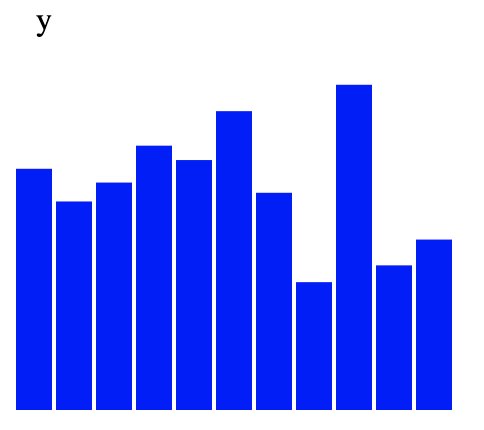

**Introduction - States of interactivity**

Making data interactive is where d3.js really shines. In this module we will add 3 instances of interactivity. We will start by changing the fill color of a rectangle when the mouse interacts with it. Then we will create popup text by using the browser default for tooltips, as well as by using svg text with selectors.

D3 has an extensive built-in set of behaviors that can trigger transformations on the page. The most basic are mouse interactivity - rolling the mouse over an element on the page, rolling off the element, and clicking on an element. We will be focusing on these in this module.

**Setup**

Download the files for module 5 from the fall 2022 course github repository.

[https://github.com/CenterForSpatialResearch/fall2022\_data\_visualization/tree/main/](https://www.google.com/url?q=https://github.com/CenterForSpatialResearch/fall2022_data_visualization)

Inside you will find 3 files that you should be familiar with from the setup module.

**Index.html** - this is where the structure of our webpage will live. We will create “div” objects by hand inside this html file to place our charts. To start, this is a blank template.

**D3.js** -  this is the d3 library file, we are using version 6. We will not be altering this file at all. We will link this file to our html file so that we can access its contents and use d3.js methods.

**charts.js** - This is the file you will write your javascript code in. It will be linked to your Index.html file in the same way as the d3.js library file. To start, this file contains the set1 data as a variable, a bar chart function we wrote previously(with a few adjustments on size), and a function call to that bar chart function.

On the browser page once we go live with our page, we can see a bar chart for the y values of set1.

**Introduction to "this" selections**

**Step 1 Mouseover**

Let’s start by adding an event to our rectangles. We can choose to continue the chain here with .on

    svg.selectAll("rect")
       .data(data)
       .enter()
       .append("rect")
       .attr("y",function(d){return 200\-yScale(d\[columnInUse\])})
       .attr("width",18)
       .attr("x",function(d,i){return i\*20 })
       .attr("height",function(d){return yScale(d\[columnInUse\]) })
       .attr("fill",fillColor)
       .on("mouseover",function(e){

       })

We can also start a new chain by selecting the rectangles.

     svg.selectAll("rect")
       .data(data)
       .enter()
       .append("rect")
       .attr("y",function(d){return 200\-yScale(d\[columnInUse\])})
       .attr("width",18)
       .attr("x",function(d,i){return i\*20 })
       .attr("height",function(d){return yScale(d\[columnInUse\]) })
       .attr("fill",fillColor)

     d3.selectAll("rect")
       .on("mouseover",function(e){

       })

Inside our rollover, select the  element we are currently working with using “this”.

       d3.selectAll("rect")
       .on("mouseover",function(e){
           d3.select(this)
       })

Then add a new attribute to “this”, for example changing the fill color to black.

    d3.selectAll("rect")
       .on("mouseover",function(e){
           d3.select(this).attr("fill","black")
       })

Once you save, the rectangle elements will turn black if the mouse rolls over them.

**Step 2 Mouseout**

However, when the mouse rolls out of the rectangles, they stay black. To restore their original fill color, we will add another event handler.

       .on("mouseover",function(e){

       })

And within the mouseout handler, we can reset the fill of “this” back to the original fill color. This is determined by the variable fillColor we passed into the function.

       .on("mouseover",function(e){
           d3.select(this).attr("fill",fillColor)
       })

Now when we save, each bar will turn black when the mouse is over it and turn back to its original color when the mouse is no longer over it.

**Step 3 Browser Tooltips**

The rollover event is also a good place to add text annotations(tooltips) in the form of popup windows that give the viewer more details on your data. There are 2 kinds of tooltips we can use.

The first is a simple tooltip that is a default in the browser. We can simply add a title to our chain, and set that title’s content using .text where the text value is the value of the column we have chosen to use to set the height of the bars.

  .append("title")
   .text(function(d){
       return d[columnInUse]
   })

We can also use additional text here and make the tooltip more descriptive. Here we are simply adding 2 strings together with a + sign.

       .text(function(d){
           return "The value is "\+ d\[columnInUse\]
       })

**Step 3 SVG Tooltips**

To make a tooltip with svg, we append a text element to the entire svg, and move it to where our mouse is as we interact with the elements on the page. To get the element’s location so that we can place the tooltip correctly, we will use the on mouseover event handler again. We will select “this” and set new variables to the values of its attributes x and y.

       .on("mouseover",function(e,d){
           d3.select(this).attr("fill","black")
           var x = d3.select(this).attr("x")
           var y = d3.select(this).attr("y")
       })

Because we are also using the data in our tooltip, we have 2 inputs in our mouseover function. The first by default is the event, represented usually by e, the 2nd is the data which we use d to represent, and a 3rd possible input here is the index, usually represented by i.

            .on("mouseover",function(e,d){

And then we will append a text element to the svg and set its position with the x and y variables we created. Once again, our text content are set by the y values of set1, d[columnInUse].

       .on("mouseover",function(e,d){
           d3.select(this).attr("fill","black")
           var x = d3.select(this).attr("x")
           var y = d3.select(this).attr("y")
           svg.append("text")
           .text(d[columnInUse])
           .attr("x",x)
           .attr("y",y)
       })

When we save the code and rollover the bars, the y values will appear.

In order to create the event handler for the text label to disappear we will use on mouseout once again.

       .on("mouseout",function(e,d){
           d3.selectAll("text").remove()
       })

Now if we save the page, we can see that the tooltip text does disappear when we rollover to the next bar, but the title of the page “y” on the left upper corner also disappears.

This is because we are removing all text on the page each time. We need a method of isolating only the text in the tooltips and not the title. We do so by setting a class for the rectangle text and not for the title text. A class is an attribute that can be applied to multiple elements on the page to form a group that can be selected later. A class is selected using dot notation. The class we are attributing to the text labels here is “tooltip”.

           svg.append("text")
           .text(d[columnInUse])
           .attr("class","tooltip")
           .attr("x",x)
           .attr("y",y)

We would then select the text using .tooltip. Now when we mouseout of the rectangle, instead of removing all text elements, we will only remove the text with the class tooltip.

       .on("mouseout",function(e,d){
           d3.selectAll(".tooltip").remove()
       })

And now we have a working tooltip. Because this is a svg text element, we can style this tooltip with any attributes that we may add to the chart itself using the same syntax. Try out some styles for the text and try adjusting the x and y attributes so that the text placement is more legible.

    svg.append("text")
           .text(d[columnInUse])
           .attr("class","tooltip")
           .attr("x",x)
           .attr("y",y-5)
           .attr("font-size","24px")
           .attr("fill","red")
