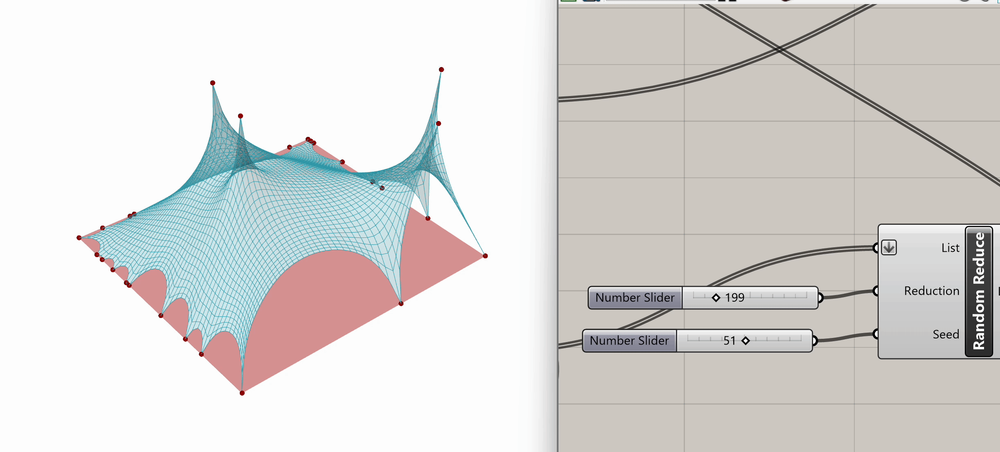

# Interactive Physics Simulation (part 1) - Tensile Surface Form Finding

## Module Summary

In this module, we will cover the fundamental principles of interactive physics simulation, introduce the Kangaroo plugin for Grasshopper, and give a brief overview of tensile membranes and their architectural applications, followed by a detailed, step-by-step tutorial on simulating the tensile form-finding process.

## Introduction 

### Interactive physics simulation

*From the article "Computational approach for form-finding optimal design" by Dasari, S.K., Fantuzzi, N., Trovalusci, P. et al*

Interactive physics simulation refers to the process of using computational tools to model and simulate physics-based dynamics in a responsive environment. Unlike traditional static simulations, interactive physics simulations allow users to manipulate parameters, observe real-time changes, and interact with simulated objects or systems in a virtual space.

Key aspects of interactive physics simulation include:

1. Real-time Interaction: Users can interact with the simulation in real-time, adjusting parameters such as forces, velocities, or material properties, and observing the immediate effects on the simulated system.

2. Dynamic Response: The simulation accurately models the dynamic behavior of physical systems, accounting for factors such as motion, collisions, friction, and deformation, allowing users to explore the consequences of different actions or scenarios.

3. Feedback and Visualization: Interactive physics simulations provide visual feedback to users, often through 3D graphics or animations, allowing them to observe and analyze the behavior of simulated objects or systems in real-time.

### Physics-based simulation in Grasshopper

There are a few ways to run physics-based simulations in Grasshopper, the most common and versatile one being through the Kangaroo plugin. Kangaroo is now included with Rhino 6 and 7 and if you are using a current version you do not need to download or install it from **Food4Rhino**.

Kangaroo was developed by Daniel Piker and it is a Live Physics engine for interactive simulation, form-finding, optimization and constraint solving.
It consists of a solver library and a set of Grasshopper components which embed physical behavior directly into the 3D modelling environment. This allows you to interact with it "live" as the simulation is running. Kangaroo's physics simulation capabilities can be applied widely, from rigid/soft body collision, to cable structures, gridshells, tensile membrane structures and inflatables. In this tutorial, we will focus on tensile membranes, and how to simulate the process of tensile surface form finding.

### Tensile Membranes in Architecture

Tensile structures are architectural constructions primarily designed to withstand tension rather than compression or bending forces. They are commonly used for roofing large spaces due to their economic feasibility and aesthetic appeal. Tensile membrane structures, supported by steel cables, offer advantages such as flexibility, lightweight construction, and the ability to span vast distances.

Historically inspired by early man-made shelters - such as the black tents first developed using camel leather by the nomads of the Sahara Desert, Saudi Arabia, and Iran, as well as the structures used by Native American tribes - tensile structures have evolved significantly over time. Technological advancements, particularly during the Industrial Revolution, facilitated the development of stronger materials and innovative construction techniques. German architect and engineer Frei Otto played a pivotal role in advancing tensile structure design through scientific studies and experimentation.

Tensile structures are classified into membrane tensioned structures, mesh tensioned structures, and pneumatic structures. Membrane tensioned structures use membranes held in place by cables, distributing tensile stresses efficiently. Mesh tensioned structures employ cable meshes to transmit forces to separate elements like glass or wood sheets. Pneumatic structures rely on air pressure to support protective membranes.

## Tensile Surface Form Finding

### Step 1: Create Rectangle
To start our tensile surface form-finding exercise we define the topology directly through Grasshopper. For this example, we want to work with a square mesh so we begin by using the `Rectangle` component that creates a rectangle on a plane. The inputs for this component are the following:

1. Plane: Rectangle base plane	(type of input: plane)
2. X Size: Dimensions of rectangle in plane X direction	(type of input: domain)
3. Y Size: Dimensions of rectangle in plane Y direction	(type of input: domain)
4. Radius: Rectangle corner fillet radius (type of input: number)

The base plane is set by default to the World XY plane, with its center point at (0,0,0), which works well for us in this example. As you can see, the X and Y dimensions of the rectagle are asking for a domain type of input, so we need to construct one. We use the `Construct Domain` component, setting its domain start to 23 and the domain end to -23, in order to get a square symmetrical across the x,y axis.

We have just established the foundational parameters for shaping our tensile structure!

---

### Step 2: Mesh Creation
Now that we have defined the shape of our topology, we proceed to convert the rectangle into a mesh. For that we use the `Mesh Plane` component, which asks for 3 inputs:

1. Boundary: Rectangle describing boundary of plane	(type of input: rectangle)
2. Width count:	Number of faces along {x} direction	(type of input: integer)
3. Height count: Number of faces along {y} direction (type of input: integer)

We connect the rectangle we created in Step 1 to the boundary input and use sliders to determine the width and height count (slider=55). Increasing this count will enhance the simulation precision, but it will also increase the computational load, so make sure you don't exceed necessary values. This meshing phase is crucial for prepping the geometry for the Kangaroo physics simulation.

---

### Step 3: Mesh Qualities

After creating our mesh, we can start thinking about how we want this geometry to behave and give it specific qualities. Let's say in this instance, that we want the 4 corners to be anchored to the ground. In the Goals-Pt section of Kangaroo, we can find the `Anchor` component that does exactly that. It asks for 3 inputs:

1. Point: Point to anchor	(type of input: point)
2. Target:	Location to pull the anchor to. If left empty, the initial location will be used (type of input: point)
3. Strength: Strength (type of input: number)

We need to connect to the first input the 4 mesh corners we want anchored. To extract those corners from our mesh we can use the `Mesh Corners` component from the Kangaroo Mesh section. We plug our mesh into the first input and then we connect the `Mesh Corners` output to the `Anchor` component, specifying the point input. The default strength for anchors is 1000, adjustable through a slider. For our example, we will keep it at that default strength. We will also leave the second input (Target) empty, since we want the points to be anchored at their initial location.

Additionally, we will introduce springiness to the mesh by setting the lengths of its edges using the Kangaroo component `Edge Lengths` from the Goals-Lin section. `Edge Lengths` asks for the following inputs:

1. Mesh: Mesh to set edge lengths for (type of input: mesh)
2. LengthFactor: Target edge length as a multiple of current length	(type of input: number)
3. Strength: Strength	(type of input: number)

We will plug in our mesh into the first input and a slider into the second one, setting the length factor at 0.5. Optionally, we could also add a slider for strength, but for this example we will keep the default strength.

---

### Step 4: Manipulate Mesh Vertices

We have now set the basic goals and constraints for our tensile membrane. As a next step, we can experiment with further manipulating the mesh vertices. We want to apply different constraints to the peripheral vertices compared to the ones contained within the mesh, so as a first step let's split them into two lists. To do that, we can use the `Naked Vertices` component from the Kangaroo Mesh section. This component takes our mesh as input and gives us the following outputs:

1. ClothedIndex: Indexes of vertices surrounded by faces (type of output: integer)
2. NakedIndex: Indexes of vertices not surrounded by faces (type of output: integer)
3. ClothedPts: Point locations of vertices surrounded by faces	(type of output: point)
4. NakedPts: Point locations of vertices not surrounded by faces (type of output: point)

After plugging in our mesh into `Naked Vertices`, from the naked points output, we can select additional periphery points to anchor. Let's randomize that selection by using the `Random Reduce` component. `Random Reduce` needs a single list in order to perform the reduction operation, this is why we flatten the NakedPts list as we plug it into the first input, in order to remove any existing Data Tree levels.

Next, we input a slider for the number of points to reduce (e.g., reduce by 199), and we use a seed slider for random selection.  If we scrub both sliders, we can observe the changes in the selection of peripheral vertices.

Now that we have our selected peripheral vertices, let's connect that output list to the `Anchor` component from Step 3, the same one grounding the four mesh corners.

We can also use an additional `Anchor`component, not to tether vertices to the ground but at a higher elevation. For this step, we need to switch to our Rhino viewport in order to set four points at random x,y coordinates and z elevation, but making sure they are placed above the mesh surface we are working with.

After setting these four points in the Rhino viewport, we bring them into Grasshopper by assigning them to a `Point` component (right click -> Set Multiple Points). These will be our Target points for our simulation. 

At this stage, we need to determine the four mesh vertices that we will tether to these target points. We know they will be selected from the ClothedPts list (see above the `Naked Vertices` component), but we still need a method for locating the corresponding points on our mesh.

There's a Grasshopper component that can do that for us and that's `Closest Point`. This component searches through a collection of points to identify the closest one, which will help us find the corresponding points on our mesh. Let's take a look at the inputs it needs:

1. Point: Point to search from (type of output: point)
2. Cloud: Cloud of points to search	(type of output: point)

We will connect our four target points to the first input of the `Closest Point` component, while the ClothedPts list obtained from the `Naked Vertices` will be connected to the second input. The points we are looking for will be the first output of `Closest Point`.

Next, we will use an additional `Anchor` component, connecting the `Closest Point` output list to the first point input and the Rhino points to the second target input. As before, we will keep the strength at the default value of 1000.

---

### Step 5: Combine Components

With all elements, goals, and constraints now configured, we are ready to proceed with the next phase of the Kangaroo simulation, and that is combining all the elements into a single data stream.

To do that, we will use the `Entwine` component,  which effectively flattens and merges multiple data streams. The goal is to create a unified data stream for input into the Kangaroo simulation. While most of our current elements (like `Edge Lengths` and`Anchor`) are compatible with Kangaroo, we need to ensure our mesh is also in a format recognized by Kangaroo. There is a special component called `Show` that we can use in order to coerce the mesh into the necessary geometry type.

Now let's plug all our elements into `Entwine`: our mesh, transformed via`Show`, will be the first input, followed by both `Anchor` components, and `Edge Lengths`.

---

### Step 6: Kangaroo Bouncy Solver

We are finally ready to execute our first Kangaroo simulation, by running the `Kangaroo Bouncy Solver` component. This component is at the core of the simulation, consolidating all defined goals, solving the system, and producing the "solved" vertex locations. Fundamentally, the `Kangaroo Bouncy Solver` operates by minimizing energy within the system.

 As described by Dan Piker, the creator of Kangaroo, : *"The various Goals define different energies which are zero under certain geometric conditions. The Kangaroo solver iteratively moves the points so that the sum of the energies acting on all the points in the system is as low as possible."*

Now that we understand how `Kangaroo Bouncy Solver` works, let's set up the simulation. For this example we only need to connect three inputs: 
1. GoalObjects:	GoalObjects	(type of input: generic data)
2. Reset: Hard Reset (completely rebuild the particle list and indexing) (type of input: boolean)
3. On: If true, Kangaroo will continue to iterate until reaching the given threshold value (type of input: boolean)	

In the first "GoalObjects" input, we connect the entwined data stream. We use a button for the reset input and a boolean toggle for the on/off switch input. When the boolean toggle is set to On, the bouncy solver dynamically finds a mesh form based on the input conditions. And this is our first simulation!

---

### Step 7: Visualize Output

Now, let's visualize the output mesh. For this example, we'll be using components from the **Human** plugin, downloaded from **Food4Rhino**. 

Let's use the `Custom Preview Materials` component to render the BouncySolver output mesh, and the `Custom Preview Lineweights` component to display the output mesh contours as lines.

Given that the BouncySolver output provides both the mesh and the contours within a single list, we need to use the `Split List` component to partition that list at index=1. List A contains the mesh and List B the contours.

With the mesh and the contours separated, we connect List A to the geometry input of `Custom Preview Materials`, and list B to the geometry input of `Custom Preview Lineweights`. 

We can adjust the color through the `Colour RGB` component, using sliders for Red, Green, and Blue (here set at 53, 164, and 179 respectively). We can also adjust the transparency of the mesh through a slider. 

---

### Experimentation:

Spend some time experimenting with the model to see what kinds of variations and geometries you can create. Feel free to test different input conditions by altering the location of target points or changing the seed in the `Random Reduce` component. 

