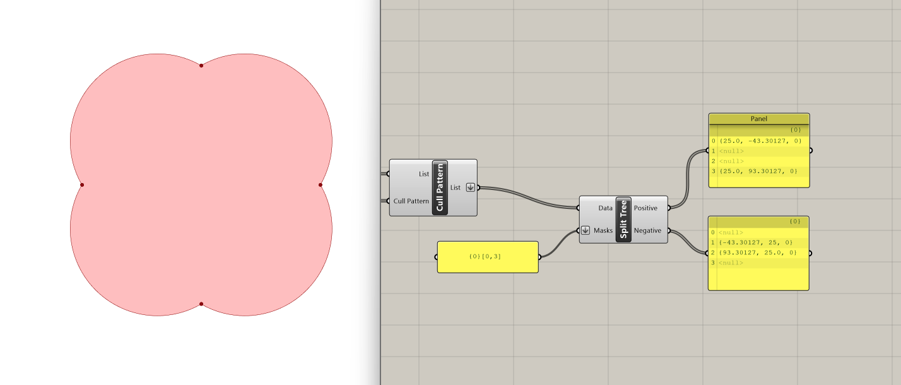

# Interactive Physics Simulation (part 2) - Inflatable Structures

## Module Summary

In this module, we will delve deeper into Kangaroo and interactive physics simulation, with a focus to inflatable structures. We will give a brief overview of pneumatic structures in architecture, followed by a detailed tutorial on creating interconnected domes formed by a grid of intersecting circles. In order to follow this tutorial, it is best to have completed the first part of the series: "Interactive Physics Simulation (part 1)- Tensile Surface Form Finding".

## Introduction 
### Pneumatic Structures in Architecture

*Haus-Rucker-Co, Yellow-Heart / Gelbes Hertz. 1967-8. Photo courtesy of Gunter Zamp Kelp*

Pneumatic structures are architectural constructions that use air or gas pressure to support and shape their form. These structures typically consist of airtight membranes or fabrics that enclose a volume of air, creating an internal pressure that gives the structure its shape and stability. They are lightweight, adjustable, and versatile, and have been used for a variety of purposes, including temporary shelters, event spaces, sports facilities, and architectural installations.

Beyond their practicality - or perhaps because of it - pneumatic structures have also taken on utopian connotations, and architects and protesters alike have used them to symbolize ideas and social movements.

In the 1960s, the radical group of Italian architecture students known as UFO used inflatable structures with political messages to protest the Vietnam War. Lapo Binazzi, an architect who was an original member of UFO, said about the structures: "They were inflated, served their purpose, and were immediately deflated." Around the same time, Ant Farm, a multidisciplinary collective involved with alternative architecture, performance, and video, produced the Inflatocookbook, a manual for DIY pneumatic structures. Heavily influenced by the youth counterculture of the time, the collective's interest in inflatables lay in their ability to support a nomadic, communal lifestyle in stark contrast to the consumerist culture of the US in the 1970s.

*Ant Farm, 50 x50 Pillow (1970), installation at Saline Valley, California for Whole Earth Catalog Supplement*

As conceptual artist Jonathon Keats once said: "When it comes to prototyping possible futures with minimal resources and maximum flexibility, pockets of air leave open many more options than steel and concrete."

## Inflatable Domes

### Step 1: Create Circle

In the previous example, we performed a Kangaroo simulation with a square mesh. Now we will advance to creating and manipulating more complex geometries.

We will start by using the component `Circle CNR` to generate a circle defined by its center, normal, and radius:

1. Center:	Center point (type of input: point)
2. Normal:	Normal vector of circle plane (type of input: vector)
3. Radius: Radius of circle  (type of input: number)

We'll designate a point as the center (in this case, 0,0,0) and use a slider to set the radius to 50. The normal vector defaults to align with the z-axis, so we'll keep it unchanged.

---

### Step 2: Grid of Circles

To create the grid of four intersecting circles, we use the `Move` component, which translates an object along a vector, so we can get three more instances of the original circle. The inputs for `Move` are:

1. Geometry: Base geometry (type of input: geometry)
2. Motion: Translation vector (type of input: vector)

We begin by translating the original circle 50 units along the x-axis. We plug the original circle into the geometry input and create an x-vector with a slider set at 50 units.

Next, we use a second Move component to translate both of these circles 50 units along the y-axis.

---

### Step 3: Create Mesh

Now that we have our four intersecting circles, we will perform a boolean union operation to obtain their outline, using the component `Region Union`. Its inputs are:

1. Curves: Curves for boolean union operation (type of input: curve)
2. Plane: Optional plane for boolean solution (type of input: plane)

We connect our four circles to the curves input, leaving the optional plane input unchanged, and achieve the desired topology!

We can now convert this topology into a mesh, with the `Mesh Brep` component:

1. Brep	: Brep geometry (type of input: brep)
2. Settings: Settings to be used by meshing algorithm (type of input: MeshParameters)

We connect the output from the `Region Union` operation to the Brep input. For the Settings input we introduce the `Settings (custom)` component which enables us to specify the qualities of our mesh.

`Settings (custom)` has a range of customizable inputs, but for this example we will only fix the Maximum Edge input, setting it to 5 through a slider.  Regulating the size of the mesh faces is essential, otherwise we can get a mesh that is very difficult to work with. 

We also use the `Triangulate` component on our mesh, which triangulates all quads in a mesh. Triangulation facilitates easier management and computation, particularly on the GPU.

---

### Step 4: Split the Mesh

Let's say that we want to be able to manipulate every quad separately and therefore split the mesh into four separate quads that we can then work with. How can we do that?

We start the process by identifying the intersection points on the periphery, which we intend to split the mesh across. To achieve this:

The `Multiple Curves Component` solves the intersection of overlapping curves, and by plugging in our four circles we get all their intersection points.  

However, we are only interested in the ones that are on the periphery rather than the interior points. One way to sift through the list of points is to use the `Curve Closest Point` to determine the distances of these points from the curve perimeter.  The inputs are:

1. Point: Point to project onto curve (type of input: point)
2. Curve: Curve to project onto	(type of input: curve)

We input the list of points from the first output of `Multiple Curves Component`, and we connect the `Region Union` output to the curve input. We can then use a panel to explore the outputs from `Curve Closest Point`. We can see that the third output, Distance, indicates the distance of each point from the curve.

In order to create a pattern (or boolean) that filters the points based on their distance from the periphery, we use the `Smaller Than` component. This component filters values in the distance list that are smaller than a specified threshold, which in this case is set by a slider at 0.1. The component essentially acts as a gatekeeper, allowing only values meeting the specified condition to pass through.

The final step in this filtering process is the `Cull Pattern` component. `Cull Pattern` takes two inputs:

1. List	: List to cull	(type of input: generic data)
2. Cull Pattern: Culling pattern (type of input: boolean)

The first input will be the original list of points (this is the list of intersection points obtained from the `Multiple Curves Component`), and the cull pattern will be the output from the `Smaller Than `component, containing the filtered points based on the threshold condition. And now we have our four points!

These are the four points required in order to create two intersecting lines that will operate as tension cables for our mesh. Let's take a look at the content of our four point list, using a `List Item` and scrubbing through each point. We want to connect Points 1,4 and Points 2,3. While we could manually select each point using a `List Item` component and draw lines between them due to the length of our list, we opt for a more elegant solution that remains applicable even with longer lists, where manual extraction becomes impractical.

We will split the list of four points using the `Split Tree` component. This tree operation gives us the ability to select a part of a tree or split into two. For that, we use a string mask that specifies the positive output of our tree. In this example, since we have flattened our list and it therefore contains one branch, we want to pick the first (i=0) and last (i=3) items in this branch (branch= {0}). 

Let's look into the positive output. On the panel, we can see that we get the two points we picked and the rest are nulls. The other two points which do not fulfill criteria are in the output called the negative tree. 

Now that we have our two sets of points, let's use the component `Fit Line` (which fits a line to a collection of points) to connect them.

To prepare the lines for use in splitting the mesh, we turn them into solid volumes by extruding them along the z-dimension with the `Extrude` component. This is necessary because the `Mesh Split` component requires the splitters to be meshes rather than curves.

With both the mesh and the splitters ready, we can connect them to the `Mesh Split` component. This operation will result in the division of the original mesh into four separate meshes, each defined by the intersection with the splitters. 

---

### Step 5: Kangaroo - Anchors

We are finally ready to proceed with the Kangaroo physics simulation! We'll start by identifying the naked vertices of the unsplit mesh. The `Naked Vertices` component allows us to isolate the points along the circumference of the mesh. Once identified, we can designate these points as anchors with the Kangaroo `Anchor` component, fixing them in place during the simulation to emulate a tensioned structure.

(Refer to the first tutorial of the series for a more in-depth analysis of the aforementioned components.)

We also use the `Naked Vertices` component for each split mesh, in order to isolate the vertices along the tension cables, and manipulate them separately.

To achieve this, we use the `Set Difference` component, which creates the difference of two sets (the collection of objects present in A but not in B):

1. Set A: Set to subtract from (type of input: generic data)
2. Set B: Substraction set (type of input: generic data)

We input the list of naked vertices of the split meshes in Set A and we connect the list of naked vertices from the unsplit mesh in Set B. The Set Difference operation yields the desired points - those exclusively present in Set A but not in Set B.

Next, we want to tether these points higher up along the z-axis. We do this through the `Move` and `Unit Z` components, setting the factor of z at 3 with a slider. The original points serve as the input for the Points of the `Anchor` component, while the vertically shifted points are plugged into the Target input.

---

### Step 6: Kangaroo - Edge Lengths

To determine the springiness of the meshes, we use the `Edge Lengths` component. Here's how we configure it: We connect the four split meshes to the Mesh input of the `Edge Lengths`component. Then, we set the length factor to 0.4 to determine how much the edges of the mesh can stretch or contract. And lastly, we set the strength to 9 to defines how strong the springs between vertices are, affecting their resistance to deformation.

(Refer to the first tutorial of the series for a more in-depth analysis of the `Edge Lengths` component.)

---

### Step 7: Kangaroo - Pressure

To simulate pneumatic membranes we use the Kangaroo component `Pressure`, that applies a force normal to each triangle of the mesh, and proportional to its area. The inputs are: 

1. M: Mesh (type of input: mesh)
2. Strength: Strength (type of input: number)

Let's try applying different amounts of pressure to each pair of domes. 

To do that, we first use the `Split List` component and connect the four meshes to the List input. We set the split index to 2 to create two pairs of domes.

For the first pair of domes, (the List A output from the `Split List` operation) we use a `Pressure` component, adjusting the strength slider to set the desired pressure (e.g., 0.43).

For the second pair of domes (List B), we use another instance of the `Pressure` component, setting the slider to a different pressure (e.g., 0.55).

---

### Step 8: Kangaroo - Combine Data Streams

Now that we have all our components we want to combine them into one data stream that we will use to plug into the Kangaroo `Bouncy Solver`. We use the `Entwine` component. 
In the first input we plug in our four split meshes through the `Show` component, which coerces the meshes into the type of geometry expected by Kangaroo. In the next inputs we plug in the `Edge Lengths`, the two types of `Anchor`, and the two `Pressure` components.

(Refer to the first tutorial of the series for a more in-depth analysis of the `Entwine` and `Show` components.)

---

### Step 9: Kangaroo - Bouncy Solver

We are ready to perform the simulation with the Kangaroo `Bouncy Solver`!  In the GoalObjects input we plug in the entwined data stream. This input defines the goals and constraints for the Kangaroo simulation. We also connect a `Button` to the Reset input, that allows us to reset the simulation to its initial state, and a `Boolean Toggle` for the on/off switch input, which controls the activation of the simulation. 

The `Bouncy Solver` analyzes the input conditions and finds a mesh form that satisfies the defined goals and constraints. 

(Refer to the first tutorial of the series for a more in-depth analysis of the `Bouncy Solver` component.)

---

### Step 10: Visualize Output

As a last step, let's visualize the output mesh. We will use the `Custom Preview` component plugging in the output geometry from the `Bouncy Solver` to its geometry input. For its material input, we connect a `Create Material` component, which offers multiple inputs for adjusting the visual outcome. In this example, we will simply connect a `Colour Swatch` to the diffuse input and two sliders to control the transparency and shine of the mesh.

---

### Experimentation:

Spend some time experimenting with the model to see what kinds of variations and geometries you can create. Consider adjusting the amounts of pressure applied to the domes and explore different combinations of pressure application across the domes. For an additional challenge, attempt to apply a unique pressure value to each dome.

