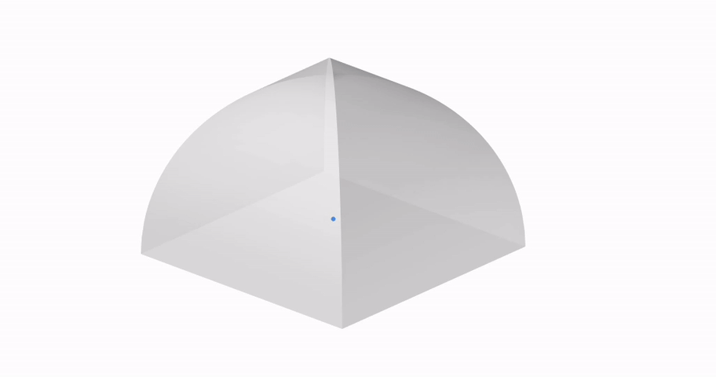

# Dynamic Simulation (part 1) - Acoustic Visualization

## Module Summary

In this module, we will cover the fundamental principles of dynamic simulation, and give a short history of acoustic visualization, tracing its evolution and significance, followed by a step-by-step tutorial on acoustic visualization with the Pachyderm plugin.

## Introduction 

### Dynamic simulation

 

*Visualization of Hurricane Irene Diffusion  
from 'An Agent-Based Model of Urgent Diffusion in Social Media'*

Dynamic simulation refers to computational methods for modeling and analyzing systems that exhibit time-dependent behaviors and evolving states. Unlike static simulations, which focus on equilibrium conditions, dynamic simulations capture changes in system variables and responses over time. These simulations enable the exploration of transient phenomena and evolving patterns within complex systems.

1. Temporal Evolution: Dynamic simulations capture the temporal evolution of system variables, allowing users to analyze how system behavior changes over time in response to various inputs and conditions.

2. Complex Interactions: Dynamic simulations model complex interactions between system components or agents, considering feedback loops, nonlinearities, and emergent behaviors that arise from the interactions among system elements.

3. Scenario Exploration: Dynamic simulations facilitate scenario exploration by allowing users to simulate different scenarios, interventions, or perturbations and observe the system's response, helping to identify optimal strategies or understand system vulnerabilities.

4. Prediction and Forecasting: Dynamic simulations support prediction and forecasting by extrapolating current system behavior into the future, providing insights into long-term trends, potential system states, and the consequences of policy decisions or interventions.

### A Short History of Acoustic Visualization 

In the field of acoustic visualization, computational simulation proves valuable in its ability to portray multi-dimensional, time-dependent data, particularly since sound has been inherently difficult to communicate visually. 

Space and sound share an intrinsic connection: sound is as much a spatial experience as space is a sonic one. Early civilizations relied on empirical methods to achieve desired acoustics and optimize sound amplification in places of worship or performance.

One of the earliest attempts at visualizing sound waves emerged in the late 18th century with the work of Ernst Chladni, a German physicist and musician. Using metal plates covered in sand or powder, known as Chladni plates, and by vibrating them with a violin bow or other tools, Chladni observed intricate patterns forming in the sand. These patterns revealed the nodal lines of the vibrating plate, providing a rudimentary visualization of sound waves.

*Chladni Figures, 1787*

The 19th century saw advancements in experimental apparatus that led to sophisticated methods for acoustic visualization. One of these methods is August Toepler's Schlieren photography, a technique for seeing traveling waves, which captured images of sound waves by detecting changes in air density.

*Shock wave visualization from a bullet fired from a pistol*

Another early acoustic visualization technique was the shadowgraph, a type of flow visualization, that allowed physicist W.C. Sabine to develop a deeper understanding of the behavior of sound in auditoriums. In the 1930s, Franz Max Osswald, expanded on Sabine's methods, experimenting with sound photographs in architectural models.

*Franz Max Osswald, contact print of sound photographs in architectural models*

Exploring representations of sound illuminates the ways in which transferring various media, scaling architectural models, and interpreting information can impact architectural design. Iannis Xenakis, who is known for his exploration of the relationship between architecture and music, exemplifies the impact of sound representation in design. Xenakis collaborated with Le Corbusier to design the Philips Pavilion for the 1958 Brussels World's Fair, the first electronic-spatial environment to combine architecture, film, light, and music into an immersive experience. The reinforced concrete pavilion was a cluster of nine hyperbolic paraboloids, inspired by his musical composition Metastaseis.  Within this ephemeral structure, music was spatialized by sound projectionists using telephone dials.

*1958 Philips Pavilion, Xenakis and Le Corbusier*

In recent years, the field of acoustic visualization has continued to evolve, driven by the refinement and application of computer simulation methods, as well as innovations in imaging technologies.

### Acoustic Visualization in Grasshopper

Acoustic Simulation in three dimensional space is typically conducted using  "task-specific" acoustic simulation software packages. n Grasshopper, sound dispersion was often approximated with definitions imitating acoustic ray tracing. However, Arthur van der Harten's plugin Pachyderm expands Grasshopper's capabilities in acoustic simulation, allowing for more comprehensive sound dispersion modeling.

 

Pachyderm Acoustic Simulation is a collection of acoustics simulation algorithms that can be used to predict noise, visualize sound propagation, and critically listen to designed spaces. Pachyderm includes geometrical acoustics (ray-tracing and image source with enhancements, and visualization), Finite Volume Method (with several built-in applications, including eigen-frequencies, 3d scattering coefficient prediction, and visualization), and Transfer Matrix techniques for calculation of acoustic absorption which can be applied in the simulation techniques.

## Acoustic Visualization with Pachyderm

### Step 1: Install Pachyderm

We will start this tutorial by downloading the Pachyderm plugin from the  **Food4Rhino** website. Unlike other Grasshopper plugins, Pachyderm comes as an executable file with its own installer. Once downloaded, we'll run the executable file to start the installation process.

It's worth noting that while Pachyderm can be run directly in Rhino through its command line, its capabilities are expanded when integrated with Grasshopper.

There should now be an Acoustics tab in the Grasshopper toolbar, with components under the panels  analysis, audio, computation, model, utility, and visualization.

---

### Step 2: Set Up Scene for Acoustic Visualization

We begin by creating a simple geometry to explore how Pachyderm functions. From the Rhino command line, generate a box with dimensions of 80 feet width, 80 feet depth, and 40 feet height. Let's make sure we are using feet as the unit of measurement, not inches, as the size of the room significantly influences the simulation of sound dispersion, rather than just its proportions.

Now that we have our geometry, let's transition to Grasshopper and assign the box we just created to a `Brep` component. To convert this geometry into data that Pachyderm can use for acoustic operations, we'll introduce the `Polygon Scene` component. This component constructs a scene from existing Rhino or Grasshopper geometries. It requires four inputs:

1. Rhino Geometry: Does the component obtain the geometry from the Rhinoceros Model? (type of input: boolean)
2. Grasshopper Geometry: Grasshopper Geometry (type of input: geometry)
3. Grasshopper Layers: For each Grasshopper Geometry, indicate what layer to copy acoustical properties from (type of input: integer)
4. Voxel Grid Depth: Number of voxels in each dimension (type of input: integer)

We'll proceed by connecting the `Brep` containing our box to the Grasshopper Geometry input. Then, we'll insert a `Boolean Toggle` component set to False in the Rhino Geometry input, preventing it from searching for geometry in Rhino.

We'll keep the Voxel Grid Depth unchanged. To define the layer `Polygon Scene` should use to get its material qualities, we need to specify that our Brep is in layer 0. To do this, we can connect a `Panel` component where we write "0" to the Grasshopper Layers input, and the `Polygon Scene` component will run normally.

However, we want to use this setup to eventually iterate through the room's shape, sometimes having multiple Breps as inputs for the Grasshopper Geometry. Let's construct a list of indices that will correspond to every Brep, by bringing in the component `Repeat Data`. This components needs two inputs: 

1. Data: Pattern to repeat (type of input: generic data)
2. Length: Length of final pattern (type of input: integer)

We connect the "0" Panel to the Data input. Next, we get the length of the list of Breps through a `List Length` component which we connect to the Length input of `Repeat Data` in order to define the amount of times the data needs to be repeated. The output of the `Repeat Data` will in turn be plugged into the Grasshopper Layers input for `Polygon Scene`. 

After setting up the Grasshopper components, we need to return to the Rhino viewport and type `PachyDerm_Acoustic` in the command line. This action prompts a window with three tabs: Impulse, Materials, and Analysis.

In the Materials tab, we will define the layer as Default from the dropdown list, which corresponds to the layer where our breps are located. Additionally, within the material library, we can choose a specific material. For this example, let's select the Plaster material.

---

### Step 3: Set Up Sound Source

Next, we need to define the sound source in our scene. From the Model panel of the Pachyderm plugin, we select the `Geodesic Source` component, which creates a geodesic omnidirectional source object. Its inputs are:

1. Origin: Acoustic center of the sound source (type of input: point)
2. Power: The power spectrum for the source (type of input: data list)
3. Delay: Signal delay (type of input: integer)

For the acoustic center of our sound source, we set a point in the Rhino viewport, making sure it is located within our Box geometry. We then assign it to a `Point` component, before connecting it to the `Geodesic Source` Origin input.

The Power input is set by default as a list of 8 values at 120 decibel, which works with the premise of our example, so we will leave it unchanged. Similarly, since we don't intend to introduce delay in our acoustic model, we leave the Delay input as is, with a value of 0.

---

### Step 4: Set Up Ray Directions 

For the next step, we will need to download another Grasshopper plugin from the  **Food4Rhino** website, called Pufferfish. The process for installing a Grasshopper plugin can be found [here](https://smorgasbord.cdp.arch.columbia.edu/modules/5-computational-design-modeling-in-grasshopper/5-3-Analysis-Tools). Pufferfish is a plugin that enhances Grasshopper's capabilities in manipulating meshes and NURBS, allowing for changes in their shapes. 

In our tutorial, we'll take advantage of Pufferfish's Vector Panel to visualize how sound is dispersed in space. Specifically, we use the component `Vector Star` which creates a plane-oriented,recursive, spatial subdivision of vectors outward from a base planes origin. Its inputs are:

1. Plane: Base plane for vector star orientation and location (type of input: plane)
2. Steps: Number of recursive subdivision steps	(type of input: integer)
3. Subdivision Type: Determines how the vector star is subdivided (type of input: integer)
4. Dimensionality: True for 2D. False for 3D (type of input: boolean)

In the first input, Plane, we will connect our `Point` sound source. For the second input, number of subdivision steps, we can plug in a `Slider` that we set to 50. This slider allows us to increase or decrease the number of output vectors accordingly. We will keep Subdivision type as default, as well as Dimensionality, which is automatically set to 3D. 

The vector array produced is omnidirectional. However, sound sources are often directional (a person speaking, a speaker with a specific orientation). To emulate the directional nature of a sound source, we will select the vectors that are facing one side of the room.

We start by deconstructing the output vectors from the `Vector Star` component into their xyz coordinates using the `Deconstruct Vector` component. Next, we use a `Larger Than` component to sort the y coordinates that are larger than zero. This generates a true or false list, which we plug into a `Cull Pattern` component. 

We can visualize the outcome using the `Vector Display` component where we plug in our `Point` sound source and the list from `Cull Pattern`.

---

### Step 5: Ray Visualization

With our geometry, sound source, and directional sound source rays in place, we can now combine them to visualize how sound will propagate within this geometry.

The component we will use to visualize spatial acoustics is `Visualize Pachyderm Rays`, which casts specular rays on the geometry specified, and returns the ray paths as polylines. 

Let's take a look at its inputs:

1. Room Model: The Pachyderm Room Model Reference (type of input: data)
2. Source:	Sound Source Object	(type of input: data)
3. Ray Directions: The initial direction of each ray (type of input: vector)
4. Terminating Surface: Terminating Surface	(type of input: Brep)
5. Number of Bounces:	Number of times the ray will reflect before terminating	(type of input: integer)

We connect the `Polygon Scene` component from Step 2 in the Room Model input, the `Geodesic Source` component from Step 3 in the Source input, and the output of the `Cull Pattern` component from Step 4 to the Ray Directions input.

As we don't need to set a Terminating Surface, we can leave this input unchanged. Regarding the Number of Bounces, we can set it to 3 through a `Slider` component. We can increase this number as desired, but keep in mind that larger values will increase the computational load (and might crash your script).

We have now visualized the sound propagation in our geometry through ray paths as polylines.

---

### Step 6: Sound Particles Visualization

The image above demonstrates that ray visualization is not the most effective method for understanding how sound interacts with geometry over time. Sound particle visualization is commonly used to represent the movement of sound in space.

To achieve this visualization, we will use the output Ray Curves from `Visualize Pachyderm Rays`, and have particles follow the path of sound. We can do that with the `Evaluate Length` component, which allows us to move points proportionally along the rays. Its inputs are:

1. Curve: Curve to evaluate	(type of input: curve)
2. Length: Length factor for curve evaluation (type of input: number)
3. Normalized: If True, the Length factor is normalized (type of input: boolean)

In the curve input, we plug in the output Ray Curves from `Visualize Pachyderm Rays`. We also connect a `Boolean Toggle` component set to False, because we don't want to normalize these curves.

To determine the length factor for curve evaluation, we sort the list of Ray Curves with the `Sort` component and reverse that output in order to get the longest curve with `List Item`= "0". We then connect this longest curve to a `Multiplication` component, along with a `Slider` ranging from 0 to 1. This gives us the range of all curves, with the smallest one represented by 0 and the longest one by 1 times the longest length. Finally, we plug these values into the Length input of `Evaluate Length`.

By adjusting the `Slider` connected to the `Multiplication` component, we can evaluate our curves from 0 (the initial position for particles) up to the maximum length possible (longest length * 1). This enables our sound particle animation to unfold dynamically, giving us a comprehensive visualization of sound propagation in space.

---

### Step 7: Geometry Iterations

To further explore the relationship between spatial geometry and sound propagation, let's examine how sound behaves in a space with a vaulted ceiling instead of a flat one.

We start by drawing an arc in the Rhino Viewport's top view, with the center at the midpoint of our rectangle footprint and a radius equal to the diagonal distance from the rectangle's center to its corner. We then switch to the Perspective view to rotate the curve in 3D, forming an arc across the rectangle. We mirror this curve diagonally across the rectangle.

We select the two arcs and loft them, and then mirror the lofted surface to complete the enclosure. We also make sure we create a rectangular surface that represents the floor of the room. 

With the new geometry created, let's assign the three surfaces to a new `Brep` component in our Grasshopper script. This component will replace our previous Box geometry.

We will need to connect it to the `List Length` component and the Grasshopper Geometry input in the `Polygon Scene` component. Before recomputing sound propagation, disable the `Visualize Pachyderm Rays` component to prevent software crashes.

If we go back to the `Slider` that controls the particle visualization and scrub it, we can see how sound behaves differently in this structure.

---

### Experimentation:

Take time to experiment with the model, exploring various geometries and configurations. Consider introducing internal geometries that will interfere with the way sound propagates. Test different materials, from glass to plywood, and observe how the absorption coefficient impacts the space's acoustics.

