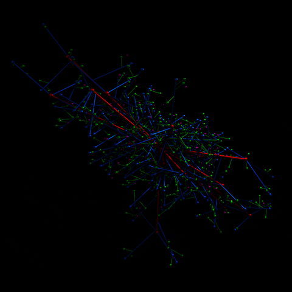

# Sequence: Integrated Computational Simulation in Design

 

## Sequence Summary:

In this tutorial sequence, we will explore Grasshopper’s versatile capabilities for simulation. Our examples will span from physics-based structural simulations, including tensile membranes and inflatable structures, to dynamic system simulations like crowd movement and acoustic visualization. 

## Why?

 Simulation within Grasshopper can be a really valuable tool, both for analysis and for design. You can use it to examine and gain insights into structures or systems, or as a supplementary aid in the design process. As designers, you'll find that simulation provides immediate and direct visual feedback, facilitating a closer examination of the mechanisms at work. It also allows you to introduce complexity as needed into your system as you refine your design solutions. 
 

## Modules:

1. Interactive Physics Simulation (part 1) - Tensile Surface Form Finding
2. Interactive Physics Simulation (part 2) - Inflatable Structures
3. Dynamic Simulation (part 1) - Acoustic Visualization
4. Dynamic Simulation (part 2) - Crowd Simulation

