# Graphing Tabular Data

The first information format we'll be bringing in to Grasshopper is data organized in a table of rows and columns (in other words, a spreadsheet). This tutorial will cover creating a graph of a numerical dataset, visually styling it, annotating it, and finally adding interactivity which can be animated and exported.

## Downloading a Dataset

For this tutorial we'll use a public dataset from [New York City's Open Data](https://opendata.cityofnewyork.us/) portal: [COVID-19 Daily Counts of Cases, Hospitalizations, and Deaths](https://data.cityofnewyork.us/Health/COVID-19-Daily-Counts-of-Cases-Hospitalizations-an/rc75-m7u3). The "Export" button at the top right of the page will allow you to download the latest version of the dataset as a CSV file.

CSV (Comma Serparated Values) is a typical format for tabular data in computational contexts. You can open it in Excel to see and edit the data:

 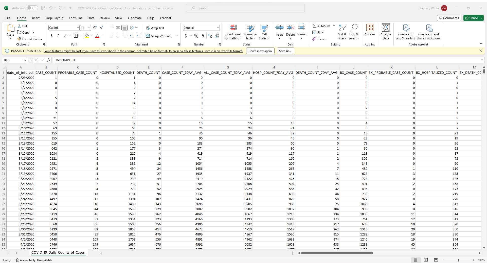

But you can also see the raw contents of the file by opening it in a basic text editor:

 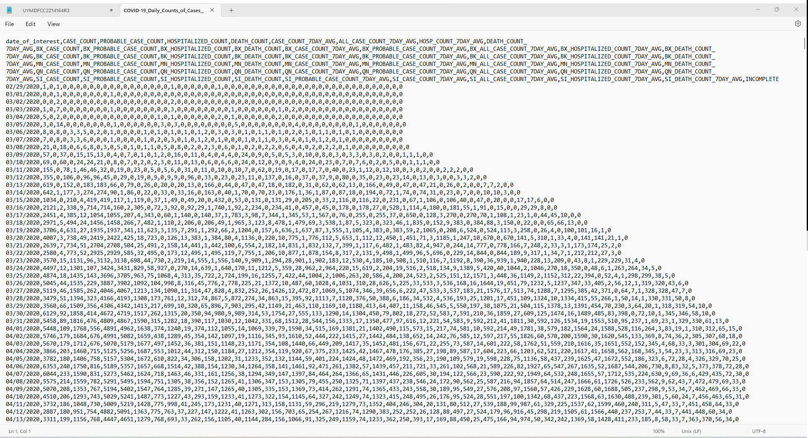

Here you can see the structure of a CSV dataset, which is just a text file where columns are separated by commas and rows are separated by line breaks. *Note that since commas are being used to separate columns, it's important that there aren't any commas in the data itself.*

To start interpreting this data, create a new Rhino file and open Grasshopper.

## Importing the Data

Interpreting the file will be easier using a `Read CSV` component, which is part of the LunchBox plugin. If you don't have it already, [you can download LunchBox here](https://www.food4rhino.com/en/app/lunchbox). Later on we'll also be using a plugin called [Human](https://www.food4rhino.com/en/app/human), so install that one too.

 Create a new Rhino file and open Grasshopper. Add `File Path`, `Read File`, and `Read CSV` components to the canvas, and connect them like so:

 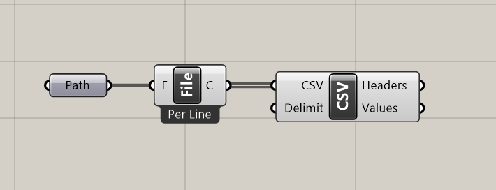

 Right click the `Path` module, choose "Select One Existing File," and navigate to the dataset we downloaded earlier.

 The "Headers" output will tell you what information is stored in each column, and you can isolate columns with the `Tree Branch` component. Using panels to preview the outputs should look something like this:

  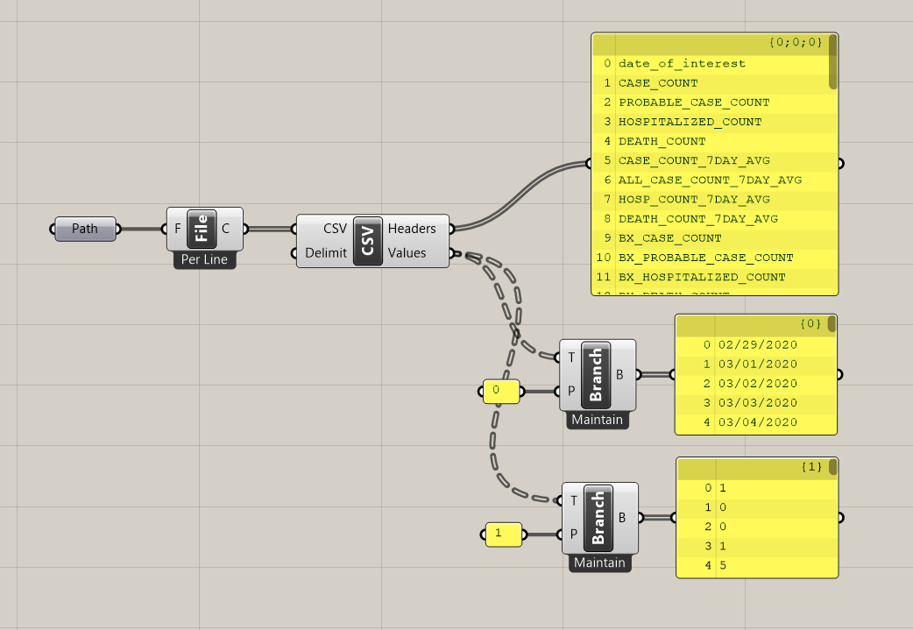

  You can see that plugging 0 into `Tree Branch` gives a list of dates, corresponding to index 0 from the list of headers ("dates_of_interest"). Tree Branch 1 (for "CASE_COUNT") returns a list of integers, the number of cases reported each day. The index of each item in those lists are from the same row in the original table, meaning they correlate with each other: on date 0 (02/29/2020) there was 1 case, on date 1 (03/01/2020) zero cases, and so on.

  ## Graphing the Data

  We aren't interested in partuclar dates at the moment, so let's focus on the case counts, and draw a line graph of the number of cases over time.
  
  For the *x* axis, number of days, we just need evenly spaced values, as many as there are data points. For this we can use a `Series` component, plugging the length of the data set into the "Count" input. That series can then plug into the "X coordinate" input of a `Construct Point` node.

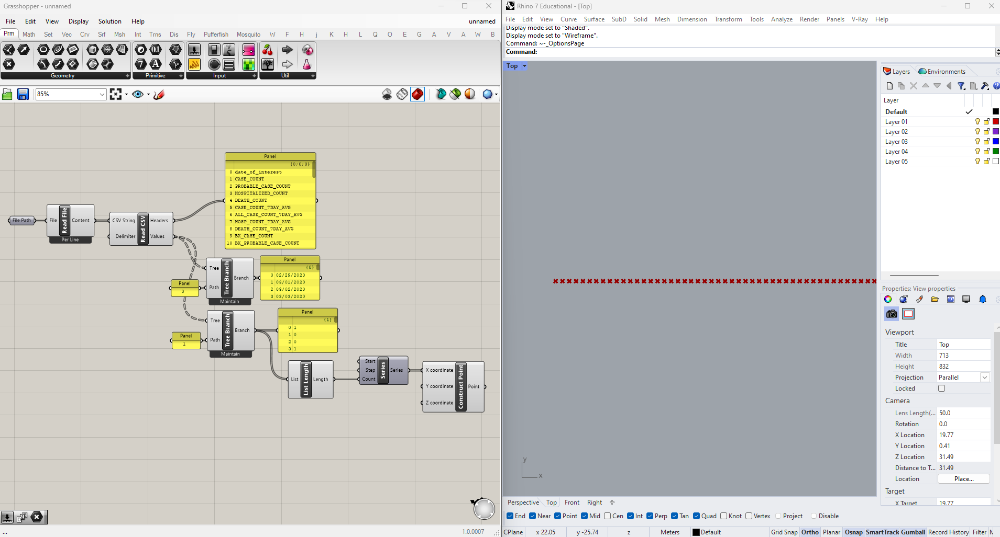

For the *y* values we just plug in the list of case counts, connect them with a `Polyline`, and we'll have our line graph. We do need to scale the values to fit nicely on a the screen though, so we'll pass them through a `Multiply` node with a slider before connecting them to `Construct Point`. I've also hidden everything but the line by selecting the nodes I want to hide, right-clicking on the canvas, and selecting "Preview Off."

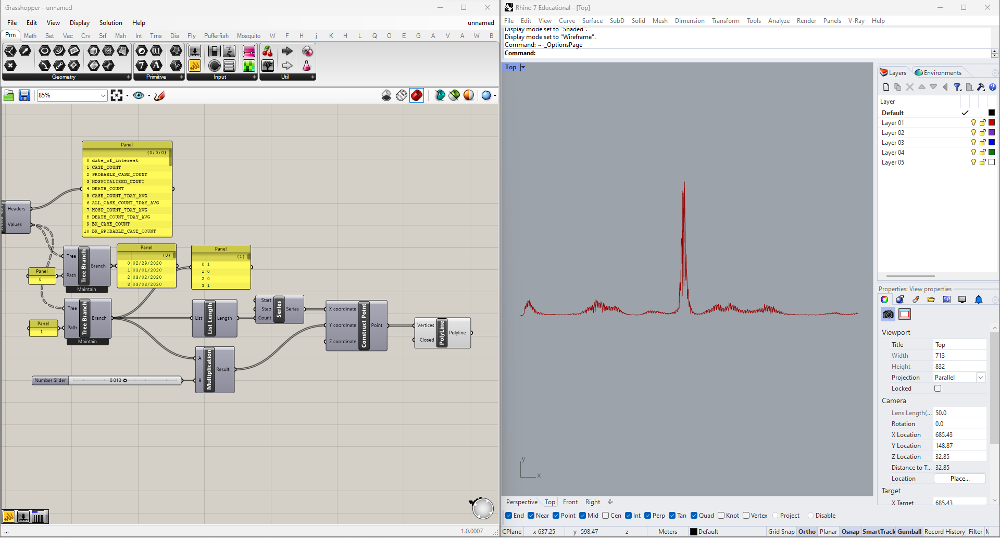

You can see the graph is very jagged, with a regular 7-day cycle of dips and spikes. This adds a lot of noise to the graph without telling us anything about the disease: it's just an artefact of the data collection methodology (it turns out that cases occuring over the weekend are often not reported until the following week). What would be more informative is a **rolling 7-day average** of case counts. With a little math we could do this ourselves, but fortunately it's already column 5 in the dataset ("CASE_COUNT_7DAY_AVG").

Using the same method as before, we can graph this second series on top of the first one, but the result won't be very legible. We could `bake` the lines and style them in Rhino, or export the vectors to Illustrator, but let's keep things nimble and interactive by doing this part in Grasshopper too.

## Styling the Graph

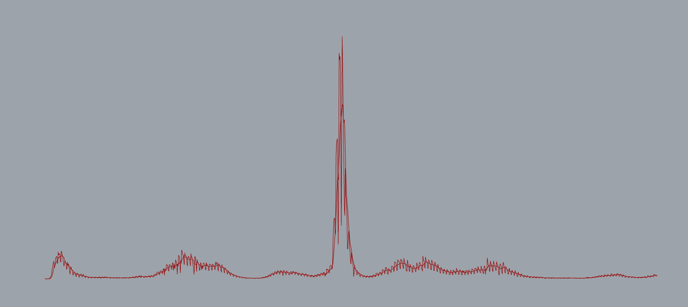

You can change the display color of geometry using vanilla Grasshopper, but if we want to change the weights of the lines as well we'll need the **Human** plugin we installed earlier.

Using Human's `Custom Preview Line Weights` node we can give the graph of averages more visual weight than the daily counts: I've gone with a reddish 3-pixel line and changed the Rhino background to black. For visual clarity I've also replaced the line graph of the daily counts with a darker bar graph, drawing lines from each data point down to the *x* axis. To ensure that the line tracking the averages appears above the daily counts, I've added values to the Z inputs on both `Construct Point` components.

Lastly I've added one more line, in orange, to track the 7-day average death toll (column 8 in the dataset). To make it easier to compare to the case counts it has its own scaling factor. Looking at both graphs overlaid illustrates a time lag between cases and mortality rates, as well as the changing relationship between the two (presumably an effect of improved treatment methods and the rollout of vaccines).

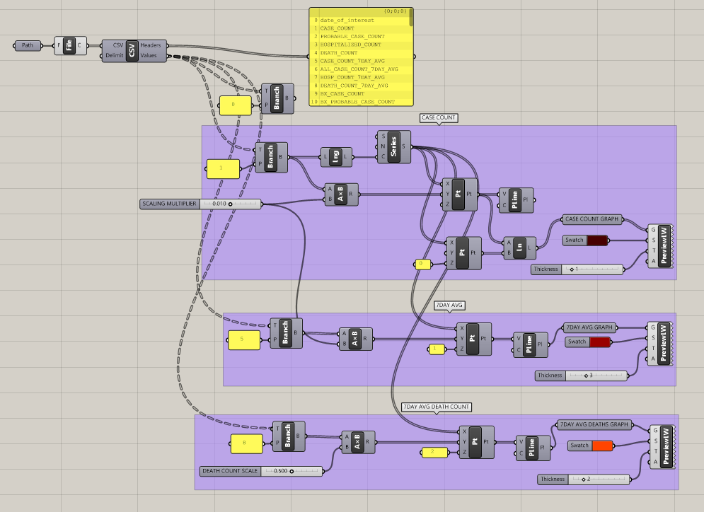

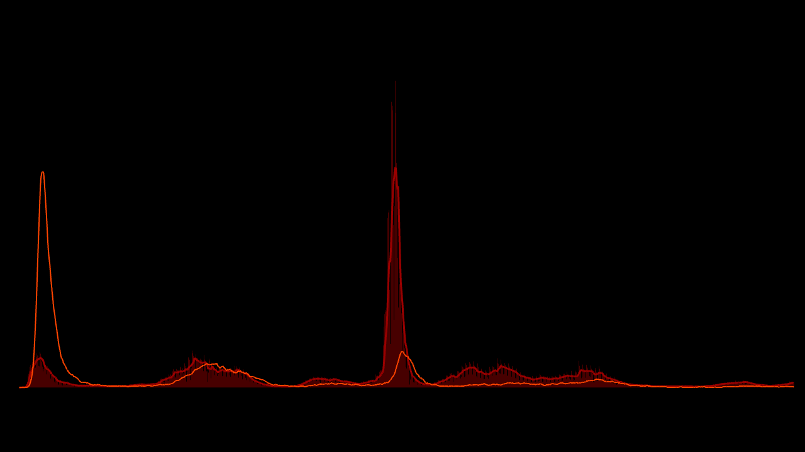

# Annotating the Graph

This is looking a lot better, but it doesn't contain any numerical information. To understand what we're looking at better we'll add labels to both axes as well as grid lines.

Let's start by labelling the dates, on the *x*-axis. Obviously there isn't room for each day, so we'll do months and years. **Our goal here is to add all the labels parametrically**, so they'll adjust automatically if we update the data set, rescale the graph, etc.

The process for creating the date labels is, broadly:
- Identify dates which have a month value different from the previous date.
- Use this information to isolate data points on the graph corresponding to the first day of each month.
- Add text labels at the bottom of the graph using the x component of those data points.
Repeat the same process to label years.

Here's a more detailed look at each of those steps, and the results:

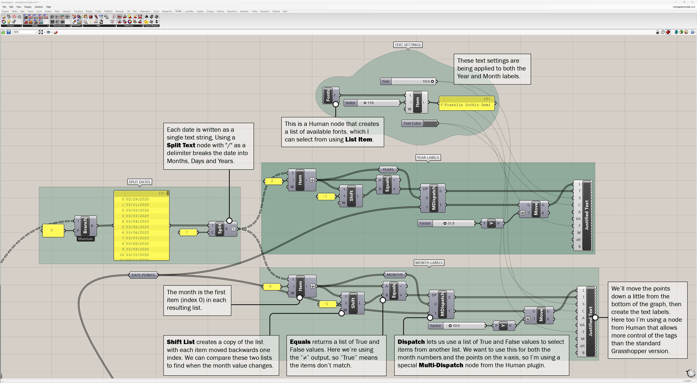
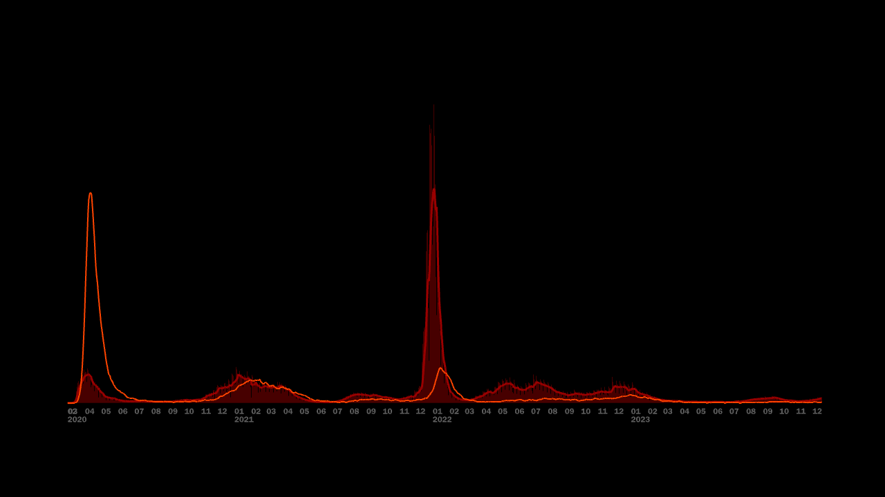

Now we'll add the grid lines and Y-axis labels for both case counts and death counts. Here's how:
- For the horizontals simply make a series of lines, adjusting their spacing and number by eye. We do want to make sure we pick intervals that give round numbers for both of our data sets, though we can always adjust for this later on.
- Use the same scaling factors we used when graphing the data to determine what values each grid lines represents.
- Add tags for these values at either end of each grid line.
- Draw a vertical line on the grid for each month.

Again, a more detailed look at how this is done, along with the results:

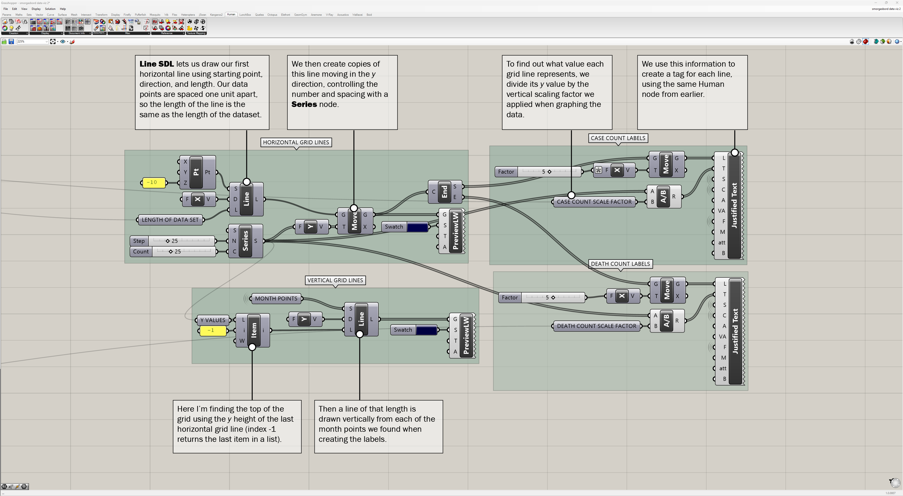
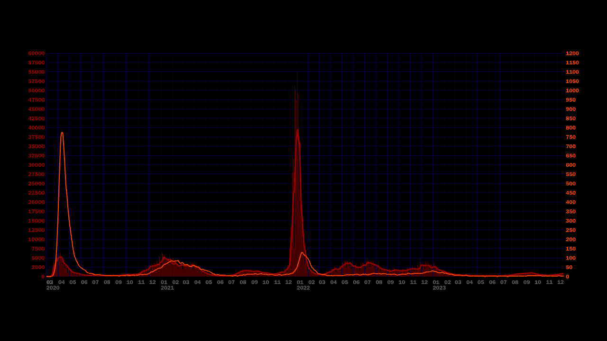

# Interactivity

We've successfully created a static graph, but maybe by adding some interactivity we can extract more information from this dataset. For instance, we can now see the number of cases and deaths from COVID that are reported on each day, and how that value changes over time, but what about the *total* number of cases and deaths up to a particular date? Let's add a slider which will let us scrub through dates and see the totals as we do so.

The first step is creating the slider that lets us choose a date. This input should work for any arbitrary list of dates, so we'll use a slider that goes from 0 to 1, then remap that parameter to the indices of our source data. The result looks like this:

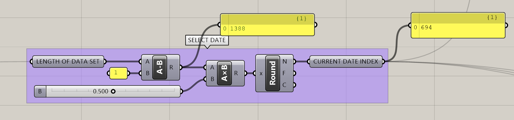

The value of the slider is multiplied by the length of the list, minus one (since the first index is 0, the length of a list is always one more than the index of the last item). Then we round the result to an integer to get our date index.

Next let's add a vertical line to the graph to mark the current position of the slider. We can do this the same way we created our vertical grid lines, but using the slider we just made to choose the index of our starting point. That gives us the following:

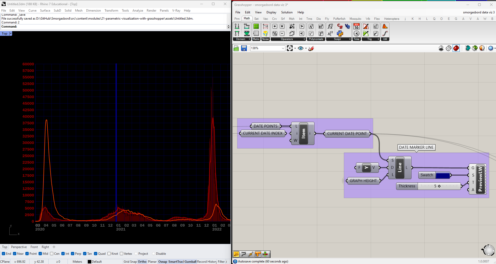

Now we can move on to visualizing the total reported cases and fatalities. We can (and will) do this with numbers, but we can also show it graphically by highlighting the area underneath each curve. We'll create a closed `Polyline`, fill it in using `BoundarySrf`, and then tailor its appearance using another Human component, `CustomPreviewMaterials`.

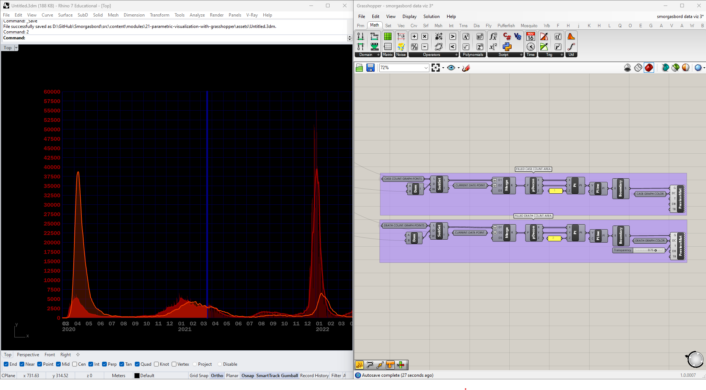

Next we'll add points for placing tags of the current date and totals, relative to the top left of the graph:

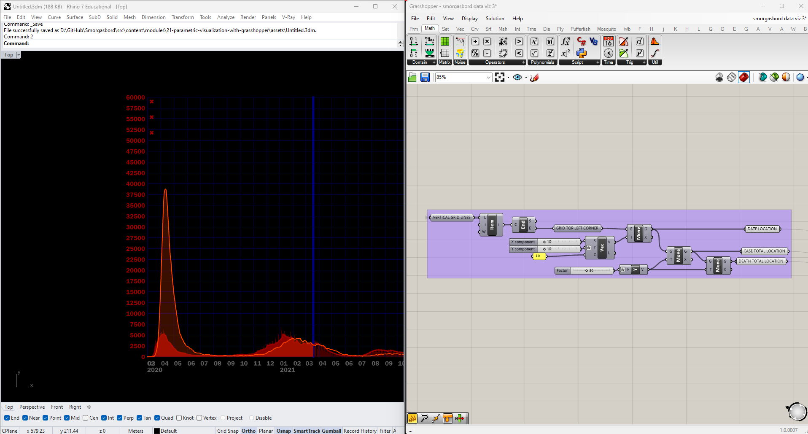

And then add the tags:

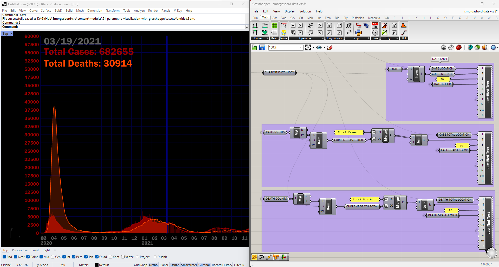

Now we have a graph we can scrub through using our slider:

# Animation

Our last step in this tutorial will be exporting this interactive slider as an animation. Grasshopper makes this easy: just right-click any slider, select "Animation," and choose your file location, resolution, and frame count.

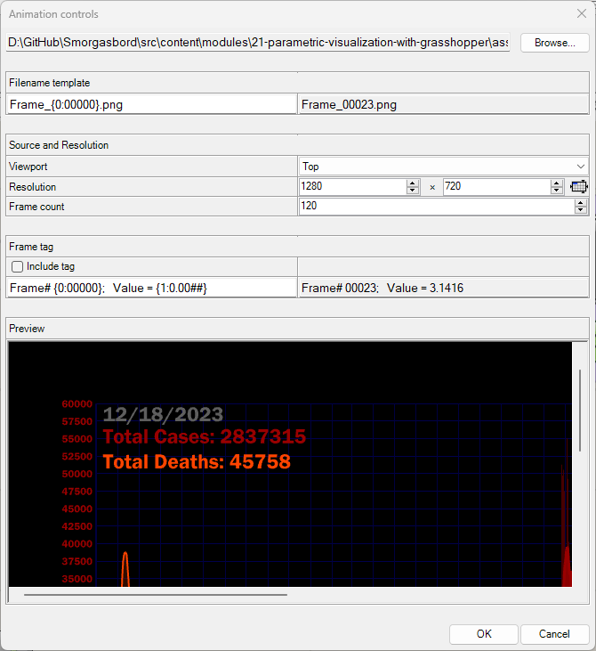

Click "OK" and Grasshopper will export a series of frames you can compile in Photoshop or After Effects.

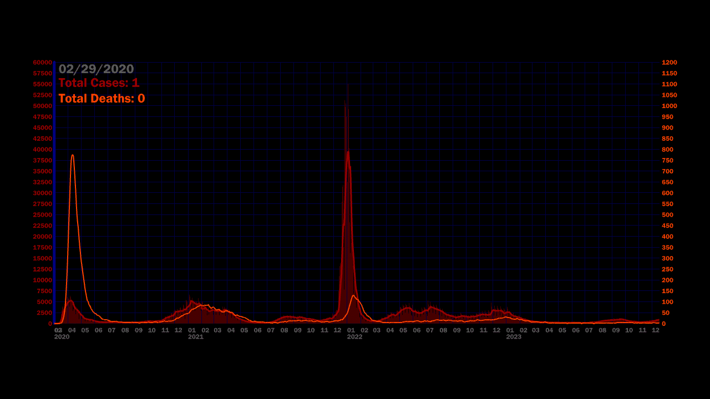

# Further Experimentation

Now that we've graphed a dataset, here are some things to try on your own:
- Incorporate another parameter from the dataset into the current graph
- Graph another dataset from NYC Open Data
- Create an animated graph in three dimensions