# Analyzing Media

In this tutorial we'll move away from tabular data to look at another source of information: images, video and audio. In a digital context all these media are just collections of numbers, every bit as much as a tabular dataset is, allowing us to analyze, interpret, and translate them into other forms. They introduce new difficulties though, in that:

- The number of raw data points tends to be much larger. A single HD image contains 1920x1080 pixels, each with red, green, and blue color values, for a total of 6.2 million values.
- The semantic content is much harder to extract from the raw data.

While Grasshopper can 

Recs for other tools:
OpenCV
MediaPipe
Speech to text ??

This tutorial will use a few new plugins.
- Firefly
- Mosquito

## Loading an Image into Grasshopper

We'll begin by creating a new Grasshopper script and dropping in an `Import Image` node (found under "Input" in the "Param" tab). Connect a `File Path` node, and right-click it to select an image to work with. I've chosen a photograph by the artist Cindy Sherman, but you're free to experiment with something else.

Once your file is loaded, the image should appear in your Rhino viewport as a rectangular mesh, with vertex colors sampled from your source image. It will probably be hard to see through the mesh edges, but you can hide these by unchecking "Preview Mesh Edges" in the Display menu, or using the shortcut `ctrl+m`.

At this point each vertex of our mesh has an RGB color value taken from the image, one pixel per vertex. To access the color values directly we can use a `DeconstructMesh` node and read the "C" output.

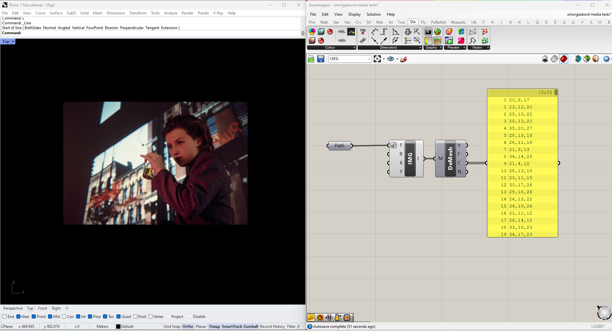

Because I'm using a high-resolution image there are 540,000 of values, which is a bit excessive. To reduce the number of pixels sample plug a number slider into the X and Y values of the `Import Image` node. I'm going to start with 64 samples in each direction (4096 total)--we can always increase it later if we need to. You should see the change in resolution reflected in the mesh.

## RGB Color Analysis

Let's see what we can do with these colors. To start, we can just look at them all side by side. I'm going to draw a horizontal line using `Line SDL`, `Divide` it into the same number of segments as there aree colors (which I get using `List Length`), and then draw a vertical line from each of the resulting points. I can then plug both the vertical lines and colors into a `Custom Preview Line Weights` node.

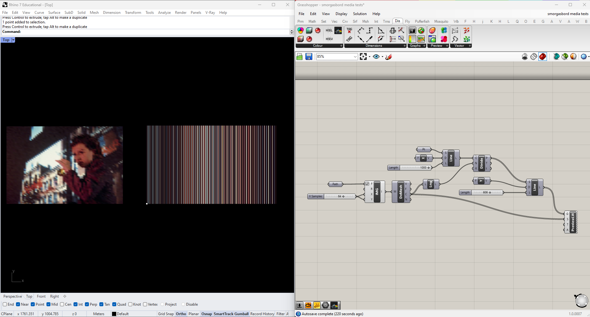

The result is an abstracted view of the image's color palette. Here the ordering of the colors is still determined by the content of the original image. even though mesh vertices are theoretically unordered, the way this particular mesh has been built results in a clear pattern of repeating bands. Let's try introducing another level of abstraction by giving the colors a deliberate order.

To break out the individual red, green and blue values of each color we can use `Split ARGB` node, found in the Color section of the Display tab. Let's start by sorting our lines by one of these values. The `Sort List` node orders a given list from low to high, with the added option of sorting additional lists by the same metric. If we plug our "R" values into the "K" input and our original mesh vertex colors into the "A" input, the resulting "A" output will return the colors sorted by their red component. Try using this new list to color your lines.

 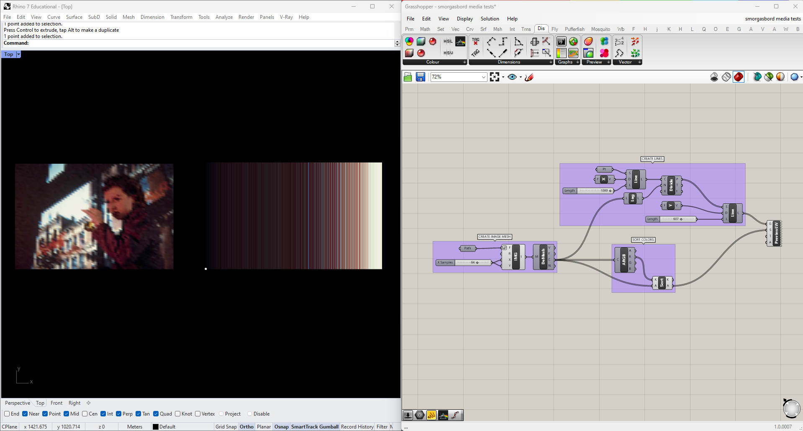

 This is a little better, but now the main effect seems to be that the lines are sorted from dark to light. Try swapping out the red value for green or blue, and you'll see that the result is basically the same.

 The reality is that RGB is the standard digital color format because that's the information our displays need to reproduce colors, but it's often hard to relate those values intuitively to our perception. In this case the result is that we have a three-dimensional dataset, and yet sorting the data along each dimensions produces no meaningful variation in the outcome. Let's try a different approach.

 HSV (for Hue, Saturation, and Value), is a color system that often maps to our perception more intuitively. We can convert our colors to this format using the `Split HSV` node, located in the same panel where we found `Split ARGB`. I'm going to try sorting the colors by each of these three parameters.

  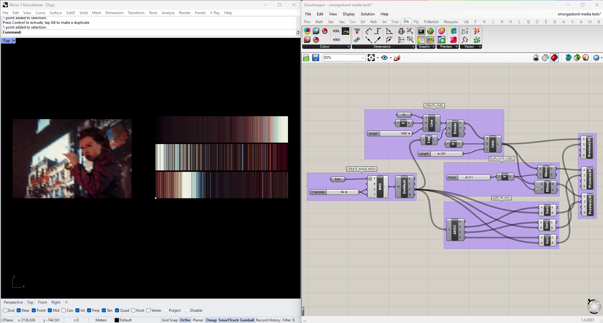

The bottom row is sorted by hue, the middle by saturation, and the top by value. This is becoming a lot more legible, but I think we can do better. For one thing, in each case we're still sorting a 3-dimensional color space along a single dimension. Second, we perceive the hue dimension as circular, rather than linear: pure red is 0, but 0.99 and 0.01 are both *almost* red.

I'm going to incorporate this fact by rearranging my color lines into a circle. To do this I'll draw a `Circle` around a `Point`, use `DivideCurve` on the circle to get as many points as I have lines, and then get the `Vector2pt` from the center to each point on the circle. I can then plug those vectors and the central point into a `LineSDL` node.

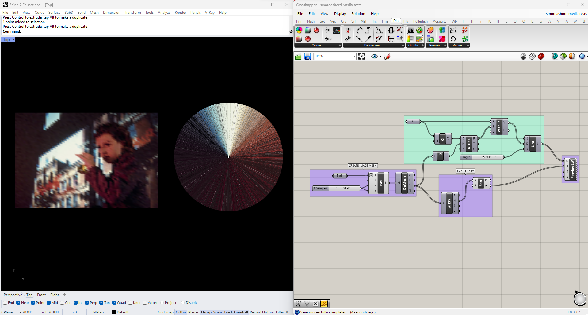

This takes care of the hue issue, but I still want a better way of expressing the other two values in my analysis. Fortunately my visualization already includes a parameter that isn't being used, namely the length of each line. I could try to incorporate a third somehow, maybe by extruding the graph into 3D. But both saturation and value can be thought of as describing the "intensity" of a color, so to keep things simple I'm going to try just averaging them, to compress them into a single dimension. I'll use this average, multiplied by some constant, to get the length of each line. Since this information is now expressed elsewhere I can remove it from the display color of the lines, using a `Colour HSV` node with only a hue input.

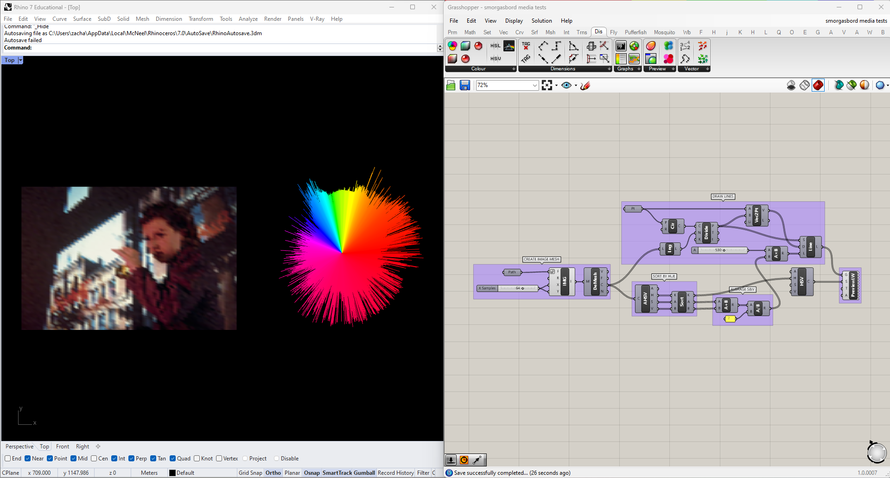

This is getting pretty close. I can clearly see what hue ranges are more prevalent in the image, and how the intensity and consistency vary in different regions of the spectrum. My last tweak will be to even out the "noise" in the saturation and value data, to make the overall shape more legible. I'm going to use Firefly's `Smoothing Moving Average` node for this, but it could be done manually manually with just a little more work.

Once the data is smoothed out, we can try plugging in different images and see how the graph changes.

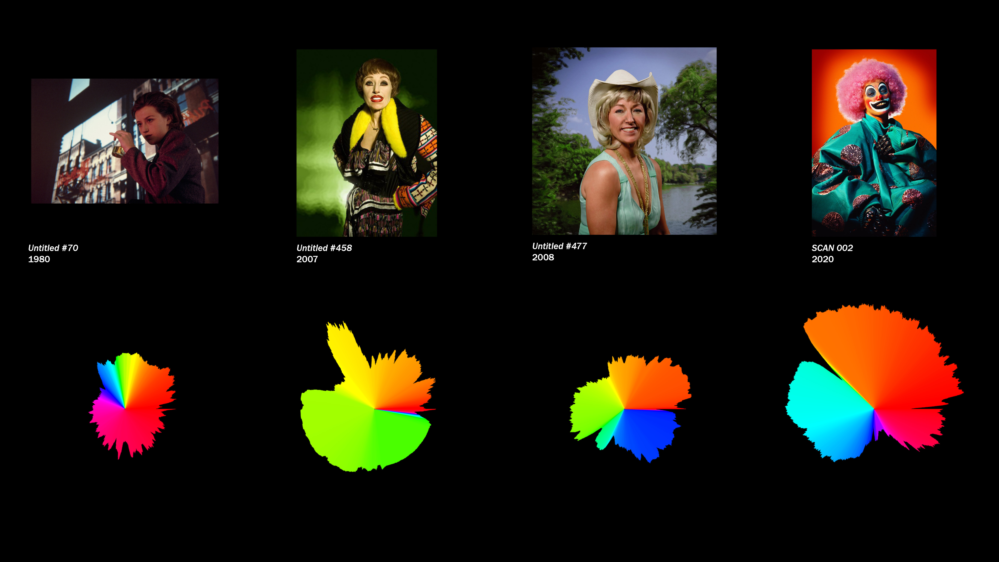

## Generating Geometry from Images

We've analyzed the color content of an image, but what about spatial or geometric data? A simple case would be where pixel data relates to spatial data directly, such as this image from USGS Earth Explorer:

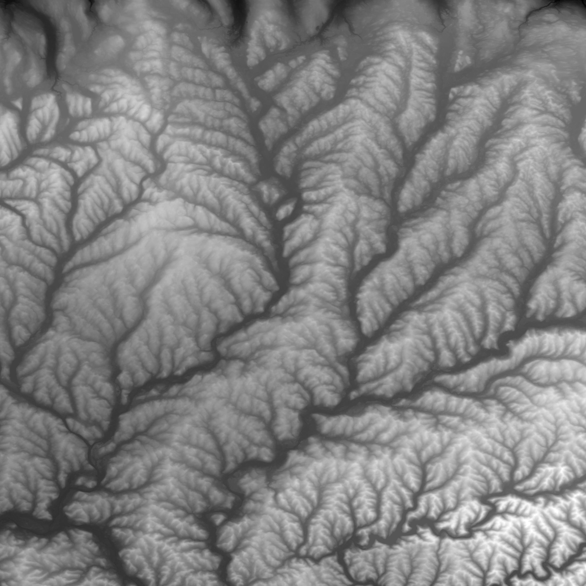

Images like these are a standard way of storing geographical elevation data, and can be used to create topographical maps and models in GIS applications, but we can do a version of the same thing in Grasshopper. Just as we did before, we'll start by:

- Importing the image as a mesh
- Setting the number of X and Y samples (I'm using 256 to start)
- Deconstructing the mesh

This time, we want to use the color data to alter the mesh itself, by moving each vertex upwards in the Z direction. Since it's a grayscale image the R, G and B values are the same, and we can pull any of them using `Split ARGB`. We multiply this number by some factor we can adjust with a slider, move the vertices upwards, and reconstruct the mesh with these new points.

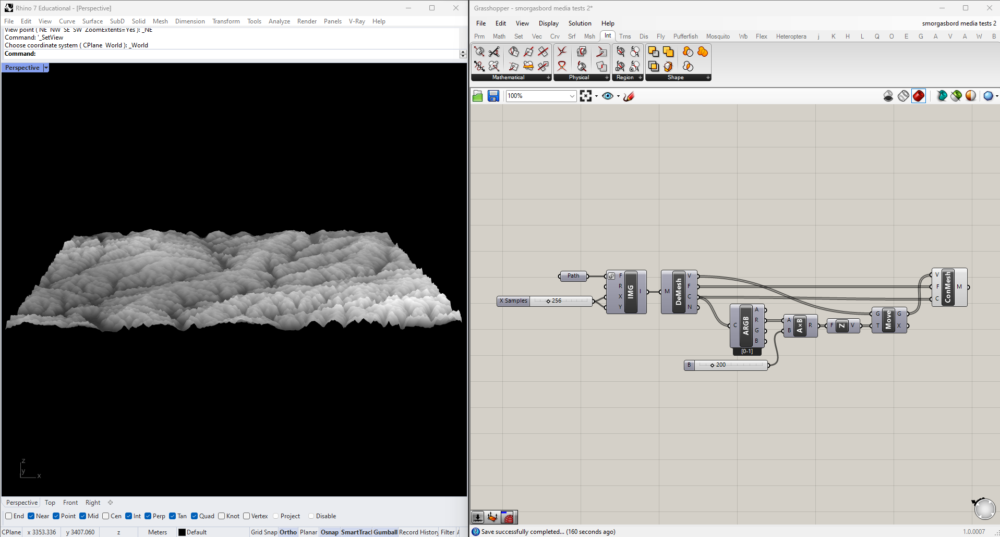

Once we have the mesh in 3D, we also have the ability to derive topo lines from it by cutting contours. We do this with the `Mesh | Plane` intersection node, which in in the "Mathematical" section of the "Intersections" tab. The cutting geometry will be an `XY Plane` moved upwards to each contour height. In the below example I've also color-coded the lines, and increased the mesh resolution for a more precise output.

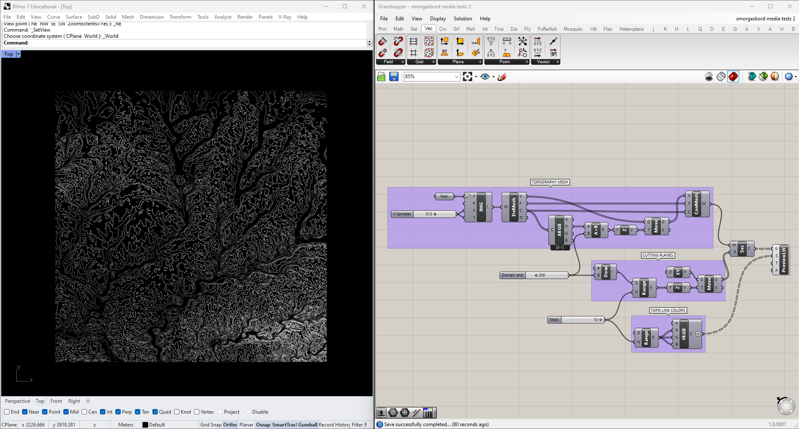

This works for topographical data, but it can be useful for other types of images as well. For instance, we could get vector data from a raster image, such as this Franz Kline painting:

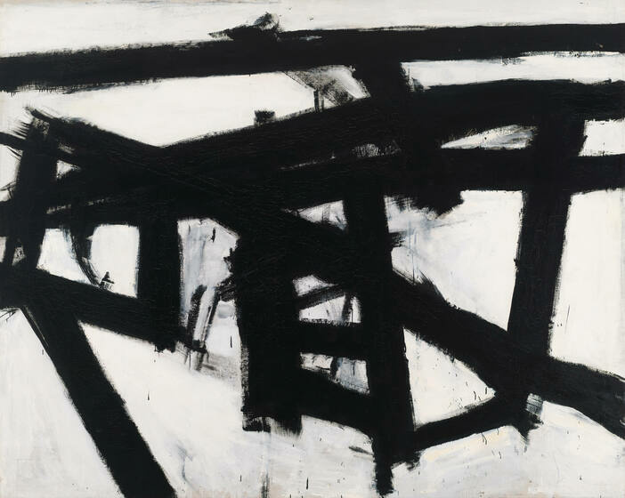
Franz Kline Mahoning 1956 Whitney Museum

I'll plug it into the same script as before, but with a single cutting plane whose height I can adjust manually. To reduce noise I'm also going to filter the curves by `Length`, using a `Dispatch` node to toss out any below an adjustable threshold.

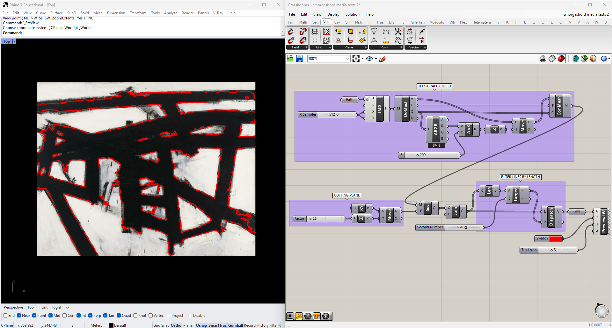

## Video

Now that we know how to work with images, we can try applying those same techniques to video. For this we'll use Firefly, which has components for importing both video files and a live stream from a webcam.

To bring a video stream into Grasshopper, simply drop a `WebCam Video Stream` and a `Mesh from Image` component onto the canvas (both are found in Firefly's "Vision" panel) and connect them. You should see the feed from your camera in the Rhino viewport.

The resulting mesh is functionally the same as the ones we made before from still images, so we can start by plugging it in to the same scripts. I found that the color analysis script was pretty sluggish using the default stream resolution, so I downscaled it by right-clicking the `WebCam Video Stream`.

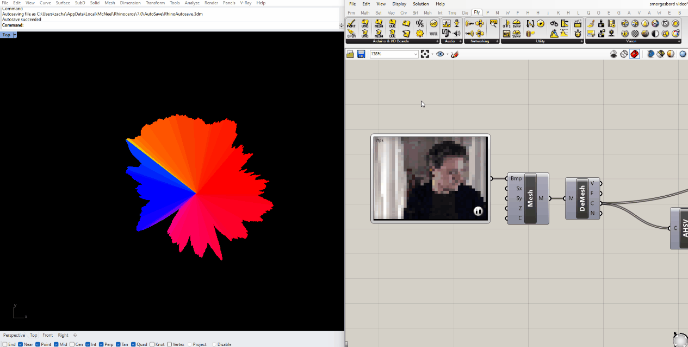

If you look at the mesh in perspective view, you'll see that the 3D height map based on color value is already built in to the component. We can contour that mesh the same way we did for the topographical image, we just have to adjust the upper bound of the domain.

Under controlled circumstances, we could use this same method to find particular elements in a scene. A simple example would be in a scenario would be tracking a dark object on a light background: we just have to place the cutting plane at a height where it consistently cuts through the object, but nothing else in the scene. Here I've placed a black ball on a canvas dropcloth, and aimed my webcam at it:

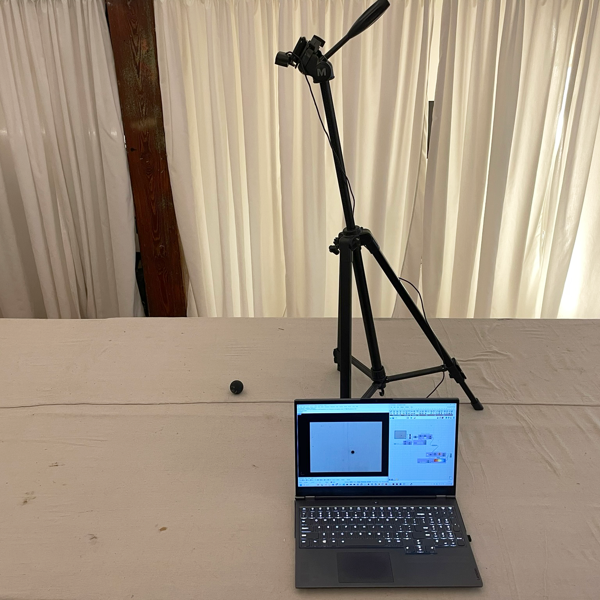

And placed a plane that intersects the ball in Grasshopper:

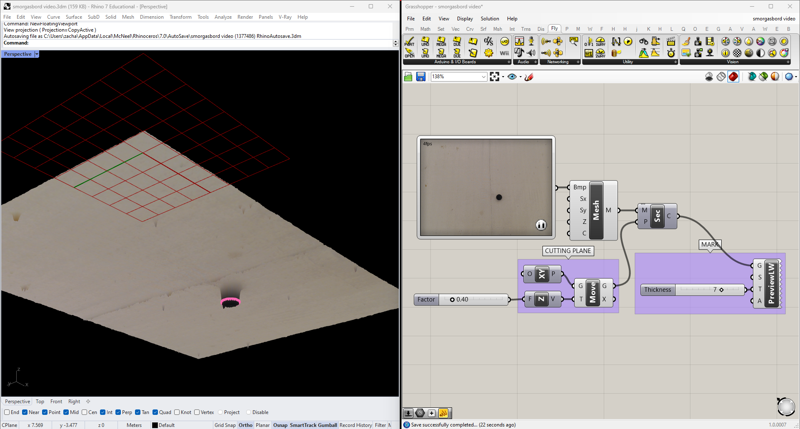

To make sure I'm only picking up one object (hopefully the one I'm looking for), I'm going to find the `Area` of any contours I find and only take the largest one. The `Area` component also returns centroids, which is what I'll use as the location of the ball moving forward.

To track the ball's location over time, I can use Grasshopper's `Data Recorder`. A stream of data is plugged into the input side of the component, and whenever it changes the new data is added to the end of a list, which can be accessed from the output side. The red button stops and starts the recording, and the X clears all stored data. Connect the recorded list of points into a `Polyline` and you'll have a visual history of the ball's path.

In this script I've also exploded the polyline and colored them with a gradient, so I can see which parts of the path are most recent:

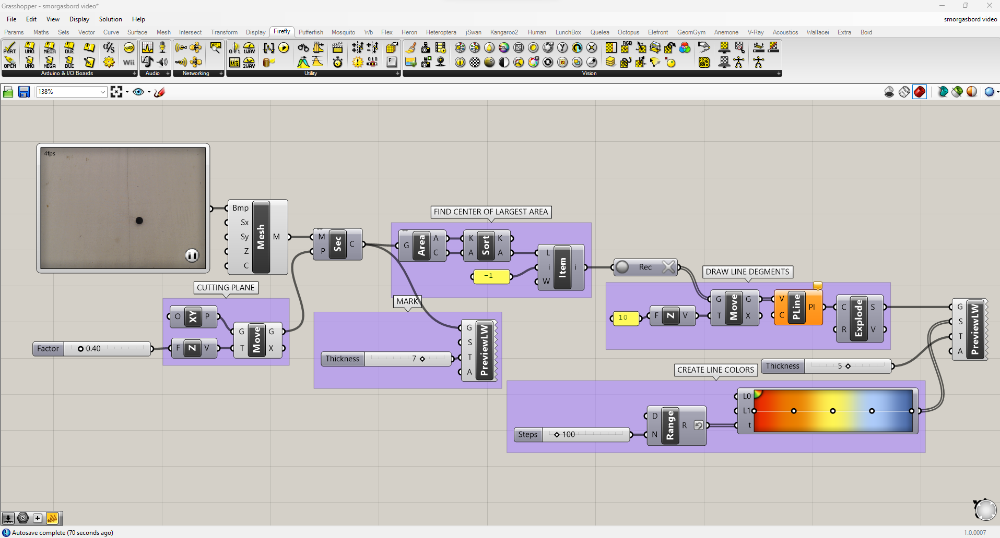

And this is the result:

(Note that while this does work, it's an extremely cumbersome way of doing object tracking. If you'd like to pursue this further, consider switching to Python's OpenCV library. More advanced methods like object, face and pose recognition can be done using Google's MediaPipe library.)

## Audio

Rhino and Grasshopper are by no means audio tools, but there are still a couple ways we can use sound as an input.

The plugin Mosquito has an `Audio Wave` node, which samples an audio file and returns a series of points approximating the waveform of the contents. Here's the output from Daft Punk's "Harder, Better, Faster, Stronger," scaled up in the Z direction for legibility.

Even with over 40,000 samples, the waveform doesn't have anywhere near enough detail to tell us about audio frequency. We can get a sense of amplitude though, so let's clean this up to create a rough graph of the song's loudness over time.

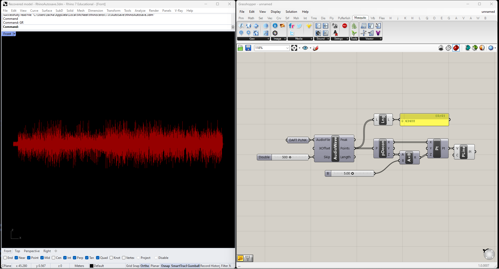

I only care about each sample's distance from zero, not whether it's positive or negative, so I'll start by swapping out the points' Z-components for their absolute values. Then I'll smooth the data out, again with Firefly's `Smoothing Moving Average` node; in this case I got better results by smoothing the data twice, rather than simply using more samples. Finally I'll fill the area under the curve with vertical lines, and add color and lineweight.

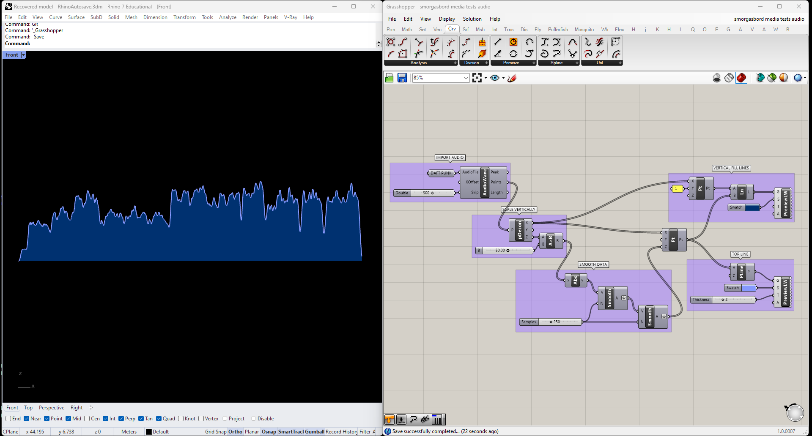

## Live Audio

Firefly also has a `Frequency Spectrum` component, which responds in real time to audio captured by your microphone. A simple script for translating those frequencies into geometry would look something like this:

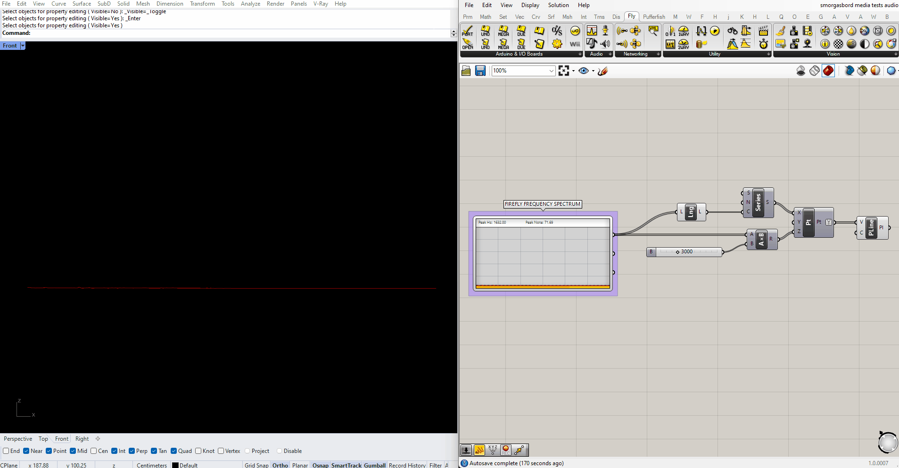

In my experience the upper half of the spectrum never registers any data, so from here onwards I'll be trimming it out using a `SubList` node.

This illustrates what sounds are being picked up right now, but what if we want to visualize a longer slice of time? For situations like this, Grasshopper has a `Data Recorder`. 

Using the `Data Recorder` I'm going to keep a record of each polyline, and sequentially add new ones to the visualization as they're created. I want the newest polylines to be closest to the camera. Since `Data Recorder` adds new items to the *end* of the list, I'll just pass it through a `Reverse` component before continuing. I end up with this:

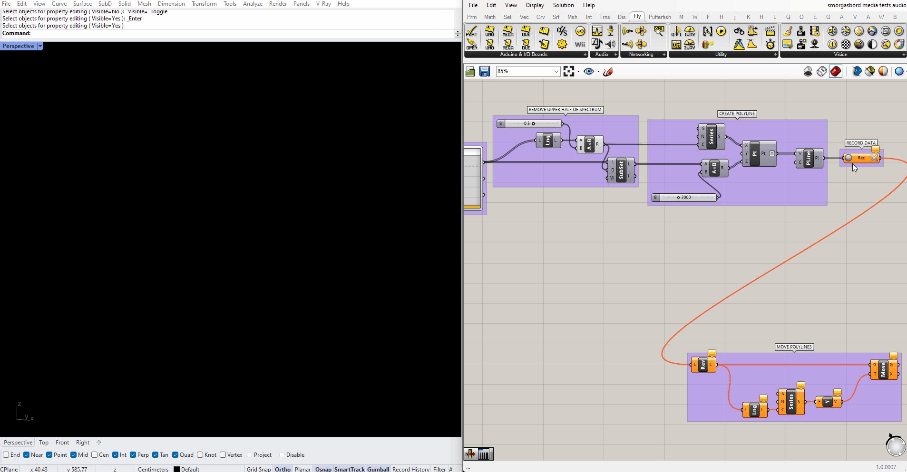

This will keep recording forever, so in case I want to leave it running for a while I'm going to use another `SubList` to only show the most recent polylines. Then I'll adjust the display of the lines to make them easier to read.

Ideally I'd like to join all this data into a single mesh, with vertices colored by height. Unfortunately, all the ways I can think of to do that are either too slow to keep up with the real-time input, or too involved to cover in this tutorial. (If it wasn't important to view the full animation live, I could record just the raw data, then animate through it using `ListItem` and a slider). Instead I'll do the next best thing, and color the lines themselves using a gradient, while making them thick enough that they blend together into something like a continuous surface. In the end, the script looks like this:

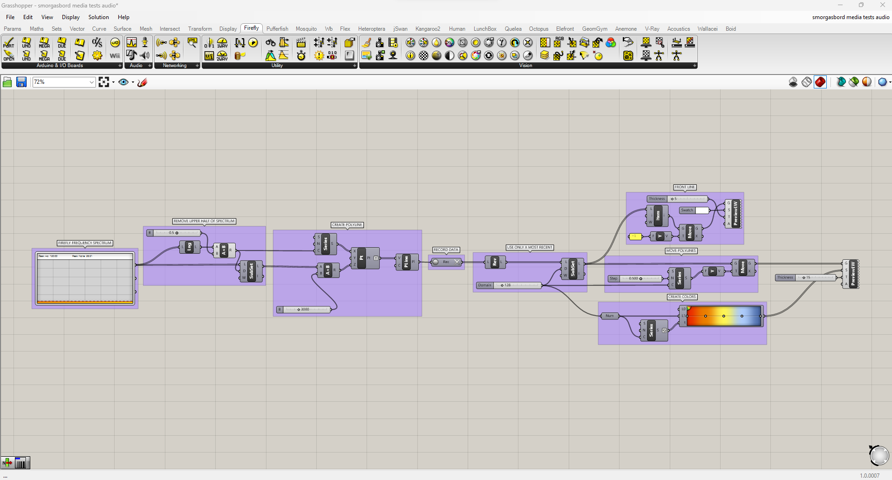

Note that I've reversed the gradient colors too, this time by right-clicking the output of the `Series` node and choosing "Reverse." I've also added a white line at the very beginning, to highlight the current input. The result looks like this:

# Further Experimentation

In this tutorial we analyzed video and audio data separately. Can you create a visualization that combines both data sources?