# Visualizing 3D Scans

In this tutorial we'll look at some ways Grasshopper can be used with another type of external media: meshes created by 3D-scanning the environment. We'll be using the following Grasshopper plugins:

* [Lunchbox](https://www.food4rhino.com/en/app/lunchbox)
* [Human](https://www.food4rhino.com/en/app/human)


We won't go into detail about capturing 3D scans here, but two methods are:

### Photogrammetry
Photogrammetry is the process of deriving spatial data from a collection of 2D images. After thoroughly photographing a space from a variety of angles and distances, the photos can be processed using software such as [RealityCapture](https://www.capturingreality.com/), [Meshroom](https://alicevision.org/#meshroom), [Metashape](https://www.agisoft.com/), or [Autodesk ReCap](https://www.autodesk.com/products/recap/). The results can be refined in Blender, if necessary.

### Mobile Apps
An alternative to photogrammetry software is using a mobile app, such as [Polycam](https://poly.cam/) or [Matterport](https://matterport.com/) (especially if you have a phone or tablet with a LIDAR scanner). The results will be be much lower fidelity, but a decent scan can be made in just a few minutes.

## Loading a Scan into Grasshopper

For this this tutorial I'll be using a scan I made using Polycam:

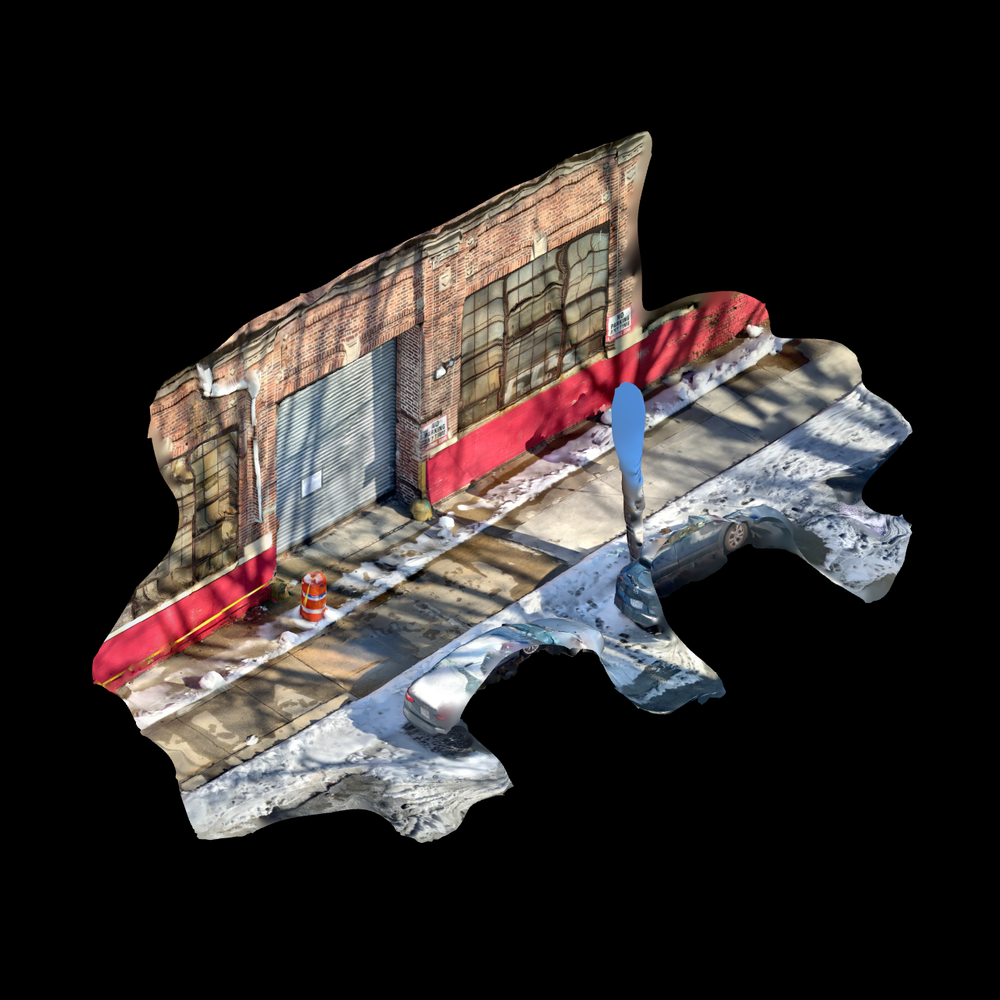

Create your own using the method of your choice (you can also download one from a site like [Sketchfab](https://sketchfab.com/)). Scans will typicially come on OBJ format, with an accompanying texture map as a PNG or JPG.

### Rhino Import

If you're simply planning to include the scan in your model as-is, you can `Import` the OBJ file into Rhino. The texture map should be linked automatically, but can also be set manually in the material palette.

### Grasshopper Reference

But since our goal in this tutorial is to manipulate and visualize this scan using Grasshopper, we'll load it there instead, using the `Import OBJ` node (part of the Lunchbox plugin). Open Grasshopper, and add one to the canvas, and plug a `File Path` node into the "F" input. Right-click the `File Path` node, choose "Select one existing file," and navigate to your OBJ file.

This loads the mesh, but without any material applied to it. To display our texture map we can plug this mesh into Human's `Custom Preview Materials` component, using another `File Path` node to select it.

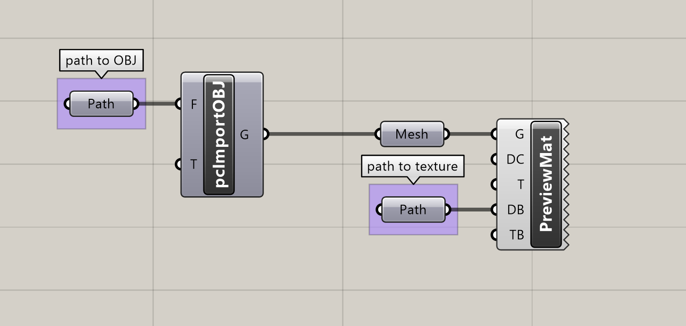

## Vizualization

In the rest of the tutorial we'll look at a few ways to isolate and analyze the data captured in the scan.

### Contours

Contouring our mesh is one way of including it in a drawing as a simpler, more standardized collection of curves. If, say, we wanted to use our scanned environment as a backdrop for other interventions or data visualizations, contours might be less distracting and noisy than either the photographic texture or the raw mesh geometry.

To create the contours, simply plug the mesh geometry from `Import OBJ` into a `Contour` node, with a vector (such as `Unit Z`) connected to Direction (N) and a value for the contour spacing, which will depend on the scale of your mesh. The appearance of the lines can be edited using Human's `Custom Preview Linewights` node.

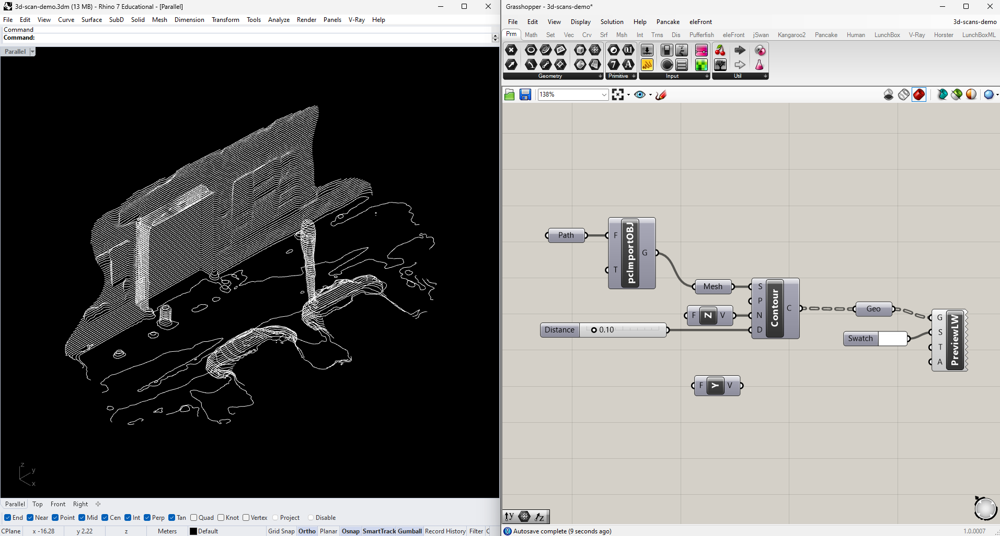

For a fully gridded display, we can contour the model along all three axes. Here I've also included the original mesh with a solid black preview material to match the viewport background, to that the scene still appears solid.

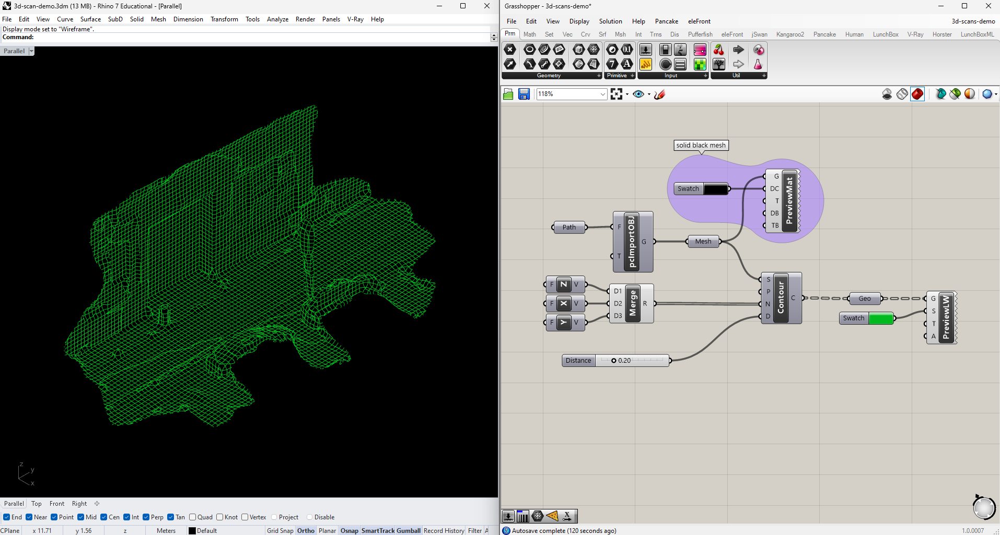

Another potential use of contouring is to make the scan more legible in a plan or other orthographic drawing. Let's contour the mesh only along the Z-axis, and look at it from above.

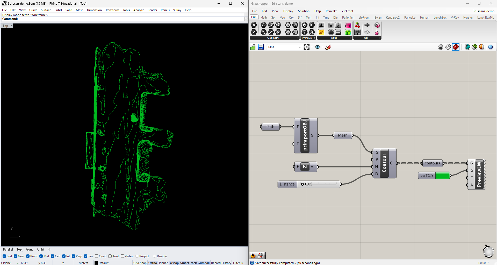

This gives us some sense of the overall shape, but it might be easier to interpret if we could read the heights of the different contours. Let's color-code them. To find the heights of the contours, `Deconstruct` their `End Points` and take the Z values. Since we care only about relative heights, not actual values, take the `Bounds` of this list of Z values and plug the resulting domain into a `Remap Numbers` node along with the original values. Feed the remapped values into a `Gradient`, and you'll have display colors to use with `Custom Preview`.

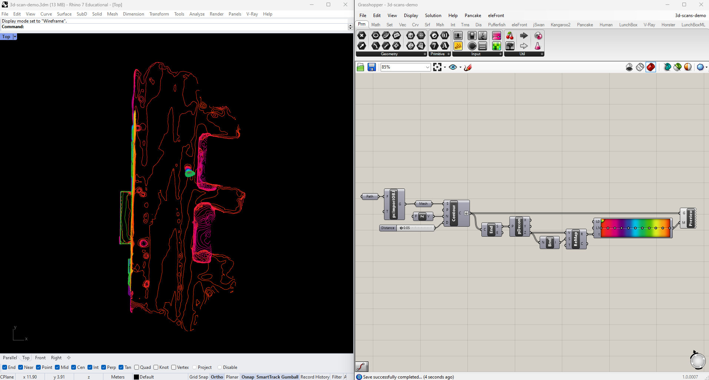

### Point Cloud

A second way of representing the scan is by using vertex data only, without the edges or faces. Reasons for this might include computational efficiency if the scan is very heavy, to obscure distracting artifacts or inaccuracies in the reconstruction, or just to make other elements of the visualization more legible. We can extract the vertices using `Deconstruct Mesh`, and control their appearance with `Cloud Display`.

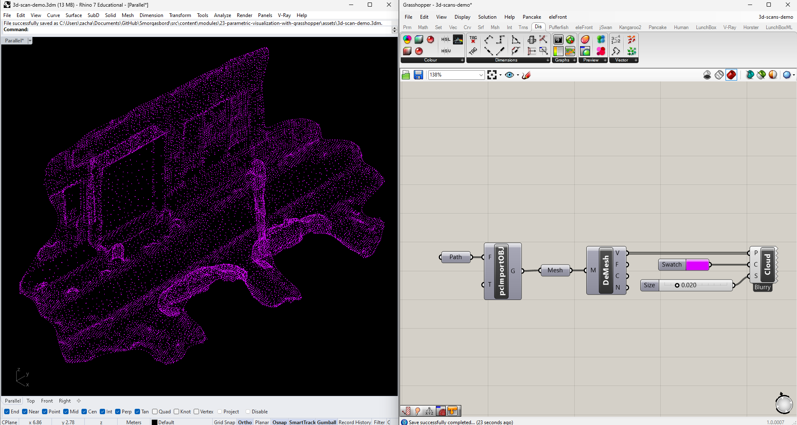

This cloud would be easier to interpret if the points maintained the color information from the scan. Unfortunately, unlike some of the meshes we've worked with in other tutorials, this information is stored in the scan's diffuse map, not the vertex data of the mesh itself. We can solve this problem by extracting the mesh's UV coordinates and relating them to the OBJ file's texture map. This requires a Python module, but the code is very straightforward:

```
import rhinoscriptsyntax as rs

if not m==None:
    UVs = m.TextureCoordinates
```

Drop a `Python` module on the canvas, double-click it to open the code editor, and paste this in. Rename the input to "m" and the output to "UVs", and plug your mesh in the get the coordinates. Feed them into an `Image Sampler` directed to your texture (double-click to set the file path), and you'll get the color data for each vertex of your mesh.

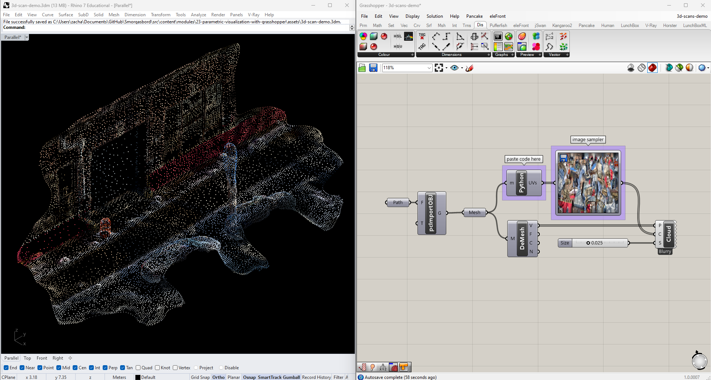

### Edges

Next let's try working with only the edges of the mesh. As with the vertices, this could be a way of working with the model more efficiently, or differentiating it from other elements of the visualization.

Edges aren't a primitve attribuite of a mesh, so instead of using `Deconstruct Mesh` we need to extract them using a separate `Mesh Edges` component. This has three outputs: naked (the outer edges of the mesh), interior, and non-manifold (i.e., broken). For this exercise we can just use the interior ones, at output E2.

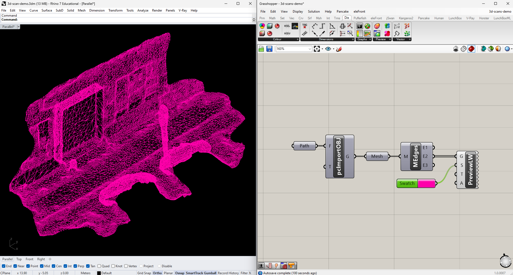

Let's now start looking at how we might use this scan as a canvas for representing additional data. We'll start by just color-coding each edge based on its distance from some arbitrary point. Add one to your Rhino model, then create an empty `Point` node in Grasshopper, right-click it, and choose "Set one geometry."

Get the midpoints of your edges using `Evaluate Cuve` at parameter 0.5, then get the `Distance` between those midpoints and the one you created manually. Instead of remapping those values, like we did when creating our contours, let's suppose we're only interested in proximity up to a certain real value. Plug the distances directly into a `Gradient`, and set this value by attaching a number slider to it's L1 input. Code your mesh edges with the resulting colors, which will update as you adjust both the number slider and the Rhino point.

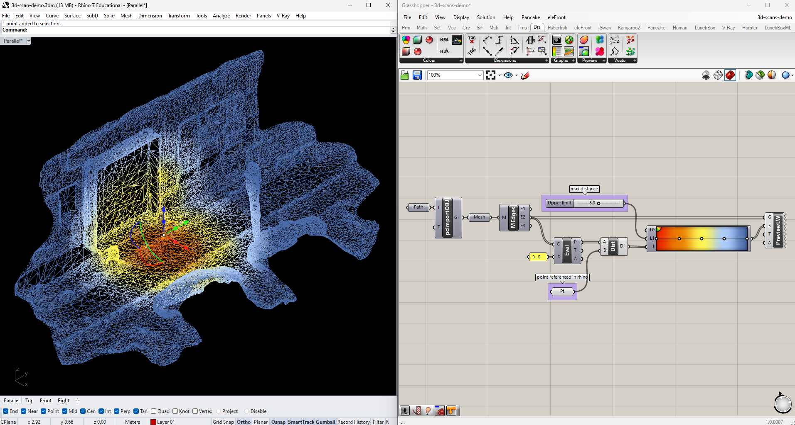

What if we wanted to expand this to include multiple points? Add a few more in Rhino and link all of them to a single `Point` node in Grasshopper. Measure their `Distance` to the edge midpoints like we did before, but graft the input collecting those midpoints, so as to find the distance from each edge to *every* Rhino point. I've decided I'm only interested in the closest point to each edge, so I'll `Sort` the resulting tree of distances, and use `List Item` to pull the first (and therefore lowest) value in each sorted list. Flatten the output and send it through the `Gradient` to get your new colors.

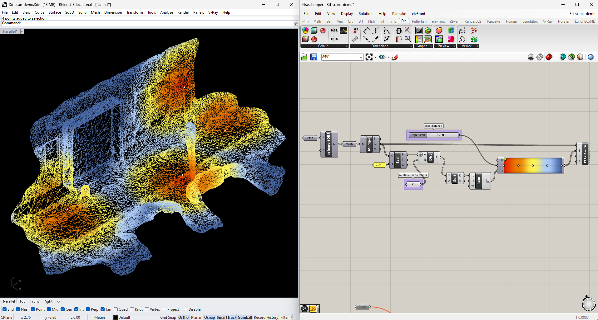

### Faces

Finally, let's use the full 3D surface of the mesh, once again as a canvas for data representation: this time, a heat map aggregating foot traffic information.

This analysis will be more computationally intensive than what we've done so far, so let's start by simplifying our mesh. There are a number of ways to do this (including in other applications altogether). We'll use `Quad Remesh`, which provides a good mix of accuracy and control. It works with a separate `Quad Remesh Settings` component, which lets you set properties like the target face count, density uniformity, and "Hard Edges," which I've toggled on in this case.

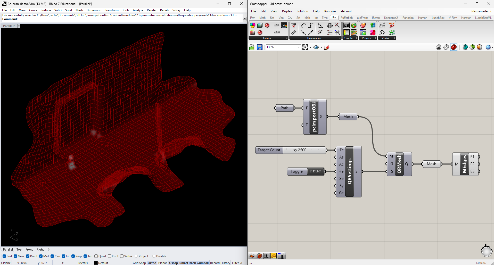

In Rhino, draw some paths through your scene (for now I'll just make some up), and link them with an empty `Curve` node in Grasshopper. Then create points evenly spaced along each line using `Divide Length`. It's a good idea to keep the number of points low while you're working, and then try adding more once your script is working properly.

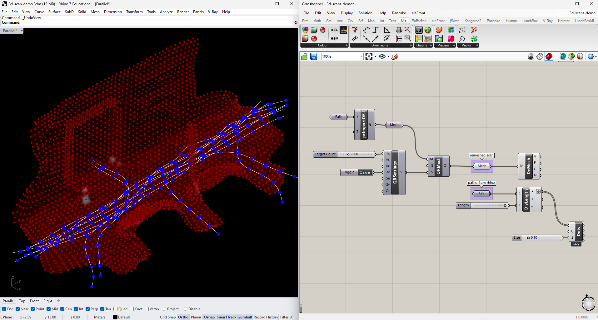

Our strategy this time will be to look at each vertex of our mesh and count how many of these path points lie within a given distance. Plug both lists of points into a `Distance` node, making sure to flatten the list coming from the paths and graft the input reading the vertices. Check which of these distances is `Smaller Than` a value controlled by a number slider.

The `Smaller Than` node returns boolean values (True and False), but Grasshopper considers these to be interchangable with the integers 1 and 0. This means we can add up each list in the tree (corresponding to each vertex of our mesh) using `Mass Addition`, and the sum will be the number of times it was True that a point along a path was less than our upper limit. Then we only have to `Remap` those sums and pass them to a `Gradient`, like we've done before, and we'll have vertex colors to `Construct Mesh` with (the vertices and faces are taken straight from the original `Deconstruct Mesh`).

For legibility, I show the edges of the mesh in this diagram as well.


# Further Experimentation
Here are some additional challenges if you'd like to continue experimenting with 3D scans:
- Can you update one of the drawings above to include animation?
- How would you combine one of the "heat map" diagrams above with the original texture map?
- Is there any scenario where you might want to manipulate or distort the geometry of the scan, instead of using it as-is? How would you go about it?