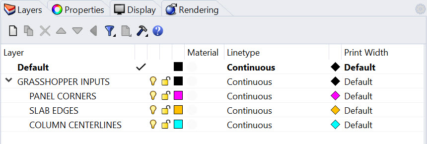
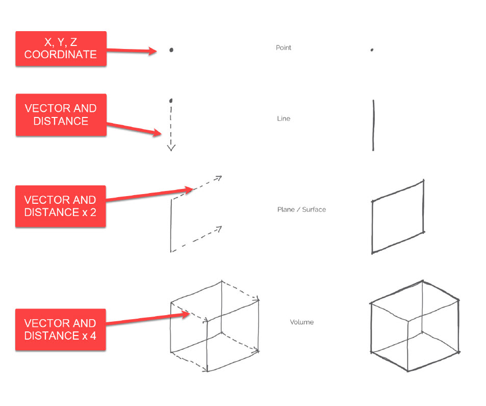
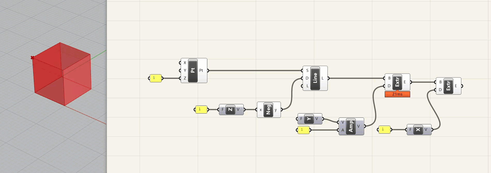
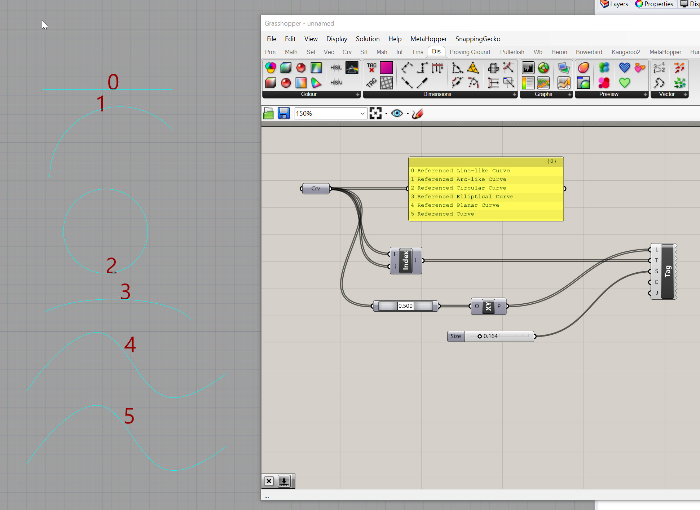

# Intro

**Construction geometry** refers to any geometry that is necessary for parametric modeling, analysis, automation, or translation to other application (without importing).

Remember all those curves, points, and planes you used to build your super cool Rhino model? Those are gold! Don’t get rid of them. In a parametric workflow, they are the backbone of your process. I always like to establish a method or retaining that data early and often. This can be as simple as establishing a layer structure and assigning a color that represents construction geometry.

>**Joe’s Tip #2**
>
>Harness the power of simplified geometry in your computational processes. Opt for lines over pipes, points over spheres, and planes over extrusions. This approach not only accelerates your definitions but also encourages you to think within the realm of construction geometry. Once your foundational geometry is in place, you can add detail and thickness, but save this step for the end. And when it's time to translate your work to other platforms, like Revit, remember, you'll be returning to that construction geometry, not the solids, breps, and polysurfaces. This strategy empowers you to work efficiently and effectively in your parametric workflow. 
>
>For example, if we are planning on working with an engineer to analyze a building's structural system, they would not use the solid geometry you use for rendering or creating drawings—they would use a connected model that represents the centerlines of your structural elements. It’s the same thing for translating geometry to Revit - the centerline of the column is more valuable than the solid geometry, the curve representing the edge of the slab is more valuable than the slab itself, and the four points representing the corners of a facade panel are more valuable than the built out curtain wall. 

## All Geometry Can Be Constructed Using Data

If you think about this at it's most basic level, there are multiple ways that you can construct a box. You could draw a rectangle and extrude it up. You could draw eight points in space and connect them using lines.

In the example above, we are first defining a coordinate in space. We are then defining a vector in the negative Z-axis and a distance and drawing a curve. We are then definining a second vector in the y-axis and a distance, and extruding that curve. Finally, we are defining a third vector in the x-axis, a distance, and performing another extrude. This seems like overkill - and I agree that if you are drawing a single box and you already know the dimensions, it is overkill. But if you need to adjust the size of this box, or better yet replicate this box thousands of times and adjust the height relative to a point in space, it would be nearly impossible to do that without scripting.

Below is how you would construct that same box parametrically, using the same logic as the sketch.

A few notes about this - first, I am defining the coordinates of the point in Grasshopper - NOT doing it in Rhino. I could have modeled a point in Rhino and referenced it in Grasshopper - sometimes this is necessary, and in fact you are often working off of explicit geometry that is provided for one reason or another. However, it is good to use this method whenever possible to provide flexibility . A second note is that I am using two different methods for the vector/distance function. The first is to just plug a dimension into a vector component, and the second is to use an `amplitude` component that receives a vector and a distance. The first method is good for quick operations where you are using the x, y, or z axis. The second is more flexible and is good when you are using either multiple different vectors, or a vector other then x, y, or z.

Finally, the dimensions are definied in a yellow `panel` with the value "1." Unless you are using some type of conversion within Grasshopper, values will always refer to the file units. So if you take this file and change the units to mm, you will have a 1x1x1 mm box. If you change it to feet, you will have a 1x1x1 ft box. It is important to think about values and dimensions when building your definitions.

**Side Challenge 1:** *I'm going to offer these relatively difficult (but optional) challenges throughout the course and not provide a solution - I want to see if you can take knowledge from the previous lessons and repurpose them. So, can you recreate this definition, but make the box adjustable? [You can download the definition above here,](/definitions/simple_box.gh) although you should try to build it from scratch first.*

*Hint:* use a [`Number Slider`](https://grasshopperdocs.com/components/grasshopperparams/numberSlider.html) component for this

## Geometric Rigor

Even the most complex shapes have an underlying geometric rigor to them - a Non-Uniform Rational B-Spline (NURBS) curve, which is the backbone of complex modeling in Rhino, is defined by a series of control points and degrees of weight associated with each control. Now, getting a contractor (or Revit for that matter) to understand a NURBS curve is a different story. That is why, ideally, we keep our geometry to arcs and lines. Trust me, you can do some really beautiful, curvy architecture using just these line types. And many projects start with more freeform shapes then get rationlized down to simpler shapes while still maintaining their elegance.

[Here is a primer on different types of curve geometry in Grasshopper](http://grasshopperprimer.com/en/1-foundations/1-4/1_curve-geometry.html)

[Here is a primer on how Revit intreprets NURBS curves](http://www.theprovingground.org/2012/09/interoperable-geometry-part-2-spline.html)

As you can see below, not all curves are treated the same in Grasshopper. All of these are technically "curves" but they have other characteristics that define them, and therefore, they have limitations on what you can do with them. One important item to note is that the curve with the index of "5" below is NOT planar (althought you can't tell from this view) but that is why it is described as a "Referenced Curve" and not a "Referenced Planar Curve" in the yellow `panel`.

Now that we have a foundational understanding of construction geometry, let's take a look at how to leverage different parametric operations for building design.