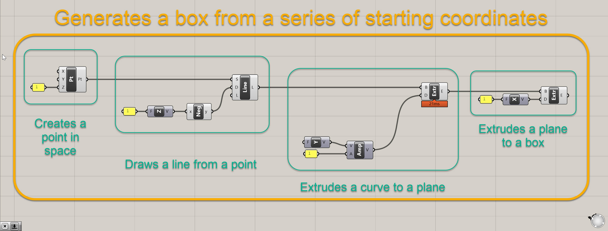
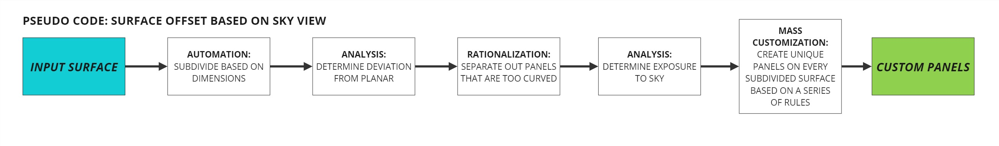
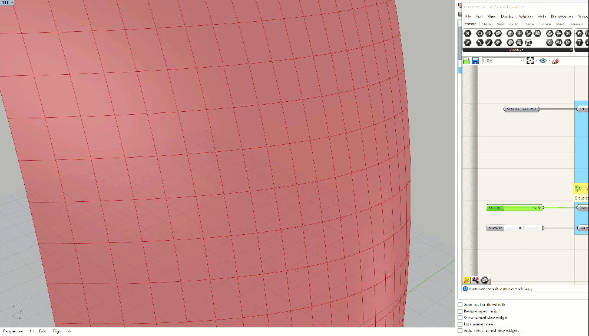
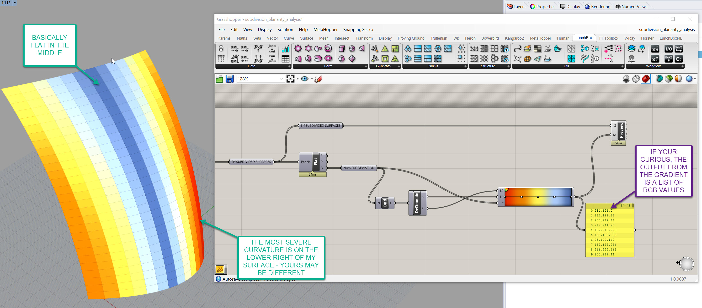
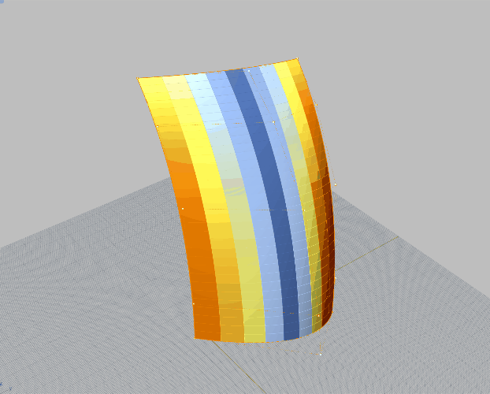

# Intro

This section will cover some fundamental use cases of parametric building modeling. It is important to be able to delineate between when to leverage paramatric modeling and when not to. I can confidently say that I use Grasshopper for some aspect of every project I work on. However, I don't use it for everything - the gradient of how much varies from project to project.

For example, on a very boxy, straightforward design model, you may use Grasshopper for automating some repetitive tasks like modeling railings (this is one of my favorte basic use cases). You may also use it to translate some geometry into Revit as a starting point for documentation. However, it might take more time to build out the computational logic to do this then it would to just remodel objects from scratch. Conversely, for a complex, curvy shape, you may be using Grasshopper to dictate the entire project.

We will look at the following uses cases where computational modeling is beneficial and advantageous:
- Repetition and Automation
- Analysis
- Rationalization
- Mass Customization

These are just a few examples, and as the course progresses, we will apply these techniques to actual building design. But for now, we'll look at a series of simple definitions that showcase these functionalities.

## Understanding Definitions as a Series of Functions

Not so fast! Before we jump into use cases, I want to discuss the concept of functions with you. Thinking about your script as a series of functions is incredibly powerful for a few reasons:
 - First, it allows you to logically map out how you want your definition to work.
 - Second, it forces you to keep your definition organized, which will help you build more complex definitions without getting lost. [Take a look at Luc's definition here at the bottom of the page.](https://smorgasbord.cdp.arch.columbia.edu/modules/4-grasshopper-intro/47-documentation-best-practices) The "after" example has a clear flow, and the groups are strategically designed as functional processes.
 - Third, once you get a feel for how to build functions, you can actually start packaging and re-using those within other definitions! Thank about how much time that will save.

 How big should a function be? That's up to you to decide- and as you progress in your computational journey, you'll get a better feel for it. Also, a function can (and often does) consist of a series of smaller functions. Let's revisit that box script from earlier, and examine it as a series of functions:

 

 It is the same defintion as before, except a bit better organized. And if we really examine what it is doing, we can break it down into a series of smaller functions (drawing points, extruding curves, and extruding planes) that fit within a larger function (basically a box generator). It's not super fancy, but we now have a function that generates a box based on a series of starting coordinates, which is in this case 0,0,1.

So if we are going to think about our forthcoming use cases, which will be a definition that subdivides a surface and creates panel openings based on sky exposure, we can map it out the following way:

I often call this process "pseudo code," which I didn't invent, but it is basically mapping out the logic for how to achieve my objective prior to actually scripting. In our case, our overall objective is to create a series of custom panels on a surface that respond to some external factor, a view to the sky. In order to do that, we need to create a series of functions that get us from point A to point B. And in that process, we may or may not create some smaller nested within larger functions along the way.

>**Joe's Tip #3**
>
>Sketch out your code before you begin, and try to think about how the code relates to the geometry. Below is a sketch from a real project at our office in which we were trying to figure out the best way to sort a series of points on a complex surface.
>
>
>
>As with everything in architecture, it's never a linear process, and I often find myself going back and forth between "pseudo coding" and actually scripting.

I promise I'll get into the definition soon but there's three more important disclaimers.

*First disclaimer* - I usually don't like doing tutorials that aren't associated with a specific project or real world condition. I believe it's hard to translate abstract demonstrations into real projects, however please think of the rest of this page as an intro to the concept of functions. After this section all future tutorials will be associated with a real world design objective. I will also be more rigorous with dimensions and alignments in future tutorials as these are important aspects of computational building design.

*Second disclaimer* - What I do here may or may not be directly applicable to your project. These are just examples of what can be done with computational thinking. Don't feel like you need to shoehorn this process into your project. In fact, I would prefer you explore other methods of design for your project.

*Third disclaimer* - There is a lot of background info within the tutorial here - that is because these techniques are foundational to computational building realization. Please work to understand the background info which will facilitate future tutorials. I won't go into as much detail about the "why" in future sections if I've already covered it here.

OK! Let's get into a use case for automation. **Please script along with me for the upcoming tutorials.**

## Use Case 1: Repetition and Automation
One incredibly common use case in computational design is subdividing a surface. As we know, large surfaces must be divided up into smaller elements for construction. If the original surface is flat, the subdivisions will most likely consist of flat surfaces as well. If the orginal surface is curved, it is very common to rationalize those down to flat surfaces when possible (which is the least expensive), or develop a clear, describable curvature for each panel (which is more expensive). However, that is not always possible, so most projects with complex geometry usually consist of flat panels where possible, singlely curved surfaces where possible, and doubley curved panels only when necessary.

For our example, we first need to **create a surface,** so we can subdivide the surface into rectangles.
- Start a new Rhino file. We will be working in feet so make sure that is your defauly unit.
- Create a surface that is roughly 100' wide by 200' tall. Put it on a layer called HOST SURFACE, which should be a sublayer of GRASSHOPPER INPUTS. It can be edited or replaced later (that's kind of the point) but for now give it some curvature in the x, y, and z axis.
- Ensure your surface is both A) oriented in the proper direction with the front face of the surface representing the exterior and B) is a surface, and not a trimmed surface or polysurface.

Mine looks like this:

>**Joe's Tip #4**
>
> One incredibly helpful view hack is creating a custom Backface setting. By default, your backface and frontface are the same color. This makes it hard to identify your surface direction, which is very important once you get into computational workflows. You can adjust this to be a single color for all backfaces by going to Options> View> Display Modes> then the display mode you want to assign it to. In my example below, I've use a bright magenta to define my backfaces, which makes it easy to tell the front, which is orange, from the back. It is also helpful in quickly identifying open polysurfaces.
>
>

Ok, now that we've gotten our surface modeled, we need to **get it into Grasshopper and subdivide it.** Here's how we are going to do that:
- First, launch Grasshopper within Rhino
- Next, drop a `Surface (srf)` geometry container component onto the canvas and set it as the surface you modeled. Rename this component to be `Srf:HOST SURFACE`. It's always good to label your containers so you know what they are holding. I also keep the initial abbreviation so I know the type of element it is looking for. 
- Connect your `Srf:HOST SURFACE` component into a `Dimensions (Dim)` component. This provides you with an approximate dimension of the surface in the U and V coordinates. We'll use this so we can set the target dimension of our subdivisions, not the count. For example, we probably want to say a panel is 5' x 12', not that there are 30 panels in the U direction and 48 in the V direction. Most likely you have a target module size your are working towards.
- Now that we have the approximate surface dimensions, we'll need to do a little math to figure out how many panels with a width of 5 and height of 12 will fit on the surface. Take both the U and V the outputs of the `Dimensions (Dim)` component and plug each into it's own seperate `Division (A/B)` component, into the A input. Then, plug two `Number Slider ()` components into the B value of the `Divison (A/B)` components. Set the `Number Slider ()` components to a range of about 0 to 20, and you probably need 0 or 1 decimal places. Make the values of the sliders about 5 and 10. The outputs from the division will most likely be values with several decimal places but that's ok.
- Next, we need to divide up the surface. We'll use two components which almost always work in tandem to do this. The first is `Isotrim (SubSrf)` and the second is `Divide Domain^2 (Divide)`. To make the `Divide Domain^2 (Divide)` component work, you will need to feed it a surface, a U value, and a V value. So plug your `Srf:HOST SURFACE` component into the I input, plug your divided U value into the U input, and plug your divided V value into the V input. Your `Divide Domain^2 (Divide)` will automatically round the numerical inputs to the nearest whole number. Finally, plug the output of this, the S value, into the D input of your `Isotrim (SubSrf)`, and take your `Srf:HOST SURFACE` and plug this into the S `Isotrim (SubSrf)`. You should see the surface subdivisions pop up right after this. 

Congratulations! You've created your first Grasshopper function. Essentially, this is a series of components that takes three inputs - a host surface, a panel height, and a panel width. It has one output, which is a list of subdivided surfaces. Here is a clean version of what it should look like for reference:

I have some extra components in there, namely some duplicate `Srf:HOST SURFACE` elements, the `Num: PANEL HEIGHT` and `Num: PANEL WIDTH` inputs, and the `Srf:SUBDIVIDED SURFACES` output. This may seem tedious and redundant, but it helps keep your definitions organized and it is clear what the functions is taking in and what it is putting out. It is good to get in the habit of doing this, and as you'll see, a clean definition will help you manage complexity later on.

You should have something that looks like the GIF above - the panels should update as you adjust the height and width. If you don't, please double check everything. If you're still having trouble, [you can download the grasshopper definition here.](https://drive.google.com/file/d/1Q1ba_Z4A-C9a1bMy3AZnrAqqbhRD6ceA/view?usp=sharing)

## Use Case 2: Analysis: Determine Deviation from Planar

Alright, let's start figuring out how we are going to actually build this thing. The good news is that since you have a clean and organized definition (right?) you have a clear **output,** your `Srf:SUBDIVIDED SURFACES`, that will now be the input for your next function.

What we now need to do is determine how far off each of our surfaces is from from being flat, aka planar. There are many ways to run this geometric analysis, and in fact there are probably entire dissertations dedicated to analyzing geometry for constructability. We are going to make our lives very easy and rely on a tool called [Lunchbox](https://apps.provingground.io/lunchbox/) which is a must have for any Grasshopper users.
- Luckily, you can now install Lunchbox using the "Package Manager" command in Rhino. [There's more detailed instructions here.](https://apps.provingground.io/install-lunchbox-for-grasshopper/)
- There are a few plug-ins out there that add basic functionality and simplify common Grasshopper processes - Lunchbox is one of them. We will be using it frequently throughout the course. For now, we will be focusing on the Utlities section, but take a minute to familarize yourself with some of the other components that Lunchbox has to offer.

- Within the Utlities section, there is a component called `Flatness Check (Flat)`. Place one of these on the canvas, and plug your `Srf:SUBDIVIDED SURFACES` output from your previous definition into the "Panels" input on the `Flatness Check (Flat)`.
- You will have three outputs from the `Flatness Check (Flat)` component - F, P, and D. All of these contain incredibly helpful data. The F is a flattened projection of your surfaces. To take a step back, the original subdivided surfaces coming out of the `Isotrim (SubSrf)` component are divisions of the orginal untrimmed surface - so imagine cutting up a surface with equally subdivided lines, and whatever is left over is what you get. It's basically a series of pieces of the original curved geometry - so, these surfaces in and of themselves could be curved. This may or may not be ok, depending on the final desired material of the surface or budget constraints. For the purposes of this exercise, let's assume we don't want to have any curved panels - this is where the flatness projection comes into play.
-The P output from the `Flatness Check (Flat)` component is the Projection Plane - which is a flat plane that is based on the average coordinates of the surface. This is convoluted, but to put it simply, this plane represents Lunchbox's best interpretation of what a flattend version of the curved surface should look like. 
-The D output is the Amount of flatness deviation - so bascially how far is the furthest point from the surface to the Projection Plane. Again, this is a simplified way of measuring curvature, and in the real world you will need to work with engineers and fabricators to determine the allowable tolerances. For now, we are going to build a parametric definition that will help us seperate panels based on a Amount of flatness deviation threshold.
- Let's go back to the the F output from the `Flatness Check (Flat)` component. Plug in a `Surface (Srf)` component here and hide the other surface visualizations in Grasshopper so you don't have overlapping info. Your definition and output should look something like this:

- In the Rhino viewport, you'll notice there is now a gap between adjacent panels - this gap will be more or less pronounced depending on a few factors, like curvature of the underlying surface and the density of the subdivisions. If you crank up your subdivisions, you will see less of a gap, but then you'll have more panels, more mullions, more connections, etc. As you dive deeper into your surface rationalization journey, you'll realize it becomes a balancing act between maintaining design intent, managing cost, and working within material constraints.
- Now, that break in the surface MAY be acceptable, depending on the detail of the connection, but we're going to set up a way to test that and adjust depending on an adjustable tolerance. But for now, let's wrap up this section and do a bit of Data Visualization regarding our surface. 
- I'm going to walk you through a basic method of visualizing data in Grasshopper - this method can be use for a wide variety of analysis so you will be using it frequently. 
- Grab the output D value from the `Flatness Check (Flat)` component and store it in a `Number (Num)` containter - rename this so it's clear what it is storing. You should be familar with this process based on what we've done to this point.
- Now, grab a `Custom Preview (Preview)` component, and plug your **ORIGINAL** subdivided surfaces, not your flattened ones, into the G input on it. They should all turn a pinkish color in the viewport - we'll fix that soon.
- Next, grab `Gradient` component. It will have three inputs and one output. The inputs are L0, which represents the value that defines the lower bounds of your color range, L1 which defines the upper value, and t, which is the list of values you then want to associate with a color within the gradient. Basically, imagine this as a set of points along the gradient, and where ever the t value lands, it associates that color to that number. This "t" value is very common through other Grasshopper workflows as well. 
-Right click on the `Gradient` component, go to Presets and select the gradient that goes from red to yellow to blue. See below. You can select other presets or even create your own, but this is a good one that shows bad (red), ok (yellow), and good (blue) ranges:

- In order to define our inputs to our `Gradient`, we need to get our lowest value, our highest value, and our set of t values. We already have the t values - this is the D output from the `Flatness Check (Flat)` component. To get the other two, we need to find the lowest and highest value in our list of numbers. Luckily, there is a component for this, called `Bounds (Bnd)`. Drop one of these into the canvas and plug your deviation values into it.
- This gives us a domain, so we need to break this up into a start and an end. Plug the output from the `Bounds (Bnd)` component into a `Deconstruct Domain (DeDomain)` component. This will give you the start and end of this domain.
- Ok let's wrap this up - plug the S output from the `Deconstruct Domain (DeDomain)` into the L1 of the `Gradient` and the E output into the L0. These wires are crisscrossed - I'll explain why in a second. If you haven't yet, plug the deviation values into the t input on the `Gradient`. Finally, plug the output on the right hand side of the `Gradient`, which doesn't have a letter, into the M input on your `Custom Preview (Preview)` component. Your surface should change colors - and the surface and definition should look something like this!

If your definition doesn't look like mine, [you can download the grasshopper definition here.](https://drive.google.com/file/d/1Q4TfDfzYbGpJilETkO7s6XOd9AIQjxJ9/view?usp=sharing).

Also, if you adjust the surface, you should see the analysis update:

**A few things to recap and note before we move on to the next section:**
- The reason the `Custom Preview (Preview)` is working is because the lists match up - List Management will make or break your ability to work in Grasshopper. You can learn more here, but esssentially you have set number of surfaces, in my case 364, and a set number of colors, also 364, that are in the exact same order. You can associate different data with each other as long as you maintain the same structure. Lists will not reorder themselves unless you tell them to, but always work to associate the same amount of geometry counts with the same amount of colors or values, in the same order, when working your data visualizations or your results will be inaccurate. 
- The reason I crossed my wires out of the `Deconstruct Domain (DeDomain)` is because I wanted my higher values to be red, and my lower values to be blue. In data visualzation, it's important to think about how someone's inheriant bias will dictate thier intrepretation of what they are seeing. Red typically means **stop** or **bad** so therefore we want the most extreme values to be shown this way. If we didn't switch them, blue would be the most extreme and red would be flat. 

Congratulations! You've now build another function that analyzes a panel and assigns a color value based on deviation from flatness.

>**Joe's Tip #5**
>
> Data Visualization is incredibly important for a computational designer! Not only does it look cool, but you are often trying to understand or explain complex ideas.
>
> You will need to understand the complexity yourself - for example, I would not have known that the lower right hand corner of my surface had the most extreme curvature until I visualized it, then it was immediately obvious.
>
>You will often need to show your analysis to other members of team, you consultants, and your clients. Imagine needing to explain to a client that the cost of the facade will be higher in some areas, or that the design will need to change because of material constraints. Without good visuals to back that up, it would be harder to explain on a complex design.

**The rest of this section is continued in Part 2**