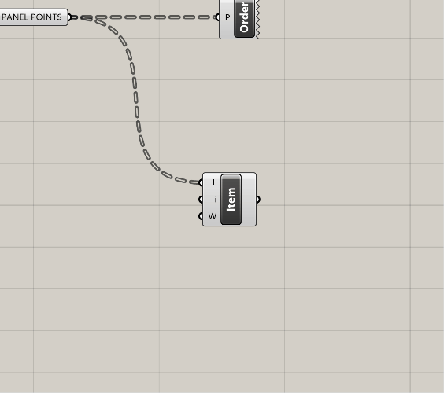

# Intro

This is a continuation of How to Approach Parametric Building Modeling.

**Please do the tutorials in Part 1 before continuing on here**

## Use Case 3: Rationalization: Seperate Out Panels that Are Too Curved

The next common use case for computational building design is rationalizing geometry that is not achievable. It may involve flattening, triangulation, or unifying radii or varous curves. We'll explore a few of these later in the course, but for now we'll focus on first seperating out the extreme panels, and then triangulating those panels. 

Let's start with seperating out those pesky overly-curved panels. For this, we're going to rely on another tried and true Grasshopper component, `Dispatch`.
- Drop a `Dispatch` component on to your canvas and take a look at it. You'll see two inputs - L and P, and two outputs - A and B. For basic dispatching, you are going to feed the L a list of what you want to sort, which can really be any element that Grasshopper work with. The P will take a True/False pattern. Remember our conversation about lists from earlier? Here is another instance where you want your lists to match up - if you have 500 elements, you'll want 500 True/False values.
- So now let's get this dispatch working. Remember how I told you it is important to label your critcal outputs? Well, your `Srf:SUBDIVIDED SURFACES` is one of those critical outputs. We're going to use it yet again. Plug it into the L on your `Dispatch` component.
- Now we need to create a pattern to dispatch with. There are many ways to do this in Grasshopper, and you'll continue to learn more ways throughout the course. For now, we want to test of a a deviation value is larger then a threshold. Luckily, there's a component for that, and it's called `Larger Than (Larger)`. The A input it the list of numbers you want to test, and the B is the value to test against. Plug the D output of the `Flatness Check (Flat)` component into the A of the `Larger Than (Larger)`. We're doing this because we cant to evaluate the deviation from flat. Next, plug a slider in to the B. Let's use 0.150 as a starting point on the slider for the B value. 
- The top output of the `Larger Than (Larger)` component will give you a True result for every value that is above 0.150, and a False for every result below. Now, plug this pattern into the P on the `Dispatch` component. 
- By default, the `Dispatch` visibility is turned on, so you won't clearly see this working. Turn off the visibility of the `Dispatch` and plug one `Surface (Srf)` containers into each of the two outputs from the dispatch (A and B). If you click on either one of these, you should see only some of the panels on the surface selected. Also, as you adjust the slider, you should see the selection change. See below for a progress image of the defintion as well as the dynamic selection:

Now we have the ability to sort panels based on a threshold. There's a few adjustments I need to make to get to where we want to be. Let's talk through the logic first. **IF** a panel is too curved, I want to trangulate it. This is because the distances between the adjacent panels will get too large, and my mullion will not be able to accomdate the difference. **BUT** if a panel is not too curved, I want to flatten it and use that geometry. The result will be a series of flat panels, some four-sided, and some three-sided. They will not connect perfectly, but that's ok because our mullions will absorb that difference.
- Based on what we have, so far, I only need the A output from my `Dispatch`. I'm going to rename the `Surface (Srf)` coming out of the A to `Srf:CURVED FOR TRIANGULATION` and I'm going to delete the `Surface (Srf)` coming out of the B. Then, I am going to copy and paste this `Dispatch` to create another another one. However, I want to keep the P input on this one, but I'm going to swap out the L for the flattened panels coming out of my `Flatness Check (Flat)`component. It should look something like below:

>**Joe's Tip #6**
>
> The highlighted objects below are relays. They are incredibly helpful in keeping your definition organized. You can create them by double clicking on a curved wire.
>
>

**Side Challenge 2:** *See if you can create a Data Visualization where all of the panels that are too curved based on our new threshold are FULLY red - they should not be a gradient. And any panel that is below the threshold SHOULD have a gradient to show how close they are to exceeding the threshold. If you're able to figure this out, screenshot it and drop it into our class Slack channel.* 

**Let's continue on with our rationalization** - we now have two different lists of panels. The first is set of curved panels that are ready for triangulation - we'll keep working on these. The second set are panels that are flat and below our threshold - we're done with these for now. 
- I'm going to teach yet another foundational technique for computational building design, which is the ability to break geometry down into it's vertices and use these to construct new geometry. If you look at the sketch below, you'll see I can take a rectangle and define the vertices as A, B, C, and D. After that, it's as simple as playing connect the dots to create subgeometries. This method is good for a few reasons. First, it keeps future Grasshopper operations lights since I am working with points and lines, not intersections or solids. Second, I can use the points to host future operations and create more complex build ups on top of it, like hosting a more detailed triangular panel within our newly created one. Third, by being rigorous and organized, you can simplify the creating of subgeometries and faciliated future translation to Revit. 

- It's good to be consistent with standards. For the purposes of this class, our first point (A) will always be the lower lefthand corner of the panel, and the rest will go clockwise from there. 
- Now that we've established the logic, let's execute it in Grasshopper. Take your `Srf:CURVED FOR TRIANGULATION` component and plug it into a `Deconstruct Brep (DeBrep)` component. This is another very popular component, and provides three outputs: F which is all of the individual faces of the input in a list, E with is all of the individual edges, and V which is all of the individual vertices. We're going to use V. Plug a `Point (Pt)` container into this, rename it for clarity as I've described above, and turn off the visibility of the prior elements. 
- What is coming out of the V is a new type of data structure, called a Data Tree. This is another critical concept in Grasshopper. If you are not familar, please take some time to review [this section of the Smorgasbord](https://cdp.arch.columbia.edu/smorgasbord/modules/4-grasshopper-intro/45-working-with-data). I can't tell you how critical the understanding of Data Trees is, and the concept will continue to challenge you throughtout your computational journey. However, the more you can manage Data Trees, the more versatile you will be. For our purposes we now no longer have a single branch of objects, but rather multiple branches (one for each panel) that each contain a list of 4 points.
- To check to make sure the output of the V is in the right order, plug in a `Point Order (Order)` component. This will give you a set of different colored arrows showing how your points are organized.  

- My points are looking good - they start in the lower left-hand corner and run clockwise. The order of these points will be driven by the underlying logic of your orginal surface. If your points aren't ordered like mine, you might need to do some list manipulation. Check the first link directly above, as well as [this resource](https://modelab.gitbooks.io/grasshopper-primer/content/1-foundations/1-4/6_list-management.html) for more information on manipulating lists. 
- Now that are points are extracted and ordered properly, let's create our ABCD logic. We're going to use a `List Item (Item)` component to do this. Plug your new Data Tree of points into the L input on the `List Item (Item)`. The i output on this component gives you the first item in EACH list - so it's not just one value, but rather the first item for EACH panel - so it should be dozens or hundreds of points. The inportant thing to note, however, is that this will be the lower left hand corner point of each panel! By default, this gives you the first item in each list. But if you wanted to start with a different one, plug a value in to the i input to define the starting point. 
- Let's get the other three. This is easy - just zoom in to the `List Item (Item)` component until you see a plus button pop up - now add three more outputs to get a total of 4 points.

- We now see i, +1, +2, and +3. Put a `Point (Pt)` container on each, and rename these A, B, C, and D so you don't get lost later (trust me). 
- Ok remember our sketch? Let's do some connect the dots and wrap this up - use a `Merge` component, and plug in points A, B, D into inputs D1, D2, and D3, in that order. This basically creates a new series of lists that contain the three points we need for a triangle. Create a new `Merge` component, and plug in B, C, and D in order. Create a `Polyline (PLine)` and plug the first `Merge` into it. Repeat this process for the 2nd `Merge`. Finally, create a `Boolean Toggle (Toggle)` component, make sure it is set for True, and plug it in to the C inout on both `Polyline (PLine)`. This portion of your definition should look something like this:

If your definition doesn't look right, [download my version here](https://drive.google.com/file/d/1QAPICVV_s4uyMuAKEvS9uzZJcbb2qeYz/view?usp=sharing).

Amazing - we now have a function that does a few things (which could individually also be consdered sub-functions):
- It will seperate out panels based on a deviation from flatness threhold
- It will create a flat 4 sided panel if it is below the threhold
- It will triangulate any panels that exceed our threshold

## Use Case 4: Analysis: Analyze Against an External Factor

I'm going to demonstrate another analysis use case that is common practice. We covered analyzing your own geometry, but what if you wanted to analyze your surface against some external factor? For example, maybe you want to create shading based on exposure to harsh light. Or perhaps you want to add density to your facade in areas that you need privacy, and create openness in areas where you want to have views to the exterior. You will have some external factor that drives your geometry, you will need to determine your design's relationship to that external factor, and finally you will need to understand how that factor should influence your design. 

For example, let's say we want to create an atrium that has a clear view of the sky, but we want views out horizontally to be more private - so the more direct views of the sky the panel has, the more open we want it to be. Let's figure out how to do that by picking up where we left off with our last function. Take a look at the definition below to see how to prep yourself for the next steps.

I've pulled forward the critical outputs and clearly identified them. We MAY need some other info from previously in the definition, but in an ideal situation, we have a clearly defined set of outputs that lead us into our next function. Also, you can see how clean my definition is, with each blue rectangle defining a specific function. Take some time to get organized if you haven't yet.

Ok, let's do our sky analysis.

- To be able to determine exposure to the sky, I first need a vector that is normal to the surface of my panels. I'm going to use an `Evaluate Surface (EvalSrf)` component to do this. This component has two Inputs - the first is s, which requires an **untrimmed surface** (note it will accept a trimmed surface, but convert it into an untrimmed one). The second input is uv which is looking for a set of u,v coordinates. You can think of u,v as similar to x,y except x,y are **global coordinates** relative to your Rhino file and coordinate system, and u,v are **local coordinates** relative to the geometry you are evaluating.
- Getting back to the `Evaluate Surface (EvalSrf)` component - you'll see there are a bunch of outputs. Each of these is incredibly helpful and you'll probably use them all at some point during your computational journey. Right now they aren't giving any results, but that is because we haven't provided any surfaces or uv coordinates.
- To first get a set of surfaces, grab the first set of triangles and plug them in. to the s input on the `Evaluate Surface (EvalSrf)` component. 
- Now, we need a set of coordinates. To do this, we can use an `MD Slider` component. By default, this is set to O.5 ; 0.5 which for our purposes is great. Beacuse each panel is flat, we should have the same normal vector no matter where we evaluate it. Just leave it at this value for now but feel free to move it around to see how it affects your model. Beforme moving on, we want to **reparameterize** the surface input on the `Evaluate Surface (EvalSrf)` component. Right click on the S and make sure you turn on **reparameterize** . This ensures the surface is being evaluated relative to itself - so previously the 0.5 ; 0.5 would be an absolute coordinate - now it is relative. It actually doesn't really matter for this exercise, but I'd like you to get familiar with the concept of **reparameterization**.
- Are we missing a step here? Depends on how explicit you want to be. We are plugging a closed curve into the `Evaluate Surface (EvalSrf)` component. So how can it evaluate a surface if it's not recieving one? The good news is that some Grasshopper components assume what you are trying to do and perform the conversion for you. So, what this component is doing is evaluating the input (a closed curve) and if it is not what it expected, it will perform a conversion to what it is expecting (a surface). When you send data to a component, it is called **casting** and sometimes there are multiple data types that you can **cast** to a component. 
- Now that the `Evaluate Surface (EvalSrf)` is working, take a look to see what each of the outputs is providing. As I mentioned, there is a lot of great info coming out of this component, but for now we want to work with the N output, which is the surface normal at the uv coordinate. 
- To finalize this step, we need to do a few things. First, I always like to visualize my vectors to help me understand what is happening. To do this, we are going to use a `Line SDL (Line)` component. This is yet another incredibly helpful component. Plug the P and N from the `Evaluate Surface (EvalSrf)` component into the S and D of the `Line SDL (Line)` component, respectively. We are basically giving it a starting point and a direction based off our surface. We now need to give it a length - this can be a fixed number, so create a `Panel ()` component, set it to a value of 10, and plug it in to the L on the `Line SDL (Line)` component. Now, copy and past the `Evaluate Surface (EvalSrf)` and the `Line SDL (Line)` components two times, and and replace the two new S inputs with your second set of triangles and your flattened 4 sided panels. You can use the same `MD Slider` to fee all three. The last step is to **graft** the 4 sided surfaces using a `Graft Tree (Graft)` component so the data structure matches the triangles (each element in its own branch). Your definition and model should look like the following:

- Ok, now that we have the normal vector, we need a vector representing exposure to the sky so we can measure the angle between the two. This will be relatively easy. We're going to create a new `Line SDL (Line)` component and use the same S input (the point on the surface) and the same L input (10). However, we'll swap out the D input for the Z vector - which is easy. Just use a `Unit Z (Z)` component. Do this three times, and you should now have a line pointing directly up in addition to the one that points normal to each surface.
- Before me measure the angle bwtween the two vectors, we're going to create a plan to help measure the angle. This is probably not necessary here, but it is really good practice. We will often try to describe scripts as **bulletproof** which means they will have some additional measures built into them to prevent them from breaking in most (hopefully all) scenarios. I'm going to show you a few techniques on how to do this, and using the plane to help measure the angle is one of them. Once you get in the habit of doing this, it only take a few extra minutes and will ensure more accuracy downstream in your future scripts.
- There are may ways to create planes, but for this instance we will use the `Line + Line (LnLn)` component. This takes two inputs, A and B, both lines. Plug your vertical line into the A, and your normal line into the B, and it should create a plane that is parallel to each of them. 
- Finally, we will use an `Angle` component to measure the angle. Plug the vertical line into the A, the normal line into the B, and the plane we just created into the P. Put a `Panel ()` on the A output to see the results (note Grasshopper angles are always in Radians).

Your definition should look like this - if it doesn't you can [download mine from here](https://drive.google.com/file/d/1Q1oqxQ5bdmvhtvlYcbzv-U4vfV3rSl_y/view?usp=sharing).

We'll use the output angles from this function to drive the openings of our panels in the next (and final) sequence.

## Use Case 5: Mass Customization: Creating Unique Panels with an Underlying Computational Logic

Now we've laid a great foundation to finish out panelization. We have a clean defnition that is clearly broken down into discreet functions. We have clean curves to work with. And we have clearly defined angles to use for panel sizing. Now let's bring it all together.  

We've done a lot of work to this point, and you may find that these last few staps are actually the quickest, or most strightforward. That is the nature of computational modeling - there is a lot of up front work that goes into building your definition, but the result is something that is accurate, flexible, and able to model complexity that wouldn't be possible without it. 

To get yourself set up for the final portion, go ahead and create number containers for all of the angle outputs, and also duplicate the surface outputs and bring them forward. What we're going is extracting our critical data and geometry and isolating it elsewhere in the definition, so we don't get mixed up and can clearly create a new function. Make sure you're using the grafted 4 sided surfaces, or re-graft if needed. Don't be afraid of white space on your Grasshopper canvas - it is easier to read and gives you space to work. 

We have our critical inputs isolated, let's set up our customization. 
- First, we currently have two data sets (panels and angles) what each have three groups within each (triangles 1, triangles 2, and 4 sided panels.) This means we are trasking 6 different inputs and have currently been operating on each one individually. Let's try to simplify this by merging the branches a bit. We are going to use an `Entwine` component to do this. Well, two actually. Create one, and right-click on it. Make sure the option to Flatten Inputs is OFF. Underneath the component it should not say "Graft". Plug the three angle number inputs into the three inputs on the `Entwine` component. Repeat this process for the three different panel types - make sure you uncheck the Flatten Inputs again. 
- Now we have two data trees to work with rather then six. Let's first create our panel offset distances using our angles. To do this, we are going to remap the values to be dimensions that we can work with. We have angles and need to convert them into foot-based offsets (or whatever unit your file is in - ideally feet though so our numbers make sense). Remapping is another foundational technique in Grasshopper. So, drop a `Remap Numbers (ReMap)` component on your canvas. This takes a set of values to remap (our angles), a source domain (the lowest and highest angle values), and a target domain (this will be adjustable based on our desired offsets).
- Simplify the values that re coming out the the `Entwine` component that hols your angles. You can do this by right-clicking on the R and turning on Simplify. This removes unnecessary branches from our data tree and will help us align our two trees later on. Then, take this simpilfed data and plug it in to the V on the `Remap Numbers (ReMap)`.
- Now we need to create a source domain - to do this, we need to flatten our angles that are coming out of our `Entwine`. This allows us to evaluate all of the angles as one 
list rather then in seperate branches. To do this, drop a `Flatten Tree (Flatten)` component onto the canvas and plug the same R output from the `Entwine` into it. 

>**Joe's Tip #7**
>
> I never, ever flatten or graft inputs/outputs within the component by right clicking. I am ok with simplifying and reparameterizing, since those are usually operations that you want to carry downstream and don't remove any data structure. With grafting or flattening, it makes it very hard to un-do that operation later on. Plus, you often want the option of using both the grafted and flattened data, and if you do this operation in the component you can't get both. 
>
> Also, never set values or formulas directly in a component - always use a panel or some other input. It is very hard to see and track down internalized values/formulas and can lead to confusion if other people are working in your definition. It seems like more work, but is a better standard and makes collaboration easier. 

- Now take out flattened values and plug them into a `Bounds (Bnd)` component - this gives us the lowest and highest value from our list of all angles. Plug the output from this component into the S on the `Remap Numbers (ReMap)` component.
- Let's next construct a custom domain - you can use the handy `Construct Domain (Dom)` component to do just that. Now create two sliders that range from 0 to 3 or so, with 2 decimal points of resolution. Plug one into the A input on the `Construct Domain (Dom)` and the other into the B. Note that your B will end up being a lower number since you want the relationship of the angle to be inverse to the opening size (larger difference, smaller opening). Now plug the output of this component into the T on the `Remap Numbers (ReMap)`. This portion of the definition should look like this:

- Now let's finish up the offset. Take your simplified and entwined panels and plut them into the S of a NEW `Evaluate Surface (EvalSrf)` component. This is a bit redundant, but similar to the angle component, the `Offset Curve (Offset)` component works better when you give it a plane. We'll use the F output from the `Evaluate Surface (EvalSrf)` for that. Also create a new `MD Slider` and plug it in to the `Evaluate Surface (EvalSrf)`. 
- Place a `Offset Curve (Offset)` component. Take the entwined, simplified surfaces and plug them into the C of the `Offset Curve (Offset)` component. Remeber how `Evaluate Surface (EvalSrf)` converted our curves to surfaces? Well, `Offset Curve (Offset)` will convert our surfaces to curves. 
- Next take the F from the new `Evaluate Surface (EvalSrf)` and plug it in to the P on the `Offset Curve (Offset)`. Finally, take the R output from the `Remap Numbers (ReMap)` component and plug it into a `Negative (Neg)` component. This is because we want our offsets to go inwards, not outwards. Plug the output of this `Negative (Neg)` into the D on the `Offset Curve (Offset)`. You should now have the curves offsetting inside your panels! Hide the visibility of other objects if it's hard to track.
- To finish this off, let's loft the curves to create a frame. Simplify the output of the `Offset Curve (Offset)` component and plug this into the first input of a newly created `Merge` component. Then, plug the output of the simplified `Entwine` component containing your panels into the second input of the `Merge` component. Plug the output of the `Merge` component into the C input of a newly created `Loft` component.
>**Joe's Tip #8**
>
> Also try to avoid plugging multiple output wires into a single input wire - it is hard to reconfigure, add, and remove later. Use a `Merge` component to do this instead.

**Side Challenge 3:** *There's an opportunity to merge the data trees earlier and simplify the definition - can you see it? Hint: we may not need to to the evaluate surface/angle measurement function in three paths. Can you figure out how to merge them? If so, take a screenshot and post it in the class Slack. This approach is cleaner, but harder to manage from a data tree perspective.* 

Your completed mass customization function should look like this. The final definition is at the bottom of the page if you need it:

## Conclusion

Ok! We're finally done with this section. Test your definition out - it should look and perform like the following screenshots. I've also cleaned up the definition a bit. Your definition should be able to adjust density of the panels, adapt to the underlying host surface, adjust the flatness threshold, and control the frame offsets. Note you may get some overlapping offsets - you will just need to go back and adjust the offset domain inputs to control this:

**[Download my definition here](https://drive.google.com/file/d/1QA9p4JEWodlcyf-jnZrThR02r3dr8J85/view?usp=sharing) if you need it.**

On to the next section!