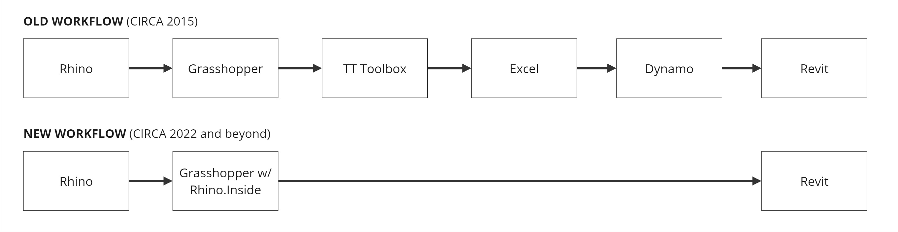

# Software Intro

I'm excited that you are interested in learning more about Rethinking BIM! If you're interested in computation, BIM, and the merger of the two, this sequence is for you. We will also tackle real-world challenges related to building design and documentation while exploring new methodologies for project execution.

INSERT DYNAMIC GIF FROM END OF TUTORIAL

The purpose of this sequence is to think not only about how you can use Revit, or BIM, within a computational design workflow but also about how you can plan your workflow in a way that leverages computational thinking to augment building constructability. 

As much as Revit is great for production, it is not well-suited for design. As much as Rhino is great for design, it is not well suited for production. Each of these platforms has made strides to improve capabilities, but the nature of the architectural building design process will always involve multiple applications. Therefore, knowing how to work with different software is beneficial in practice. However, knowing how to plan workflows that streamline the transition between platforms is rare but incredibly valuable. Finally, knowing how to unlock the benefits of each platform will actually allow you to augment their strengths, create a dynamic interplay between applications, and leverage the transfer of data to turbocharge your design process.

If we accept the fact that multiple different applications are required for an architectural design project, we should also assume that in today’s climate, you will most likely be designing in Rhino, and you will most likely be documenting the project in Revit. There are other design platforms and documentation platforms, but the Rhino the Revit workflow is incredibly common and powerful. Up until fairly recently, this workflow was challenging and involved multiple steps to set up. One specific project I worked on in 2015 required several steps and multiple plug-ins to translate information from Rhino to Revit cleanly, and different data types required different processes. With the advent of [Rhino.Inside.Revit](https://www.rhino3d.com/inside/revit/1.0/), this translation process has been reduced to a single step. Throughout this sequence, I will also refer to Rhino.Inside.Revit as Rhino.Inside or RiR.

## What is BIM?
BIM stands for Building Information Modeling. Throughout this sequence, we will further explore how BIM is a powerful tool not only for architectural design but also for development, construction, and building operations. It is important to note that BIM is by no means a one-size-fits-all approach to a design and construction project. If you were to try to capture everything that BIM can do on a project, not only would it take a tremendous amount of time and resources, but it would also require the input of disciplines ranging from real estate developers to engineers to building operators to contractors to subcontractors, and so on. At the outset of a project, it is important for the stakeholders involved to define the BIM goals that are critical to project success.

Also, most people assume BIM means Revit. This is essentially the same thing as calling a tissue a Kleenex or a chicken nugget a McNugget (do people eat those anymore?). Revit is  a BIM platform. However, not all BIM is Revit, but Revit is the most popular BIM platform for architects. 

BIM is many things, but the capability we will leverage most for this class is its ability to directly associate essentially any type or amount of data with geometry. We will use computation to program that data as an input, automatically associating it with geometry. Then, we will leverage it for endless possibilities as an output as we extract it for whatever purpose we require.

## What is Rethinking BIM?
For the purposes of Rethinking BIM, we will focus on a few selected data-driven workflows. We will approach BIM from an architect's standpoint, with an awareness of what is important for both our client and or contractor.

The important thing to take away from this sequence is that if you merge data and geometry, you can unlock a world of possibilities. The ultimate goal is for you to be able to define what data is important for YOUR project, develop a clear strategy to leverage that data, and accurately execute that strategy to deliver a successful project. 

**This is not BIM 101 or Intro to Revit.**

Rethinking BIM encourages a project-wide methodology of analytical thinking and data-driven design, leveraging computation as a tool to link BIM into a seamless workflow.

## Preparing for this Sequence
For this class, you should know the basics of both Grasshopper and Revit. If you don’t know the basics of Grasshopper, [you can find an introduction on the Smorgasbord here](https://cdp-smorgasbord.netlify.app/modules/4-grasshopper-intro/index).

There are many resources for learning Revit. [This sequence, which I recorded for GSAPP,](https://youtube.com/playlist?list=PLIqhlKP0NUNdCIUfR-QCvFp1q5C6TN4gT&si=_GlIhetMiHDaNVYc) will teach you the basics of Revit 2023 and give you the knowledge you need for this class.

Additional resources are listed at the bottom of the page if you want to dive in deeper.

>**Joe’s Tip #1:**
>
>If you want to get good at this, work through many tutorials. Computational design is not like CAD-based 3D modeling. Both are incredibly robust, but with a few underlying concepts, you can go far with basic 3D modeling. That is not the case with computational design. I have found that I am constantly revising even my basic workflows after seeing how other users do things. The power of computation stems from linking various workflows together and building custom algorithms. The more you know, the more you can customize and expand your capabilities.

One of the beautiful things about Rhino and Grasshopper are how open-ended and flexible they are. One of the challenging things about Revit is how rigid it is. Rhino.Inside bridges the gap between the two platforms and will serve as a conduit to automate production, analyze geometry, and allow for complexity to be realized in Revit.

At a minimum, you will need access to the following platforms or plug-ins for this sequence:

* Rhino 8
* Rhino.Inside.Revit (latest stable build)
* Revit 2023 or later
* Excel (any version should work)

Note: Rhino 8 has added [Object Attributes](https://www.rhino3d.com/features/grasshopper/object-attributes/), which provide substantial workflow improvements. If you’ve used [Elefront](https://docs.elefront.io/) in the past, the new Object Attributes provide similar functionality. It is important to use Rhino 8 for this sequence since Object Attributes are leveraged. 

However, depending on the focus of your project, you may need additional capabilities beyond vanilla Grasshopper or Rhino. Chances are you can find a plug-in or package for Grasshopper or Rhino that meets your needs. Also, the [legacy Grasshopper 3D forum](https://www.grasshopper3d.com/) and more recently established [McNeel Rhino forum](https://discourse.mcneel.com/) are both incredibly robust, and the community is helpful and responsive. After 14+ years of using Grasshopper, I still consult these forums almost daily.  

To find additional content for Rhino and Grasshopper, you can run the “package manager” command in Rhino to install additional resources quickly. You can also check out [Food4Rhino](https://www.food4rhino.com/en) for a vast library of resources. 

## Additional Resources:

[Archi-tech Network](https://archi-tech.network/catalog): One of the best resources for architectural modeling in Revit and Grasshopper. Unfortunately, it is not free, but it’s well worth the cost. 

[Managing Complexity](https://youtube.com/playlist?list=PLIqhlKP0NUNduZt4544HDckzEoIXlemnB&si=VDEw2ptEF_QvYkIK): I developed a set of tutorials that was the precursor to this sequence. If you are hungry to get ahead and build out your skillset, dive into these. This is free 🙂

