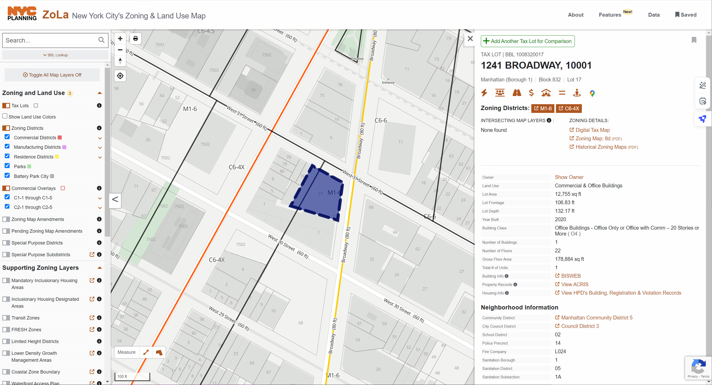
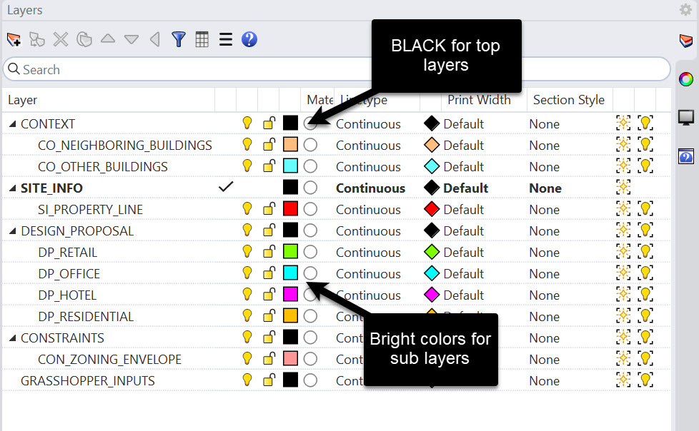
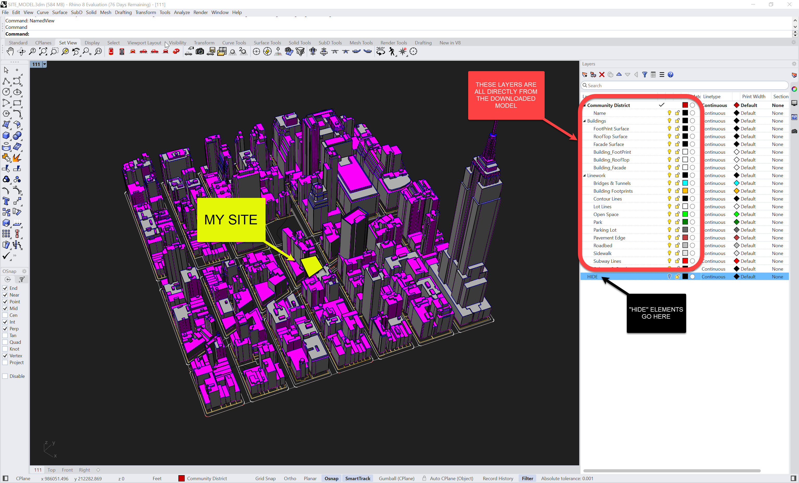
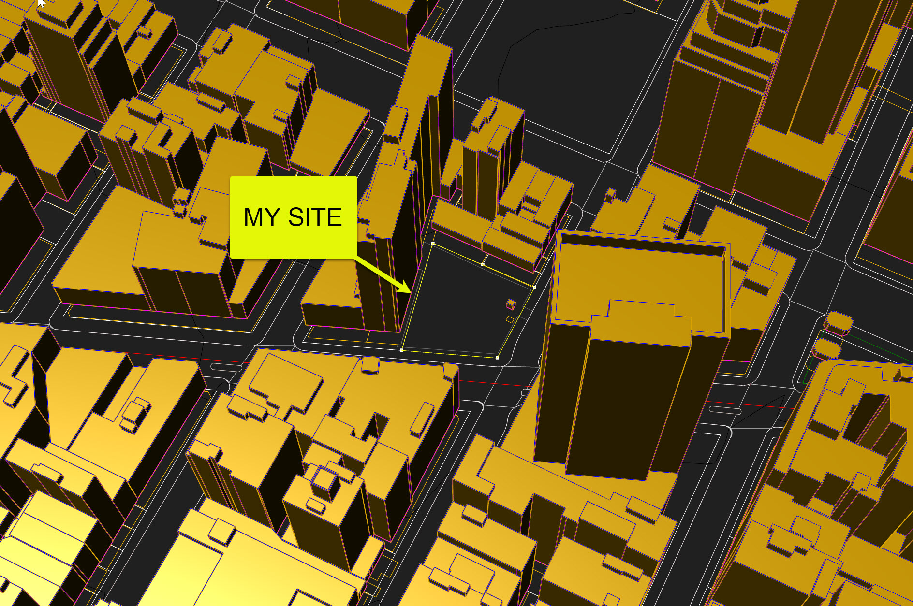
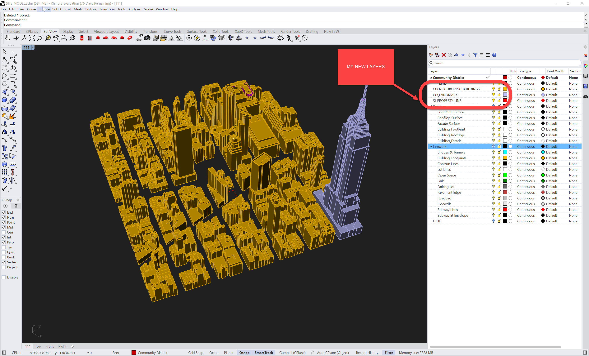
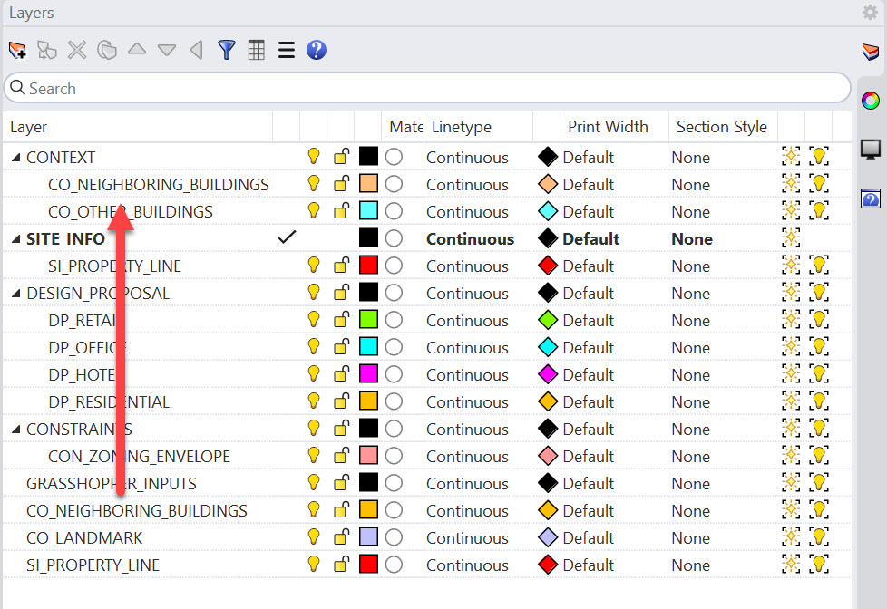
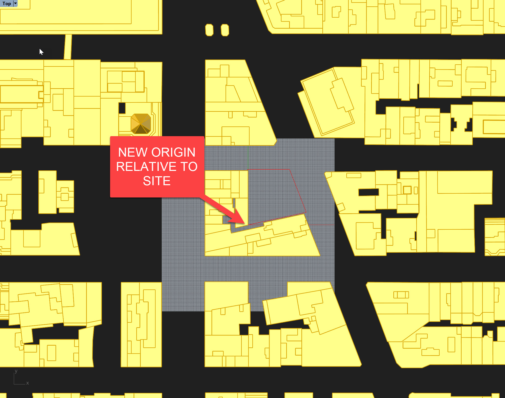

# Model Set-Up

In this section, we'll cover how to set up the preliminary geometric constraints for your project. This includes:

- Establishing Good Layer Organization - I mentioned this earlier, but to reiterate this will help you keep your project organized and will also allow for automating the import of certain geometries. It will also allow you to quickly turn on and turn off layers to help with visualization and managing performance. You'll notice your file may run slowly while the context is turned on - having a quick method of turning this off is very helpful.
- Esatblishing Accurate Site Context - this is critical for future analysis realted to environment, adjancies, and views... just to name a few.

For the rest of these modules, I'm going to use the following site:

**Remember, your site will have it's own unique characteristics. Feel free to use my site, or use your own in tandem with these tutorials, but remember to substitute any zoning, programming, or planning constraints as needed.**

## Layer Organization
As this was touched upon in the [Construction Geometry](https://smorgasbord.cdp.arch.columbia.edu/modules/24-parametric-thinking-for-building-modeling/241-construction-geometry) section earlier in this series. Now let's put it into practice.

I'm not very strict about naming standards as long as it's clear and organized. Think about layers and sublayers. For example, I usually like to have my **Context** as one of my top level layers, and the sublayers here will be buildings, roads, neighboring site boundaries, or other critical landmarks. Next, my specific **Site Info** will be on another top level layer. Then, my **Design Proposals** will be on a third layer. My **Constraints** will be on a fourth. And finally, my **Grasshopper Inputs** will be the fifth. Also, nothing should go on these top level layers - they are used to universally control visibility of thier sublayers.

And we also might reference objects that are not on our **Grasshopper Inputs** layer for Grasshopper - this is strictly for objects that are only needed for Grasshopper. Our zoning envelope is a good example of this. 

>**Joe's Tip #9**
>
> After many years of trying to figure out the best method of organizing a Rhino project, I've come to the conclusion that there is no best consistent way and the project needs to evolve as it progresses. Our office has also adopted this stance, as layer organization on early stage design, competitions, and concepts will look much different then more developed models. On this project, our layer setup will be light and geared towards early stage design. Also, most of our detailed modeling will occur in Revit, so we don't need to establish a Rhino layer structure for these elements. 

Ok, so now let's get setup.
- Start a new Rhino file and choose "Large Objects Feet" as the file template. 
- Create five main layers (the five categories I listed above). Note that I do not like to use any spaces when naming layers, but rather opt for an underscore. This will help in referencing things later. Also, I like to use all capitals in my naming. This helps me quickly distinguish between layers I created, and ones that may have come from imports. If something doesn't conform to my naming convention, I know it hasn't been categorized yet. So, for the "Site Info" top layer, use "SITE_INFO"
- Create a few sublayers to get started. Please note that I like to add a prefix to each of my sublayers that is based on the top layer - this will also help with referencing objects later on. This list will expand as we progress, but let's start with massings for each of the programs. Let's also create a sublayer for our site boundary, and another for for our zoning envelope. Finally, start to add some structure to your context layers. Below is how mine is starting to look:

    

- Note a few things. First, my top level layers all use Black as their display color - this will also help me identify if an object isn't assigned to a sublayer. I then use bright colors for each sub layer. Some people prescribe to the color of the layer should look like the actual object - I would use the material color for that purpose. It allows you to have multiple layers of visial information embedded in each layer - on that is diagrammatic, and one that is more realistic. We can adjust these colors as we progress if needed. But avoid using Yellow as that is the default selection color in Rhino.

## Site Model Organization
Now that our layers are set up, let's get the site model organized.

- I'm going to start with a file that I downloaded from [NYC's Open Data website](https://www.nyc.gov/site/planning/data-maps/open-data/dwn-nyc-3d-model-download.page). There is a ton of info here, but this specific section has very accurate 3D Rhino models of most of NYC. Please note these were last updated in 2018 so if there's a new important building in the vicinity of your site, you may have to model it from scratch. You'll need to find the Community District that your project is in and download that model. The files themselves contain the other boundaries of the community districts, but if you're looking to get a head start, [check here](https://data.cityofnewyork.us/City-Government/Community-Districts/yfnk-k7r4).
- My site is in Manhattan Community District 05 so I'll start with that file. You'll notice this is a pretty big file, so therefore I don't want to bring everything in to my working model - only the elements I need to use. If I have two models that are coordinated accurately to each other, I can easily cut and paste elements into their right locations as needed.
- I will also take that initial downloaded model and get it a bit better organized - everything that isn't within a few blocks of my project goes on a "HIDE" layer so I can see my site more clearly. After those first few steps, your model and layers should look like this:

    

- Note this is not my working model - it's solely to get the site organized and cleaned up.
- You'll also notice that the buildings themselves are surfaces that each represent facade vs rooftop vs footprint - this can be incredible helpful if you need to analyze each of those elements concurrently. But for our purposes, we want them all as polysurfaces. So let's select all of the building surfaces that are within our vicinity and join them to get them ready to import. Remember the magenta surfaces represent element backfaces (I set this up in an earlier demo and is a good way to make sure your surfaces are all facing the same direction) - you may see a few of these stray ones after you join - try to flip them so you don't see any magenta, but if there are a few pesky remaining ones you can leave them for now. Some may not join cleanly as well - that's ok for now. The Empire State Building will join into several pieces, not one solid element.
- Let's also make sure our site is clearly delineated, so I'll grab that property line and put it on it's own layer - this should be on the "Linework:Lot Lines" layer. Make sure you select the lot line and not something else, like a parking lot.

    

- You may want some other elements to reference later, like subway lines or pavement edges, but for now let's leave them for now. The nice thing about this process is you can bring in elements as needed, rather then taking info more then is required and bloating your model. Also, feel free to delete anything on you site or put them on a "DEMO" or "EXISTING" layer
- Finally, I added the Empire State Building to a "CO_LANDMARK" layer so I can use this for things like view analysis if needed. I've hid all my other layers, and my file now looks like this:

    

-   The last thing we'll need to do is bring this information into our working model. Open them both in different sessions of Rhino 8, and simply copy and paste the elements from your site model into your working model, using Ctrl + C and Ctrl + V. Your objects will be far away from the Rhino origin - we'll fix that in a minute. 
- The layers will not come in on their proper sub layers, but that's ok - either move the objects to the right layers, or reorganize your layers:

    

- Now let's get the origin sorted - there are a few things to consider here. First, why is it so far off? It's because the models from the City Dataset are located relative to geodetic reference system, the [National Spatial Reference System (NSRS)](https://oceanservice.noaa.gov/facts/nsrs.html). This is incredibly helpful when understanding where your project is relative to other buildings, and for coordinating across vast swaths of land, but it's really challenging when trying to model in Rhino. Plus, Revit and most environmental performance analysis platforms have the ability to set these coordinate in the file. The most important thing for us it to ensure our Rhino and Revit origins are in the same location - you'll see this come into play later. 
- So to fix this, I'm going to select everything in my working model and move them to the origin, using the property line as a reference. I'm then going to rotate everything to the streets running east - west are running parallel to my x-axis. However, we'll save a reference so we can snap things into the right place in the future:

    

- Now, you'll need to rely on your site boundary to ensure that things are in the right place relative to each other - if you bring in additional elements in the future, make sure to also bring in your site boundary from your site model so you can use it as a reference.
- The final thing we'll need to do is set the height - the building elevations are set relative to the NSRS, but the lot line is now set to 0 elevation. We want to ensure our design is in the right place relative to the neighboring buildings. I'm going to copy the property line up to the height of the neighboring buildings, then set that new property line to be an elevation of 0. Finally, I'll move the property line that is not at 0,0,0 to a new layer, called "PROPERTY_LINE_REF" which we can use to coordinate against other info if we need to being more data in. You can snap the property line from your site model to the new "PROPERTY_LINE_REF" in the future to ensure things are in the right place relative to each other:

    

You can download my **[site model](workingfiles/SITE_MODEL.3dm)** or my **[working model](workingfiles/RB_PROJECT_MODEL.3dm)** if needed.

Ok, now that we've set up our site constraints, we're ready to start querying geometric and numerical data in Grasshopper!

**Side Challenge 4:** *Can you bring in the sidewalk and road boundaries to create a more detailed model? Try setting up a grasshopper script that quickly extrudes them, or do it manually.* 

