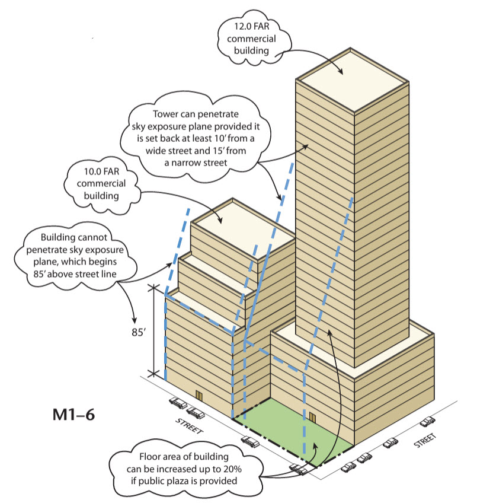
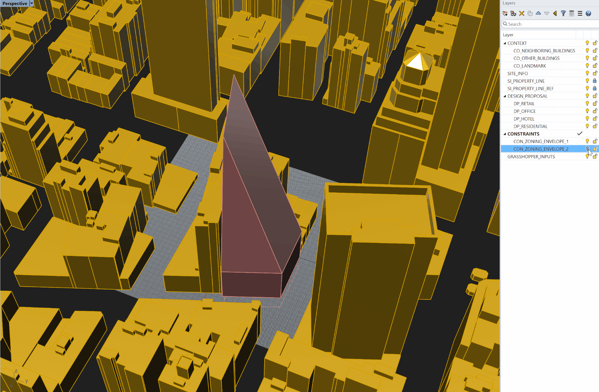
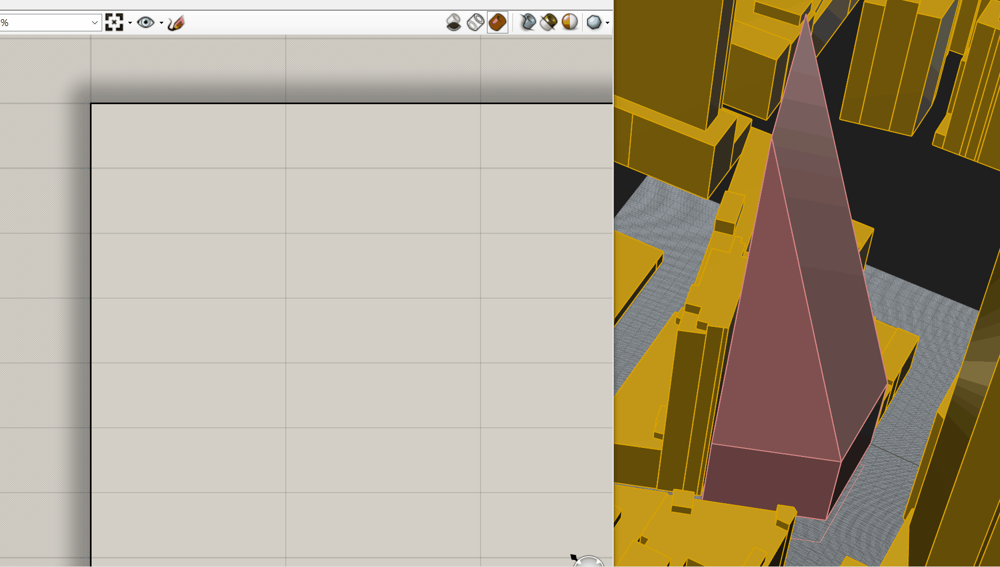
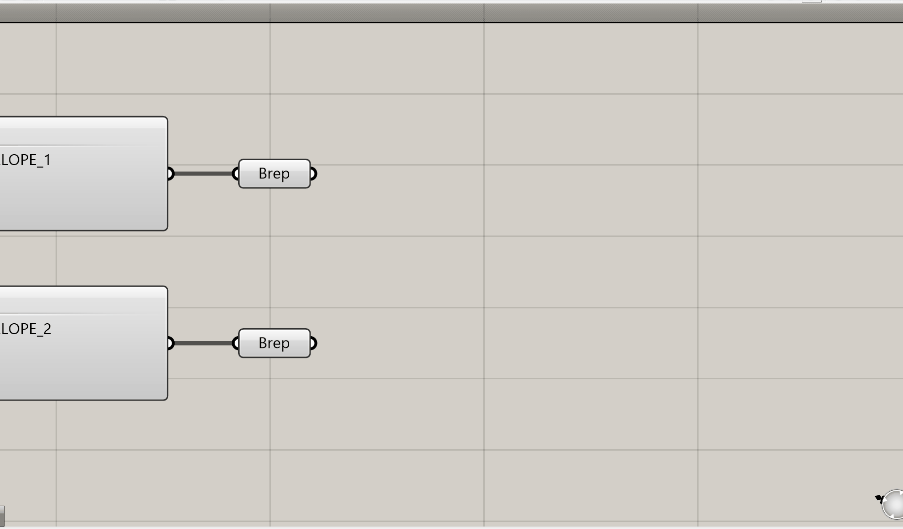
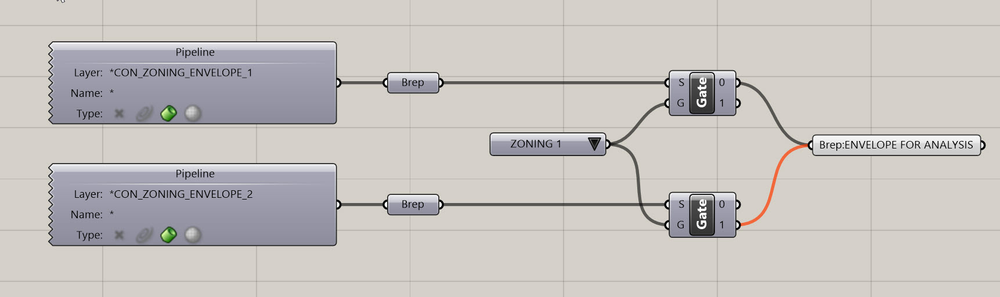
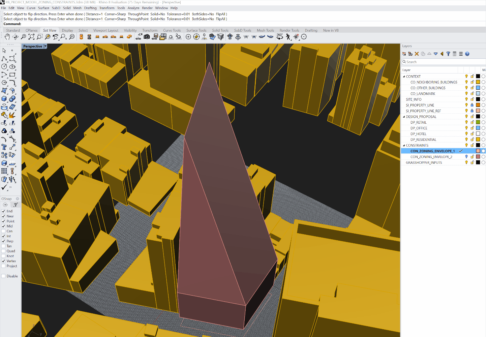
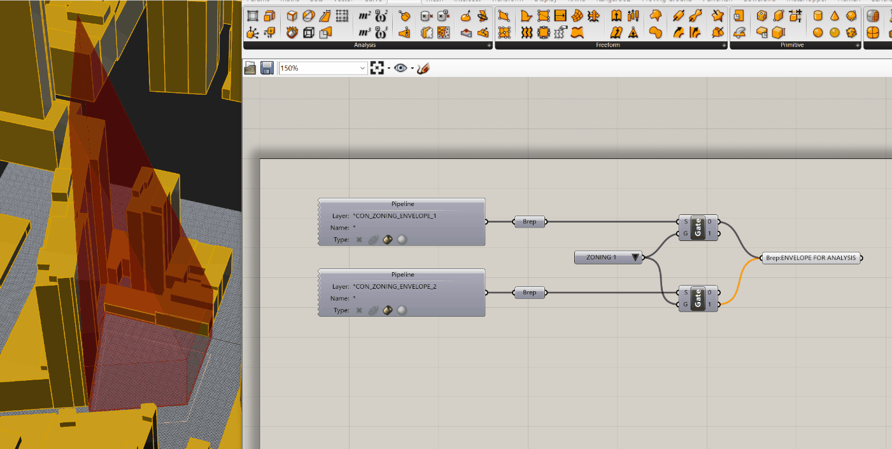
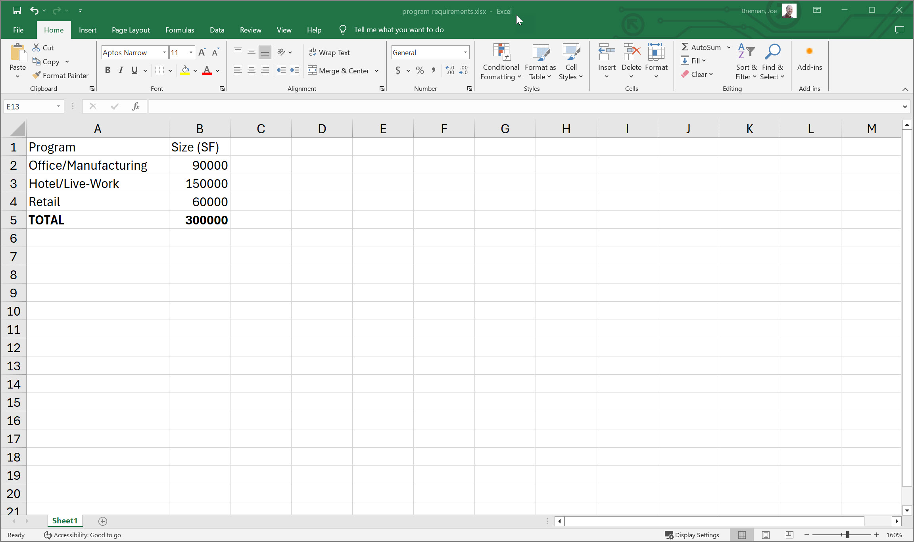
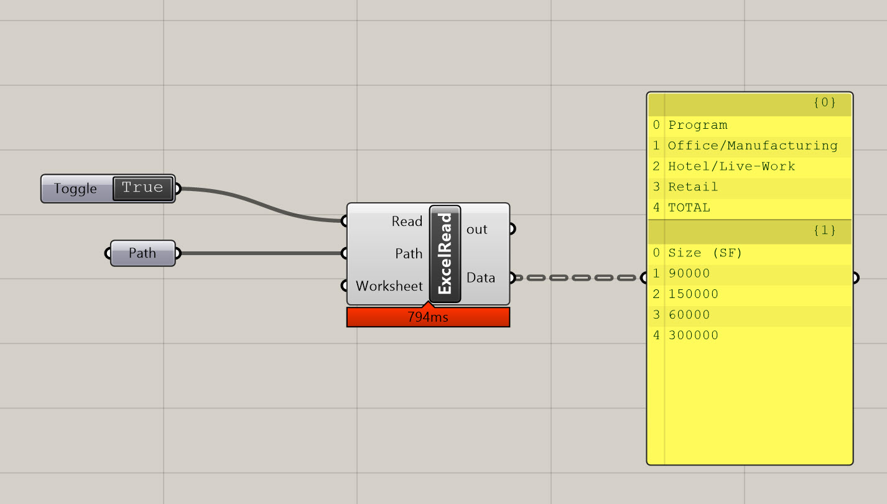
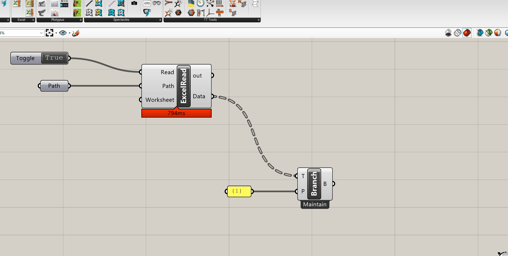

# Establishing Key Building Targets and Constraints

In this section, we'll cover how to set up the further numeric and geometric constraints for your project. This includes:

- Defining Zoning Constraints - this will help you quickly analyze if your design is compliant with Zoning or not
- Setting up Numerical Constraints - in this instance, your program targets

## Defining Zoning Constraints

Zoning regulations consist of a series of metrics that get translated into spatial constraints. Our site is zoned as [M1-6](https://www.nyc.gov/site/planning/zoning/districts-tools/m1.page). I'm going to use the following diagram to help me establish my zoning envelope:

M1-6 is interesting because there are two variations on the envelope that you can pursue - the first is building directly to the property line on the street facing sides, but then you would be limited by the sky exposure plane. The second option allows you to penetrate the sky exposure plane if your building is set back at least 10 feet from a wide street and 15 feet from a narrow street. I have a sneaky suspiscion the second option will be better for us on this site, but let's set it up so we can evaluate both. 

- We're going to model out the zoning envelopes by hand rather then parametrically. While there have been many attepts to automate this (including by me), zoning is incredibly complicated and I've found the best way to ensure accuracy is to model it directly while referencing your local zoning code. 
- I'm going so revise my layers a bit to set up two different envelopes - one for the setback, and one for the option that is directly up against the property line. We'll then set up a parametric operation to toggle between these two. Adjacent to the site, [West 31st is a narrow street, and Broadway is a wide street,](https://www.nyc.gov/site/planning/zoning/glossary.page#:~:text=A%20narrow%20street*%20is%20a,feet%20or%20more%20in%20width.) so we'll be cognizant of that when modeling our envelope. Also, the Narrow Street Sky Exposure Plane = 2.7 to 1 and the Wide Street Sky Exposure Plane = 5.6 to 1 so we'll implement that as well. Do not model a "bottom" on the envelope as there is no restriction as to how deep you can go, and you don't want the definition to flag your envelope as non-compliant if you do go below grade. Below is the result:
 
    

- You'll notice that the tower option allows for much more height, and the setbacks aren't even that noticable.
- Now that our envelopes are modeled, let's open up Grasshopper and establish a method for toggling between options so we can check to see if our building meets zoning requirements.
- I'm going to introduce you to a new component called `Geometry Pipeline (Pipeline)`. This component is great for quickly referencing geometry. Basically, it allows you to add an manipulate geometry in your file without having to constantly re-referencing it. This methodology relies very heavily on keeping layers organized - so remember to keep everything named clearly and on the right layers.
- To use this component, set the Layer property to the name of you layer - leave the asterik (*) at the front which allows you to find that text even if it's in a sublayer. Then, at the bottom of the component, set the geometry type to Brep.

    

- Now any Brep geometry on that layer will automaticallt be referenced by Grasshopper - no need to click and set the object.
- Create a second `Geometry Pipeline (Pipeline)` comonent and repeat the process, this time with the other zoning envelope layer. 
- Now, we're going to set up selection filters. This is another great Grasshopper workflow to add to your standard toolkit. Create a `Value List` component. This will allow you to set up a series of options and associate them with an integer, which can later be use to select between different objects.

    

- Next, place two `Stream Gate (Gate)` components. In the first, plug your first zoning envelope into the S input and your `Value List` into the G input. On the second, plug your second zoning envelope into the S, but take the same value list and plug it into the G. Plug the 0 output of your first `Stream Gate (Gate)`component into a `Brep` component and plug the 1 output of your second `Stream Gate (Gate)` into the same `Brep` component. It should look like this:

    

- To finish off our Zoning envelope selection function, we're going to add a bit of tolerance to the envelope - if we model directly on the property line, it will report it as non compliant. So, all we're going to do is offset our envelope by 1 foot for some wiggle room. Now, the challenge here is it's very difficult to do in Grasshopper without plug-ins and we don't really need this to be parametric, so I'm going to go back to my orginal rhino geometry and offset the surfaces. The good news is my `Geometry Pipeline (Pipeline)` components will quickly rereference this new geometry. Go ahead and run the "OffsetSrf" command in Rhino - make sure the corner setting is set to sharp, and you are not creating a solid. Also make sure the offset distance is 1 and that your arrows are facing out. Delete your orginal surface so it's not referenced twice. Do this for both Zoning envelopes. Confirm the two envelopes are each on the right layers:

    

- Your definition should look like the following, and you should be able to flip between zoning options using the dropdown. We will later use these envelopes to check out building for compliance:

    

## Defining Numerical Constraints

We've set up a way of referencing geometric constraints for analysis - now let's do the same for numbers.

- You're often getting data from Excel, either from a client or design lead who is managing the program or stacking chart. Let's look at how to quickly reference this information, and also set it up to dynamically update if the Excel file changes. I've set up a very simple spreadsheet for demonstration, but you can use any spreadsheet in the same way - just ensure you're referencing the right cells, and try to maintain cell location as the project progresses. Create an Excel spreadsheet that matches mine below:

    

- Drop an `Excel Reader (ExcelRead)` component on your canvas. Note this is part of the LunchBox plug-in. There are other Excel readers, but this is my preferred one. If you need help installing it, please refer to [Use Case 2 in this tutorial](https://smorgasbord.cdp.arch.columbia.edu/modules/24-parametric-thinking-for-building-modeling/242-how-to-approach-parametric-building-modeling). 
- To get the `Excel Reader (ExcelRead)` to work, you need to set the Read input to True. Place a `Boolean Toggle (Toggle)` component on the canvas and set it to True, then plug it in to the read. Next, set a path by placing a `File Path (Path)` component. Right click on this `File Path (Path)` component and choose "Select one existing file." Navigate to your Excel file and set it here. Ensure your file is saved before you do this. If it is and is still not reporting correctly, toggle the boolean to false then back to true and see if that helps. There is a Worksheet input as well - you can leave that for now. In the future if you have multiple worksheets in your file, you'll need to input the name of the one you'd like to reference. 

    

- You're now reading the data from Excel directly into Grasshopper! This may not seem super exciting, but it opens up a world of possiblities, and allows you to combine the organizational aspects of Excel with the parametric aspects of Grasshopper.
- Alright, now let's extract the square footages we need. The data from Excel is organized by Branch (Excel Column) and Item (Excel Row). We need Branch {1} and items 1, 2, and 3. To get the Branch, use a `Tree Branch (Branch)` component. Plug the Data into the T, and in the P you'll need to input the exact branch you want to reference. Place a `Panel` with the text {1} in it, and plug it into the P in the `Tree Branch (Branch)`. 
- The output of this will be all of the data from the branch we need in one list. To get the three numbers we need, we'll create a list item component and expand it to cover all the items we need.

    

- To wrap this up, we'll add three `Number` components and label them with the associated program so we can reference them later. It shoud look like the following:

    

We're all set for our next tutorial, where' we'll look at creating geometry an analyzing the square footages of the different program elements. In the last tutorial, we'll bring it all together so we can check that we are hitting our targets.
