# Extracting Key Data from Model

In this section, we'll cover how to extract key data from your model. This includes:

- Establishing a massing apporach - this will not only define how you evaluate your building area, but ultimately how your geometric facade rationilization 
- Contour floor slabs and extract areas - this will allow us to evaluate program compliance
- Understand efficiences and deductions - what is our GFA vs. ZFA. vs. RSF
- Retrofit a definition for a different massing style

## Establishing a Massing Approach

As discussed in class, there are many ways approaches to building massing. It is important to understand what the program of the building is, and how to make sure your massing approach allows for your program and layouts to function. It is also important to ensure you're able to adapt your design to meet your analysis targets. One of the most time consuming aspects of an early stage design process can be counting and keeping track of square footages, as well as running the calculations to make sure you're hitting your target GSF, ZFA, and RSF. This is where we can rely on computation to run calcs for us, while we can focus on design.

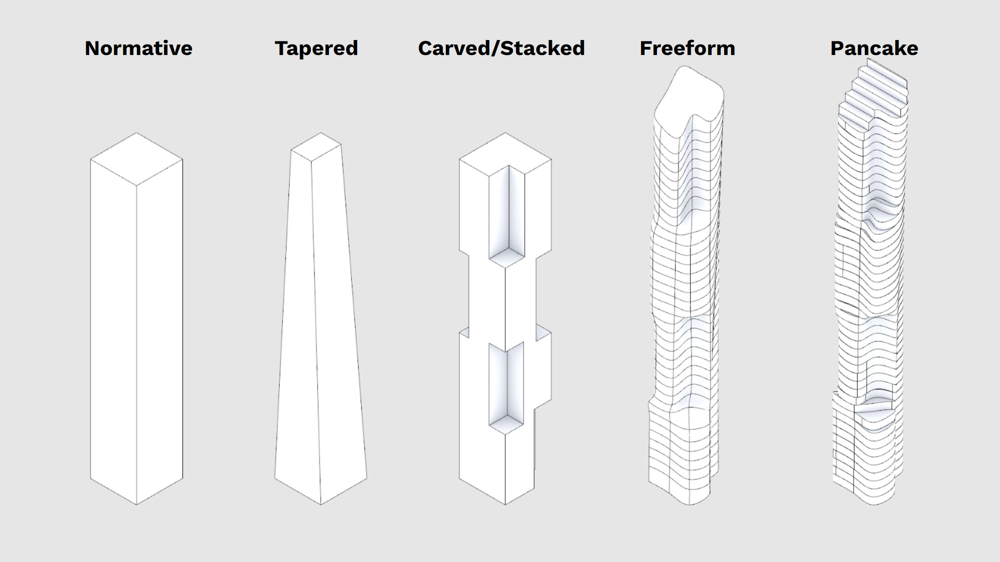

Above you'll see five overly simplified massing approaches - obviously there are variations on these, you can combine them, and there are also a ton of other approaches you can take. For the purposes of this course, the techniques we'll explore in this section will allow you to analyze the above options and you should be able to adapt your script to analyze a broad variety of other massing styles or approaches.

For your project, think about your design apporach, then then use the right technique to analyze your massing. For these tutorials, read and work through both options.

## Normative, Tapered, Freeform

We're going to use the same technique to analyze these three methods.

I'm going to work with a Freeform, because even though it looks the most complicated, it's just as easy to do as the more straightforward designs.

- Open your model that has your zoning constraints in them - you'll need these later. We previously created layers to hold different program types - for a freeform or monolithic massing we'll just use a single layer, so create that layer and model your Freeform design - note this should be a single, closed solid object. 

**Side Challenge 4:** *Can you model your freeform option parametrically? See if you can use curves, lofting, and other techniques within Grasshopper to create a more dynamic and easily editable design option.*

- Below is that my option looks like - I used three simple curves to loft it and create a twist as it rises. 

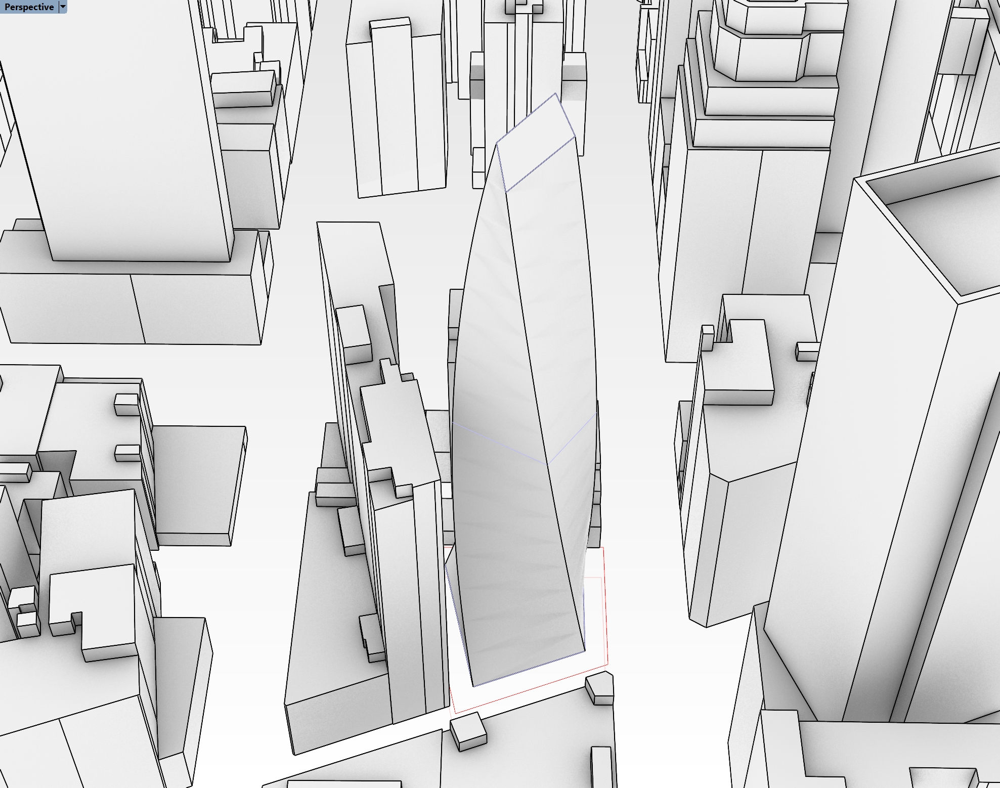

If you want to use my model, [you can download it here](https://drive.google.com/file/d/1QRfu5JP8oS26w8vyw6rjPWM7liVW_ZnW/view?usp=drive_link), but you are also welcome to play with your own design.

- Now let's analyze the areas - because it's a single massing, we're going to need to implement a logic that assignes each floor plate to a program. On that note, let's take a moment to discuss floor-to-floor heights. The simplest way to create floorplates from this massing would be to use a contour component, or just contour that natively in Rhino. But, floor to floor heights are typically not the same throughout a building, especially in a mixed-use project, so we'll need to account for that in our parametric analysis. 
- Open Grasshopper if you haven't yet, and open up your definition that has your zoning envelopes and excel reading functions. We're going to start a new function in here, but we'll stitch it all together later. Drop a `Geometry Pipeline` component onto the canvas and use it to pull in your massing option. 
- Typically, retal is at the ground floor in a mixed-use building. So I'm going to tackle that first. We're going to use elevations to define where we can to cut our floor plates, but instead of explicitely typing in the elevations, we'll do some math to calculate what they should be. Drop a `Series` component on the canvas - the S value by default is 0, which is good for our purposes since that is the elevation of our ground floor. Then add two sliders - the first represents the floor-to-floor height, and the second represents the number of floors. Plug the first into the N input on the `Series` component, and the second into the C. You now have a dynamic way of creating elevations for each retail floor.

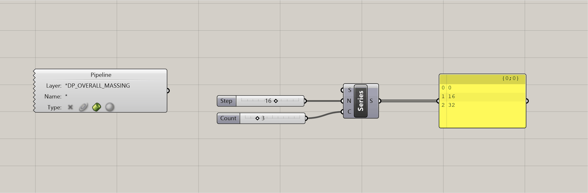

- In the gif above you can see how the elevations will update as you adjust the sliders. This is helpful, because it will allow you to test different configurations to hit your program targets. We're going to do the same thing for our office program, and our hotel. Except this time, we need to make sure the office starts on the floor above our top retail floor. We just need to add in the top elevation of the retail floor PLUS the floor to floor height to get the starting elevation of the office, and make that the S input on our next `Series` component. Below is what this should look like:

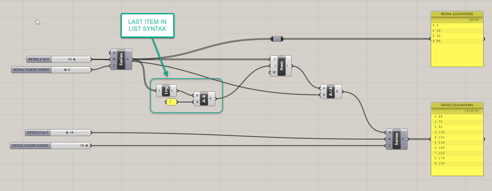

- The syntax that I've highlighted is very common, and is used to get the last item in a list. I've also taken some time to get organized and label my sliders and output panels - you can see we have the beginnings of a dynamic stacking chart. I'm going to do the same thing for the hotel then we'll be ready to start sectioning the massing. See below for how that should look:

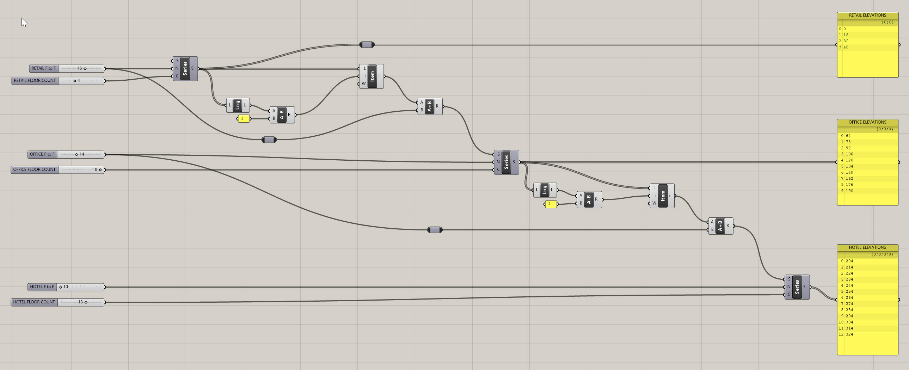

- Now let's contour our building. We could merge all of these elevations into one list, but i want to keep them seperate so we can evaluate the different program square footages independently and compare them to our targets. So again lets start with retail. We need to create a plane at each elevation to cut our massing - but we first need a point to establish the origin of that plane. Drop a `Construct Point (Pt)` component and plug your retail elevations into the Z input. No need to input X or Y because these are 0 by default, and because planes extend infintely in two directions, it doesn't even matter if they are close to our building. The plane is easy - use an `XY Plane (XY)` component, which by default gives you a plane at the origin extending in both the X and Y axes. Plug the output of your `Construct Point (Pt)` to the O input of your `XY Plane (XY)`. Repeat this for the office and hotel.

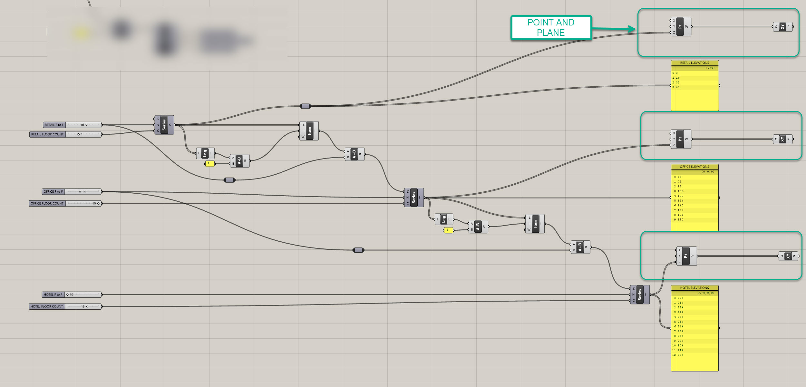
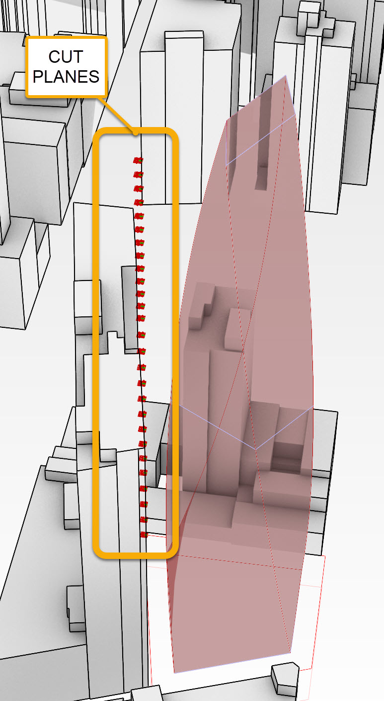

- What I've been doing so far is creating parallel processes in Grasshopper - basically I'm creating redundancy in the definition by copying functions and tweaking them. This is ok for now because each function is slightly different, but I don't want to keep copying the same process three times. I'm going to merge all my data into one tree to avoid this. It is very important to note that this is not one list - but rather one tree with three branches. Place an `Entwine` component on your canvas and plug the three planes into the three inputs. 

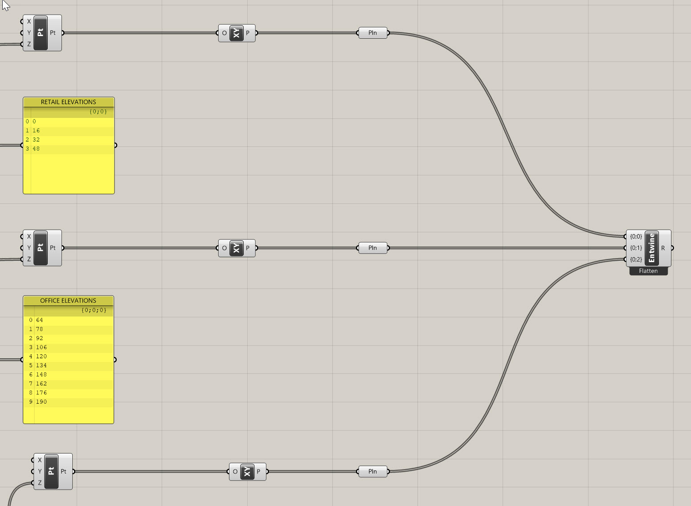

- We now have three different branches but we can the same function on them - and since they are different branches, we can evaluate them independently later. The next few steps are easy - we're going to intersect our Brep with our Planes, and then create surfaces from these new cuts. Use a `Brep | Plane (Sec)` component for the intersection, and plug your massing into the B input and your Entwined plnaes into the P inout. Then use a `Boundary Surfaces (Boundary)` component to create a surface, and plue the C output of the `Brep | Plane (Sec)` component into this. 
- We now want to split this up into branches we can evaluate independently. First, we need to organize the branches a bit. You may have noticed that the `Brep | Plane (Sec)` component created a seperate branch for each intersection - this is helpful because sometimes the planes will intersect the brep in two or more locations, and you may want to understand that at a detailed level. For our purposes, we want to merge them back into three branches. Let's use a `Shift Paths (PShift)` component for this, which will remove the second branch structure and bring us back to the orginal three branch structure.
- Now lets color code the floor plates so we can more easily understand what is retail vs office vs hotel. I could split the tree branches out, but I want to maintain my tidy housekeeping and leverage our clean structure. So, use another `Entwine` component and create three `Colour Swatch (Swatch)` components, one to represent each program. Change the colors of these to match your program colors, which should also match your layer colors for each program for consistency. Plug each `Colour Swatch (Swatch)` into an entwine input, and make sure your order of your colors matches the prder of your program elevations, or else your colors will get mixed up. 

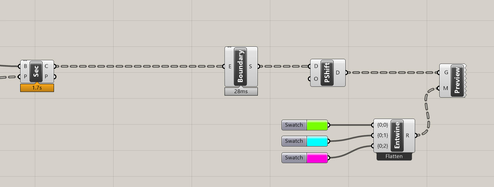

- If you adjust your original sliders, your floor plates should adjust accordingly!

- Now we want to get the areas of each program, so we're going to use and `Area` component. Take the one output of our `Shift Paths (PShift)` component, and plug it into the one input of the `Area` component. Take the A output of the `Area` and plug it into the one input of a newly created `Mass Addition (MA)` component. This give you the sum total of all the values in each individual branch - so technically this is our GFA for each program. There's probably a ton of decimal points at the end of each, so use a `Round` component to simplify the values - plug the R output of the `Mass Addition (MA)` into the `Round` and you'll have rounded GFAs for each of your program types.
- We need to find our ZFA and RSF - the ZFA applies to the full building and is not delineated by program (at least not in this instance - some zoning overlays require you to track seperately, so make sure you're aware of the sites requirements). RSF needs to be tracked by program, and also the efficiency rations for each will be different, so we need to track those seperately. 
- We need to do a little math to get our ZFA, which is essentially our GFA minus any zoning deductions we can take (like mechanical areas or mechanical shafts). At this stage of design, we will just apply a factor, called a Gross Up, to our ZFA to get our GFA. But the problem is we HAVE our GFA (because this is actually the built square footage of the project) and we need to calculate our ZFA - so the formula looks like this, with GU representing our Gross Up, which is typically around 3 or 4%: 

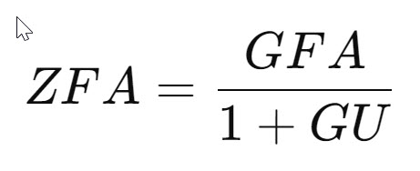

- Let's implement this into Grasshopper - flatten the rounded GSF values and add them all up - these are all techniques you've used before. Then, set up math that matches the formula above using a little bit of algebra (see, your teachers we right when they said you would need to use it one day). It should look something like the following. Note on the right hand side of my definition I have added panels where I can compare my total GFA, total ZFA, and my GFA by program:

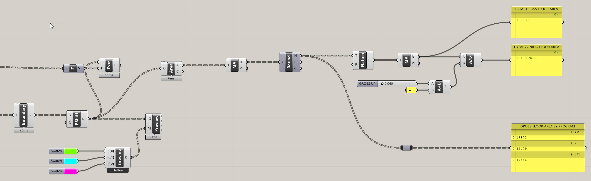

- **After you've completed the large massing above, let's dive into a pancake option. You can [download my progress definiton](https://drive.google.com/file/d/1QUPIK_p6AlGgSZhdsS3F4JnRLYbgSzEk/view?usp=drive_link) here if you are stuck**

## Pancake

- The above method works for a large single massing that you need to later segment by floors, but what happens if your building looks more like the Pancake Option from above? You would need to extract your floor areas differently. See my example below, which is a different approach to the same site:

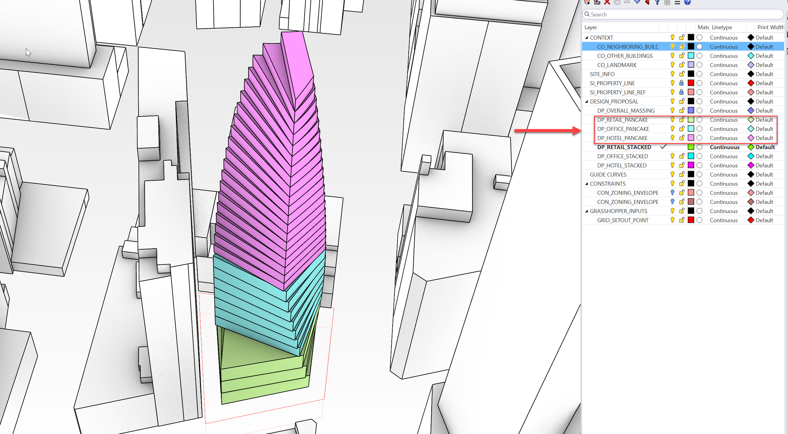

- The above example is a different take on the previous design - some of the corners align going up the building, and some don't. When you're actually designing your project, take the time to play around with tweaks on your design, and leverage our parametric methods to test them out.

- Some design take this approach to model a building, where each floor is modeled individually. It also shows a design intent where the floorplate is twisting, but the facade is vertical. Think about the difference between these BIG projects - [One High Line](https://big.dk/projects/one-high-line-3358) and [Via West 57th](https://big.dk/projects/via-57-west-2350) both show how the facade is actually curved to follow the form. Conversely, [Aarhaus Residences](https://big.dk/projects/aarhus-residences-19789) and [Ellinikon Park Rise](https://big.dk/projects/ellinikon-park-rise-16186) both show how twistig froms can be expressed with more normative facade systems.

- THe main difference here is that we are going to model each floor individually - so the number of floors, the floor to floor height, and the floor plate are NOT driven parametrically, but rather by hand. We will still use Grasshopper to analyze the areas of each program, but we'll take a different approach.
- You'll notice that in my example above, I have three different layers for three different program types. You'll want to do the same. You can model your own option, or download mine which is linked above.
-Let's work in the previous Grasshopper definition for now, but we will start an entirely new logic. Below your previous work, drop three `Geometry Pipeline` components. Assign the appropriate layer names and geometry types - you should be familiar with this by now. Instead of contouring these masses, we will want to grab the bottom surface of them and extract the floor area from the surface itself. 
- To do this, first `Entwine` the three `Geometry Pipeline` components so you can work in one data tree rather then running duplicate processes. Plug the output of the `Entwine` into a `Deconstruct Brep (DBrep)` component. Deconstructing a Brep is a very helpful and common operation. It will allow you to grab all the faces, edges, and vertices from a 3D geometry.
- One of these faces is the bottom surface of each of our massings, but we need to make sure we get the right one. To do this, plug an `Area` component into the F output of the `Deconstruct Brep (DBrep)` component. We don't want the areas (yet) but rather care about the C output, which is the centroid of each surface. We can use this centroid to determine with point is the LOWEST compared to the others - this will help us determine which surface is the floor plate. Take the C output of the `Area` component and plug it into a `Deconstruct (pDecon)` component which will give you the X, Y, and Z coordinates of each point as their pwn values.
- The Z value is essentially the height, so if we can get the LOWEST height, we can get the lowest surface. To do this, plug the Z output of the `Deconstruct (pDecon)` into the K input of a `Sort List (Sort)` component. This will take all of the items in your list and sort them in order - this will work for numerical information or text info. A great feature of this component is the A input, which allows you to sort a different set of values (or geometry) in the SAME order as the K values - so what that means is if we plug in our faces from our `Deconstruct Brep (DBrep)` component into the A input of the `Sort List (Sort)` component, it will reorder the faces to be lowest in height to highest, therefore giving us our floor plate surface at the top of the list. This workflow is incredibly common (using sorted values to also sort another set of critical inputs) so commit it to memory. We will use it again later. 
- To wrap this up, take the A output of the `Sort List (Sort)` component, get the area of it, round those values, and shift the paths to get everything grouped nicely - it should look something like this:

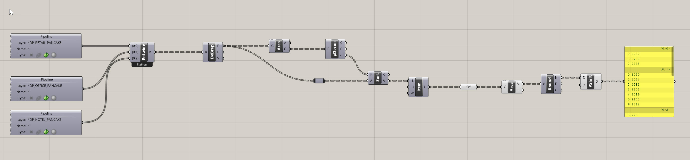

- The output of this the area of each floor, broken down into trees that represent each program. You can see that there is a lot LESS work to get to this point then there was in the freeform massing, BUT the tradeoff is you need to be more precise and model a lot more directly in Rhino. This is a pretty standard tradeoff of parametric workflows.
- To wrap this up, we can re-use the same logic from previously to get the GSF and ZFA. Try to stitch your previous logic in - below is a hint:

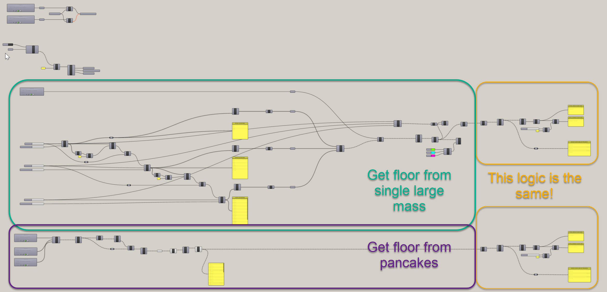

- Hopefully you're starting to see how logic can be repeated and functions can be reused. In this instance, we have set up a consistent output from both of the area extraction functions - a list of each floor area broken down by program. So, we can just reuse the GFA to ZFA conversion function for the pancake portion. 
- If you're lost, no worries - [download my definiton from here](https://drive.google.com/file/d/1QtduhKphXYNRW-lLuLKdK1NFUCWHHgG7/view?usp=drive_link) and take a close look before moving on to the next section.

**Side Challenge 5:** *Can you reconfigure this definition to work on stacked model approach? In my file, I have an example under the layers DP_RETAIL_STACKED, DP_OFFICE_STACKED, and DP_HOTEL_STACKED. I'll give you a hint - you will need to combine logic from the two methods we explored above.*

 